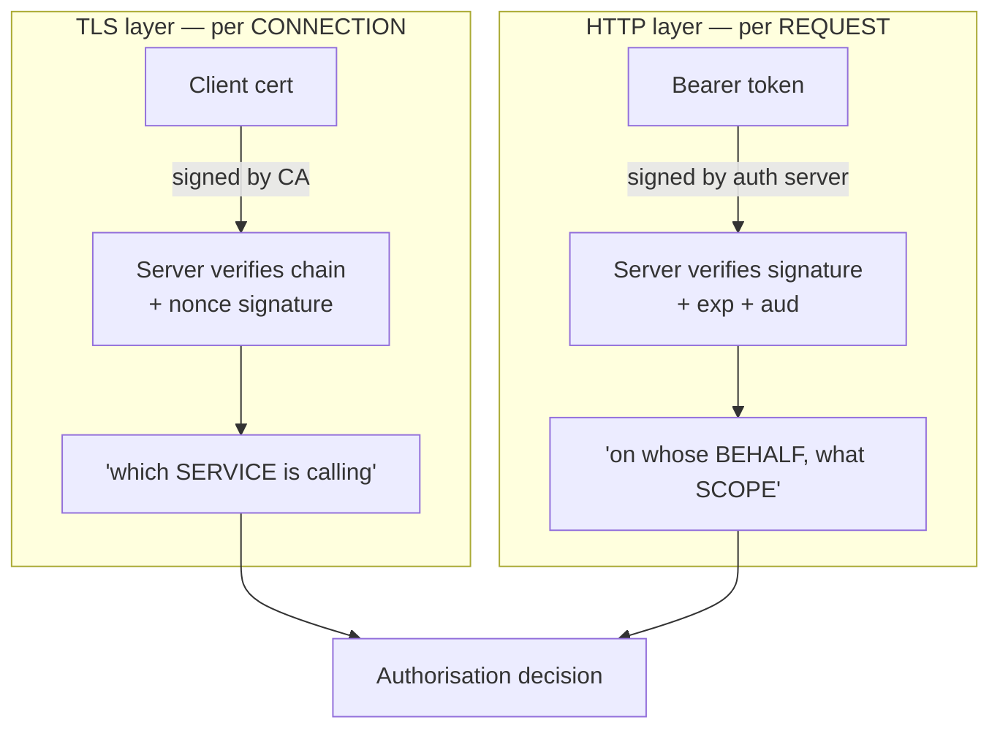

## Before you start

You need [authentication-authorization](authentication-authorization) for what a token is and how bearer credentials work, and [mutual-tls-explained](mutual-tls-explained) for how a client certificate gets checked during a handshake. This topic does not re-teach either — it puts them side by side and helps you pick.

## In one sentence

A **certificate** authenticates a *connection* — the whole pipe, once, at setup — while a **token** authenticates a *request* — one message, every time; almost every difference between them follows from that single fact.

## Why it matters

Teams argue about this in the wrong terms. Someone says "certificates are more secure", someone else says "tokens are more flexible", and the decision gets made on vibes. Then a real problem shows up: a load balancer is added in front of the service and the client's certificate identity vanishes, or a token leaks in an access log and works perfectly for whoever finds it.

Both outcomes were predictable from the connection-versus-request distinction. Get that clear and you can reason about revocation, rotation, proxies, and logging without memorising a list.

## The intuition

Think about getting into a building and then getting things done inside it.

The certificate is the **badge reader at the front door**. You tap once, the door opens, and for as long as you stay inside nobody re-checks. The check is bound to your physical presence — you cannot text your badge to a friend outside, because the reader also demands that you be standing there.

The token is a **signed work order you carry**. Each time you ask someone to do something, you hand over the paper. It says who authorised it, what it covers, and when it expires. It is checked afresh at every desk. But paper is paper: if it falls out of your pocket, whoever picks it up can hand it to the same desk and get the same result.

That is the whole security asymmetry. The badge proves *possession of something unstealable* on every single use. The paper proves only that you are *holding the paper*. That is exactly what the word **bearer** means in "Bearer token": the bearer of the bytes is the authority.

## How it actually works

Here is the part that surprises people: **the cryptography is the same**. Both are "a document signed by a trusted issuer, verified with the issuer's public key".

An X.509 certificate is DER-encoded binary. The issuer signs the `tbsCertificate` bytes. You verify with the CA's public key.

An RS256 JWT is JSON, base64url-encoded. The issuer signs the ASCII string `header.payload`. You verify with the issuer's public key.

Different encodings, different signers, different lifetimes — but identical RSA math underneath. Verify either by hand and you run the same operation: recover the hash embedded in the signature with `s^e mod n`, hash the signed bytes yourself, compare. If someone tells you "certificates use real crypto and JWTs are just base64", they have this backwards; the base64 is packaging, and there is a signature under it doing the same job.



So if the math matches, where does the security difference come from? **The protocol around the signature, not the signature itself.**

During a TLS handshake, the server sends fresh random material and the client must **sign it with the private key**. That is a challenge-response. A copied certificate is useless without the matching private key, and the key never crosses the network — only a signature over a one-time nonce, worthless for replay. Possession is re-proven on every handshake.

A token has no challenge. The client sends the string. Whoever holds the string can send it too. And the token travels on *every* request in a header, so every proxy, log aggregator, and APM tool along the path handles the live credential.

Two consequences fall straight out. **Tokens carry claims** — subject, scope, tenant, audience — because they are minted per session by an authorisation server that knows the user. A certificate carries a name and little else; it is issued once, months in advance, and knows nothing about today's user. And **tokens are stealable but expressive**, while **certificates are unstealable but mute**.

## Worked example

Both verifications, in the same shape, so the symmetry is visible:

```js
const { createSign, createVerify, generateKeyPairSync, createHash } = require('node:crypto');

const { privateKey, publicKey } = generateKeyPairSync('rsa', { modulusLength: 2048 });
const b64u = (b) => Buffer.from(b).toString('base64url');

// --- Build an RS256 JWT by hand: exactly what a cert signature also does ---
const header  = { alg: 'RS256', typ: 'JWT' };
const payload = { sub: 'order-service', aud: 'billing-api', scope: 'invoices:read' };

const signingInput = `${b64u(JSON.stringify(header))}.${b64u(JSON.stringify(payload))}`;
// THE signed bytes are this literal ASCII string, dots included — nothing else.
const sig = createSign('sha256').update(signingInput).sign(privateKey);
const jwt = `${signingInput}.${b64u(sig)}`;

// --- Verify ---
const [h, p, s] = jwt.split('.');
const valid = createVerify('sha256')
  .update(`${h}.${p}`)
  .verify(publicKey, Buffer.from(s, 'base64url'));
console.log('signature valid:', valid);

// --- The tampering attack: rewrite the scope, reuse the signature ---
const evil = b64u(JSON.stringify({ ...payload, scope: 'invoices:write admin' }));
const forged = createVerify('sha256')
  .update(`${h}.${evil}`)                       // different bytes -> different SHA-256
  .verify(publicKey, Buffer.from(s, 'base64url'));
console.log('forged accepted:', forged);

console.log('hash of original:', createHash('sha256').update(`${h}.${p}`).digest('hex').slice(0, 24));
console.log('hash of tampered:', createHash('sha256').update(`${h}.${evil}`).digest('hex').slice(0, 24));
```

Output:

```
signature valid: true
forged accepted: false
hash of original: 3f0a1c9d4e8b2716a5c03d94
hash of tampered: c72e58b0119fa4d3e6087b25
```

Why the forgery fails is worth stating precisely. The signature does not "contain the payload" — it contains a **hash** of the signing input. Changing one character of the payload changes the SHA-256 completely (the avalanche property), so the hash the verifier computes no longer matches the hash sealed inside the signature. The attacker cannot fix this without the private key, and the private key is what they do not have.

A certificate's signature protects its `tbsCertificate` bytes the same way. Edit the subject name in a certificate and it stops verifying, for identical reasons.

## A second example — when it gets harder

The naive view is "pick one". Production systems frequently need both, and the lab's scenario 2 shows exactly why: a client presents a **certificate at the TLS layer and a Bearer token at the HTTP layer**, both applying at once, neither replacing the other.

```js
const https = require('node:https');

const req = https.request({
  host: 'billing.internal', port: 443, path: '/invoices', method: 'GET',
  cert: clientCert, key: clientKey, ca: caCert,   // TLS layer: WHICH service is calling
  headers: { authorization: 'Bearer eyJhbGciOi...' }, // HTTP layer: ON WHOSE BEHALF
});
```

They answer different questions, so they cannot substitute for each other:

- The certificate says **"this connection comes from the order service"**. It cannot say which end user triggered the call, because it was issued weeks ago.
- The token says **"acting for user 8812, scope `invoices:read`, expires in 5 minutes"**. It cannot prove the caller is the order service, because anyone holding the bytes could send them.

Layer them and each covers the other's gap. A stolen token is useless without the client certificate and key. A stolen certificate — if the key ever did leak — grants no authorisation on its own. This is defence in depth in a form you can actually explain in an interview.

The subtler hard case is **where identity is visible**. Terminate TLS at a load balancer and the token survives untouched (it is just an HTTP header, forwarded onward) while the certificate identity is **destroyed** — the LB completed that handshake, not your service. Your backend sees a connection from the LB. This asymmetry surprises people mid-incident and is why mTLS constrains your topology in a way tokens do not. [tls-termination-and-passthrough](tls-termination-and-passthrough) covers the workaround and its own risks.

## Quick reference

| Dimension | Client certificate (mTLS) | Bearer token (JWT) |
|---|---|---|
| Authenticates | The connection, once at setup | Each request, every time |
| Answers | Which *service* is calling | On whose *behalf*, with what *scope* |
| Proof type | Challenge-response (signs a nonce) | Possession of bytes |
| If stolen | Useless without the private key | Fully usable by the thief |
| On the wire | Key never sent; only a fresh signature | The credential itself, every request |
| Carries claims | Barely — a name, validity dates | Yes — subject, scope, audience, tenant |
| Lifetime | Months to years (or minutes with SPIFFE) | Minutes to hours |
| Revocation | CRL/OCSP — often not really solved | Short `exp`, or a denylist you must consult |
| Survives TLS termination | No, unless forwarded as a header | Yes, it is just a header |
| Rotation | Deploy new files, restart or reload | Refresh flow, invisible to the app |

Reach for it when:

| Situation | Choose |
|---|---|
| Service-to-service inside your own infrastructure | mTLS |
| End users in browsers or mobile apps | Tokens |
| You must know which user an action was for | Tokens (add mTLS if you also need the caller) |
| A CDN or shared LB terminates TLS for you | Tokens |
| Partner integration, few clients, high assurance | mTLS |
| Credential leaking into logs is the top risk | mTLS |
| Authorisation must change within minutes | Tokens with short `exp` |

## Common mistakes

- Saying "certificates are more secure than tokens" without saying *why*. The math is the same; the difference is challenge-response versus bearer possession. Name that and you sound like you have used both.
- Treating a certificate as authorisation. `CN=order-service` proves who connected, not that they may delete invoices. You still need a policy mapping identity to permissions.
- Reading the `alg` field out of a JWT header and verifying with it. The header is *not* covered by the signature, so an attacker sets `alg: none` or downgrades RS256 to HS256 and signs with your public key as the HMAC secret. Pin the expected algorithm server-side. A certificate has no equivalent hole because its algorithm sits inside the signed bytes.
- Expecting client-certificate identity to survive a proxy that terminates TLS. It does not, by construction.
- Assuming a short token expiry is the same as revocation. It bounds the damage window; it does not stop a live token.

## What interviewers ask

- **What is the fundamental difference between mTLS and token auth?** — A certificate authenticates the connection once at handshake time; a token authenticates each individual request. Everything else — claims, revocation, proxy behaviour — follows from that.
- **A JWT and a certificate are both signed documents. So what actually differs?** — The protocol around the signature. mTLS makes the client sign a fresh server nonce, so a copied certificate without the private key is worthless and nothing replayable crosses the wire. A token is a bearer credential sent verbatim on every request, so stealing the bytes is stealing the credential.
- **Why would you use both on the same call?** — They answer different questions. The certificate says which service is calling, the token says on whose behalf and with what scope. Layered, a stolen token is useless without the certificate and a certificate grants no authorisation alone.
- **How does tampering with a JWT payload get detected?** — The signature seals a hash of the `header.payload` signing input. Changing any byte changes the hash entirely, so the verifier's computed hash stops matching the one recovered from the signature, and producing a matching signature needs the private key.
- **Which is harder to revoke?** — Both are awkward, differently. Certificates need CRL or OCSP infrastructure that clients frequently skip or fail open on. Tokens cannot be un-issued at all, so you shorten expiry or maintain a denylist you must check on every request — reintroducing the state the token was meant to avoid.

## Practice

1. Extend the worked example to tamper with the *header* instead of the payload: set `alg` to `none` and drop the signature. Write a deliberately naive verifier that reads `alg` from the token, and show it accepts the forgery. Then fix it by pinning the algorithm.
2. Take an HTTPS client that sends both a client certificate and a Bearer token. Remove the certificate and record the exact error; then restore it and remove the token instead. Note that one failure happens at the handshake and one returns an HTTP status, and explain why that split tells you which layer broke.
3. Write down what your service knows about a caller in three topologies: direct mTLS, mTLS terminated at a load balancer that forwards nothing, and the same load balancer forwarding a client-certificate header. For each, say which identity survives and what you must now trust.

## Where to go next

Certificates in this topic were long-lived files someone installed. [workload-identity-and-spiffe](workload-identity-and-spiffe) removes the human: identities issued automatically to every service, expiring in minutes, which fixes most of the rotation and revocation problems in the table above. For what goes wrong when mTLS is misconfigured, read [mtls-failure-modes](mtls-failure-modes).
