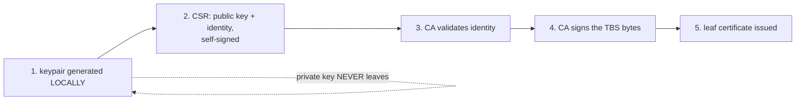

## Before you start

Read `tls-and-certificates` first. You need to already know what a certificate is, that a client walks a chain of certificates up to a root it trusts, and that leaf/intermediate/root are three positions in that chain. This topic goes behind those facts: who produces certificates, how, and what a signature physically is.

## In one sentence

A **public key infrastructure** (PKI) is the set of keys, signing rules, and trusted files that lets one party vouch for another's identity, and a **certificate authority** (CA) is the party doing the vouching — by signing a hash of exactly the bytes that describe you.

## Why it matters

Encryption is the easy half. Any two strangers can agree on a shared key and talk privately; nothing about that tells either one who the other is. PKI is the answer to "who am I talking to", and every authentication scheme built on certificates — HTTPS, mutual TLS, code signing, SSH certificates, Kubernetes API clients — is the same three moving parts underneath.

Get PKI wrong operationally and you get the two most common production failures in this whole area. Either you cannot issue a certificate that anything trusts, or you accidentally hand your private key to something that had no business holding it. Both come from not knowing which artefact is secret and which is public.

## The intuition

A CA is a notary, not a vault.

You write a document. You take it to the notary. The notary does not take your document away, does not keep a copy of your signature stamp, and does not learn any of your secrets. What they do is read the document, satisfy themselves you are who you claim, then apply their own seal *to that exact document*. Anyone who recognises the notary's seal now believes the document.

Two consequences fall straight out of that picture, and both are things people get wrong:

The notary never holds your pen. Your **private key** is generated on your machine and stays there. What you send the CA is a request containing your **public key** — the half that is safe to publish.

The seal covers *those exact bytes*. Change one letter of the document afterwards and the seal no longer matches. The seal is not a wrapper around the document; it is a statement about the document's content.

## How it actually works

A signature is a signed hash. The CA takes the region of the certificate that describes you — called the **TBS** ("to be signed") bytes: your name, your public key, the validity window, the extensions — hashes it with SHA-256, then performs a private-key operation on that hash. The result is the signature, stored in the certificate next to the bytes it covers.

This is worth stating flatly because the wrong version is so common in interviews: **a signature is not the certificate encrypted with the CA's key.** It is a signed digest of one specific byte range. Verification does not "decrypt the certificate"; it recovers the digest the CA committed to and compares it against a digest you compute yourself over the same bytes.

The issuance flow follows from that:



Step 2 is the **CSR** (certificate signing request). It carries your public key and the identity you are asking for, and it is signed with your own private key. That self-signature is **proof of possession**: it shows you actually hold the private half matching the public key inside, so the CA is not certifying a public key that belongs to someone else.

Step 3 is where CAs differ. A public CA has to prove you control the domain — Let's Encrypt does this by asking you to serve a token at a URL under that domain, or publish a DNS TXT record. A private CA inside your company might validate by "the platform team ran this script", which is a perfectly good answer for internal services.

Notice what never happens: at no point does the private key travel. The CA cannot decrypt your traffic, cannot impersonate you, and does not need to. If a certificate provider ever offers to generate the keypair for you and email you the key, they have just become a party that can impersonate your service.

Because a certificate holds only the public half, you can check locally whether a certificate and a key file belong together: derive the public key from each and compare. Same public key means they are a pair.

## Worked example

```js
const { X509Certificate, createPrivateKey, createPublicKey } = require('node:crypto');
const { readFileSync } = require('node:fs');

const certPem = readFileSync('certs/client.crt', 'utf8');
const keyPem  = readFileSync('certs/client.key', 'utf8');

const cert = new X509Certificate(certPem);
console.log('subject   :', cert.subject);
console.log('issuer    :', cert.issuer);       // who SIGNED this
console.log('isCA      :', cert.ca);
console.log('selfSigned:', cert.subject === cert.issuer);

// A cert holds only the PUBLIC key. A key file holds both halves.
// Export the public half of each in the same format and compare.
const fromCert = createPublicKey(certPem).export({ type: 'spki', format: 'der' });
const fromKey  = createPublicKey(createPrivateKey(keyPem)).export({ type: 'spki', format: 'der' });

console.log('cert pubkey:', fromCert.subarray(-8).toString('hex'));
console.log('key  pubkey:', fromKey.subarray(-8).toString('hex'));
console.log('PAIR       :', fromCert.equals(fromKey) ? 'MATCH' : 'MISMATCH');
```

Against the `mtls-demo` lab this prints:

```
subject   : CN=demo-client
issuer    : CN=Demo-Root-CA
isCA      : false
selfSigned: false
cert pubkey: f9d44b0203010001
key  pubkey: f9d44b0203010001
PAIR       : MATCH
```

That repeated `f9d44b0203010001` is the whole point. The same public key fingerprint appears in the certificate and in the private key file, and *that* is what "the cert and key are a pair" means. The lab's server prints it on startup for exactly this reason:

```
[PEM] server-a cert (our identity, we SEND this)  ./certs/server-a.crt
        pubkey : f9d44b0203010001       <- note this value
[PEM] server-a key  (SECRET, never sent)
        pubkey : f9d44b0203010001       <- SAME -> they are a pair
[PAIR] ✓ server-a server: cert and key MATCH
```

Run this check before you deploy. It needs no network, no CA, and no running server — it is pure local parsing, so it catches a mismatched bundle at config-save time instead of at 3am during a handshake. A mismatch surfaces at runtime as `ERR_OSSL_X509_KEY_VALUES_MISMATCH`, thrown before a single packet leaves the machine.

## A second example — when it gets harder

Now scale from one certificate to a fleet, and the interesting question becomes: whose CA?

For internal service-to-service traffic, run your own. The `mtls-demo` lab's `1-make-certs.sh` shows the shape in thirty lines: create one CA keypair, self-sign its certificate (a root is self-signed by definition — it is the trust anchor, so there is nobody above it to sign it), then have that one CA sign three leaf certificates for `server-a`, `server-b`, and `client`.

```
                    ca.key / ca.crt          (Demo-Root-CA, isCA:true)
                            │ signs
        ┌───────────────────┼───────────────────┐
        ▼                   ▼                   ▼
   server-a.crt        server-b.crt        client.crt
```

Because one CA signed all three, **each side trusts everyone by trusting one file**: `ca.crt`. Add a fourth service and you distribute nothing new — its certificate is already trusted the moment your CA signs it. That property is why private CAs win internally. You control both ends, so you can pre-distribute trust, and you get to decide the naming, the lifetimes, and the issuance policy.

The lab also shows the failure this buys you: `rogue-client.crt` is a genuine, correctly-formed, unexpired certificate signed by a *different* CA. Presenting it gets `ECONNRESET`. A valid certificate is not a trusted certificate.

Public CAs exist for the opposite situation. You cannot pre-distribute anything to a stranger's browser, so you need an authority that stranger's operating system already trusts — a set of roots shipped by Apple, Microsoft, Mozilla, and Google. You are buying pre-existing trust, and paying for it by having to prove domain control.

That global reach forces the structure of a public PKI. Roots stay **offline** — often literally air-gapped, powered on only for ceremonies — because a compromised root cannot be fixed. Its certificate sits in billions of trust stores you do not control, some of which will never receive another update. So roots sign almost nothing except **intermediates**, and intermediates sign the actual leaves. An intermediate is a *revocable buffer*: if it leaks, the root revokes it and issues a new one, and the blast radius is the certificates under that one intermediate rather than the entire internet.

Which brings us to the genuinely hard part. Revocation mostly does not work.

The first attempt was the **CRL** (certificate revocation list): the CA publishes a signed list of revoked serial numbers, and clients download it. Lists grew to megabytes, and a client that has not refreshed recently is checking stale data.

**OCSP** (Online Certificate Status Protocol) replaced the list with a question: the client asks the CA's responder about one serial number and gets a small signed `good` / `revoked` / `unknown`. Better, but it adds a network round trip to a third party on the critical path of your page load, and it tells that third party every site you visit.

**OCSP stapling** fixes both. The *server* periodically fetches a signed, time-stamped OCSP response for its own certificate and includes it in the handshake. No client-side round trip, no privacy leak.

But all of it founders on **soft-fail**. If the revocation check is unreachable, browsers proceed anyway — because failing closed would mean a CA outage takes down half the web. An attacker who can steal a private key can usually also block the check, so revocation stops being a security boundary and becomes a hint.

The modern answer is to stop relying on revocation: issue **short-lived certificates**. If a certificate is valid for 90 days, or 24 hours, or an hour, then expiry *is* your revocation mechanism, with no responder to query and nothing to soft-fail. This is the same reasoning that pushed public certificate lifetimes from years down to months, and it is why workload identity systems hand out certificates measured in hours.

## Quick reference

| Artefact | Who holds it | On the wire? | Secret? |
|---|---|---|---|
| Private key | Only the subject | Never | **Yes** |
| CSR | Subject → CA | Yes, once | No |
| Leaf certificate | Subject | Yes, every handshake | No |
| CA certificate | Every verifier | No — used to *check* | No |
| CA private key | The CA only | Never | **Yes, critically** |

| Revocation method | Cost | Real-world weakness |
|---|---|---|
| CRL | Client downloads a large list | Size, staleness |
| OCSP | Extra round trip per certificate | Latency, privacy leak, soft-fail |
| OCSP stapling | Server pre-fetches, sends in handshake | Still soft-fail if absent |
| Short-lived certificates | Automation required | None — expiry replaces revocation |

| | Private CA | Public CA |
|---|---|---|
| Use for | Internal service-to-service | Anything a browser reaches |
| Trust distribution | You ship `ca.crt` yourself | Pre-installed in every OS |
| Validation | Your own policy | Must prove domain control |
| Cost | Operating the CA | Free (ACME) to expensive |

## Common mistakes

- Saying a signature is "the certificate encrypted with the CA's private key". It is a signed hash of the TBS byte range. That distinction is exactly what verification checks.
- Believing the CA sees your private key. It sees a CSR containing your *public* key. If a vendor generates the keypair for you, they can impersonate you.
- Treating a valid certificate as a trusted certificate. The rogue certificate in the lab is perfectly valid and correctly rejected, because trust comes from *who signed it*.
- Assuming revocation protects you. Soft-fail means a determined attacker who blocks the check keeps using the stolen certificate. Short lifetimes are the real defence.
- Deploying a certificate and key from different issuances. Compare the public key fingerprints first — it is a free local check.
- Reaching for a public CA for internal traffic. You control both ends, so a private CA is simpler, cheaper, and lets you set your own lifetimes.

## What interviewers ask

- **What does a CA actually do when it issues a certificate?** — It validates the requester's identity, then hashes the TBS bytes and signs that hash with its private key. They are checking whether you know a signature covers a specific byte range rather than the whole file.
- **Does the CA ever see your private key?** — No. You generate the keypair locally and send a CSR containing the public key, self-signed to prove you hold the private half. This is the single most reliable separator between people who have run a PKI and people who have read about one.
- **Why do intermediates exist if the root could sign leaves directly?** — Roots are offline and unreplaceable across billions of trust stores, so they sign rarely. Intermediates are online, do the day-to-day signing, and can be revoked and replaced without touching the root.
- **How would you check a certificate and key match, without deploying them?** — Derive the public key from each and compare; identical public keys means they are a pair. Purely local, no network needed.
- **Why is certificate revocation considered a hard problem?** — CRLs are large and stale, OCSP adds latency and leaks browsing history, stapling fixes those but every mechanism soft-fails when unreachable. Short-lived certificates sidestep the problem by making expiry the revocation.
- **Private CA or public CA for internal microservices?** — Private. You can pre-distribute one `ca.crt`, so every service trusts every other by trusting one file, and you control lifetimes and naming.

## Practice

1. Take any certificate and its key file, derive the public key from each, and compare. Then deliberately pair a certificate with a *different* key and confirm the check catches it. Explain why this needs no network access.
2. Create a CA and have it sign two leaf certificates. Serve one over HTTPS, connect with a client configured to trust only your `ca.crt`, and confirm it succeeds. Then create a *second* CA, sign a third leaf with it, and present that one instead. Predict the error before you run it.
3. Pick three public HTTPS sites and inspect the certificate each presents. For each, write down which certificate is the leaf, which is the intermediate, and whether the root appears in the chain at all — then explain why it does not need to.
4. Optional hands-on: the `mtls-demo` lab has all of this pre-built. `1-make-certs.sh` builds the one-CA/three-leaf PKI, `inspect-pem.js` prints the pairing fingerprints, and `certs/rogue-client.crt` is the untrusted-CA failure case.

## Where to go next

Go to `x509-and-der-decoded`. You now know a CA signs a hash of the TBS bytes — next you will find those exact bytes inside a real certificate, extract the CA's public key by hand, and compute the signature verification yourself. After that, `certificate-lifecycle-and-rotation` covers keeping issued certificates alive in production.
