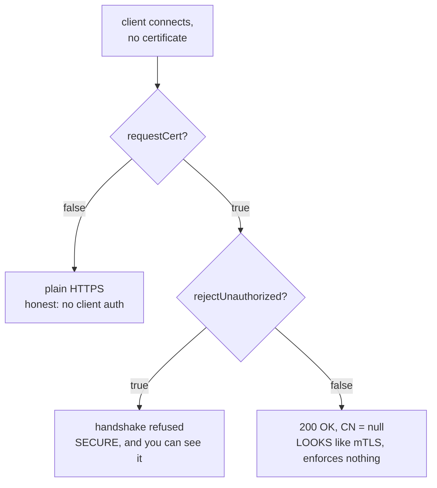

## Before you start

Read `mtls-failure-modes` first — it covers the failures that announce themselves. This topic is the opposite case, and the contrast is the whole point. `tls-and-certificates` covers chains and CAs; `web-security-fundamentals` gives useful context on threat models.

## In one sentence

The dangerous TLS configurations are the ones that **succeed**: a failing handshake tells you something is wrong, while a connection that verifies nothing looks exactly like a working one.

## Why it matters

Every failure in `mtls-failure-modes` had a virtue — it stopped the request and printed a code you could search for. You cannot ship a broken handshake by accident, because nothing works.

You absolutely can ship a handshake that enforces nothing. It returns 200. Latency is normal. Dashboards are green. The security control you believe you deployed is not running, and there is no signal anywhere that will tell you, because the absence of enforcement produces no errors, no logs and no metrics. It gets discovered in a penetration test, or not at all.

That is why these configurations are worth memorising as *shapes* rather than as rules. In a code review you have seconds, and the tell is not "this looks wrong" — it is "this looks fine, and that specific pair of flags means it isn't."

## The intuition

Picture the guard at the door again. Three ways to run that door:

- **Locked and checked.** ID demanded, ID verified, no ID means no entry. Secure, and you know it works because people without badges get turned away.
- **No door at all.** Everyone walks in. Insecure, but *obviously* insecure. Nobody is confused about the security posture of an open doorway.
- **A guard who asks for ID, glances at it, and waves everyone through regardless — including people who show nothing.** From the street this is indistinguishable from option one. There is a guard. There is a checkpoint. People show badges. Nothing is enforced.

The third door is the entire subject of this topic. It is worse than the second, because the second is honest.

## How it actually works

### The inspect-only trap

The server has two switches. `requestCert` decides whether to *ask* for a client certificate. `rejectUnauthorized` decides whether to *act* on the answer. People treat these as one setting and reason that `requestCert: true` means "mTLS is on".

```js
const server = https.createServer({
  cert, key, ca,
  requestCert: true,         // ask for a client certificate
  rejectUnauthorized: false, // ...and accept the connection no matter what
}, handler);
```

What actually happens with a client that presents **no certificate at all**:

```
[TLS] handshake OK  proto=TLSv1.3  authorized=false
[TLS] authorizationError=ERR_SSL_PEER_DID_NOT_RETURN_A_CERTIFICATE (allowed because rejectUnauthorized=false)
[REQ] handler ran
HTTP 200 {"yourClientCN":null,"tlsAuthorized":false}
```

The handshake completed. The request handler ran. The caller got **200 OK**. The server knows perfectly well the client was unauthenticated — `authorized` is `false` and `authorizationError` is populated — and it served the request anyway, because nothing was configured to care.

The reason this reaches production is that it passes the test everyone runs. You configure mTLS, you call the service with a valid certificate, you get 200, you ship. Confirming enforcement requires the *negative* test: call it with **no** certificate and require a failure. Almost nobody writes that test, and it is the only one that distinguishes the two configurations.



There is a legitimate use: an observe-then-enforce migration, where you log which callers present certificates before you start requiring them. That is fine *if* the observation phase has an owner, a deadline and an alert on `authorized === false`. Without those it is not a migration, it is a permanent hole with a good story attached.

### `rejectUnauthorized: false` as a panic fix

On the client side, the same flag has an even blunter effect. Something fails, you are under pressure, you set it to `false`, the error disappears and you move on.

Be precise about what you traded. You keep **confidentiality against a passive eavesdropper** — traffic is still encrypted, so someone merely recording packets learns nothing. You give up **all authentication**, which means you have no idea who you are encrypting *to*. An attacker who can answer for that hostname — DNS poisoning, a hijacked route, a malicious proxy, anything on the path — presents any certificate they like, or a self-signed one they minted a second ago, and you accept it. You then encrypt your credentials directly to them.

So the honest description is not "slightly less secure". It is: still private from bystanders, completely defenceless against anyone actually in the path. The threat model it protects against is the one you were least worried about.

Two Node-specific sharp edges make this worse. The environment variable `NODE_TLS_REJECT_UNAUTHORIZED=0` disables verification **process-wide**, for every library in your dependency tree at once — a far bigger blast radius than one call. And historically, passing `undefined` for `rejectUnauthorized` was treated as `false` rather than as "use the default", so code doing `rejectUnauthorized: config.strict` silently disabled all verification whenever that config key was absent. That was a real reported vulnerability, later fixed, and it is the reason to write the value literally rather than compute it.

### Trusting a specific certificate is not the same as disabling verification

These two get conflated constantly, and they are close to opposites.

```js
// Option A — trust THIS CA, verify normally against it.
https.request({ host, ca: fs.readFileSync('./our-ca.crt') });

// Option B — verify nothing.
https.request({ host, rejectUnauthorized: false });
```

Option A **adds** a trust anchor. Every check still runs: signature, chain, expiry, hostname. You have simply told the client that one additional CA is acceptable — which is exactly the right answer for internal services, a private PKI, or a staging environment with its own CA. It is *more* specific than the public trust store, not less: only certificates from that CA are accepted.

Option B **removes** the checks. Any certificate passes. Nothing is verified.

They are reached for in the same moment — an error about an untrusted certificate — and one of them is the correct fix while the other is the vulnerability. If the certificate is genuinely yours, name its CA. Reserve `rejectUnauthorized: false` for throwaway local experiments, and never let it into a file that gets deployed.

The stronger variant is **pinning**: instead of trusting a CA, check that the peer's certificate or public key fingerprint equals a specific known value. That defeats even a compromised CA, at the cost of breaking every time you rotate the certificate — so it needs a rotation plan before it needs code.

## Worked example

A self-audit you can actually run. It calls your own server twice and asserts the negative case.

```js
const https = require('node:https');
const fs = require('node:fs');
const P = (f) => fs.readFileSync(`./certs/${f}`, 'utf8');

function probe(tls) {
  return new Promise((resolve) => {
    const req = https.request(
      { host: '127.0.0.1', port: 4443, path: '/', servername: 'localhost', ...tls },
      (res) => { res.resume(); resolve({ status: res.statusCode }); },
    );
    req.on('error', (e) => resolve({ error: e.code }));
    req.end();
  });
}

(async () => {
  const withCert = await probe({ cert: P('client.crt'), key: P('client.key'), ca: P('ca.crt') });
  // THE test that matters: no client certificate at all. This MUST fail.
  const without  = await probe({ ca: P('ca.crt') });

  console.log('with a valid cert :', withCert);
  console.log('with NO cert      :', without);

  const enforcing = Boolean(without.error) && withCert.status === 200;
  console.log(enforcing
    ? 'PASS — mTLS is enforced'
    : 'FAIL — server accepted an unauthenticated client. Not enforcing.');
  process.exit(enforcing ? 0 : 1);
})();
```

Against a correctly configured server (`rejectUnauthorized: true`):

```
with a valid cert : { status: 200 }
with NO cert      : { error: 'ERR_SSL_TLSV13_ALERT_CERTIFICATE_REQUIRED' }
PASS — mTLS is enforced
```

Against the inspect-only trap (`rejectUnauthorized: false`), the *only* line that changes is the one nobody tests:

```
with a valid cert : { status: 200 }
with NO cert      : { status: 200 }
FAIL — server accepted an unauthenticated client. Not enforcing.
```

Identical first line. Identical latency. Identical application logs. The entire difference between "authenticated" and "open to the internet" is visible in exactly one probe — which is why that probe belongs in CI, not in a runbook.

## A second example — when it gets harder

Version and cipher configuration is the quieter footgun, because "it connects" is not evidence of anything about *how*.

TLS 1.0 and 1.1 are formally deprecated. A server that still accepts them will happily negotiate down when a client offers only those, and both sides will report a successful handshake. The fix is a floor, not a preference:

```js
https.createServer({
  cert, key, ca,
  requestCert: true,
  rejectUnauthorized: true,
  minVersion: 'TLSv1.2',   // a floor: refuse anything older outright
  honorCipherOrder: true,  // the SERVER's preference order wins, not the client's
});
```

`minVersion` is the important one. Without it you are trusting that no client ever asks for something old, which is precisely the assumption an attacker tests — a downgrade attack works by pretending to be a client that supports nothing better. `honorCipherOrder` matters because otherwise the client picks from the overlap, and a hostile client picks the weakest option available.

Restricting `ciphers` explicitly is available but easy to get wrong; a hand-written list goes stale and can quietly exclude the modern suites you wanted. Setting a version floor and leaving Node's defaults alone beats a bespoke cipher string in most codebases.

The pattern across all of these: the insecure state is reachable by *omission*. You do not have to write anything wrong. Leaving `minVersion` unset, leaving `rejectUnauthorized` computed from a config value that turns out to be undefined, leaving the negative test unwritten — each is a non-action that produces a working, unenforced system.

## Quick reference

| Configuration | Handshake result | What it actually gives you |
|---|---|---|
| `requestCert: true`, `rejectUnauthorized: true` | fails without a valid cert | Real mTLS. The only enforcing combination |
| `requestCert: true`, `rejectUnauthorized: false` | **200 OK, CN = null** | Nothing. Looks like mTLS, enforces nothing |
| `requestCert: false` | 200 OK | Plain HTTPS — honest about having no client auth |
| Client `ca: ourCa` | fails on a bad cert | Full verification against a CA you chose. Correct fix |
| Client `rejectUnauthorized: false` | **always succeeds** | Confidentiality vs passive sniffers only. No authentication |
| `NODE_TLS_REJECT_UNAUTHORIZED=0` | **always succeeds** | The above, process-wide, for every dependency |
| No `minVersion` | succeeds on old TLS | Silent downgrade to deprecated versions |
| `minVersion: 'TLSv1.2'` + `honorCipherOrder` | fails on old TLS | A floor the client cannot negotiate below |

### Code-review checklist

- Is `rejectUnauthorized` written as a literal `true`, never computed from config that could be `undefined`?
- Does any `requestCert: true` appear alongside `rejectUnauthorized: false`? If so, who owns the deadline for flipping it?
- Is there a test asserting that a request with **no** client certificate fails?
- Is `minVersion` set explicitly?
- Does an untrusted-certificate error get fixed by adding `ca:`, or by disabling verification?
- Is `NODE_TLS_REJECT_UNAUTHORIZED` set anywhere in Dockerfiles, CI config, or process managers?
- Does any code read the caller's identity from a header when a verified certificate is available on the socket?

## Tools & frameworks

| Tool | What it's for | Reach for it when |
|---|---|---|
| [Mozilla SSL Config Generator](https://ssl-config.mozilla.org/) | Known-good TLS configuration per server | You are about to hand-write a cipher suite list |
| [OWASP Cheat Sheets](https://cheatsheetseries.owasp.org/) | The footgun catalogue, each with the fix | You have a specific "is this safe?" question and want a sourced answer |
| [Helmet](https://helmet.js.org/) | Secure headers by default in Node | You run Express, which ships insecure headers until you add these |
| [Kyverno](https://kyverno.io/docs/introduction/) | Enforce secure defaults as cluster policy | You want the insecure option to be impossible to set by accident, not just discouraged |
| [Trivy](https://trivy.dev/) | Misconfiguration scanning across IaC and images | You want insecure defaults caught before they deploy rather than in review |

The biggest Node footgun is not in this table because no tool catches it for you: `rejectUnauthorized: false` and `NODE_TLS_REJECT_UNAUTHORIZED=0` silently discard the whole point of TLS.

## Common mistakes

- Believing `requestCert: true` means mTLS is on. It is half the setting; without `rejectUnauthorized: true` nothing is enforced.
- Testing only the happy path. A valid certificate returning 200 proves nothing — the negative test is the whole test.
- Describing `rejectUnauthorized: false` as "less secure". It removes authentication entirely; you are private from bystanders and defenceless against anyone on the path.
- Computing `rejectUnauthorized` from a config value. An absent key has historically meant "off", not "default".
- Using `NODE_TLS_REJECT_UNAUTHORIZED=0` to fix one call. It disables verification for the whole process and every library in it.
- Confusing "trust this specific CA" with "trust everything". Passing `ca:` keeps every check and is the correct fix for internal certificates.
- Leaving `minVersion` unset and assuming clients will choose well. Downgrade attacks exist because they choose badly on purpose.
- Reading the client's identity from a header when mTLS is on. Take it from the socket; headers are attacker-controlled.

## What interviewers ask

- **Why is `requestCert: true` with `rejectUnauthorized: false` worse than no mTLS at all?** — Because it succeeds. No client auth is honest and visible; this configuration returns 200 to unauthenticated callers while looking exactly like enforcement, so nobody investigates.
- **What exactly do you lose with `rejectUnauthorized: false`?** — All authentication. Traffic stays encrypted against passive eavesdroppers, but you no longer know who you are encrypting to, so anyone able to answer for that hostname can read everything.
- **A colleague fixes an untrusted-certificate error by disabling verification. What do you suggest instead?** — Pass the issuing CA via `ca:`. That keeps signature, chain, expiry and hostname checks and simply adds one trust anchor, which is the right answer for internal PKI.
- **How would you prove mTLS is actually enforced in production?** — Send a request with no client certificate and require it to fail. That single negative probe is the only thing distinguishing enforcement from the inspect-only trap, so it belongs in CI.
- **Why set `minVersion` when connections already work?** — A working connection says nothing about which version was negotiated. Without a floor, a client offering only deprecated TLS gets a successful downgraded handshake.
- **What is the general shape of a TLS footgun?** — It is reachable by omission and it succeeds. Loud failures are safe because someone fixes them; silent non-enforcement produces no error, no log and no metric.

## Practice

1. Configure a server with `requestCert: true` and `rejectUnauthorized: false`. Call it with no client certificate and confirm you get 200 with a null CN. Then write the assertion that would have caught it.
2. Turn the self-audit script above into a test that fails the build. Decide where it runs — against a live environment, or against a locally started server — and justify the choice.
3. Break a client with an untrusted internal certificate. Fix it twice: once with `ca:`, once with `rejectUnauthorized: false`. Describe precisely which checks each version still performs.
4. Set `minVersion: 'TLSv1.2'` on a server, then force a client to `maxVersion: 'TLSv1.1'`. Record the error and explain why silence here would be worse than the error.
5. Optional hands-on: the lab at `mtls-demo` makes the trap a one-line change. Set `REJECT_UNAUTHORIZED=false` in `.env`, restart the server, and rerun the no-certificate scenario — it flips from a handshake rejection to `HTTP 200` with `yourClientCN=null`, with the server logging `authorizationError` it then ignores.

## Where to go next

Continue to `mtls-vs-token-auth`. You now know how mTLS is configured, how it fails and how it fails silently — the next question is when a certificate is the right tool at all, and when a token is genuinely the better answer.
