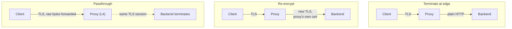

## Before you start

You need [cdn-and-edge-caching](cdn-and-edge-caching) for why anything sits in front of your servers at all, and [mutual-tls-explained](mutual-tls-explained) for how a client certificate is checked. This topic is about what happens to that certificate when something else answers the handshake first.

## In one sentence

**TLS termination** is the point where encrypted traffic is decrypted, and moving that point changes who can read the traffic, who can route on it, and — the part that catches people — whether the client's certificate identity still exists by the time your application sees the request.

## Why it matters

The failure is specific and common. mTLS works perfectly in staging, where your service is dialled directly. Then it goes behind a load balancer, and `getPeerCertificate()` comes back empty. Nothing errors. Handshakes succeed. Your code that read `CN` to identify the caller now reads `undefined`, and if it was written trustingly, everyone is suddenly authenticated as nobody.

The certificate did not go missing. **It was presented to the load balancer**, which completed that handshake and opened its own separate connection inward. Your service is the peer of the proxy, not of the client. There is nowhere for the client's certificate to be, because your service never had a handshake with the client.

Understand where termination happens and this is obvious in advance instead of during an incident.

## The intuition

Think of a letter travelling to an office through a mail room.

**Terminate at the edge**: the mail room opens the envelope, reads the letter, and walks the bare page to the recipient's desk. It can sort by content, file a copy, redact a line. But once the envelope is off, the sender's wax seal is gone — and everyone in the corridor can read the page.

**Re-encrypt**: the mail room opens the envelope, reads it, then puts the page into a *new* envelope of its own and sends it on. Corridors are protected again. But it is the mail room's seal now, not the sender's. The recipient can prove the letter came from the mail room, and nothing more.

**Passthrough**: the mail room reads the address on the outside and hands the sealed envelope to the recipient untouched. The seal arrives intact, so the recipient can verify the sender personally. The cost is that the mail room could not read a word — no sorting by content, no filing, no redaction.

That trade-off is exact and it does not have a clever escape. **Reading the traffic and preserving the client's seal are mutually exclusive**, because reading requires terminating and terminating means the seal was verified by the mail room, not the recipient.

## How it actually works



**Terminating at the edge** means the proxy holds your certificate and private key, decrypts, and forwards plain HTTP. This is the common default. The proxy sees full request content, so it can route by path, cache, compress, rewrite headers, apply a WAF, and produce useful metrics. Certificate management collapses to one place. The internal hop is plaintext, which is acceptable only if that network is genuinely trusted — the assumption zero-trust thinking rejects.

**Re-encryption** — also called TLS bridging — terminates, inspects, then opens a *new* TLS connection to the backend. Two independent TLS sessions, joined by a proxy that can read both. You keep Layer 7 features and encrypt the internal hop. The cost is double the handshakes and double the crypto, plus certificates to manage in two places.

**Passthrough** means the proxy operates at Layer 4 and forwards TCP bytes without decrypting. It can route using SNI — the unencrypted server name in the ClientHello — but that is all it can see. The backend terminates, so it holds the certificate *and* sees the client's certificate directly. End-to-end encryption in the strictest sense, and you give up every Layer 7 capability: no path routing, no caching, no header rewriting, no request-level WAF.

Now the practical heart of it.

**Where the client certificate is visible, and where it is lost.**

Under passthrough, the client's certificate reaches your application intact, on the socket, verified by your service against your CA. This is the only model where client identity arrives natively.

Under termination or re-encryption, the client's certificate identity is **destroyed at the proxy** by construction. The proxy did the mutual handshake. The proxy's connection inward is a fresh connection with no client certificate on it — or, under re-encryption, with the *proxy's* certificate. Your service can prove the proxy called, not who the client was.

Nothing about this is fixable at the TLS layer. The only way identity survives is if the proxy **explicitly copies it into the application layer** — as an HTTP header.

The de facto standard is Envoy's **`X-Forwarded-Client-Cert`** (XFCC), which carries fields from the verified client certificate: `By` (the terminating URI), `Hash` (SHA-256 digest of the client cert), `Subject`, `URI` (the SPIFFE ID, in a mesh), and optionally `Cert` or `Chain` as URL-encoded PEM. **RFC 9440** standardises the same idea as `Client-Cert` and `Client-Cert-Chain`. Other proxies use their own names — `X-SSL-Client-Cert`, `X-Client-Cert-DN`. Same mechanism, different spelling.

And here is the consequence you must be able to state, because it is the whole security question:

**Once identity arrives in a header, you are trusting a header.**

A header is text. Anything that can reach your backend can set it. If your service reads `X-Forwarded-Client-Cert` and believes it, then a request that bypasses the proxy — from a pod in your cluster, from a misrouted internal caller, from an attacker who found the backend's address — can assert any identity it likes with `curl -H`. No certificate, no key, no handshake.

That is strictly worse than having no mTLS at all. Without mTLS you know you have no caller identity. With a forgeable header you have caller identity you *believe*, and it is free to forge.

So the header is only safe under a hard structural condition: **the backend must be unreachable except through the proxy**, and the proxy must **strip or overwrite** any inbound copy of that header rather than appending to it. Both halves are required. Enforce reachability with network policy, a service mesh with STRICT mTLS between proxy and backend, or an authenticated tunnel. "It is on a private subnet" is usually not enough, because most breaches involve an attacker already inside one.

Envoy defaults to sanitising XFCC unless you explicitly configure forwarding, which is the correct default and worth noticing: the safe behaviour is to *delete* a header a client might have set.

**Why a CDN in front of your API breaks naive mTLS.** A CDN's entire function is terminating TLS close to the user — that is where the latency win comes from ([cdn-and-edge-caching](cdn-and-edge-caching)). So a CDN terminates, which means client-certificate identity ends at the edge PoP. You cannot have CDN caching *and* native end-to-end client certificates; they are the same trade-off as the mail room. Your realistic options:

| Option | What you get | What you give up |
|---|---|---|
| CDN verifies the client cert and forwards a header | Caching, WAF, edge performance | You must trust the CDN's verification and its header; origin must be locked to the CDN |
| Bypass the CDN for the mTLS API on a separate hostname | Native client certs on the socket | No caching or edge protection for that hostname |
| Drop mTLS at the edge; use tokens instead | Full CDN feature set | Bearer semantics — a stolen token works |
| CDN passthrough (where offered) | End-to-end encryption | Layer 7 features, i.e. most of the CDN |

The usual real answer is the second: a dedicated `api-mtls.example.com` that skips the CDN, while browser traffic goes through it. Splitting by hostname is unglamorous and it works, because it stops trying to have both.

## Worked example

The difference between reading identity off the socket and reading it from a header:

```js
const https = require('node:https');
const fs = require('node:fs');

const server = https.createServer({
  key: fs.readFileSync('server.key'),
  cert: fs.readFileSync('server.crt'),
  ca: fs.readFileSync('ca.crt'),
  requestCert: true,
  rejectUnauthorized: true,
}, (req, res) => {
  // (1) SOCKET identity — only exists if THIS process did the mutual handshake.
  const peer = req.socket.getPeerCertificate();
  const fromSocket = peer && peer.subject ? peer.subject.CN : null;

  // (2) HEADER identity — survives termination, and is forgeable by anyone
  //     who can reach this port without going through the proxy.
  const fromHeader = req.headers['x-forwarded-client-cert'] ?? null;

  res.end(JSON.stringify({ fromSocket, fromHeader }, null, 2));
});

server.listen(8443);
```

Dialled directly with a client certificate:

```
{ "fromSocket": "demo-client", "fromHeader": null }
```

Behind a terminating proxy configured to forward XFCC:

```
{
  "fromSocket": null,
  "fromHeader": "By=spiffe://prod/ns/gw/sa/ingress;Hash=4a7f...;Subject=\"CN=demo-client\""
}
```

And the attack, from any process that can reach port 8443 directly:

```bash
curl -k https://backend:8443/ -H 'x-forwarded-client-cert: Subject="CN=admin-service"'
```

```
{ "fromSocket": null, "fromHeader": "Subject=\"CN=admin-service\"" }
```

No certificate was involved. `fromSocket` is honestly `null` — Node cannot invent a peer that never handshook. `fromHeader` is whatever the caller typed. If your authorisation reads `fromHeader`, you have just been impersonated by one `curl` flag.

## A second example — when it gets harder

The subtler version passes review, because the header *is* being validated:

```js
// Looks careful. Is not.
const xfcc = req.headers['x-forwarded-client-cert'];
const subject = /Subject="CN=([^"]+)"/.exec(xfcc ?? '')?.[1];
if (!subject) return res.writeHead(401).end();
if (!allowedCallers.has(subject)) return res.writeHead(403).end();
```

Present, well-formed, on the allowlist. Every check passes. All of them are checks on **a string the caller supplied**. Parsing a forgery carefully still yields a forgery. Validation cannot manufacture authenticity — only a signature or a trusted channel can, and neither is present here.

Two more edge cases worth knowing:

**Multiple hops append.** XFCC is a comma-separated list, and each proxy may add an element. Reading the first element gets you the *outermost* claim, which is the one a client could have injected if any hop failed to sanitise. Reading the last gets you the nearest proxy. Ambiguity about which element you meant is where subtle bypasses live — hence configuring the trusted hop count explicitly, exactly as with `X-Forwarded-For`.

**Health checks and internal callers.** A load balancer probes `/health` without a client certificate. If the backend enforces mTLS on the socket, probes fail and the LB marks every instance unhealthy — a self-inflicted outage from tightening security. You need a documented exemption for the probe path or a separate probe listener, decided deliberately rather than discovered at 3am.

The general lesson: **identity moved from a channel property to a data property, and data properties need a trust boundary to mean anything.** On the socket, identity was proven cryptographically per connection. In a header, it is a claim whose entire trustworthiness rests on network reachability. That is not a smaller guarantee — it is a *different kind* of guarantee, enforced by network policy instead of cryptography, and it fails in a completely different way.

## Quick reference

| Model | Proxy decrypts | Internal hop | Client cert reaches backend | L7 features |
|---|---|---|---|---|
| Terminate at edge | Yes | Plaintext | No — header only | Full |
| Re-encrypt (bridge) | Yes | Encrypted | No — header only | Full |
| Passthrough (L4) | No | Same TLS session | Yes, natively on the socket | SNI routing only |

| Where identity lives | Enforced by | Fails when |
|---|---|---|
| Socket (`getPeerCertificate`) | Cryptography, per connection | Anything terminates TLS in front |
| Header (XFCC / `Client-Cert`) | Network reachability + header stripping | Backend reachable off-proxy, or header appended not overwritten |

## Tools & frameworks

| Tool | What it's for | Reach for it when |
|---|---|---|
| [NGINX](https://nginx.org/en/docs/) | Terminate TLS, or use `stream` for passthrough | You want the clearest docs showing both modes side by side |
| [HAProxy](https://docs.haproxy.org/) | TCP mode with SNI-based routing | You need passthrough but still have to route by hostname |
| [Envoy](https://www.envoyproxy.io/docs/envoy/latest/intro/arch_overview/security/ssl) | Termination, origination and passthrough | You are re-encrypting to the backend instead of sending plaintext across the last hop |
| [Gateway API](https://gateway-api.sigs.k8s.io/) | `Terminate` versus `Passthrough` TLS modes | You are in Kubernetes, where this choice is an explicit field rather than a config style |

The trade-off decides the tool: termination gives you L7 routing, WAF and caching but the load balancer sees plaintext, while passthrough preserves end-to-end mTLS and gives up every L7 feature.

## Common mistakes

- Assuming client-certificate identity survives a terminating proxy. It cannot; the proxy was the peer.
- Trusting a client-certificate header while the backend is reachable directly, which makes identity forgeable with one `curl` flag — worse than having no mTLS, because you now believe a lie.
- Appending to an inbound identity header instead of stripping or overwriting it, letting a client inject the first element.
- Validating the header's *format* and calling it authentication. Careful parsing of attacker-supplied text yields attacker-supplied identity.
- Expecting a CDN to give you edge caching and native end-to-end client certificates. Terminating is what a CDN does; pick one, usually by splitting hostnames.
- Enabling `requestCert` with `rejectUnauthorized` without exempting the load balancer's health probe, so every instance is marked unhealthy.

## What interviewers ask

- **Your service reads the client certificate CN. You put it behind a load balancer and it is empty. Why?** — The load balancer completed the mutual handshake and opened a separate connection inward, so your service's peer is the proxy. There is no client certificate on that connection; identity has to be forwarded explicitly at the application layer.
- **Compare termination, re-encryption, and passthrough.** — Termination decrypts at the edge and leaves the internal hop plaintext, giving full Layer 7 features. Re-encryption decrypts, inspects, then opens a new TLS connection inward, keeping features and protecting the internal hop at double the crypto cost. Passthrough forwards raw bytes so the backend terminates, giving true end-to-end encryption and native client certificates but only SNI-level routing.
- **What is XFCC and what must be true for it to be safe?** — A header in which a terminating proxy copies verified client-certificate details to the backend. It is only trustworthy if the backend is unreachable except through that proxy and the proxy strips or overwrites any inbound copy. Otherwise anyone who can reach the backend can assert any identity.
- **Why is a forgeable identity header worse than no mTLS?** — Without mTLS you know you have no caller identity and design accordingly. With a forgeable header you have identity you act on, so authorisation decisions rest on attacker-controlled text while appearing to be authenticated.
- **How do you do mTLS with a CDN in front?** — Usually you do not on the same hostname. Either the CDN verifies the certificate and forwards a header while the origin is locked to CDN egress only, or you route the mTLS API to a separate hostname that bypasses the CDN and forgo caching there.

## Practice

1. Run the worked-example server directly with a client certificate, then behind a local terminating proxy. Record `fromSocket` and `fromHeader` in each case and explain the change without using the word "proxy".
2. Configure the proxy to *append* to an inbound `x-forwarded-client-cert` rather than overwrite it. Send a request with your own forged first element and work out which element a naive backend reads. Then fix it two ways: overwrite at the proxy, and pin the trusted hop index at the backend.
3. Design mTLS for an API that must also be behind a CDN for browser traffic. Choose a topology, state exactly what enforces that the origin is unreachable off-CDN, and name what you gave up.

## Where to go next

Continue to [connection-reuse-and-handshake-cost](connection-reuse-and-handshake-cost) — every model here changes how many TLS handshakes happen and where, and handshakes are the expensive part. For the misconfigurations that make mTLS fail or silently not apply, read [mtls-failure-modes](mtls-failure-modes).
