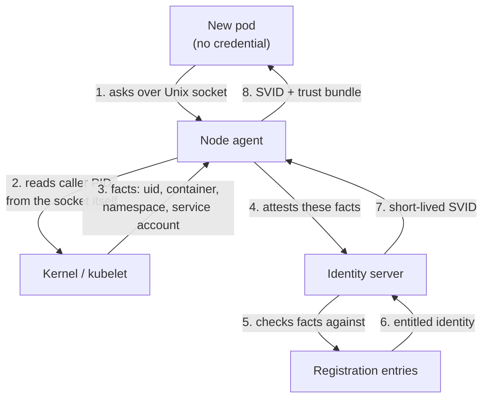

## Before you start

Read [service-discovery-and-mesh](service-discovery-and-mesh) — it explains the sidecar and control-plane machinery this topic gives identities to. [pki-and-certificate-authorities](pki-and-certificate-authorities) covers how a CA signs and what a chain of trust is; here you will watch a CA issue certificates every few minutes with nobody touching a file.

## In one sentence

**Workload identity** is a verifiable name for a running piece of software — a pod, a process, a function — issued automatically by the platform, so services can prove *what they are* to each other without any human ever handling a secret.

## Why it matters

The default answer for service-to-service auth is a shared secret in an environment variable. `PAYMENTS_API_KEY=sk_live_9f2...`, injected at deploy, the same value everywhere.

Watch that decay. The value is in your CI config, in a secrets manager, in six pods' environments, in a developer's `.env` from last March, and probably in a log line where someone printed `process.env` while debugging. It never expires. Rotating it means a coordinated change across every consumer, so it gets postponed indefinitely — the secret in your cluster right now is likely years old.

Now the failure. Any process that has read that value *is* the payments client, forever, from anywhere. There is no way to tell a legitimate caller from a copy, no way to expire the copy, and no blast radius smaller than "everything". This is not a hypothetical; leaked long-lived credentials are among the most common paths into production systems.

Workload identity replaces it with a credential that is short-lived, automatically rotated, never written down, and only obtainable by a process the platform actually scheduled.

## The intuition

Think about how a new employee gets a building pass on day one.

They arrive holding nothing. They cannot be given a pass in advance — a pass mailed to a home address is a pass an attacker can intercept. So HR does something different: it checks facts the *employer* already knows. Someone confirms this person appeared at reception, that a manager requested a start today, that the face matches the file. Only after that vouching does the pass get printed.

The pass then expires — not in years, but at the end of a contract period — and is silently reissued while they work.

That is workload identity exactly. A brand-new pod holds no credential. It cannot be shipped one in advance, because anything embedded in an image is available to anyone who pulls the image. Instead something *already trusted* — the platform that scheduled the pod — vouches for facts about it. Only then is a credential issued, and only a short-lived one.

The crucial move is the same in both stories: **you do not start with a secret, you start with a witness.**

## How it actually works

Two identifiers do the work.

A **SPIFFE ID** is the name, written as a URI: `spiffe://prod.example.com/ns/payments/sa/charge-worker`. The host part is the **trust domain** — one administrative region with one root of trust. The path identifies the workload within it. It is a name, not a credential; anyone can type it.

An **SVID** (SPIFFE Verifiable Identity Document) is the credential that proves the name. It carries exactly one SPIFFE ID and comes in two shapes: an **X.509-SVID**, a real certificate with the SPIFFE ID in the SAN URI field — usable directly for mTLS — or a **JWT-SVID**, a signed token for hops where you cannot control the TLS layer. Same identity, two envelopes.

Now the hard part, and the part interviewers push on.

**The bootstrap problem: how does a process with no credential obtain its first credential?** You cannot solve it with a secret, because holding that secret would itself require a secret. Bake one into the image and every puller has it. The recursion has to be broken by something outside the workload.

The answer is **attestation**: an already-trusted party asserts facts about the workload, and those facts are checked against a registration entry that says what identity such a workload deserves.



Notice step 2, which is where the security actually lives. The pod connects to a Unix domain socket and **says nothing about who it is**. The agent asks the *kernel* for the peer credentials of that socket — the calling process ID — then resolves that PID through the container runtime to a container, pod, namespace, and service account. Every fact comes from the platform, never from the caller. A lying workload cannot lie, because it is never asked.

That is why the trust chain terminates cleanly. It bottoms out in things the platform enforces: which process opened this socket, which pod that process belongs to, what the scheduler recorded about that pod.

Node-level attestation anchors the layer below. The agent itself proves it runs on a legitimate node using something the cloud vouches for — an instance identity document, a TPM, a cluster-issued token — so a laptop cannot pretend to be a cluster node and start requesting identities.

Then the lifecycle: an SVID typically lives **an hour or less**, and the agent renews it in the background well before expiry. The application does not restart, redeploy, or notice. Rotation stops being an operation and becomes a property.

## Worked example

Attestation in miniature — facts from the platform, never from the caller:

```js
const net = require('node:net');
const crypto = require('node:crypto');

// Registration entries: platform facts -> the identity they earn.
const entries = [
  { selectors: { ns: 'payments', sa: 'charge-worker' },
    spiffeId: 'spiffe://prod.example.com/ns/payments/sa/charge-worker' },
];

const TTL_SECONDS = 3600;

// Stand-in for kernel peer-credential lookup + container runtime resolution.
// The workload never supplies these — that is the entire point.
function attest(pid) {
  const platformFacts = { 4711: { ns: 'payments', sa: 'charge-worker' } };
  return platformFacts[pid] ?? null;
}

function issueSvid(pid) {
  const facts = attest(pid);
  if (!facts) throw new Error('attestation failed: unknown workload');

  const match = entries.find((e) =>
    Object.entries(e.selectors).every(([k, v]) => facts[k] === v));
  if (!match) throw new Error('no registration entry matches these facts');

  return {
    spiffeId: match.spiffeId,
    expiresIn: TTL_SECONDS,          // short: blast radius is bounded by this
    serial: crypto.randomUUID(),
  };
}

console.log(issueSvid(4711));         // a real, scheduled workload
try { issueSvid(9999); }              // a process the platform never scheduled
catch (e) { console.log('rejected:', e.message); }
```

Output:

```
{
  spiffeId: 'spiffe://prod.example.com/ns/payments/sa/charge-worker',
  expiresIn: 3600,
  serial: 'a1f4c8d2-6b03-4e77-9c15-8e2b7d0a4f39'
}
rejected: attestation failed: unknown workload
```

Read `issueSvid` again and note what is missing: **there is no parameter for a claimed identity**. The workload cannot request `spiffe://.../ns/admin/sa/root` because there is nowhere to ask. It gets whatever its platform facts entitle it to, and nothing else. Compare that with an API key, where the credential *is* the claim and the claim is whatever bytes you present.

## A second example — when it gets harder

The naive read is "short-lived certificates, problem solved". Two things bite.

**Selectors that are too loose grant identity to the wrong thing.** Register on namespace alone:

```js
{ selectors: { ns: 'payments' },
  spiffeId: 'spiffe://prod.example.com/ns/payments/sa/charge-worker' }
```

Now *every* pod in the `payments` namespace attests successfully and receives the charge-worker identity — including a debug pod someone exec'd into to run a one-off script. You have rebuilt the shared-secret problem with better cryptography: a credential many workloads hold in common. Selectors must be as specific as the identity is powerful, which usually means service account plus namespace, and sometimes the image digest.

**Short TTLs make the identity provider a hard dependency.** A one-hour SVID means every workload must reach the agent roughly hourly, forever. If the control plane is unreachable for two hours, credentials expire *fleet-wide* and healthy services start refusing each other — the same "fail closed and take everything down" pattern that [service-discovery-and-mesh](service-discovery-and-mesh) warns about with registry eviction.

Real implementations blunt this: agents cache the trust bundle and renew at around half the TTL, so a one-hour credential tolerates roughly thirty minutes of outage. But the trade-off is explicit and worth stating out loud. A shorter TTL bounds the damage from a stolen credential and shrinks your tolerance for control-plane downtime. Those move in opposite directions, and picking a number is choosing between them.

Watch also for workloads that read their SVID **once at startup**. It works for an hour, then fails mysteriously — and restarting fixes it, which sends everyone hunting for a memory leak. Long-lived processes must re-read the credential, not cache it for their lifetime.

## Quick reference

| Concept | What it is |
|---|---|
| Trust domain | One root of trust; the host part of a SPIFFE ID |
| SPIFFE ID | The name: `spiffe://trust-domain/path`. Not a credential |
| X.509-SVID | Certificate with the SPIFFE ID in SAN URI — used for mTLS |
| JWT-SVID | Signed token with the same ID — for non-TLS hops |
| Workload API | Local socket where a workload fetches its SVID and trust bundle |
| Registration entry | Selectors (platform facts) mapped to an identity |
| Workload attestation | Agent asks the kernel/runtime who the caller is |
| Node attestation | Agent proves the node is legitimate to the server |

| | Long-lived shared secret | Workload identity (SVID) |
|---|---|---|
| Lifetime | Years, effectively forever | Minutes to an hour |
| Rotation | Manual, coordinated, deferred | Automatic, invisible |
| Humans see it | Yes — CI, vaults, `.env`, logs | No |
| Held by | Anyone who ever read it | Only the attested workload |
| Blast radius if leaked | Unbounded in time and scope | One workload, until expiry |
| Tied to | Nothing | What the platform actually scheduled |
| Hard dependency | None | Identity control plane |

## Common mistakes

- Trying to solve bootstrap with a bootstrap secret. That is the same problem one level down. The recursion only breaks when something already trusted — the platform — vouches for the workload.
- Writing selectors that are too broad, so many pods legitimately obtain one powerful identity. You get shared-secret semantics with a certificate's overhead.
- Reading the SVID once at startup and caching it for the process lifetime, producing a failure exactly one TTL after every deploy.
- Confusing the SPIFFE ID with the credential. The ID is a public name anyone can write down; only the SVID proves it.
- Treating identity as authorisation. `spiffe://.../charge-worker` says who is calling, not what they may do. Authorisation policy is a separate layer that consumes this identity.
- Setting an aggressively short TTL without checking your control plane's availability, converting a brief outage into a fleet-wide authentication failure.

## What interviewers ask

- **How does a brand-new pod get its first credential when it starts with nothing?** — Through attestation. It connects to a local agent socket and claims nothing; the agent asks the kernel for the caller's process ID, resolves it through the container runtime to a pod, namespace, and service account, and checks those platform-supplied facts against registration entries. Identity comes from what the platform scheduled, never from what the workload asserts.
- **Why is a long-lived API key in an env var a problem at scale?** — It never expires, it spreads to every system that ever handled it, rotation needs coordinated changes so it gets postponed, and anyone who read it once is indistinguishable from the real caller forever. There is no bounded blast radius.
- **What is a SPIFFE ID versus an SVID?** — The SPIFFE ID is the name, a URI with a trust domain and a path, and it is public. The SVID is the cryptographically verifiable document — an X.509 certificate or a JWT — that proves the bearer legitimately holds that name.
- **Why short-lived certificates instead of good revocation?** — Revocation needs every client to check CRL or OCSP, and clients routinely skip it or fail open, so revocation frequently does not work in practice. A one-hour lifetime achieves the goal by construction: a stolen credential is worthless within the hour, with no infrastructure to consult.
- **What is the risk of very short TTLs?** — The identity control plane becomes a hard dependency. If it is unreachable longer than the renewal window, credentials expire across the fleet and healthy services reject each other, so a brief control-plane outage becomes a total one.

## Practice

1. Extend `issueSvid` so a registration entry can require an image digest as well as namespace and service account. Show that a debug pod in the right namespace, running a different image, is now refused.
2. Add expiry: return an `expiresAt` timestamp, write a client that fetches once and caches forever, and demonstrate the failure at the TTL boundary. Then add renewal at half the TTL and show it survives.
3. For a fleet of 200 pods on a 1-hour SVID with renewal at 30 minutes, work out how long the identity server can be down before the first authentication failure and before total failure. Then argue for a specific TTL, naming what you are trading.

## Where to go next

Continue to [mtls-in-service-meshes](mtls-in-service-meshes) — a mesh is where these identities get used automatically, issuing and rotating certificates for every pod so application code makes a plain HTTP call and gets authenticated mTLS anyway. For how certificates are issued and expired more generally, read [certificate-lifecycle-and-rotation](certificate-lifecycle-and-rotation).
