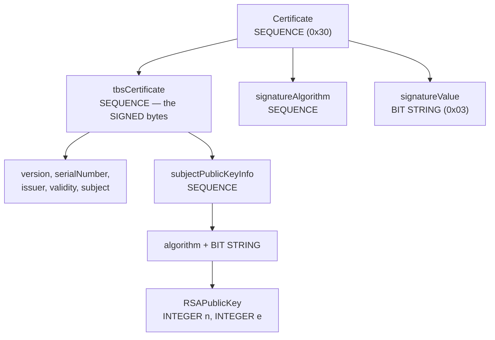

## Before you start

Read `pki-and-certificate-authorities` first. You need one idea from it: a CA signs a *hash of the TBS bytes*, not the whole file. This topic is about finding those bytes.

Nothing else is required. No cryptography background, no experience with binary formats. If you can read a hex dump and follow a for-loop, you can do everything here.

## In one sentence

A certificate is a nested tree of **tag-length-value** records — one byte says what this is, the next bytes say how long it is, then the data — and once you can walk that structure you can extract any field and check the signature yourself with about forty lines of arithmetic.

## Why it matters

Almost nobody does this, and that is exactly why it is worth doing.

Certificates are the last place most engineers accept "it's a black box." You call `verify()`, you get `true` or `false`, and if it says `false` you start guessing. Once you have parsed one by hand, the guessing stops: you know which byte range is signed, you know why an off-by-two slice makes verification fail silently, and you know that "the cert and key are a pair" is a comparison of two integers.

It also demystifies a whole class of tooling. Every certificate library, every `openssl x509 -text` dump, every warning about "malformed certificate" is doing what you are about to do manually.

## The intuition

Think of **DER** as a self-describing box format, with no schema needed to unpack it.

Every box has a label, a size written on the outside, and contents. `30` on the label means "this box contains other boxes" (a `SEQUENCE`). `02` means "this box holds a number" (an `INTEGER`). So you can walk a shipment you have never seen before: read the label, read the size, and you now know exactly where this box ends and the next one begins — without understanding what is inside it.

That property is why DER, not JSON, holds certificates. It is **unambiguous**: any given structure has exactly one valid byte encoding. A signature covers bytes, so the format carrying signed data must never have two ways to write the same thing. JSON has infinite whitespace variants; DER has one.

**PEM** is just that binary, Base64-encoded, with header lines glued on so it survives being pasted into a config file.

## How it actually works



**Step 1: PEM to DER.** Drop the first and last lines, join what remains, Base64-decode it. The first byte of the result is `0x30`. That is the `SEQUENCE` tag, and seeing it is your confirmation you have real DER and not, say, a file with Windows line endings mangled into the Base64.

**Step 2: read one tag-length-value.** The tag is one byte. Then the length, and here is the part that trips people: lengths come in two forms.

- **Short form.** If the byte is `0x00`–`0x7f`, that byte *is* the length. `02 03 01 00 01` is an INTEGER, 3 bytes long, value `01 00 01` (which is 65537 — you will meet it again shortly).
- **Long form.** If the high bit is set, the low 7 bits say **how many following bytes hold the real length**. So `82 04 D3` means: high bit set, 2 length bytes follow, and those bytes are `0x04D3` = 1235. The `0x82` is not part of the length; it is a count of length bytes.

Certificates are over 127 bytes, so their outer `SEQUENCE` always uses long form. This is why every PEM certificate starts with `MII` — that Base64 is `30 82`, a SEQUENCE with a two-byte long-form length.

**Step 3: walk children.** A `SEQUENCE` value is just more tag-length-value records back to back. Read one, jump to its end, read the next, stop when you reach the parent's end. That is the entire parser.

**Step 4: know the shape you are walking.** RFC 5280 defines it in three lines:

```
Certificate  ::=  SEQUENCE  {
     tbsCertificate       TBSCertificate,
     signatureAlgorithm   AlgorithmIdentifier,
     signatureValue       BIT STRING  }
```

Three children, always. Child 0 is everything being attested; child 2 is the CA's signature over child 0.

**Step 5 — the detail everything hinges on.** The TBS bytes you hash must include the `tbsCertificate` element's **own tag and length header**, not just its contents.

The CA did not hash "the fields inside tbsCertificate." It DER-encoded the `TBSCertificate` structure — which produces `30 82 xx xx <fields>` — and hashed *that complete encoding*. So your slice starts at the offset of the tag byte, not at the offset where the value begins:

```js
// RIGHT: from the tag byte through the end of the value
const tbsBytes = der.subarray(tbsTlv.offset, tbsTlv.valueEnd);

// WRONG: skips the 4-byte tag+length header
const wrong = der.subarray(tbsTlv.valueStart, tbsTlv.valueEnd);
```

Get this wrong and you have a beautifully working parser that reports every certificate on earth as invalid. There is no error message, no clue — just two hashes that do not match, because you hashed 1231 bytes and the CA hashed 1235. This is the single most common bug in hand-written certificate verification, and it is why the lab slices from `offset`.

**Step 6: BIT STRING has a leading count byte.** `signatureValue` is a `BIT STRING` (tag `0x03`), and a BIT STRING's *first content byte* is the number of unused bits in the final byte. For certificate signatures and public keys it is always `0x00`, because the data is whole bytes. But you must skip it, hence `valueStart + 1`. Forget it and your signature integer is 256 times too large.

## Worked example

The parser, in full. Two functions do all the work.

```js
const { readFileSync } = require('node:fs');
const { createHash } = require('node:crypto');

// ---- PEM -> DER: drop header lines, undo Base64 -------------------------
function pemToDer(pem) {
  const lines = pem.trim().split('\n');
  return Buffer.from(lines.slice(1, -1).join(''), 'base64');
}

// ---- read ONE tag-length-value at `off` --------------------------------
function readTLV(der, off) {
  const tag = der[off];
  let p = off + 1;
  let len = der[p++];
  if (len & 0x80) {                       // LONG FORM
    const n = len & 0x7f;                 // low 7 bits = count of length bytes
    len = 0;
    for (let i = 0; i < n; i++) len = (len << 8) | der[p++];
  }
  return { tag, len, valueStart: p, valueEnd: p + len, offset: off };
}

// ---- walk a SEQUENCE's direct children --------------------------------
function children(der, seqOff) {
  const seq = readTLV(der, seqOff);
  const out = [];
  let p = seq.valueStart;
  while (p < seq.valueEnd) {
    const t = readTLV(der, p);
    out.push(t);
    p = t.valueEnd;                       // jump straight past this child
  }
  return out;
}

const der = pemToDer(readFileSync('certs/client.crt', 'utf8'));
console.log('DER bytes  :', der.length);
console.log('first bytes:', der.subarray(0, 8).toString('hex'));

const top = children(der, 0);
const names = ['tbsCertificate (SIGNED)', 'signatureAlgorithm', 'signatureValue'];
top.forEach((c, i) =>
  console.log(`  [${i}] tag=0x${c.tag.toString(16)} len=${String(c.len).padEnd(5)} ${names[i]}`));

const [tbsTlv, , sigTlv] = top;

// INCLUDE the tag+length header — the CA hashed exactly this range.
const tbsBytes = der.subarray(tbsTlv.offset, tbsTlv.valueEnd);
console.log(`\ntbsCertificate = bytes [${tbsTlv.offset}..${tbsTlv.valueEnd}] = ${tbsBytes.length} bytes`);
console.log('sha256(tbs)  :', createHash('sha256').update(tbsBytes).digest('hex'));

// BIT STRING: skip the leading "unused bits" byte
console.log('unused bits  :', der[sigTlv.valueStart]);
const sigBytes = der.subarray(sigTlv.valueStart + 1, sigTlv.valueEnd);
console.log('signature    :', sigBytes.length, 'bytes');
```

Output against a 2048-bit RSA certificate:

```
DER bytes  : 862
first bytes: 3082035a30820242a0030201
  [0] tag=0x30 len=578   tbsCertificate (SIGNED)
  [1] tag=0x30 len=13    signatureAlgorithm
  [2] tag=0x3  len=257   signatureValue

tbsCertificate = bytes [4..586] = 582 bytes
sha256(tbs)  : 9f2c8a1d...
unused bits  : 0
signature    : 256 bytes
```

Read that output carefully, because three things confirm the theory. `30 82 03 5a` at the start is SEQUENCE, long form, 2 length bytes, `0x035a` = 858 (plus the 4-byte header = 862, the file size). The `tbsCertificate` reports `len=578` but the slice is **582 bytes** — the extra 4 are its own `30 82 02 42` header, which is precisely the header the CA included. And `signatureValue` is `len=257` for a 256-byte signature: 256 bytes of signature plus that one `unused bits` byte.

## A second example — when it gets harder

Parsing is the easy half. Now verify the signature with no crypto library at all.

**Find the CA's public key.** In the *CA's own* certificate, walk `tbsCertificate` → `subjectPublicKeyInfo` → `BIT STRING` → `RSAPublicKey`. You can locate `subjectPublicKeyInfo` structurally without counting fields: it is the only child of TBS that is a `SEQUENCE` containing exactly two children whose second is a `BIT STRING`. Inside that BIT STRING (skip the unused-bits byte again) is another SEQUENCE holding two INTEGERs — the modulus `n` and the exponent `e`.

```js
function derIntToBigInt(der, tlv) {
  let bytes = der.subarray(tlv.valueStart, tlv.valueEnd);
  if (bytes[0] === 0x00) bytes = bytes.subarray(1);   // strip DER sign padding
  let v = 0n;
  for (const b of bytes) v = (v << 8n) | BigInt(b);
  return v;
}

const caDer  = pemToDer(readFileSync('certs/ca.crt', 'utf8'));
const caTbs  = children(caDer, 0)[0];
const spki = children(caDer, caTbs.offset).find((k) => {
  if (k.tag !== 0x30) return false;
  const kids = children(caDer, k.offset);
  return kids.length === 2 && kids[1].tag === 0x03;   // {algorithm, BIT STRING}
});
const spkiKids = children(caDer, spki.offset);
const rsaDer   = caDer.subarray(spkiKids[1].valueStart + 1, spkiKids[1].valueEnd);
const [nTlv, eTlv] = children(rsaDer, 0);
const n = derIntToBigInt(rsaDer, nTlv);   // modulus
const e = derIntToBigInt(rsaDer, eTlv);   // exponent
console.log('n bits:', n.toString(2).length, '  e:', e);   // 2048   65537
```

There is `e = 65537` again — the `02 03 01 00 01` from earlier.

**Treat the signature as one integer.** 256 bytes of signature, read big-endian, is a single number `s` with 617 decimal digits. Nothing more clever than that.

**Compute `s^e mod n`.** This *is* RSA verification. Signing was `s = h^d mod n` and needed the CA's private `d`; verifying is `m = s^e mod n` and needs only the public `e`.

You cannot compute it directly. `s ** e` with `e = 65537` would produce roughly 617 × 65537 ≈ **40 million digits** before any reduction — the lab prints exactly this number to make the point. So you reduce at every step, using square-and-multiply:

```js
function modPow(base, exp, m) {
  let result = 1n;
  base %= m;
  while (exp > 0n) {
    if (exp & 1n) result = (result * base) % m;   // bit set -> multiply in
    exp >>= 1n;
    base = (base * base) % m;                     // always square
  }
  return result;
}

let s = 0n;
for (const b of sigBytes) s = (s << 8n) | BigInt(b);
console.log('s < n ?', s < n);                    // must be true: RSA works in Z_n

const m = modPow(s, e, n);
let hexM = m.toString(16); if (hexM.length % 2) hexM = '0' + hexM;
const recovered = Buffer.concat([
  Buffer.alloc(sigBytes.length - hexM.length / 2, 0), Buffer.from(hexM, 'hex'),
]);
```

`e = 65537` is `0b10000000000000001` — 17 bits, two of them set. So this is 17 squarings and 2 multiplies instead of 65537 multiplications, and it is why `e = 65537` is the near-universal choice.

**Unpad and compare.** What comes back is a PKCS#1 v1.5 block: `00 01 FF FF … FF 00 <DigestInfo>`. Walk past the `0xFF` padding to the `0x00` separator; what follows is a small DER `SEQUENCE { AlgorithmIdentifier, OCTET STRING hash }`. Pull out the OCTET STRING — that is the hash the CA committed to.

```js
let i = 2; while (recovered[i] === 0xff) i++;      // skip padding
const digestInfo = recovered.subarray(i + 1);      // past the 0x00 separator
const diKids = children(digestInfo, 0);
const hashFromSig  = digestInfo.subarray(diKids[1].valueStart, diKids[1].valueEnd);
const hashComputed = createHash('sha256').update(tbsBytes).digest();

console.log('from signature:', hashFromSig.toString('hex'));
console.log('we computed   :', hashComputed.toString('hex'));
console.log(hashFromSig.equals(hashComputed) ? 'SIGNATURE VALID' : 'INVALID');
```

```
from signature: 9f2c8a1d5e...
we computed   : 9f2c8a1d5e...
SIGNATURE VALID
```

Two hashes match, so only the holder of the CA's private key could have produced `s`, and not one bit of the TBS bytes changed. That is the complete meaning of "the certificate is signed by this CA."

**Cross-check against the real API.** Your hand-parse should agree with `node:crypto` exactly, which is how you catch a bad slice:

```js
const { X509Certificate } = require('node:crypto');
const cert = new X509Certificate(readFileSync('certs/client.crt', 'utf8'));
const ca   = new X509Certificate(readFileSync('certs/ca.crt', 'utf8'));

console.log('subject   :', cert.subject);
console.log('issuer    :', cert.issuer);
console.log('sigAlg    :', cert.signatureAlgorithm);          // sha256WithRSAEncryption
console.log('raw bytes :', cert.raw.length);                  // === der.length
console.log('key bits  :', cert.publicKey.asymmetricKeyDetails.modulusLength);
console.log('verify()  :', cert.verify(ca.publicKey));        // true
```

`cert.verify(ca.publicKey)` returning `true` is the library doing every step above. `cert.raw.length` equalling your `der.length` proves your PEM decode was byte-exact.

**The tamper test.** Flip one bit in `tbsBytes` and re-hash. Roughly 128 of the 256 digest bits change — SHA-256's avalanche property — so the signature cannot survive even a single-bit edit anywhere in the signed region.

## Quick reference

| Tag | Type | Notes |
|---|---|---|
| `0x02` | INTEGER | Big-endian; a leading `0x00` is sign padding, strip it |
| `0x03` | BIT STRING | **First content byte = unused-bit count** (0 here) |
| `0x04` | OCTET STRING | Raw bytes, e.g. the hash in DigestInfo |
| `0x05` | NULL | Length 0 |
| `0x06` | OBJECT IDENTIFIER | Algorithm names |
| `0x30` | SEQUENCE | Ordered children — the container |
| `0x31` | SET | Unordered children |

| Length byte | Meaning | Example |
|---|---|---|
| `0x00`–`0x7f` | Short form: that *is* the length | `0x03` → 3 bytes |
| `0x81` | 1 following byte holds the length | `81 C8` → 200 |
| `0x82` | 2 following bytes hold the length | `82 04 D3` → 1235 |

| Mistake | Symptom |
|---|---|
| Slicing TBS from `valueStart` | Hashes never match; no error message |
| Forgetting BIT STRING's unused-bits byte | Signature integer 256× too big; `s > n` |
| Not stripping INTEGER sign padding | `n` and `e` slightly wrong; garbage output |
| Using `base ** exp` instead of `modPow` | Hangs or exhausts memory (~40M digits) |
| Assuming short-form length | Parser breaks on any real certificate |

## Tools & frameworks

| Tool | What it's for | Reach for it when |
|---|---|---|
| [OpenSSL `asn1parse` and `x509`](https://docs.openssl.org/) | Decode DER and PEM structures | The canonical way to see what is actually inside a certificate |
| [asn1js](https://lapo.it/asn1js/) | Browser ASN.1 decoder with a byte view | You are learning DER's tag-length-value encoding and want to see the bytes line up |
| [@peculiar/x509](https://github.com/PeculiarVentures/x509) | Parse and build X.509 in TypeScript | You are handling certificates inside a Node service rather than at the shell |
| [RFC 5280](https://www.rfc-editor.org/info/rfc5280/) | The X.509 specification itself | You need the authoritative meaning of an extension, because tools disagree |

## Common mistakes

- Slicing the TBS bytes from `valueStart` instead of `offset`. Off by the 4-byte tag+length header, and verification fails with no diagnostic at all. Always slice from the tag byte.
- Reading a BIT STRING's content directly. Skip the first byte — it counts unused bits, not data.
- Assuming a length byte is the length. Above 127 it is a *count of length bytes*. Every real certificate hits the long form.
- Computing `s ** e` before reducing. Reduce mod `n` at each step or the number is astronomically large.
- Thinking verification "decrypts the certificate". It recovers a padded hash block and you compare that hash to your own. Only the digest crosses that boundary.
- Assuming a JSON-like format could hold signed data. Signatures cover exact bytes, so the encoding must be canonical — that is the whole reason DER exists rather than BER.

## What interviewers ask

- **What is the difference between PEM and DER?** — DER is the binary tag-length-value encoding; PEM is that binary Base64-encoded with `-----BEGIN-----` header lines so it survives text transport. Same bytes, different wrapper.
- **What are the three top-level parts of an X.509 certificate?** — `tbsCertificate`, `signatureAlgorithm`, `signatureValue`. They are probing whether you know the signature is a sibling of the signed data, not a wrapper around it.
- **Which bytes exactly does a CA sign?** — The complete DER encoding of `tbsCertificate`, *including* its own tag and length header. Naming the header is the answer that shows you have actually done it.
- **Why is DER used rather than something like JSON?** — DER is canonical: one structure, one byte encoding. A signature covers bytes, so any ambiguity in encoding would let the same logical certificate hash two different ways.
- **How does RSA signature verification work?** — Treat the signature as an integer `s`, compute `s^e mod n` with the signer's public key, unpad the PKCS#1 block, extract the embedded hash, and compare it to your own hash of the signed bytes.
- **Why is the public exponent almost always 65537?** — It is `0b10000000000000001`: 17 bits with only two set, so square-and-multiply needs 17 squarings and 2 multiplies. Small enough to be fast, large enough to avoid small-exponent attacks.
- **Why is a long-form length byte not just a bigger number?** — Because a single byte tops out at 255. The high bit flags "this is a count", the low 7 bits say how many bytes follow, so lengths can grow without bound.

## Practice

1. Take any PEM certificate, decode it to DER, and print the first four bytes as hex. Explain what each byte means and compute the total file size from the length field alone. Confirm your arithmetic against the actual byte count.
2. Write `readTLV` and `children`, then walk `tbsCertificate` and print the tag and length of every direct child. Match what you find against the `TBSCertificate` definition in RFC 5280 §4.1 and identify which child is `subjectPublicKeyInfo`.
3. Extract `n` and `e` from a certificate by hand, then compare `n` against `new X509Certificate(pem).publicKey.export({ format: 'jwk' }).n` decoded from base64url. They must be the same integer.
4. Implement `modPow` and verify a real signature end to end. Then deliberately slice the TBS bytes from `valueStart` instead of `offset` and observe that verification fails with no hint as to why. Sit with that for a moment — it is the lesson.
5. Optional hands-on: `manual-verify.js` in the `mtls-demo` lab does all of the above with no `verify()` call anywhere, plus a single-bit tamper test that shows the avalanche effect, a proof-of-possession check, and a cert/key pairing comparison.

## Where to go next

Go to `certificate-lifecycle-and-rotation`. You now understand what is inside a certificate — including the validity window whose expiry is the most reliable way to take down a healthy service. If you would rather see certificates in motion, `mutual-tls-explained` shows both sides presenting them at once.
