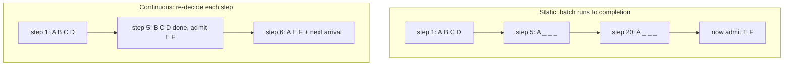

## Before you start

[inference-servers-vllm-and-tgi](inference-servers-vllm-and-tgi) — you should already know that a serving runtime keeps a batch of sequences running on the GPU. This topic is about how membership of that batch is decided.

## In one sentence

**Continuous batching** re-decides which requests are in the GPU batch before *every single token step*, so a finished request leaves immediately and a waiting one takes its slot, instead of the whole batch running to completion together.

## Why it matters

Batching is not a minor optimisation in LLM serving. It is the entire economic basis of it. Get the batching wrong and you pay ten times more per token than you need to on identical hardware.

The reason is a hardware fact that most people meet for the first time here: **generating one token reads the model's entire weight set out of VRAM.** A 14-billion-parameter model in 16-bit is about 28GB. To produce one token for one user, the GPU streams all 28GB through its compute units and does a comparatively trivial amount of arithmetic with each byte. The arithmetic units are starved; the memory bus is the bottleneck.

Now serve sixteen users in that same pass. You still read 28GB once. Sixteen users' tokens for roughly the price of one. That is the whole game.

## The intuition

Two things are happening in a generation request, and confusing them is the most common source of muddled answers in interviews.

**Prefill** processes your entire prompt. Every token of the prompt can be handled in parallel in one pass, because they are all already known. This is like reading a whole page at a glance — lots of arithmetic on lots of data, and the GPU's compute units are genuinely busy. Prefill is **compute-bound**.

**Decode** then generates the answer one token at a time. Each new token depends on the one before it, so there is no way to parallelise across them. Each pass reads all the weights to produce a single token per sequence. This is like being made to fetch an entire library book to write down one word. Decode is **memory-bandwidth-bound**.

Batching helps decode enormously and prefill only a little, because the fixed cost you are amortising — reading the weights — is what dominates decode and not prefill.

Now the scheduling. Picture a minibus that leaves only when full and returns only when every passenger has been dropped off. Passenger A is going forty stops; B, C, and D are going four. Under **static batching**, B, C, and D sit on the bus for the whole forty-stop trip, and nobody waiting at the depot can board. Under **continuous batching** the bus drops B, C, and D at stop four and picks up three new passengers there and then — same bus, same driver, three times the passengers moved.

## How it actually works

Three scheduling policies, in order of sophistication:

**Static batching.** Collect requests until you have N of them or a timeout fires, run that batch through prefill and then decode until every member is done, return all responses, start again. Two failures compound: the batch runs as long as its *longest* member needs, so short requests inherit long requests' latency (**head-of-line blocking**); and as members finish, their batch slots go on being computed while producing nothing.

**Dynamic batching.** Improves only the *forming* of the batch — smarter waiting, adaptive timeouts. Once running, the batch is still fixed. This is what classical model servers do, and it works fine for fixed-cost inference like image classification where every request takes the same time. It is a poor fit for generation, where output lengths vary by an order of magnitude.

**Continuous batching**, also called **iteration-level scheduling** or **in-flight batching**. The scheduler runs before every token step. Any sequence that emitted its stop token is removed and its KV-cache blocks are freed; any queued request that fits in the freed memory is admitted and begins. The batch composition changes constantly and the GPU never spends a step computing a finished sequence.



The `_` slots in the static path are the waste: real GPU work producing nothing.

### The tension you must state honestly

Continuous batching does not make everything better. There is a genuine trade-off, and interviewers listen for whether you know it.

A larger batch raises **aggregate throughput** (tokens/sec the server produces across all users) and *lowers* **per-stream speed** (tokens/sec one user sees). Both, always. The step now carries more per-sequence attention work, so it takes longer, so each individual user's tokens arrive further apart.

There is no setting that optimises both. You choose:

- **Interactive chat** — cap the batch so per-stream speed stays above human reading speed, roughly 20–30 tokens/sec. Accept lower aggregate throughput.
- **Bulk offline jobs** — push the batch as high as VRAM allows. Nobody is watching a stream, so total time to finish the queue is the only metric.

### The real concurrency ceiling

More concurrent sequences means more KV cache, and the KV cache lives in the VRAM left over after the weights. So your maximum batch size is set by **VRAM**, not by CPU, connection limits, or thread pools — the constraints you are used to reasoning about in web services.

This surprises people. You cannot fix "too few concurrent requests" by adding replicas of the process on the same GPU, or by tuning your web server. The KV-cache budget is the number, and [gpu-memory-math](gpu-memory-math) is where you compute it.

## Worked example

This simulates both policies against the same six requests. Nothing here calls a GPU; the point is that the scheduling difference alone produces the gap.

```js
const STEP_MS = 25;        // one decode step for the whole batch
const MAX_BATCH = 4;       // how many sequences fit in VRAM at once

// Six requests: arrival time (ms) and how many tokens each will generate.
const requests = [
  { id: 'A', arrive: 0,   tokens: 20 },
  { id: 'B', arrive: 10,  tokens: 4  },
  { id: 'C', arrive: 20,  tokens: 4  },
  { id: 'D', arrive: 30,  tokens: 4  },
  { id: 'E', arrive: 200, tokens: 6  },
  { id: 'F', arrive: 210, tokens: 6  },
];

function report(name, done, steps, wastedSlots, clock) {
  const lat = done.map(r => r.finish - r.arrive).sort((a, b) => a - b);
  const total = done.reduce((a, r) => a + r.tokens, 0);
  const slots = steps * MAX_BATCH;               // capacity: batch slots x steps run
  console.log(`\n${name}`);
  for (const r of done) console.log(`  ${r.id}: waited ${String(r.start - r.arrive).padStart(3)}ms, latency ${r.finish - r.arrive}ms`);
  console.log(`  makespan          ${clock}ms`);
  console.log(`  decode steps run  ${steps}`);
  console.log(`  wasted batch slots ${wastedSlots}/${slots} (${(100 * wastedSlots / slots).toFixed(0)}% of GPU work did nothing)`);
  console.log(`  throughput        ${(1000 * total / clock).toFixed(1)} tok/s`);
  console.log(`  latency p50/max   ${lat[Math.floor(lat.length / 2)]}ms / ${lat[lat.length - 1]}ms`);
}

// ---- STATIC: fill a batch, run it to completion, nobody joins or leaves early.
function staticBatching() {
  const queue = [...requests].map(r => ({ ...r }));
  const done = [];
  let clock = 0, steps = 0, wasted = 0;

  while (done.length < requests.length) {
    const ready = queue.filter(r => r.arrive <= clock && !r.taken);
    if (ready.length === 0) { clock = Math.min(...queue.filter(r => !r.taken).map(r => r.arrive)); continue; }
    const batch = ready.slice(0, MAX_BATCH);
    batch.forEach(r => { r.taken = true; r.start = clock; });
    // The batch runs for as long as its LONGEST member needs.
    const runFor = Math.max(...batch.map(r => r.tokens));
    clock += runFor * STEP_MS;
    steps += runFor;
    // Every slot-step not producing a real token is pure waste.
    wasted += runFor * MAX_BATCH - batch.reduce((a, r) => a + r.tokens, 0);
    batch.forEach(r => { r.finish = clock; done.push(r); });   // all finish together
  }
  return { done, steps, wasted, clock };
}

// ---- CONTINUOUS: re-decide membership every single token step.
function continuousBatching() {
  const pending = [...requests].map(r => ({ ...r, left: r.tokens }));
  const running = [];
  const done = [];
  let clock = 0, steps = 0, wasted = 0;

  while (done.length < requests.length) {
    // A finished sequence has already left; admit whoever is waiting.
    while (running.length < MAX_BATCH) {
      const next = pending.find(r => r.arrive <= clock && !r.taken);
      if (!next) break;
      next.taken = true; next.start = clock; running.push(next);
    }
    if (running.length === 0) { clock = Math.min(...pending.filter(r => !r.taken).map(r => r.arrive)); continue; }

    clock += STEP_MS; steps += 1;                     // ONE step for the whole batch
    wasted += MAX_BATCH - running.length;             // only genuinely empty slots
    for (const r of running) r.left -= 1;             // every member advances one token
    for (let i = running.length - 1; i >= 0; i--) {
      if (running[i].left === 0) { running[i].finish = clock; done.push(running.splice(i, 1)[0]); }
    }
  }
  done.sort((a, b) => a.id.localeCompare(b.id));
  return { done, steps, wasted, clock };
}

const s = staticBatching();
report('STATIC batching', s.done, s.steps, s.wasted, s.clock);
const c = continuousBatching();
report('CONTINUOUS batching', c.done, c.steps, c.wasted, c.clock);
```

Output:

```
STATIC batching
  A: waited   0ms, latency 500ms
  B: waited 490ms, latency 640ms
  C: waited 480ms, latency 630ms
  D: waited 470ms, latency 620ms
  E: waited 300ms, latency 450ms
  F: waited 440ms, latency 590ms
  makespan          800ms
  decode steps run  32
  wasted batch slots 84/128 (66% of GPU work did nothing)
  throughput        55.0 tok/s
  latency p50/max   620ms / 640ms

CONTINUOUS batching
  A: waited   0ms, latency 500ms
  B: waited  15ms, latency 115ms
  C: waited   5ms, latency 105ms
  D: waited  20ms, latency 120ms
  E: waited   0ms, latency 150ms
  F: waited  15ms, latency 165ms
  makespan          500ms
  decode steps run  20
  wasted batch slots 36/80 (45% of GPU work did nothing)
  throughput        88.0 tok/s
  latency p50/max   150ms / 500ms
```

Read the per-request lines, not just the totals. Request A — the long one — has *identical* 500ms latency under both policies. Nothing was taken from it. But B, C, and D go from 620–640ms down to 105–120ms, a 5x improvement, purely because they stop being held hostage to A's length. p50 latency drops from 620ms to 150ms while throughput rises 60%.

That combination is what makes continuous batching unusual. Almost every other performance lever trades latency for throughput. This one improves both, because it is removing pure waste rather than rebalancing a trade-off.

Note the 45% waste that remains under continuous batching. That is not a scheduling failure — it is genuinely idle capacity, because for much of the run there simply were not four requests in flight. Waste from *idleness* falls away as load rises; waste from head-of-line blocking does not.

## A second example — when it gets harder

The naive conclusion from the above is "bigger batch, better". Here is the correction. This models the cost structure of a decode step directly.

```js
// A decode step reads all the weights regardless of batch size.
// Only the per-sequence attention work scales with the batch.
const WEIGHT_READ_MS = 20;    // fixed: stream 14B params of weights from VRAM
const PER_SEQ_MS = 0.6;       // marginal: attention over one sequence's KV cache

for (const batch of [1, 2, 4, 8, 16, 32, 64, 128]) {
  const stepMs = WEIGHT_READ_MS + batch * PER_SEQ_MS;
  const perStream = 1000 / stepMs;              // tokens/sec ONE user sees
  const aggregate = perStream * batch;          // tokens/sec the SERVER produces
  console.log(
    `batch ${String(batch).padStart(3)} | step ${stepMs.toFixed(1)}ms` +
    ` | per-stream ${perStream.toFixed(1)} tok/s` +
    ` | aggregate ${aggregate.toFixed(0)} tok/s`
  );
}
```

Output:

```
batch   1 | step 20.6ms | per-stream 48.5 tok/s | aggregate 49 tok/s
batch   2 | step 21.2ms | per-stream 47.2 tok/s | aggregate 94 tok/s
batch   4 | step 22.4ms | per-stream 44.6 tok/s | aggregate 179 tok/s
batch   8 | step 24.8ms | per-stream 40.3 tok/s | aggregate 323 tok/s
batch  16 | step 29.6ms | per-stream 33.8 tok/s | aggregate 541 tok/s
batch  32 | step 39.2ms | per-stream 25.5 tok/s | aggregate 816 tok/s
batch  64 | step 58.4ms | per-stream 17.1 tok/s | aggregate 1096 tok/s
batch 128 | step 96.8ms | per-stream 10.3 tok/s | aggregate 1322 tok/s
```

Look at what happens between batch 1 and batch 16. Aggregate throughput goes up 11x. Per-stream speed falls only 30%, from 48.5 to 33.8 tokens/sec — still comfortably faster than anyone reads. That region is nearly free money: the fixed weight read is being amortised and barely anything is being given up.

Then look at 16 to 128. Aggregate gains only 2.4x more, while per-stream collapses to 10.3 tokens/sec — slower than reading speed, so users watch the text crawl. Past the point where the marginal per-sequence term catches up with the fixed weight read, you are buying small throughput gains with large latency costs.

This is why "what batch size?" has no universal answer, and why the honest answer in an interview is a question: *is anyone watching the stream?* If yes, cap the batch where per-stream speed is still comfortable — around 16 in this model. If no, run it at whatever the VRAM ceiling allows and take the 1,322 tokens/sec.

One more wrinkle worth knowing about. Prefill and decode compete for the same GPU. When a big prompt arrives, its compute-bound prefill pass stalls the decode steps of everyone currently streaming — they see a visible stutter. Runtimes handle this with **chunked prefill**, splitting a long prompt into pieces and interleaving them with decode steps, which slightly slows that one prefill to keep everyone else's tokens flowing smoothly.

## Quick reference

| Policy | Batch changes when | Head-of-line blocking | Best for |
|---|---|---|---|
| No batching | never, size 1 | n/a | nothing in production |
| Static | at batch boundaries | severe | fixed-duration inference |
| Dynamic | at batch formation only | severe | image classification, embeddings |
| Continuous | every token step | none | all LLM generation |

| Phase | Parallel over | Bottleneck | Batching helps |
|---|---|---|---|
| Prefill | all prompt tokens at once | compute (FLOPs) | a little |
| Decode | one token per sequence | memory bandwidth | enormously |

| Raise batch size | Effect |
|---|---|
| Aggregate tokens/sec | up, with diminishing returns |
| Per-stream tokens/sec | down, always |
| KV cache used | up, linearly |
| Queue wait time | down, until VRAM runs out |

## Tools & frameworks

| Tool | What it's for | Reach for it when |
|---|---|---|
| [vLLM](https://docs.vllm.ai/en/latest/) | Continuous batching and PagedAttention | The default serving engine — this is where the technique landed for most teams |
| [SGLang](https://docs.sglang.io/) | RadixAttention, batching that is prefix-cache aware | Many requests share long prefixes, as with agents and few-shot prompts |
| [TensorRT-LLM](https://nvidia.github.io/TensorRT-LLM/) | In-flight batching over compiled kernels | You want maximum throughput on NVIDIA and accept a per-model compile step |
| [GuideLLM](https://github.com/vllm-project/guidellm) | Measure the throughput against latency trade-off | You need to prove batching helped and find where TTFT starts degrading |

HuggingFace TGI pioneered continuous batching in the open but its repository was archived read-only in March 2026, so it is history here rather than an option.

## Common mistakes

- Confusing prefill and decode, then being unable to explain why batching helps so much. The fixed weight read dominating decode is the reason.
- Claiming continuous batching improves latency for *every* request. The longest request in the batch gains nothing; the short ones behind it gain everything.
- Maximising batch size for a chat product, then not understanding why users complain the answer "types slowly" while the dashboard shows record throughput.
- Reporting a single "tokens/sec" number without saying whether it is per-stream or aggregate — they move in opposite directions, so the number alone is meaningless.
- Trying to raise concurrency by adding process replicas on one GPU. The KV-cache budget is fixed by VRAM; you have only split it.
- Benchmarking with uniform output lengths, which erases head-of-line blocking and makes static batching look competitive.
- Forgetting long prompts stall active streams, then blaming the network for the stutter instead of enabling chunked prefill.

## What interviewers ask

- **Why does batching help LLM inference so much?** — A decode step reads the entire weight set from VRAM to produce one token per sequence, and that read is the bottleneck. Adding sequences to the batch reuses the same read, so sixteen users cost barely more than one; you are amortising a fixed memory transfer.
- **What is the difference between static and continuous batching?** — Static runs a fixed batch to completion, so short requests wait for the longest one and finished slots keep being computed. Continuous re-decides membership every token step, so a finished sequence leaves and a queued one joins immediately.
- **Does continuous batching hurt latency?** — Not by itself; it removes waiting, so p50 latency usually improves. Latency degrades when you then raise the batch size, which is a separate decision — a bigger batch always slows each individual stream.
- **How do you choose batch size?** — Ask whether a human is watching the stream. Interactive: cap it so per-stream speed stays above ~20–30 tokens/sec. Offline: push to the VRAM ceiling, since only total completion time matters.
- **What actually limits your concurrency?** — VRAM, via the KV cache. Each concurrent sequence needs cache space in the memory left after the weights, and that budget — not connections or CPU — sets the maximum batch.
- **Why is prefill different from decode?** — Prefill handles all prompt tokens in one parallel, compute-bound pass. Decode is inherently sequential, one token at a time, and memory-bandwidth-bound. That asymmetry is why batching transforms decode and barely moves prefill.

## Practice

1. Change `MAX_BATCH` in the simulation from 4 to 2, then to 8, and re-run. Explain why the static policy's wasted-slot percentage moves the way it does while the continuous policy's barely changes.
2. Add a `PREFILL_MS` cost proportional to prompt length to the simulation, charged when a sequence is admitted. Give one request a 4,000-token prompt and measure the stutter it inflicts on the other streams. Then implement chunked prefill — cap prefill work per step — and measure the improvement.
3. Using the second model, derive algebraically the batch size at which per-stream tokens/sec falls below 25. Show how that batch size changes if you halve `PER_SEQ_MS`, which is what a shorter average context length would do.

## Where to go next

[serving-latency-and-benchmarking](serving-latency-and-benchmarking) — you now know throughput and latency pull against each other, so the next question is how to measure both without fooling yourself. That topic defines TTFT and TPOT precisely and shows why averaging end-to-end latency across variable-length requests tells you almost nothing.
