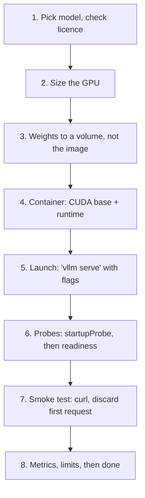

## Before you start

[inference-servers-vllm-and-tgi](inference-servers-vllm-and-tgi) for what the runtime does. [docker-containerization](docker-containerization) for images, layers, and volumes — assumed knowledge here, not repeated. [gpu-memory-math](gpu-memory-math) for the sizing arithmetic; this topic applies its answers rather than deriving them.

## In one sentence

Deploying a model means getting a specific set of weights onto a specific GPU, behind an HTTP endpoint, with health checks that understand the model takes minutes to load — and then proving it actually answers.

## Why it matters

Every step here is easy in isolation and the sequence still fails. You bake 28GB of weights into an image and every deploy pushes 28GB. You configure a readiness probe the way you always do, and the pod crash-loops in a way that looks exactly like a broken image, so you spend an afternoon rebuilding a container that was never wrong. You send the first request, see 40 seconds of latency, and conclude the GPU is faulty.

None of these are hard problems — they are unfamiliar, because a model server breaks assumptions that hold for every other service you deploy: it is enormous, it takes minutes to become useful, and its first request is not like its second.

## The intuition

Deploying a normal web service is like hiring someone who starts work the moment they walk in. Deploying a model server is like installing an industrial machine: the delivery is slow and heavy (the weights), it needs a specific power supply (matching CUDA and driver versions), it takes a long warm-up before it makes anything (model loading), and the first item off the line is slow while the tooling settles (graph compilation).

Nobody wires an "is it working?" alarm to trip one minute after switching on an industrial machine. That is exactly the mistake a default probe makes.

## How it actually works



### 1. Choose the model and check the licence

"Open weights" is not "open source": some licences cap commercial use by user count, some forbid training competing models on the outputs, some are research-only. Read the licence file before provisioning a GPU — this step can invalidate every later one. Pin the exact revision too, by commit hash: repositories are updated in place, so a name alone will one day give you different weights than you tested.

### 2. Size the GPU

Compute weights + KV cache + activation overhead in [gpu-memory-math](gpu-memory-math) and apply the answer as a hard constraint. If it does not fit one card, see [multi-gpu-and-model-parallelism](multi-gpu-and-model-parallelism); if it nearly fits, [quantization-explained](quantization-explained) is cheaper. Size for *target concurrency*, not one request: a 14B model in 16-bit is ~28GB of weights on an 80GB card, and the remaining ~48GB of KV cache is what decides whether you serve 8 concurrent users or 200.

### 3. Get the weights

28GB across several safetensors shards is 5–15 minutes of download. The obvious move is baking them into the image, and it is usually wrong: the image becomes 30GB+, every registry push and pull moves it, and any entrypoint change re-pushes all of it. Better is a **persistent volume** or shared cache directory mounted into the container, with the runtime's cache environment variable pointed at it — the image stays small and weights download once per node, not once per deploy.

The honest counter-argument: **if cold-start time dominates, bake them in.** A scale-from-zero deployment that must serve within 90 seconds cannot afford a 10-minute download, and a fat image pulled onto a warm node beats a cold download. See [gpu-autoscaling-and-cold-starts](gpu-autoscaling-and-cold-starts).

### 4. The container

Three things must line up, and a mismatch gives confusing errors. Use the runtime's **own published CUDA image**, which already matches what it was built against. The **host driver** must be at least as new as the container's CUDA toolkit — newer driver with older toolkit is fine, the reverse fails unhelpfully. And the **NVIDIA container toolkit** must be installed on the node or the container cannot see the device at all, giving "no CUDA-capable device is detected" on a machine that plainly has one.

Locally that is `docker run --gpus all`; in Kubernetes an `nvidia.com/gpu` resource request, with scheduling specifics in [gpu-scheduling-in-kubernetes](gpu-scheduling-in-kubernetes).

### 5. Launch it

```bash
vllm serve mistralai/Mistral-7B-Instruct-v0.3 \
  --host 0.0.0.0 --port 8000 \
  --tensor-parallel-size 1 \
  --max-model-len 8192 \
  --gpu-memory-utilization 0.90 \
  --served-model-name my-assistant
```

Four flags carry all the weight:

- **`--tensor-parallel-size`** — GPUs to split across. Leave at 1 unless the weights do not fit; splitting adds inter-GPU communication on every layer.
- **`--max-model-len`** — maximum context length, and a *memory* decision: it bounds per-sequence KV cache, so dropping 32k to 8k can multiply concurrency.
- **`--gpu-memory-utilization`** — fraction of VRAM the runtime may claim, default ~0.90. The remainder is not a prudent buffer; it is KV cache you threw away.
- **`--served-model-name`** — the name clients pass in `model`. A stable alias lets you swap checkpoints without touching client code.

As of September 2026 these are the current vLLM flag names — verify against the CLI reference, since serving runtimes iterate quickly.

### 6. Health and readiness probes — the trap that bites everyone

**Model loading takes minutes.** The process reads tens of gigabytes from disk, moves it to VRAM, initialises CUDA kernels, and pre-allocates the KV cache. Two to five minutes is normal for a 14B model, and throughout it the HTTP server is either not listening or returning errors.

A standard probe — `initialDelaySeconds: 30`, `periodSeconds: 10`, `failureThreshold: 3` — gives the container 60 seconds. At t=60s, three minutes before the model is loaded, the threshold trips and the kubelet kills it. It restarts, gets another 60 seconds, dies again. `CrashLoopBackOff`.

**And the symptom looks nothing like the cause.** The logs truncate mid-load with no error, because the process was killed rather than crashing, so every instinct says the image is broken or the weights are corrupt. Teams lose hours here. The image is perfect; you set a stopwatch shorter than the task.

The fix has two parts. First, separate two questions that are identical for a normal web service and completely different for a model server:

- **Is the process alive?** — has it hung or deadlocked. This is **liveness**, and the answer to a failure is *restart*.
- **Is the model loaded and able to serve?** — is it in the load phase or genuinely serving. This is **readiness**, and the answer to a failure is *do not send traffic*, never restart.

Conflating them kills healthy pods. A loading model is alive but not ready, and restarting it is strictly worse: the clock resets and it never finishes.

Second, use a **startupProbe**. While it is failing, Kubernetes suspends liveness and readiness entirely. Give it a budget — `failureThreshold` × `periodSeconds` — generously above your measured load time. Once it passes, liveness takes over with tight, normal timings.

```yaml
startupProbe:
  httpGet: { path: /health, port: 8000 }
  periodSeconds: 10
  failureThreshold: 60        # 600s budget: covers a slow cold load
livenessProbe:
  httpGet: { path: /health, port: 8000 }
  periodSeconds: 10
  failureThreshold: 3         # tight, but only ever runs after startup passed
readinessProbe:
  httpGet: { path: /health, port: 8000 }
  periodSeconds: 5
```

Why not just a huge `initialDelaySeconds` on liveness? Because a long delay is blind in both directions: set it to 600 seconds and a pod that genuinely dies at t=20s sits dead and unnoticed for ten minutes. A startup probe gives a generous budget *and* fast detection afterwards.

### 7. Smoke test

```bash
curl -s http://localhost:8000/v1/chat/completions \
  -H 'Content-Type: application/json' \
  -d '{"model":"my-assistant","messages":[{"role":"user","content":"Reply with the word OK."}],"max_tokens":8}'
```

```json
{"id":"chatcmpl-...","object":"chat.completion","model":"my-assistant",
 "choices":[{"index":0,"message":{"role":"assistant","content":"OK"},"finish_reason":"stop"}],
 "usage":{"prompt_tokens":16,"completion_tokens":2,"total_tokens":18}}
```

**The first request will be slow — several seconds, sometimes tens** — as kernels are compiled or autotuned for the shapes they see and memory pools settle. That is normal, not a performance problem. **Always discard the first request before measuring**, and if cold-start latency matters to users, send a synthetic warmup during startup, before readiness passes.

### 8. Before you call it done

Four checks catch the silent failures. `/v1/models` should list your `--served-model-name`. A `"stream": true` request must actually stream rather than arrive as one block — a reverse proxy buffering SSE is a classic silent breakage. Metrics must be scraped with KV-cache utilisation and queue depth on a dashboard, or you cannot tell saturation from a slow model. And a request exceeding `--max-model-len` should return a clean 400, not a 500. Then measure latency under realistic load — see [serving-latency-and-benchmarking](serving-latency-and-benchmarking).

## Worked example

The probe trap, made arithmetic — a decision you can get wrong in a YAML file, so compute it rather than intuit it.

```js
// Simulate a kubelet probing a pod whose model takes 4 minutes to load.
const MODEL_LOAD_S = 240;         // realistic for a 14B model from a volume

// Three probe configs. failureThreshold x periodSeconds = the budget.
const configs = [
  { name: 'liveness only (naive)', initialDelay: 30, period: 10, failures: 3, startup: null },
  { name: 'generous initialDelay', initialDelay: 300, period: 10, failures: 3, startup: null },
  { name: 'startupProbe (correct)', initialDelay: 0, period: 10, failures: 3,
    startup: { period: 10, failures: 60 } },   // 600s budget for startup only
];

function simulate(c) {
  // A startupProbe suspends liveness/readiness until it passes.
  if (c.startup) {
    const budget = c.startup.period * c.startup.failures;
    if (MODEL_LOAD_S > budget) return { verdict: 'CRASHLOOP', at: budget, why: 'startup budget exceeded' };
    const readyAt = Math.ceil(MODEL_LOAD_S / c.startup.period) * c.startup.period;
    return { verdict: 'READY', at: readyAt, why: `startup passed, then liveness takes over` };
  }
  // No startupProbe: liveness begins after initialDelay and can kill mid-load.
  const killAt = c.initialDelay + c.period * c.failures;
  if (killAt < MODEL_LOAD_S) {
    return { verdict: 'CRASHLOOP', at: killAt, why: `killed ${MODEL_LOAD_S - killAt}s before the model finished loading` };
  }
  const readyAt = c.initialDelay > MODEL_LOAD_S ? c.initialDelay : Math.ceil(MODEL_LOAD_S / c.period) * c.period;
  return { verdict: 'READY', at: readyAt, why: 'survived, but liveness is blind for the whole delay' };
}

console.log(`model load time: ${MODEL_LOAD_S}s\n`);
for (const c of configs) {
  const r = simulate(c);
  console.log(`${c.name.padEnd(24)} -> ${r.verdict.padEnd(10)} at t=${r.at}s`);
  console.log(`${''.padEnd(24)}    ${r.why}\n`);
}
```

Output:

```
model load time: 240s

liveness only (naive)    -> CRASHLOOP  at t=60s
                            killed 180s before the model finished loading

generous initialDelay    -> READY      at t=300s
                            survived, but liveness is blind for the whole delay

startupProbe (correct)   -> READY      at t=240s
                            startup passed, then liveness takes over
```

Three configs, one model, three outcomes. The naive config never serves a single request. The generous delay works, but reports ready 60 seconds late and gives up fast failure detection for the whole five minutes. The startup probe serves at 240s with tight liveness detection from 240s onward.

## A second example — when it gets harder

You fix the probes, then quantise to 4-bit to fit a smaller GPU. Load time drops to 50 seconds, someone sensibly tightens the startup budget to 90 seconds, and it works — for weeks. Then a new node's weights cache is empty. The container must download 28GB first, that takes 8 minutes, the 90-second budget expires: `CrashLoopBackOff` on that *one* node while every other pod is fine. Intermittent, node-specific, and it looks like a hardware fault.

**Your startup budget must cover the cold path, not the warm one:** empty cache plus full download plus full load. Measure that once, deliberately, on a fresh node.

**Better still, take the download off the startup path.** Fetch weights in an **init container** that runs to completion first. Its own timeout governs the download, the startup budget governs only loading, and the failure modes stop being tangled:

```yaml
initContainers:
  - name: fetch-weights          # separate concern, separate timeout
    image: my-registry/weight-fetcher:1.4
    volumeMounts: [{ name: model-cache, mountPath: /models }]
containers:
  - name: vllm
    # startupProbe budget now covers ONLY model load, not download
```

Two related traps. **Sizing that only fits when idle:** `--gpu-memory-utilization 0.95` passes your smoke test, then under real concurrency the KV cache grows into the margin and you get OOM kills at peak — hours after deploy, so nobody connects the two. Validate sizing under load. **Rollouts that need two GPUs:** a default rolling update starts the new pod before terminating the old, so both want a card; on a single-GPU node the new pod is unschedulable, the old is never terminated, and the rollout hangs with no error. Use `Recreate`, or provision headroom.

## Quick reference

| Step | Setting | Failure if skipped |
|---|---|---|
| Licence check | read the LICENSE file | legal exposure after launch |
| Pin revision | commit hash, not tag | different weights than you tested |
| Size VRAM | see gpu-memory-math | OOM at peak, not at deploy |
| Weights on a volume | mount + cache env var | 30GB image, slow every deploy |
| Match CUDA + driver | runtime's own image | "no CUDA-capable device detected" |
| Request the GPU | `nvidia.com/gpu: 1` | runs on CPU, ~100x slower |
| `--max-model-len` | lowest you can accept | wasted KV cache, low concurrency |
| startupProbe | large `failureThreshold` | CrashLoopBackOff, looks like a bad image |
| Warmup request | before readiness passes | first user waits tens of seconds |

| Probe | Question | Action on failure | Timing |
|---|---|---|---|
| startupProbe | finished loading? | keep waiting | generous — cover the cold path |
| livenessProbe | process hung? | restart | tight, only after startup passes |
| readinessProbe | can it serve now? | withhold traffic | tight, never restarts |

## Common mistakes

- Using default probe timings, getting `CrashLoopBackOff`, and debugging the image instead of the YAML.
- Using a huge `initialDelaySeconds` instead of a startupProbe — a crash loop traded for ten minutes of blindness.
- Letting readiness restart pods. Only liveness restarts; a restarted loading model never finishes loading.
- Sizing the startup budget from a warm-cache load, so the first fresh node crash-loops.
- Reporting the first request's latency as the model's latency.
- Lowering `--gpu-memory-utilization` to feel safe, silently cutting concurrency.
- Forgetting the GPU resource request, so it runs on CPU at unusable speed.

## What interviewers ask

- **Walk me through deploying an open-weight model.** — Check the licence and pin a revision, size VRAM for target concurrency, put weights on a mounted volume, build on a CUDA base matching the host driver, launch with explicit max context and memory utilisation, configure a startupProbe generous enough for cold load with tight liveness after it, then smoke-test and discard the first request.
- **Your pod is in CrashLoopBackOff and the logs stop mid-load with no error. What is it?** — Probe timings shorter than model load time: the kubelet is killing a healthy container part-way through loading, and no error appears because it was killed rather than crashing. Fix with a startupProbe whose `failureThreshold` × `periodSeconds` exceeds measured cold-start load time.
- **Why not put the weights in the image?** — Size and rebuild churn: 30GB pushed and pulled on every deploy, and any entrypoint change re-pushes all of it. The exception is scale-from-zero, where a pre-pulled fat image beats a cold download.
- **Liveness versus readiness for a model server?** — Liveness asks whether the process is hung and restarts on failure; readiness asks whether the model finished loading and only withholds traffic. During the load a pod is alive but not ready, and restarting it guarantees it never finishes.
- **Why is the first request so much slower?** — Kernel compilation and autotuning for the shapes it sees, plus pools settling. Warm up before readiness passes, and never benchmark the first request.

## Practice

1. Run a small model under Ollama and time twenty sequential identical requests against `/v1/chat/completions`. Quantify the first-request penalty as a multiple of the median.
2. Write one Dockerfile that mounts weights from a volume and one that bakes them in. Compare image size, build time, and time-to-first-successful-request on a warm node versus a cold one, then decide which you would ship.
3. Extend the probe simulation with an init-container download phase that has its own timeout. Find the combination surviving an 8-minute cold download while still detecting a dead process within 30 seconds of it going ready.

## Where to go next

[serving-latency-and-benchmarking](serving-latency-and-benchmarking) — it is live, so the next question is whether it is fast enough and where it saturates. Then [gpu-autoscaling-and-cold-starts](gpu-autoscaling-and-cold-starts), which turns the weight-loading trade-off from step 3 into a scaling strategy.
