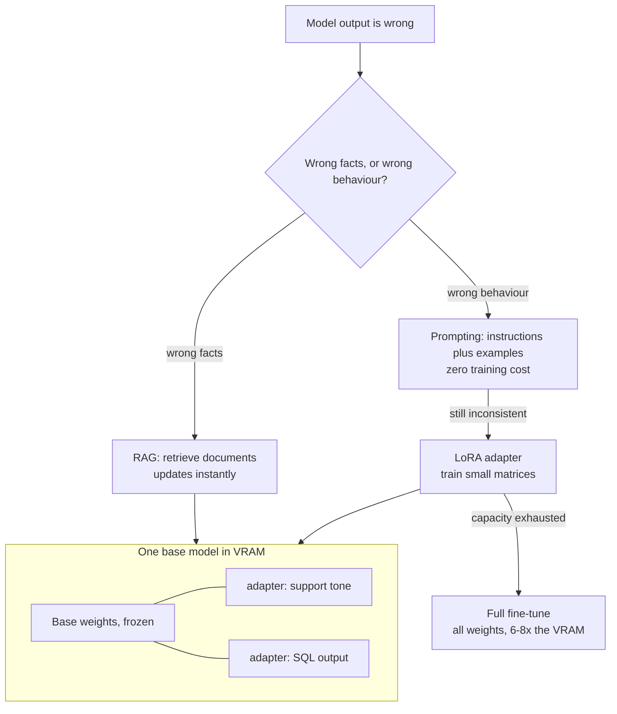
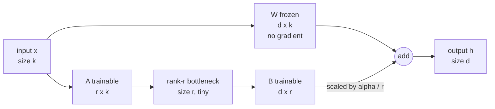

## Before you start

[gpu-memory-math](gpu-memory-math) — you need bytes per parameter, and the fact that VRAM is a fixed container. This topic reuses that arithmetic rather than repeating it. [rag-retrieval-augmented-generation](rag-retrieval-augmented-generation) — you need to know what RAG does, because half of this topic is knowing when *not* to reach for training.

## In one sentence

**Fine-tuning** continues training a model on your own examples so it behaves the way you want, and **LoRA (low-rank adaptation)** does it cheaply by freezing the original weights and training two small matrices alongside them instead.

## Why it matters

Two numbers explain why this topic lives in the GPU chapter.

A 7B model at fp16 needs about 13 GiB of VRAM to serve. To *train* every one of its parameters with the standard Adam optimizer, you need roughly **100 GiB** — about eight times as much, before activations. A model that fits comfortably on one consumer card needs a multi-GPU node to fine-tune.

LoRA takes that same job down to about 13 GiB, and QLoRA to about 3 GiB — the difference between "we need a cluster and a budget approval" and "I ran it overnight on the card in my desk".

The second reason: "just fine-tune it" is the most common wrong answer in LLM interviews. Knowing when tuning is the wrong tool is worth more than knowing how to run it.

## The intuition

You have hired someone who already knows the whole subject. Three ways to get the output you want from them.

**Prompting** is telling them what you want, each time you ask. Free and instant, until the instructions get long and they start drifting.

**RAG** is handing them the current file before they answer. It changes what they *know*, and when the file changes so does the answer. You never retrain anybody.

**Fine-tuning** is training. It changes how they *work* — tone, format, the judgement calls they make on your kind of problem. Expensive, slow, and it goes stale.

LoRA makes the training option affordable. Instead of rewriting everything the person knows, you give them a small separate set of notes that adjusts their behaviour — cheap to write, cheap to store, swappable. One person, many sets of notes, one per client.



Read that top question first. It decides everything below it, and it is the question interviewers are actually asking when they ask about fine-tuning.

## How it actually works

**Why training costs so much more than inference.** Inference holds the weights and a little scratch space. Training holds four things per trained parameter, and Adam is the reason:

| Item | Bytes per trained parameter |
|---|---|
| Weights (fp16) | 2 |
| Gradients (fp16) | 2 |
| Master weight copy (fp32) | 4 |
| Adam momentum (fp32) | 4 |
| Adam variance (fp32) | 4 |
| **Total** | **16** |

Sixteen bytes against two. For a 7B model that is `6.74e9 x 16` = about **100 GiB** versus 13 GiB to serve it — call it **7–8x**, with activations saved for the backward pass on top. The multiple moves with your optimizer; the shape never does.

Look at what dominates that table: 12 of the 16 bytes are gradients and optimizer state, and those exist **only for parameters you actually train**. That single observation is the whole idea behind LoRA.

**The low-rank update.** A transformer is mostly big weight matrices. Take one of shape `d x k`. Full fine-tuning learns a change to every entry — a full-size update matrix, `d·k` numbers.

LoRA makes a bet: the useful update is *low rank*. It does not need `d·k` degrees of freedom; a much simpler change captures nearly all of the adaptation. So instead of learning the update directly, LoRA learns it as a product of two thin matrices:

- **A** of shape `r x k`, which squeezes the input down to `r` numbers
- **B** of shape `d x r`, which expands those `r` numbers back to full output size

`B·A` has shape `d x k` — exactly the shape of the update it stands in for — but it is built from only `r·(d + k)` parameters. The original **W** is frozen: no gradient, no optimizer state, just 2 bytes per parameter sitting there being read.



The input goes down both paths. The frozen matrix does what it always did, the A-B path computes a small correction, and the two outputs are added. Nothing is replaced — the base behaviour is still fully present underneath, which is why an adapter can be switched off by not adding its branch.

Note the bottleneck. Everything the adapter learns must pass through `r` numbers — the source of both its cheapness and its limits.

**Work the parameter count.** For a 4096 x 4096 attention matrix, full tuning trains `4096 x 4096` = 16.8M parameters. LoRA at `r = 8` trains `8 x (4096 + 4096)` = 65,536 — a **256x** reduction on that matrix. And 256x fewer trained parameters means 256x less gradient and optimizer state, which is where the memory went.

**Rank `r` is the knob.** It buys capacity and costs trainable size, and the relationship is linear: double `r`, double the adapter. Small ranks (4–16) are plenty for style, tone, and format adherence; larger ranks (32–128) are for genuinely new narrow-domain behaviour. Start at 8 or 16 and raise it only when your eval says the adapter ran out of room.

**Alpha** is a scaling factor: the adapter's contribution is multiplied by `alpha / r`, which keeps the update's magnitude roughly stable when you change `r`, so retuning the rank does not force you to retune the learning rate.

**Target modules** decide which matrices get an adapter. The cheap classic is the query and value projections only. Adding the key and output projections, and then the MLP matrices, gives more capacity for more trainable parameters.

**QLoRA** goes further. The frozen base is now the biggest term, so quantize it: load the base at 4-bit, keep the adapter in higher precision, train. The base is never updated, so quantizing it costs far less than quantizing a model you are still training. This is what puts tuning a 70B model on a single 48 GB card — see [quantization-explained](quantization-explained) for the quality cost.

**Adapters are small and swappable, and this is the operational payoff.** An adapter is megabytes; the base is gigabytes. So one base model in VRAM serves many adapters, chosen per request — vLLM takes `--enable-lora` and a set of named modules and routes each request to the one it names. Fifty customer-specific models used to mean fifty deployments; now it means one deployment and fifty small files. See [inference-servers-vllm-and-tgi](inference-servers-vllm-and-tgi) for the serving path.

## Worked example

A planner that answers the question you actually have before you start: how much am I training, and will it fit?

```js
const GB = 1024 ** 3;

// Adam in mixed precision, per TRAINED parameter:
// 2 fp16 weight + 2 fp16 grad + 4 fp32 master + 4 fp32 momentum + 4 fp32 variance
const TRAIN_BYTES = 16;
const FROZEN = { fp16: 2, int4: 0.5 };

// One transformer layer's matrices, as [d, k] shapes.
function moduleShapes(hidden, ffn) {
  return {
    q_proj: [hidden, hidden], k_proj: [hidden, hidden],
    v_proj: [hidden, hidden], o_proj: [hidden, hidden],
    gate_proj: [ffn, hidden], up_proj: [ffn, hidden], down_proj: [hidden, ffn],
  };
}

function loraPlan({ name, params, layers, hidden, ffn, rank, targets }) {
  const shapes = moduleShapes(hidden, ffn);
  let full = 0, lora = 0;
  for (const t of targets) {
    const [d, k] = shapes[t];
    full += layers * d * k;            // every entry of W is trainable
    lora += layers * rank * (d + k);   // A is r x k, B is d x r  ->  r(d+k)
  }
  return {
    name, rank, targets,
    targetedParams: full,
    trainable: lora,
    pctOfModel: (lora / params) * 100,
    ratio: full / lora,
    // Only the TRAINED params carry gradients and optimizer state.
    fullTuneGB: (params * TRAIN_BYTES) / GB,
    loraGB: (params * FROZEN.fp16 + lora * TRAIN_BYTES) / GB,
    qloraGB: (params * FROZEN.int4 + lora * TRAIN_BYTES) / GB,
    adapterMB: (lora * 2) / 1024 ** 2, // shipped at fp16
  };
}

function report(cfg) {
  const p = loraPlan(cfg);
  console.log(`\n${p.name}  rank=${p.rank}  targets=${p.targets.join(',')}`);
  console.log(`  targeted weights   ${(p.targetedParams / 1e6).toFixed(1)}M params`);
  console.log(`  LoRA trainable     ${(p.trainable / 1e6).toFixed(2)}M params  (${p.pctOfModel.toFixed(3)}% of model)`);
  console.log(`  reduction          ${p.ratio.toFixed(0)}x fewer trained than those weights`);
  console.log(`  adapter on disk    ${p.adapterMB.toFixed(1)} MB at fp16`);
  console.log(`  train memory  full ${p.fullTuneGB.toFixed(1)} GB | LoRA ${p.loraGB.toFixed(1)} GB | QLoRA ${p.qloraGB.toFixed(1)} GB`);
}

// Llama-2-7B shape: 32 layers, hidden 4096, ffn 11008
const m7b = { name: '7B', params: 6.74e9, layers: 32, hidden: 4096, ffn: 11008 };
report({ ...m7b, rank: 8, targets: ['q_proj', 'v_proj'] });
report({ ...m7b, rank: 16, targets: ['q_proj', 'k_proj', 'v_proj', 'o_proj'] });
```

Output:

```
7B  rank=8  targets=q_proj,v_proj
  targeted weights   1073.7M params
  LoRA trainable     4.19M params  (0.062% of model)
  reduction          256x fewer trained than those weights
  adapter on disk    8.0 MB at fp16
  train memory  full 100.4 GB | LoRA 12.6 GB | QLoRA 3.2 GB

7B  rank=16  targets=q_proj,k_proj,v_proj,o_proj
  targeted weights   2147.5M params
  LoRA trainable     16.78M params  (0.249% of model)
  reduction          128x fewer trained than those weights
  adapter on disk    32.0 MB at fp16
  train memory  full 100.4 GB | LoRA 12.8 GB | QLoRA 3.4 GB
```

Read the first block slowly, because it contains the whole topic.

**4.19M trainable parameters out of 6.74 billion** — 0.062%. Ninety-nine point nine percent of the model is frozen, read-only, contributing 2 bytes per parameter and nothing else.

**100.4 GB to full-tune, 12.6 GB with LoRA.** Both hold the same base weights; the difference is entirely gradients and optimizer state, which now exist for 4.19M parameters instead of 6.74B. And 12.6 GB fits a 24 GB card — the card that could barely serve the model is now enough to tune it.

**QLoRA at 3.2 GB.** The frozen base drops to 3.1 GiB at 4-bit and the adapter rides on top. Single-consumer-card territory.

**The adapter is 8 MB.** Not 8 GB. A thousand of them fit in the space one base model occupies.

The second block is the rank knob working: rank 8 on two modules gives 4.19M trainable, rank 16 on four gives 16.78M — four times the capacity — and training memory moves from 12.6 GB to 12.8 GB. **Capacity is nearly free in memory terms**, because the frozen base dominates. Which raises the obvious question.

## A second example — when it gets harder

If capacity is that cheap, why not set rank to 64 and adapt every matrix in the model? Run it and find out:

```js
report({ ...m7b, rank: 64,
  targets: ['q_proj', 'k_proj', 'v_proj', 'o_proj', 'gate_proj', 'up_proj', 'down_proj'] });

// 70B shape: 80 layers, hidden 8192, ffn 28672
const m70b = { name: '70B', params: 68.98e9, layers: 80, hidden: 8192, ffn: 28672 };
report({ ...m70b, rank: 16, targets: ['q_proj', 'v_proj'] });
```

Output:

```
7B  rank=64  targets=q_proj,k_proj,v_proj,o_proj,gate_proj,up_proj,down_proj
  targeted weights   6476.0M params
  LoRA trainable     159.91M params  (2.373% of model)
  reduction          40x fewer trained than those weights
  adapter on disk    305.0 MB at fp16
  train memory  full 100.4 GB | LoRA 14.9 GB | QLoRA 5.5 GB

70B  rank=16  targets=q_proj,v_proj
  targeted weights   10737.4M params
  LoRA trainable     41.94M params  (0.061% of model)
  reduction          256x fewer trained than those weights
  adapter on disk    80.0 MB at fp16
  train memory  full 1027.9 GB | LoRA 129.1 GB | QLoRA 32.7 GB
```

Two lessons, one in each block.

**Maximum-capacity LoRA erodes its own advantages.** Rank 64 on all seven module types still fits a 24 GB card at 14.9 GB, so memory is not what bites. The adapter is: **305 MB instead of 8 MB**, a 38x jump. The swappability that made "one base, fifty adapters" work is gone — fifty of these is 15 GB, and loading one per request is no longer cheap. You are also training 2.4% of the model on a few thousand examples, which is how you overfit. High rank is for when your eval demands it, not a default.

**The 70B row is the real punchline.** Full fine-tuning needs **1,028 GB** — thirteen 80 GB cards for optimizer state alone, plus the interconnect and the expertise to use them. QLoRA needs **32.7 GB**: one card, as of September 2026 — verify current figures. That row is why open-weight models get community fine-tunes at all.

Notice too that the 70B adapter at rank 16 is 80 MB against the 7B's 8 MB at rank 8. Adapter size scales with `r`, layer count, and hidden size — not with total parameter count. Bigger base, still a small file.

**One caveat the arithmetic will not tell you.** These figures cover weights, gradients, and optimizer state. Activations are on top, and they scale with batch size and sequence length. If a job the calculator says fits in 12.6 GB dies on a 24 GB card, the cause is almost always sequence length or batch size, not the adapter — lower them, or turn on gradient checkpointing.

## Quick reference

| Goal | Reach for | Why |
|---|---|---|
| Facts that change weekly | RAG | Re-index in minutes; tuning would mean retraining on every change |
| Facts the model must cite | RAG | Retrieval gives you a source; trained weights cannot be cited |
| Output format, tone, house style | Prompting first, then LoRA | Few-shot examples often suffice; tune when consistency must be guaranteed |
| Reliable JSON or a strict schema | Prompting plus structured output | Constrained decoding is more reliable than training and costs nothing |
| Narrow-domain behaviour, thousands of examples | LoRA | Enough capacity for real behaviour change at a fraction of the memory |
| Shorter prompts and lower cost per call | LoRA | Bake the instructions into the adapter instead of paying for them every call |
| Per-customer or per-task variants | LoRA | One base in VRAM, megabyte adapters swapped per request |
| A new language, or a genuinely new capability | Full fine-tune or continued pretraining | Low-rank capacity is insufficient; budget for the cluster |

| Aspect | Full fine-tune | LoRA | QLoRA |
|---|---|---|---|
| Trained parameters (7B) | 6.74B | 4–160M | 4–160M |
| Training memory (7B) | ~100 GB | ~13 GB | ~3 GB |
| Artefact size | ~13 GB | 8–305 MB | 8–305 MB |
| Serve many variants on one GPU | No | Yes | Yes |
| Base model quality preserved | Overwritten | Frozen, intact | Frozen, quantized |
| Peak capacity | Highest | High enough for most tasks | Same as LoRA |

## Tools & frameworks

Every row here is Python: from Node you fine-tune by driving this tooling or a managed service, not from your application.

| Tool | What it's for | Reach for it when |
|---|---|---|
| [PEFT](https://huggingface.co/docs/peft/index) | LoRA and QLoRA adapters | The standard library for parameter-efficient fine-tuning — Python |
| [TRL](https://huggingface.co/docs/trl/index) | SFT, DPO and reward training | You are past supervised fine-tuning and into preference tuning — Python |
| [Unsloth](https://unsloth.ai/docs) | Faster, lower-memory LoRA training | You are fine-tuning on a single consumer or modest cloud GPU |
| [Axolotl](https://docs.axolotl.ai/) | YAML-configured fine-tuning pipelines | You want reproducible runs from a config file instead of a notebook |
| [vLLM](https://docs.vllm.ai/en/latest/) | Serve many LoRA adapters on one base model | You have per-tenant adapters — this is the cost argument for LoRA in the first place |

## Common mistakes

- Reaching for fine-tuning to add knowledge. Tuning teaches *form*; RAG supplies *facts*. If the answer changes when a document changes, you needed retrieval.
- Skipping prompting. Try instructions and few-shot examples first — it costs an afternoon instead of a GPU budget, and it frequently wins.
- Tuning with no eval set. You cannot detect a regression you never measured, and the regression is usually outside the task you tuned for.
- Ignoring **catastrophic forgetting**. The model gets better at your task and worse at everything else — and a narrow eval built only from your task will show it as pure improvement. Always keep a held-out general benchmark.
- Setting rank to 128 by default. It costs training time, produces adapters too large to swap cheaply, and overfits small datasets.
- Forgetting the re-tune commitment. Every base model upgrade means retraining, re-evaluating, and re-deploying every adapter you own.
- Applying inference memory rules to training. They differ by roughly 8x for full tuning; see [gpu-memory-math](gpu-memory-math).
- Assuming a few hundred examples is a dataset. Quality and coverage of edge cases matter more than volume, but volume still has a floor.
- Treating tuning and RAG as alternatives. They compose — a tuned model still retrieves, and that is often the right architecture.

## What interviewers ask

- **Why does training need so much more memory than inference?** — Inference holds weights only, about 2 bytes per parameter at fp16. Training adds a gradient per parameter and two Adam optimizer states in fp32, plus a master weight copy and saved activations — roughly 16 bytes per trained parameter, or 7–8x. They are testing whether you know *what* the extra memory holds, because that is what tells you LoRA works.
- **What does LoRA actually train?** — Two small matrices, A of shape `r x k` and B of shape `d x r`, whose product has the shape of the weight matrix they adapt. The base weights are frozen, so gradients and optimizer state exist only for A and B — typically well under 1% of the model.
- **Your model must answer questions about docs that change weekly — do you fine-tune?** — No. Use RAG. Fine-tuning bakes information into weights, so every document change means a retrain, and you cannot cite a source from weights. Tune only if the *style* of answer needs work, and let retrieval supply the facts.
- **What does rank `r` trade off?** — Capacity against trainable parameters, adapter size, and overfitting risk. Low rank (8–16) handles style and format; high rank is for genuinely new narrow-domain behaviour, and it costs the swappability that made adapters attractive.
- **How do you serve fifty customer-specific models on one GPU?** — Load one base model and fifty LoRA adapters, selecting the adapter per request. Adapters are megabytes, so they fit alongside the base, and inference servers like vLLM support this directly.
- **What is catastrophic forgetting and how do you detect it?** — The tuned model improves on your task and degrades elsewhere, because you moved weights that encoded general capability. Detect it by evaluating on a held-out general benchmark alongside your task eval; a task-only eval reports the degradation as success.
- **When is full fine-tuning worth it over LoRA?** — When low-rank capacity is genuinely insufficient: a new language, a new modality, or a large domain shift with a large dataset. Justify it with an eval showing LoRA plateaued, not with a hunch.

## Practice

1. Extend the calculator to invert the question: given a card size, a model shape, and a set of target modules, print the **maximum rank that fits** — with and without 4-bit base quantization.
2. Add an activation term. Estimate it as `batch x sequence_length x hidden x layers x 2 bytes`, then find the sequence length at which a rank-16 7B LoRA job stops fitting on a 24 GB card at batch 4. Explain why gradient checkpointing changes the answer.
3. Take a task you would plausibly tune for and write the decision down before touching a GPU: what prompting alone achieves, what RAG adds, what a LoRA would add on top, and the eval that would prove the tuning helped. Include the general benchmark you would use to catch forgetting.

## Where to go next

[inference-servers-vllm-and-tgi](inference-servers-vllm-and-tgi) is the sequel, because a trained adapter is worthless until something serves it — and multi-adapter serving is where the megabyte artefact becomes an economic advantage. Then [llm-evaluation-and-testing](llm-evaluation-and-testing), since every claim about whether a tune helped depends on an eval you have not built yet.
