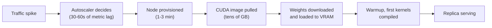

## Before you start

You need [deploying-a-model-end-to-end](deploying-a-model-end-to-end) for what a model server is and how it gets running, and [gpu-scheduling-in-kubernetes](gpu-scheduling-in-kubernetes) for how a Pod claims a whole GPU device. [continuous-batching-and-throughput](continuous-batching-and-throughput) helps but is not required — the one fact borrowed from it is that a modern server keeps a queue and admits requests into a running batch.

## In one sentence

Autoscaling GPUs means adding and removing model-serving replicas in response to load, complicated by one brutal fact: **a new replica takes minutes to become useful, not seconds.**

## Why it matters

Every reflex from web autoscaling is wrong here, and following them produces a system that is simultaneously expensive and unreliable. Scale on CPU and the autoscaler never fires. Set the minimum to zero to save money and your first user waits four minutes. React only when traffic arrives and capacity lands after the spike has passed — you paid for GPUs that served nobody, *and* you dropped requests.

Meanwhile a GPU costs the same idle as saturated. Wrong in the cautious direction and you burn budget on nothing; wrong in the aggressive direction and you drop traffic. There is no forgiving middle you stumble into by accident.

## The intuition

Web autoscaling is hiring temps from an agency next door: a request comes in, someone appears within seconds. You can afford to be reactive because reaction is nearly free.

GPU autoscaling is chartering an aircraft. From the moment you decide, a fixed pipeline runs before anything can carry passengers — the plane must be found, fuelled, crewed, and flown to you. Four minutes, say. If the rush lasts three minutes, chartering when it starts means the aircraft lands to an empty terminal. You still pay for it.

Because you cannot make the aircraft arrive faster, the useful questions become: how many do you keep standing by, and how do you hold passengers comfortably in the terminal while one is on its way? Autoscaling is the slow lever. **Queueing is the fast one.**

## How it actually works

**The scale-up unit is minutes.** Four costs stack up, and they are sequential:



The autoscaler's own decision lag is the smallest piece. Node provisioning waits on a cloud API and, for scarce GPU types, on capacity actually existing in that zone. The container image is enormous because CUDA runtimes and Python ML stacks are enormous — see [docker-containerization](docker-containerization) for why layers matter so much here. Then weights move from object storage into VRAM, and the server warms up. Total: typically two to ten minutes.

**What to scale on — and what not to.** CPU utilisation is meaningless. The serving process spends most of its life blocked waiting on the GPU, so a fully saturated server can report modest CPU, and the default HorizontalPodAutoscaler configuration will never fire. This is the single most common misconfiguration in GPU serving.

GPU utilisation is tempting and still misleading. The metric reports whether kernels were executing during a sampling window, not whether the server has spare capacity. A **decode-bound** server generating tokens for a handful of sequences shows high utilisation while having plenty of unused KV-cache room for more concurrent requests — so you scale up a replica you did not need. It can also mislead downward, sitting low while requests wait, because the bottleneck is memory bandwidth rather than compute.

**Scale on queue depth.** The honest signal is the number of requests waiting to be admitted — vLLM exposes it as `num_requests_waiting` — or better, the *time* requests spend in the queue. Queue depth is honest definitionally: a request is only waiting if the server could not take it, which is precisely "demand exceeds capacity". It needs no interpretation and no assumption about what the hardware is doing. A queue of two under bursty traffic is normal; a queue of two hundred sustained for a minute is a capacity fact.

**Scale-to-zero versus warm pools.** With no replicas running, you pay nothing and the first request pays the full cold start. That is correct for internal tools, batch scoring, evaluation runs, and demo environments where a several-minute first response is merely annoying. It is indefensible for anything interactive: nobody waits four minutes for a chat reply. Interactive products keep a floor of warm replicas sized to normal traffic, and treat autoscaling as a response to sustained growth rather than to spikes.

**Queueing is the pressure valve that buys autoscaling its minutes.** With continuous batching, a surge does not fail — it queues, and time to first token rises while tokens-per-second per user falls. That is the signature described in [serving-latency-and-benchmarking](serving-latency-and-benchmarking): TTFT climbs first, well before anything errors. That grace period is exactly the window a slow autoscaler needs, which is why **admission control matters more than scaling speed**. A bounded queue with an explicit rejection policy — 429 with a retry hint past a depth you have measured — gives every admitted request a latency you can promise. An unbounded queue accepts work it cannot finish, so every user waits, times out, and retries, multiplying the load that caused the problem.

**Cost of idle is the whole cost model.** A GPU bills by the hour regardless of tokens produced, so utilisation *is* the cost lever — the arithmetic is in [self-hosted-vs-api-economics](self-hosted-vs-api-economics).

## Worked example

Simulate a spike against a pool whose replicas take four minutes to arrive:

```js
// A traffic spike against a GPU pool where adding a replica takes MINUTES.
const SCALE_UP_SECONDS = 240;    // node boot + image pull + weight load + warmup
const CAPACITY_PER_REPLICA = 6;  // requests finished per second, per replica
const TARGET_QUEUE = 30;         // scale up while queue depth exceeds this
const QUEUE_LIMIT = 300;         // bounded queue: past this, reject immediately

function arrivalsAt(t) {
  return t >= 60 && t < 240 ? 40 : 4;   // 4 rps baseline, 40 rps spike for 3 min
}

function simulate({ minReplicas, warmSpare }) {
  let replicas = minReplicas + warmSpare;
  let queue = 0, served = 0, rejected = 0, peakQueue = 0;
  let booting = [];                      // seconds at which pending replicas go live
  let lastScaleAt = -Infinity;

  for (let t = 0; t < 900; t++) {
    booting = booting.filter((readyAt) => {
      if (readyAt <= t) { replicas++; return false; }
      return true;
    });

    queue += arrivalsAt(t);
    if (queue > QUEUE_LIMIT) { rejected += queue - QUEUE_LIMIT; queue = QUEUE_LIMIT; }

    const finished = Math.min(queue, replicas * CAPACITY_PER_REPLICA);
    queue -= finished; served += finished;
    peakQueue = Math.max(peakQueue, queue);

    // Scale on QUEUE DEPTH — the honest "demand exceeds capacity" signal.
    // One decision per 30s so we don't launch a replica every tick.
    if (queue > TARGET_QUEUE && t - lastScaleAt >= 30) {
      const needed = Math.ceil(queue / TARGET_QUEUE) - (replicas + booting.length);
      if (needed > 0) {
        for (let i = 0; i < needed; i++) booting.push(t + SCALE_UP_SECONDS);
        lastScaleAt = t;
      }
    }
  }
  return { replicas, served, rejected, peakQueue };
}

for (const cfg of [
  { label: 'min 1, no spare', minReplicas: 1, warmSpare: 0 },
  { label: 'min 1, +1 spare', minReplicas: 1, warmSpare: 1 },
  { label: 'min 4, +1 spare', minReplicas: 4, warmSpare: 1 },
]) {
  const r = simulate(cfg);
  const loss = ((r.rejected / (r.served + r.rejected)) * 100).toFixed(1);
  console.log(
    `${cfg.label}  served ${String(r.served).padStart(5)}  rejected ${String(r.rejected).padStart(4)}` +
    ` (${loss.padStart(4)}%)  peak queue ${String(r.peakQueue).padStart(3)}  ended at ${r.replicas} replicas`
  );
}
```

Output:

```
min 1, no spare  served  4254  rejected 5826 (57.8%)  peak queue 294  ended at 10 replicas
min 1, +1 spare  served  5328  rejected 4752 (47.1%)  peak queue 288  ended at 10 replicas
min 4, +1 spare  served  8550  rejected 1530 (15.2%)  peak queue 270  ended at 9 replicas
```

Three findings, and none of them is "tune the autoscaler harder".

First, the autoscaler *worked* — it correctly asked for capacity, and every configuration ended around nine or ten replicas. It just ended there **after** the spike, having provisioned for traffic that had already gone.

Second, the single warm spare cut rejections from 57.8% to 47.1%. One replica of insurance, running the whole time, absorbed more of the spike than all the reactive scaling did during it.

Third, the configuration that holds up is the one with a realistic warm floor: four replicas plus a spare drops loss to 15.2%. **The variable that determines the outcome is how much capacity was already warm when the spike began**, not how quickly the autoscaler noticed.

## A second example — when it gets harder

The naive reading of the above is "keep everything warm". Cost reality intervenes, and the real engineering lies in shortening the pipeline so warm capacity is cheaper to hold and cold capacity arrives sooner.

Attack each stage. **Image pull** is usually the largest removable chunk: pre-pull the image onto nodes in the pool, bake it into the node image, or use a registry cache in the same region so tens of gigabytes do not cross a WAN. **Weight loading** is next: keep weights on a fast local SSD or a pre-warmed shared volume rather than pulling from object storage per replica; quantised weights load faster, a real operational benefit on top of the memory benefit in [quantization-explained](quantization-explained). **Node provisioning** can be pre-paid by keeping a small pool of nodes running with no Pods on them, so scale-up is only a Pod start. **Warmup** should be a readiness gate, not a hope — do not mark a replica ready until it has completed a real inference, or the load balancer sends live traffic to a server still compiling kernels and the first users see the worst latency in the system.

Then there is scale-*down*, which is riskier than scale-up and gets far less attention. Because recovery costs minutes, removing a replica is a decision you cannot cheaply reverse. Use a long stabilisation window — tens of minutes, not the seconds you would use for web Pods. And drain gracefully: a replica mid-generation holds sequences in its KV cache, so it must stop accepting new requests, finish in-flight ones, and only then exit. Kill it abruptly and a routine cost optimisation becomes user-facing errors.

The last trap is capacity that does not exist. Scarce GPU types are genuinely unavailable in a zone sometimes, so your autoscaler asks for a node and gets nothing — indefinitely, with no error your monitoring recognises. Any plan for scarce hardware needs an answer to "what if the cloud says no": multiple zones or instance types, a reservation, or an explicit degradation path such as routing overflow to a smaller model or a hosted API.

## Quick reference

| Signal | Fires when saturated? | False positives | Verdict |
|---|---|---|---|
| CPU utilisation | No — process blocks on GPU | Constant | Never use |
| GPU utilisation | Sometimes | Decode-bound work looks busy with capacity spare | Diagnostic only |
| Requests in flight | Roughly | Ignores per-request cost | Weak proxy |
| **Queue depth** | Yes, by definition | Brief bursts are normal — require sustained | **Primary signal** |
| **Time in queue** | Yes, and ties to an SLO | Needs percentiles | **Best when available** |

| Lever | Effect on cold start | Cost |
|---|---|---|
| Pre-pulled / baked image | Removes minutes | Node image maintenance |
| Weights on local SSD or warm volume | Removes tens of seconds to minutes | Storage, and staleness on upgrade |
| Warm node pool, no Pods | Removes node provisioning | Pay for idle nodes |
| Minimum replica floor | Removes cold start entirely for baseline traffic | Pay for idle GPUs |
| One over-provisioned replica | Absorbs the first surge | One GPU-hour per hour |
| Bounded queue + 429 | None — bounds latency instead | Explicit rejections |

## Tools & frameworks

| Tool | What it's for | Reach for it when |
|---|---|---|
| [KEDA](https://keda.sh/docs/2.20/) | Scale on queue depth or custom metrics | GPU pods should scale on pending requests, and CPU utilisation tells you nothing here |
| [Karpenter](https://karpenter.sh/docs/) | Just-in-time node provisioning | Node provisioning time is the part of your cold start that dominates |
| [Cluster Autoscaler](https://github.com/kubernetes/autoscaler) | Node-group-based scaling | You want the conventional, widely-supported option over the newer one |
| [Knative](https://knative.dev/docs/) | Scale-to-zero with request buffering | Idle GPU cost is unacceptable and you can absorb the cold start it buys |
| [Modal](https://modal.com/docs) | Managed GPU with fast container starts | You would rather someone else had already solved snapshotting |

No autoscaler fixes this on its own: GPU cold starts are dominated by node provisioning plus multi-gigabyte image and weight pulls, not by the runtime.

## Common mistakes

- Leaving the default CPU-based HPA on a GPU Deployment, so it never scales and nobody notices until a real spike.
- Scaling on GPU utilisation and adding replicas to a decode-bound server that had spare concurrency all along.
- Scale-to-zero on an interactive product, discovering the first-request cold start only once a customer reports it.
- An unbounded queue, so a surge produces universal timeouts and retry storms instead of a clean subset of rejections.
- Marking a replica ready before warmup completes, routing the first real traffic to the slowest server in the fleet.
- Reusing web-service scale-down settings, so a two-minute lull removes a replica that takes four minutes to get back.
- Killing a draining replica without letting in-flight generations finish, converting a cost decision into user-visible errors.
- Planning autoscaling with no fallback for the cloud simply not having the GPU type available.

## What interviewers ask

- **Why can't you autoscale GPU inference on CPU utilisation?** — The serving process is usually blocked waiting on the GPU, so a saturated server reports low CPU and the autoscaler never fires; they are checking whether you know where the work actually happens.
- **Why is queue depth the right metric?** — A request only waits if the server could not admit it, so queue depth *is* the definition of demand exceeding capacity, whereas GPU utilisation only reports whether kernels ran and can be high on a server with spare concurrency.
- **Your model takes four minutes to start and traffic spikes for three. What do you do?** — Accept that autoscaling cannot solve it: keep a warm floor plus a spare replica, bound the queue so degradation is graceful, shorten the cold start with pre-pulled images and local weights, and pre-provision for spikes you can anticipate.
- **When is scale-to-zero acceptable?** — When no human is waiting on the first request: batch jobs, evaluation pipelines, internal tools, development environments. Never for interactive traffic.
- **What breaks first under a surge, and is that good?** — Time to first token rises while nothing errors, which is good: it is a warning with slack in it, and it buys the minutes your autoscaler needs — provided the queue is bounded so the warning does not become a universal timeout.
- **Why is scaling down harder than scaling up?** — Recovery costs minutes, so a premature removal is expensive and slow to undo, and a replica holds in-flight sequences in its KV cache that must drain before it exits.

## Practice

1. Change `SCALE_UP_SECONDS` in the simulation to 30 (a hypothetically fast cold start) and rerun. Explain, from the numbers, how much of the loss was caused by the cold start versus by the warm floor being too low.
2. Add a per-request timeout: any request waiting over 20 seconds abandons, counted separately. Compare `QUEUE_LIMIT` values of 50, 300 and 5000 and argue which gives the best user experience — noting the largest queue rejects the fewest requests.
3. Write the autoscaling policy for a service as a paragraph a colleague could implement: which metric, which threshold, minimum and maximum replicas, the stabilisation window in each direction, the queue bound, and what happens when the cloud has no GPUs available.

## Where to go next

[self-hosted-vs-api-economics](self-hosted-vs-api-economics) takes the idle-cost problem you just met and turns it into the decision it actually drives — whether to own GPUs at all. [inference-servers-vllm-and-tgi](inference-servers-vllm-and-tgi) covers the servers that expose the queue metrics this topic depends on.
