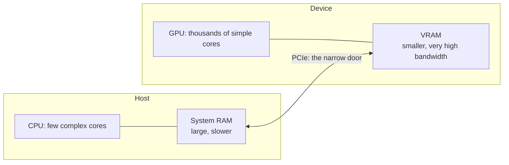

## Before you start

[computer-architecture](computer-architecture) — you need the memory hierarchy idea (registers, cache, RAM, each step outward bigger and slower). This topic adds a second, separate hierarchy hanging off the side of your machine. No GPU experience assumed.

## In one sentence

A **GPU** is a second processor with its own memory, built from thousands of simple cores that all run the same instruction on different pieces of data at once — which makes it excellent at multiplying large matrices and, for language models, usually limited by how fast it can read its own memory rather than how fast it can compute.

## Why it matters

You will be asked to size, price, or debug a model deployment. Almost every wrong answer in that conversation comes from importing CPU intuitions: assuming a faster chip means faster inference, assuming RAM and VRAM are interchangeable, or assuming a GPU sitting at 30% utilisation has 70% of capacity spare.

The single most useful correction is the bandwidth one, below. It tells you why a card twice as fast on paper gives you almost nothing, and why the fix for slow generation is usually to read fewer bytes, not to buy more compute.

## The intuition

Picture two ways to mark ten thousand exam papers.

A **CPU core** is a professor: one person, brilliant, handles anything — ambiguous handwriting, judgement calls, working out mid-sentence which branch of your argument to skip ahead to. A CPU has a handful of these, maybe 8 to 64, each spending most of its transistors on branch prediction and out-of-order execution: machinery for going fast on *unpredictable* work.

A **GPU** is a lecture hall of ten thousand first-year students, all given one identical instruction: "add column 3 to column 4." None can improvise. But when the work genuinely is the same operation ten thousand times over different numbers, the hall finishes in the time the professor takes on one paper.

That "same instruction, different data" shape is called **SIMT** (Single Instruction, Multiple Threads). Matrix multiplication is exactly this shape — every output cell is the same dot product over different rows and columns — and a neural network is mostly matrix multiplication. That is the whole reason GPUs run AI.

The hall has one more property that matters more than its size: its own library, behind a narrow door.



## How it actually works

**Two separate memory spaces.** Your GPU has its own memory, **VRAM**, physically on the card. The CPU cannot read it directly and the GPU cannot read system RAM directly. Everything crosses a **PCIe** bus between them. NVIDIA's terminology is worth learning because error messages use it: the CPU and its RAM are the **host**, the GPU and its VRAM are the **device**.

The asymmetry is the point. VRAM bandwidth on a datacentre card is measured in terabytes per second; PCIe in tens of gigabytes per second — an order of magnitude apart or more (as of September 2026 — verify current figures). This is why "it doesn't fit, so we'll spill to system RAM" performs so badly: you replaced the fast path with the slow one on every token.

**Threads and warps.** Your code launches a **kernel** — one function running on many threads. Threads are grouped into **warps** of 32 executing in lockstep. If threads in a warp take different branches of an `if`, the hardware runs both sides and masks off the inactive threads: **divergence**, and it costs real throughput. Hence GPU code avoids data-dependent branching — the students cannot go their own way for free.

**Now the insight that reframes everything.**

To generate one token, the model must read **every weight** out of VRAM — not some, all. Each weight is multiplied into the running activations exactly once, so the arithmetic per byte read is tiny. The compute units finish and then sit waiting on memory.

That makes single-stream token generation **memory-bandwidth-bound**, not compute-bound. And it gives you a formula:

```
tokens/sec  ≈  memory bandwidth (bytes/sec)  ÷  bytes of weights read per token
```

Two consequences, both counter-intuitive:

- **A card with more compute but the same bandwidth barely helps.** If you were waiting on memory, adding arithmetic units gives you a faster wait.
- **Halving the bytes roughly doubles the token rate.** This is why quantization speeds things up rather than just saving space — see [quantization-explained](quantization-explained).

The exception is **batching**. With many requests in flight, one pass over the weights serves all of them, so the bytes-per-token drop sharply and the GPU moves toward compute-bound. That is why throughput per GPU rises dramatically with concurrency — the subject of [continuous-batching-and-throughput](continuous-batching-and-throughput).

**Reading `nvidia-smi`.** The standard tool. Four fields carry most of the signal:

| Field | Means | Watch for |
|---|---|---|
| `Memory-Usage` | VRAM allocated, e.g. `21430MiB / 24564MiB` | Near total means the next request OOMs |
| `GPU-Util` | Percent of the last sample window where *any* kernel was running | Not "percent of capacity used" |
| `Pwr:Usage/Cap` | Watts drawn | Low power with high util = memory-stalled |
| `Processes` | Which PIDs hold the memory | A dead notebook still pinning 20 GB |

**High memory with low utilisation is the most informative state you will see, and it is normal.** Servers like vLLM pre-allocate a large fraction of VRAM at startup for the KV cache and never release it, so memory sits at 90% from the moment the process boots. If utilisation is also low, the card is idle but *full* — no room for another model, and no work being done. Read the two fields together or each one alone tells you the opposite of the truth.

Also, `GPU-Util` at 100% does not mean saturated: one tiny kernel running continuously reports 100%. It is a duty-cycle measure, not a capacity measure.

**The software stack.** **CUDA** is NVIDIA's programming model and runtime; below it the **driver**, above it cuBLAS/cuDNN, then PyTorch, then a serving layer. You will not write kernels, but you will hit the version coupling — a PyTorch build targets a CUDA version, which needs a minimum driver version. Most "works on my machine" GPU failures are a break in that chain, which is why container images pin all three.

## Worked example

The bandwidth formula is worth computing rather than believing:

```js
// Predict single-stream token rate from bandwidth alone. No GPU needed.
function tokensPerSecond({ card, bandwidthGBs, params, bytesPerParam }) {
  const bytesRead = params * bytesPerParam;              // ALL weights, every token
  const bytesPerSec = bandwidthGBs * 1e9;
  const theoretical = bytesPerSec / bytesRead;
  return { card, weightsGB: bytesRead / 1e9, theoretical, realistic: theoretical * 0.7 };
}

// Bandwidth figures are illustrative, September 2026 — verify current specs.
const cards = [
  { card: 'A10G',  bandwidthGBs: 600 },
  { card: 'A100',  bandwidthGBs: 2039 },
  { card: 'H100',  bandwidthGBs: 3350 },
];

for (const c of cards) {
  const r = tokensPerSecond({ ...c, params: 7e9, bytesPerParam: 2 }); // 7B at fp16
  console.log(
    `${r.card.padEnd(6)} weights ${r.weightsGB.toFixed(0)}GB  ` +
    `ceiling ${r.theoretical.toFixed(0)} tok/s  realistic ~${r.realistic.toFixed(0)} tok/s`
  );
}
```

Output:

```
A10G   weights 14GB  ceiling 43 tok/s  realistic ~30 tok/s
A100   weights 14GB  ceiling 146 tok/s  realistic ~102 tok/s
H100   weights 14GB  ceiling 239 tok/s  realistic ~167 tok/s
```

Nothing here mentions FLOPs, tensor cores, or clock speed — and yet these land in the right neighbourhood of measured single-stream rates. That is the claim made falsifiable: for one request at a time, bandwidth binds and compute does not.

The 0.7 factor absorbs attention overhead, kernel launch gaps, and the fact that no kernel hits peak bandwidth. Treat the ceiling as a bound you cannot beat, not a target you will reach.

## A second example — when it gets harder

Now break the naive version. Same model, same card, and run the numbers per *user* as concurrency rises:

```js
function perUserRate({ params, bytesPerParam, bandwidthGBs, batch }) {
  const weightBytes = params * bytesPerParam;
  // One pass over the weights serves the whole batch — the cost is shared.
  const bytesPerStep = weightBytes;
  const stepsPerSec = (bandwidthGBs * 1e9) / bytesPerStep;
  return { batch, aggregate: stepsPerSec * batch * 0.7, perUser: stepsPerSec * 0.7 };
}

for (const batch of [1, 8, 32, 64]) {
  const r = perUserRate({ params: 7e9, bytesPerParam: 2, bandwidthGBs: 2039, batch });
  console.log(`batch ${String(r.batch).padStart(2)}  aggregate ${r.aggregate.toFixed(0)} tok/s  per user ${r.perUser.toFixed(0)} tok/s`);
}
```

Output:

```
batch  1  aggregate 102 tok/s  per user 102 tok/s
batch  8  aggregate 816 tok/s  per user 102 tok/s
batch 32  aggregate 3262 tok/s  per user 102 tok/s
batch 64  aggregate 6525 tok/s  per user 102 tok/s
```

Sixty-four users cost the same weight reads as one. Aggregate throughput scales 64x while each user's experience is unchanged. **The bandwidth spent on weights is a fixed cost per step, and batching amortises it.**

Two caveats the model omits. This holds only while you stay memory-bound: push the batch high enough and compute becomes the limit, per-user rates fall, and the linear scaling flattens. And — the one that bites in production — every concurrent request needs its own KV cache in the same VRAM the weights already took, so the batch size you *want* is rarely the batch size that fits. That collision is the arithmetic in [gpu-memory-math](gpu-memory-math).

## Quick reference

| | CPU | GPU |
|---|---|---|
| Cores | ~8–64, complex | Thousands, simple |
| Per-core strength | Branch prediction, out-of-order | None — lockstep in warps of 32 |
| Good at | Branchy, sequential, latency-sensitive | Same operation over bulk data |
| Memory | System RAM | VRAM, ~10x+ the bandwidth |
| Branching cost | Cheap (predicted) | Expensive (divergence) |

| Symptom | Likely cause |
|---|---|
| High memory, low util | Server pre-allocated KV cache; card idle but full |
| High util, low power | Memory-stalled, not computing |
| Slow single-stream, GPU not busy | Bandwidth-bound — normal, batch or quantize |
| OOM at 14 GB on a 24 GB card | KV cache and overhead, not weights |
| Works locally, fails in container | Driver/CUDA/PyTorch version mismatch |

## Tools & frameworks

| Tool | What it's for | Reach for it when |
|---|---|---|
| [NVML and `nvidia-smi`](https://docs.nvidia.com/deploy/nvml-api/index.html) | Query utilisation, memory and clocks | The first command to run on any GPU box |
| [DCGM Exporter](https://github.com/NVIDIA/dcgm-exporter) | GPU metrics into Prometheus | You need fleet-level utilisation rather than one host at a time |
| [Nsight Systems](https://developer.nvidia.com/nsight-systems) | Timeline profiling of GPU workloads | You need to see kernel against transfer against idle time to know what is slow |
| [PyTorch](https://docs.pytorch.org/docs/stable/index.html) | The API through which you actually touch the GPU | You want to understand device transfers and memory allocation — Python |

Read the `nvidia-smi` utilisation number carefully: it means a kernel was resident, not that the GPU was used efficiently.

## Common mistakes

- Treating `GPU-Util` as percent-of-capacity. It is percent-of-time-any-kernel-ran; one small kernel reports 100%.
- Reading memory and utilisation separately. High memory with low util means full-and-idle, which neither field says alone.
- Assuming more TFLOPs means faster tokens. With bandwidth unchanged, single-stream speed is roughly unchanged.
- Benchmarking with one request and concluding the GPU is slow. You measured the memory-bound floor, not throughput.
- Ignoring the driver/CUDA/framework version chain, then debugging the model instead.

## What interviewers ask

- **Why are GPUs better than CPUs for neural networks?** — Inference is dominated by matrix multiplication, the same operation over thousands of independent elements; a GPU's thousands of simple lockstep cores fit that shape, while a CPU spends its transistor budget on branch prediction and out-of-order execution this workload cannot use.
- **Is LLM inference compute-bound or memory-bound?** — Memory-bandwidth-bound for single-stream generation, because each token requires reading the entire weight set from VRAM while doing very little arithmetic per byte; batching amortises those reads and pushes the workload toward compute-bound.
- **You move to a GPU with 2x the FLOPs and the same bandwidth. What happens to tokens per second?** — Very little for a single request, since you were waiting on memory, not arithmetic; the gain shows up at high batch sizes where the workload has become compute-bound.
- **Why can't the model just use system RAM?** — VRAM has roughly an order of magnitude more bandwidth, and reaching system RAM means crossing the much narrower PCIe bus; since every token reads all the weights, spilling puts the slow path in the hot loop.
- **`nvidia-smi` shows 90% memory and 5% utilisation. What is happening?** — Almost certainly an inference server that pre-allocated most of VRAM for its KV cache at startup and is idle right now: no room for another model and no work being done, which you can only see by reading both fields together.
- **Why does GPU code avoid `if` statements?** — Threads execute in warps of 32 in lockstep, so different branches make the hardware run both paths with inactive threads masked off, costing throughput proportional to the divergence.

## Practice

1. Run `nvidia-smi` on any machine with a GPU (a free Colab notebook works). Identify total VRAM, allocated VRAM, and utilisation, then load a small model and watch which numbers move.
2. Extend the bandwidth calculator to take bytes-per-parameter and predict the token rate for one model at fp16, int8, and int4. State the speedup the bandwidth argument alone predicts.
3. Take a published single-stream tokens/sec benchmark for a model and card. Compute the bandwidth ceiling and divide the measured rate by it. Explain what the gap consists of — and why a result *above* the ceiling would mean your model of the machine is wrong.

## Where to go next

[gpu-memory-math](gpu-memory-math) turns this into the arithmetic you actually need: exactly how much VRAM a given model and workload consumes, and how to predict an OOM before you deploy rather than after.
