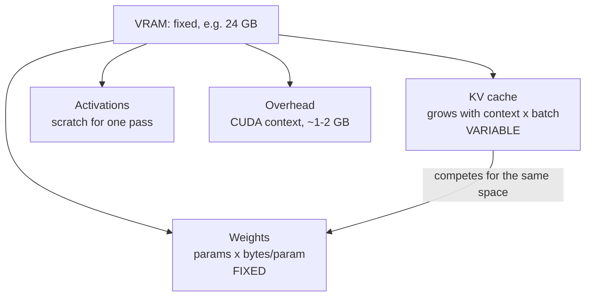

## Before you start

[gpu-fundamentals-for-engineers](gpu-fundamentals-for-engineers) — you need VRAM as a separate, fixed-size memory space, and the fact that every token reads all the weights. [kv-cache-and-context-windows](kv-cache-and-context-windows) covers *why* the KV cache exists; here you only need that it exists and grows, because this topic is about its size.

## In one sentence

Sizing GPU memory means adding up four things — model weights, KV cache, activations, and framework overhead — and checking the total against the card's VRAM before you deploy, because every one of those four is a number you can calculate in advance.

## Why it matters

`CUDA out of memory` is the most common LLM deployment failure, and it is almost always presented as bad luck: it worked in testing, it died under load. It was not luck. The load changed one variable in an equation you could have written down, and the equation would have told you the answer.

There is a second, more expensive version of the same mistake: provisioning. Someone reads "7B at fp16 is 14 GB", sees a 24 GB card, and orders a fleet of them. Then real traffic arrives with concurrency and long prompts, and every instance OOMs at eight simultaneous users.

**OOM is arithmetic, not luck.** That framing is the whole topic.

## The intuition

Think of VRAM as a shipping container you have already paid for.

The **weights** are the machine you are shipping. Big, heavy, and — this is the crucial part — a *fixed* size. Once loaded, they never grow. If you know the parameter count and the precision, you know this number exactly.

The **KV cache** is packing material, and it expands. Every conversation in flight, and every token in every one of those conversations, adds more. It grows with how long the conversations are and how many run at once, and it is competing for the space the machine already occupies.

**Activations** are the working room you need to actually turn the machine on — scratch space for one forward pass.

**Overhead** is the container walls: the CUDA context and framework allocations, a roughly fixed tax of about a gigabyte or two that exists before you load anything.

The container does not stretch. That is the entire problem.



## How it actually works

**Bytes per parameter.** Start here, because it is the one number everything else scales from:

| Precision | Bytes per parameter |
|---|---|
| fp32 | 4 |
| fp16 / bf16 | 2 |
| int8 | 1 |
| int4 | 0.5 |

Weights are then trivially:

```
weight bytes = parameter count x bytes per parameter
```

A 7B model at fp16: `7e9 x 2 = 14e9` bytes = **14 GB**. That is the easy part, and it is the part everyone quotes.

**One trap before we go on.** 14e9 bytes is 14 GB in decimal units but **13.0 GiB** in the binary units GPUs actually report — `nvidia-smi` counts in MiB. That 7% is not a rounding curiosity; it is 7% of your headroom, and it is why a card advertised as "24 GB" shows about 22.5 GiB usable after the driver takes its share. Do the arithmetic in the units your tooling reports.

**The KV cache is what surprises people.** For every token in every active sequence, the model stores a key and a value vector per layer, so it does not recompute attention over the whole prompt on every step. Its size:

```
KV bytes = 2 x layers x kv_heads x head_dim x bytes_per_element x sequence_length x batch_size
```

The `2` is K and V. `kv_heads` is the number of *key/value* heads — modern models use **grouped-query attention**, where many query heads share far fewer KV heads, and that single design choice cuts KV cache by 4x to 8x. It is the difference between a 70B model being servable and not.

Collapse the per-token part and you get a much more usable number:

```
KV bytes per token = 2 x layers x kv_heads x head_dim x bytes_per_element
```

For a 7B model (32 layers, 32 KV heads, head_dim 128, fp16): `2 x 32 x 32 x 128 x 2` = 524,288 bytes = **0.5 MB per token**.

Half a megabyte sounds harmless. Now scale it: 4,096 tokens of context is 2 GiB — for *one* user. Sixteen concurrent users at that context is 32 GiB, which is more than the weights. **Long context and large batches compete for exactly the VRAM the weights already took**, and unlike the weights they are driven by traffic you do not control.

**Activations** are scratch buffers for a single forward pass. For inference at modest batch sizes they are small — budget roughly 5–15% of weight size as a planning figure and measure the real value later. Note that this is inference only; training is a different world, below.

**Overhead** is the CUDA context plus framework allocations: roughly 1–2 GB, largely independent of model size. Small, but it is the difference between fitting and not when you are cutting it fine.

**Training versus inference.** Training memory dwarfs inference because you hold much more than weights. With the standard Adam optimizer in mixed precision you carry weights, gradients (one per parameter), and two optimizer states per parameter, plus activations saved across the entire network for the backward pass. The usual planning rule is **12–20 bytes per parameter for training against 2 for fp16 inference** — roughly an order of magnitude. This is why a model you can serve on one card needs a cluster to train, and why [fine-tuning-and-lora](fine-tuning-and-lora) exists: LoRA trains a tiny fraction of the parameters, so the optimizer states shrink with them.

## Worked example

A sizing calculator. Run it before you provision, not after you OOM:

```js
const BYTES = { fp32: 4, fp16: 2, bf16: 2, int8: 1, int4: 0.5 };
const GB = 1024 ** 3;   // GiB — the units nvidia-smi reports

function sizeIt({ name, params, precision, layers, kvHeads, headDim, context, batch, kvPrecision = 'fp16' }) {
  const weights = params * BYTES[precision];
  // 2 for K and V. kvHeads is the KV head count — grouped-query attention shares them.
  const kvPerToken = 2 * layers * kvHeads * headDim * BYTES[kvPrecision];
  const kv = kvPerToken * context * batch;
  const activations = 0.10 * weights;   // planning figure for inference; measure yours
  const overhead = 1.2 * GB;            // CUDA context + framework, roughly fixed
  return {
    name, weightsGB: weights / GB, kvGB: kv / GB, actGB: activations / GB,
    overheadGB: overhead / GB, kvPerTokenKB: kvPerToken / 1024,
    totalGB: (weights + kv + activations + overhead) / GB,
  };
}

function report(cfg, cards = [24, 40, 80]) {
  const r = sizeIt(cfg);
  console.log(`\n${r.name} @ ${cfg.precision}, context ${cfg.context}, batch ${cfg.batch}`);
  console.log(`  weights      ${r.weightsGB.toFixed(2)} GB`);
  console.log(`  KV cache     ${r.kvGB.toFixed(2)} GB   (${r.kvPerTokenKB.toFixed(0)} KB per token)`);
  console.log(`  activations  ${r.actGB.toFixed(2)} GB`);
  console.log(`  overhead     ${r.overheadGB.toFixed(2)} GB`);
  console.log(`  TOTAL        ${r.totalGB.toFixed(2)} GB`);
  const fits = cards.filter((c) => c >= r.totalGB);
  console.log(`  fits on      ${fits.length ? fits.map((c) => c + 'GB').join(', ') : 'none of ' + cards.join('/') + 'GB'}`);
}

// 7B shape: 32 layers, 32 KV heads, head_dim 128
const m7b = { name: '7B', params: 7e9, layers: 32, kvHeads: 32, headDim: 128 };
report({ ...m7b, precision: 'fp16', context: 4096, batch: 1 });
report({ ...m7b, precision: 'fp16', context: 4096, batch: 16 });
```

Output:

```
7B @ fp16, context 4096, batch 1
  weights      13.04 GB
  KV cache     2.00 GB   (512 KB per token)
  activations  1.30 GB
  overhead     1.20 GB
  TOTAL        17.54 GB
  fits on      24GB, 40GB, 80GB

7B @ fp16, context 4096, batch 16
  weights      13.04 GB
  KV cache     32.00 GB   (512 KB per token)
  activations  1.30 GB
  overhead     1.20 GB
  TOTAL        47.54 GB
  fits on      80GB
```

Read those two blocks against each other, because they are the punchline of the topic.

"14 GB fits in 24 GB" is true — for weights, at batch 1. It leaves about 6 GiB of real headroom, enough for roughly 12,000 tokens of KV cache total. Which is fine for one user at 4K context and **impossible** for eight users at 4K context, because eight users need 16 GiB of KV cache that the card does not have.

The weights did not change between those two runs. Nothing about the model changed. The only thing that changed was concurrency — and the total went from comfortable on a 24 GB card to needing an 80 GB one. That is the shape of nearly every production OOM: not a model that was too big, but a KV cache nobody budgeted.

## A second example — when it gets harder

Now a 70B model, where the arithmetic stops being a warning and becomes a hard constraint:

```js
// 70B shape: 80 layers, but only 8 KV heads — grouped-query attention
const m70b = { name: '70B', params: 70e9, layers: 80, kvHeads: 8, headDim: 128 };
report({ ...m70b, precision: 'fp16', context: 4096, batch: 1 });
report({ ...m70b, precision: 'int4', context: 4096, batch: 1 });
```

Output:

```
70B @ fp16, context 4096, batch 1
  weights      130.39 GB
  KV cache     1.25 GB   (320 KB per token)
  activations  13.04 GB
  overhead     1.20 GB
  TOTAL        145.87 GB
  fits on      none of 24/40/80GB

70B @ int4, context 4096, batch 1
  weights      32.60 GB
  KV cache     1.25 GB   (320 KB per token)
  activations  3.26 GB
  overhead     1.20 GB
  TOTAL        38.31 GB
  fits on      40GB, 80GB
```

At fp16 the weights alone are 130 GiB. **An 80 GB card cannot hold this model, and no tuning changes that** — you are 50 GiB short before a single request arrives. You have exactly two options:

1. **Quantize.** int4 takes weights to 32.6 GiB and the whole deployment to 38 GiB, which fits one 40 GB card with room for batching. Quality costs something, and not uniformly — see [quantization-explained](quantization-explained).
2. **Shard across GPUs.** Split the model over two or more cards. It works, and it introduces cross-GPU communication on every token, which is its own set of trade-offs — see [multi-gpu-and-model-parallelism](multi-gpu-and-model-parallelism).

Notice the KV cache in these runs: **320 KB per token for a 70B model against 512 KB for a 7B one.** The bigger model has a *smaller* per-token cache, because it uses 8 KV heads where the 7B uses 32. Grouped-query attention is doing more for servability here than any amount of memory tuning could. If you assume KV cache scales with parameter count you will size this backwards.

One more honest note. Real serving frameworks do not compute a KV cache size and stop; vLLM takes a `gpu_memory_utilization` fraction, subtracts weights and overhead, and turns whatever remains into a fixed pool of KV cache blocks. So your calculator does not predict an OOM so much as predict **how much concurrency and context you get before requests start queueing** — which is the number you actually needed.

## Quick reference

| Model | fp32 | fp16 | int8 | int4 | Smallest card at fp16 (weights only) |
|---|---|---|---|---|---|
| 7B | 28 GB | 14 GB | 7 GB | 3.5 GB | 24 GB |
| 13B | 52 GB | 26 GB | 13 GB | 6.5 GB | 40 GB |
| 70B | 280 GB | 140 GB | 70 GB | 35 GB | none — 2x 80 GB or quantize |

Decimal GB; subtract about 7% for the GiB your tools report, then add KV cache and overhead. Card capacities as of September 2026 — verify current figures.

| Consumer | Formula | Grows with |
|---|---|---|
| Weights | `params x bytes/param` | Nothing — fixed |
| KV cache | `2 x layers x kv_heads x head_dim x bytes x seq x batch` | Context and concurrency |
| Activations | ~5–15% of weights (inference) | Batch size |
| Overhead | ~1–2 GB | Nothing much |
| Training extra | 12–20 bytes/param total | Optimizer choice |

## Common mistakes

- Sizing weights only and calling it done. The KV cache routinely exceeds the weights under real concurrency.
- Assuming KV cache scales with parameter count. It scales with layers, KV heads, and head_dim — a 70B with grouped-query attention has a smaller per-token cache than a 7B without it.
- Mixing decimal GB and binary GiB. It is a 7% error, always in the direction of an OOM.
- Forgetting the ~1–2 GB CUDA overhead when the fit is tight.
- Testing at batch 1 and provisioning for production traffic.
- Applying training memory rules (12–20 bytes/param) to inference, or the reverse — they differ by roughly 10x.
- Treating an OOM as a flaky infrastructure problem rather than an equation that had a predictable answer.

## What interviewers ask

- **How much VRAM does a 7B model at fp16 need?** — About 14 GB for the weights, but the answer is incomplete without the KV cache, activations, and roughly 1–2 GB of CUDA overhead; at 4K context and batch 1 that lands near 17–18 GiB, and at batch 16 it passes 47 GiB.
- **Why does a 14 GB model OOM on a 24 GB card?** — The weights fit; the KV cache does not. Each concurrent request needs its own cache proportional to its context length, so a handful of long-context users consumes more VRAM than the model itself.
- **What drives KV cache size?** — Layers, KV heads, head dimension, two entries for K and V, bytes per element, sequence length, and batch size. Only the last two vary at runtime, which is why concurrency and context length are the levers that cause surprises.
- **Can you serve a 70B model at fp16 on one 80 GB card?** — No. Weights alone are around 130 GiB, so you must quantize to int8 or int4, or shard across multiple GPUs with tensor parallelism.
- **Why is training memory so much larger than inference?** — Training holds gradients and two Adam optimizer states per parameter plus activations saved for the backward pass, roughly 12–20 bytes per parameter against 2 for fp16 inference.
- **How would you decide between a bigger card and quantizing?** — Compute the total for both, then compare cost against the quality risk: quantizing is cheaper but needs an eval to prove the regression is acceptable, while a bigger card costs money and changes nothing about output quality.

## Practice

1. Take a model you can look up (check `config.json` on Hugging Face for `num_hidden_layers`, `num_key_value_heads`, `hidden_size`) and compute its KV cache in KB per token by hand. Then verify with the calculator.
2. Extend the calculator to invert the question: given a card size, a model, and a context length, print the **maximum batch size that fits**. That is the number capacity planning actually asks for.
3. For a 13B model at fp16 on a 40 GB card, find the context length at which batch 8 stops fitting. Then find it again for int8 weights, and explain why the answer more than doubles.

## Where to go next

[quantization-explained](quantization-explained) is the first lever you reach for when the arithmetic above says no — it halves or quarters the weight term, and because inference is bandwidth-bound it usually makes generation faster too.
