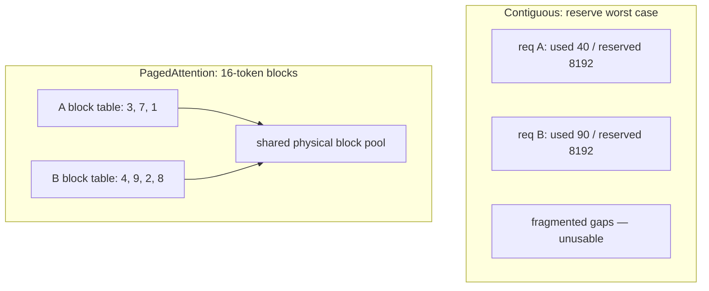

## Before you start

[gpu-memory-math](gpu-memory-math) so you know why VRAM is the scarce resource here. [http-https-websockets](http-https-websockets) helps, since a serving runtime is ultimately an HTTP server.

## In one sentence

An **inference server** is a long-running process that holds a model's weights in GPU memory and serves many concurrent requests against them, handling the queueing, batching, and memory management that a plain `model.generate()` call does not.

## Why it matters

Here is the code almost everyone writes first:

```python
@app.post("/generate")
def generate(prompt: str):
    return model.generate(prompt, max_new_tokens=256)
```

It works. It also fails in four ways at once, and none of them are obvious until you have real traffic.

**It serves one request at a time.** The GPU processes a single sequence, and every other request waits in your web framework's thread pool. Two users means the second one waits for the first to finish generating all 256 tokens.

**It wastes almost all the GPU.** Generating one token for one sequence reads the entire weight set out of VRAM and does a tiny amount of arithmetic with it. The GPU's compute units sit idle waiting on memory. You bought an 80GB accelerator and are using a few percent of it.

**It fragments memory.** Each request needs a **KV cache** — the stored intermediate state for every token so far. A naive implementation reserves a contiguous block sized for the maximum possible sequence length. A request that generates 40 tokens holds a slab sized for 8,192, and after a few hundred requests of varying length the free memory is a Swiss cheese of unusable gaps.

**It has no queue.** Under load your options are to block indefinitely or return 503. There is no admission control, no way to see how deep the backlog is, no fairness.

The gap between that handler and a production serving runtime is roughly 20x throughput on the same hardware. That is the whole reason this category of software exists.

## The intuition

A naive generate loop is a shop with one till and a policy that each customer must be fully served — including a leisurely browse — before the next is acknowledged. The till is fine. The queueing is catastrophic.

An inference server is the same shop reorganised: a numbered queue at the door, a till that serves sixteen customers' items in one sweep because ringing up sixteen barcodes costs barely more than ringing up one, and a stockroom that hands out shelf space in small standard-sized bins rather than reserving an entire aisle per customer in case they buy a lot.

That last point — standard-sized bins instead of reserved aisles — is **PagedAttention**, and it is the single best idea in modern LLM serving.

## How it actually works

A serving runtime does seven jobs. Learn them as a list, because interviewers ask "what does vLLM actually do for you?" and this is the answer.

**Request queueing and admission.** Requests arrive and enter a scheduler queue. The scheduler decides each step which sequences run, based on available KV-cache blocks and configured limits. When memory runs out it can queue, or **preempt** — evict a running sequence's cache and restart it later.

**Continuous batching.** Sequences join and leave the running batch between token steps rather than at request boundaries. This is the throughput win, and [continuous-batching-and-throughput](continuous-batching-and-throughput) covers the mechanism in full.

**KV-cache management.** Allocating, sharing, and freeing cache blocks. See below.

**Token streaming.** Tokens leave over Server-Sent Events as they are produced, rather than buffering the whole completion.

**Prefix caching.** Two requests sharing a prompt prefix — the same system prompt, the same few-shot examples — can share the same physical KV blocks instead of each computing and storing them. Note this is the *server-side* mechanism; the consumer-side billing feature is covered in [llm-cost-and-latency](llm-cost-and-latency).

**An OpenAI-compatible HTTP surface.** `/v1/chat/completions`, `/v1/completions`, `/v1/models`.

**Metrics.** Prometheus counters for queue depth, KV-cache utilisation, tokens/sec, TTFT.

### PagedAttention

Attention theory lives in [attention-and-transformers](attention-and-transformers) and cache sizing in [kv-cache-and-context-windows](kv-cache-and-context-windows). What matters here is purely a memory-management question: **where do those cache tensors physically live?**

The naive answer is one contiguous slab per request. That forces a terrible decision. You do not know in advance how many tokens a request will generate, so you must reserve for the *worst case* — the model's maximum sequence length. If that is 8,192 tokens and the average request generates 300, you have reserved roughly 27 times what you need, per request. Multiply by concurrency and the KV cache — not the weights — becomes what limits your batch size.

Contiguous allocation also fragments. Slabs of different sizes are allocated and freed, leaving gaps too small for the next request even when the total free memory is ample. This is **external fragmentation**, the exact problem operating systems solved with paging in the 1960s.

PagedAttention borrows that solution. The KV cache is carved into fixed-size **blocks**, each holding the keys and values for a small number of tokens (16 is a common block size). A sequence gets a **block table** — a list of pointers to the physical blocks holding its cache, which need not be adjacent. When it needs another token's worth of space, it is handed one more block from a free list.



Three consequences follow, and all three are worth stating in an interview:

1. **Near-zero waste.** The only unused memory is the partially filled last block of each sequence — bounded by the block size, not by the maximum sequence length.
2. **No external fragmentation.** All blocks are the same size, so any free block fits any request.
3. **Free sharing.** Two sequences with an identical prefix point their block tables at the *same* physical blocks. Copy-on-write handles divergence. This makes prefix caching and parallel sampling nearly free.

The original paper reports 2–4x throughput at equal latency versus previous systems, driven almost entirely by fitting more concurrent sequences into the same VRAM.

## Worked example

You can measure the fragmentation problem without a GPU. This models the two allocators against the same request trace.

```js
const MAX_LEN = 8192;      // model's max sequence length
const BLOCK = 16;          // tokens per KV block
const KV_PER_TOKEN = 0.5;  // MB per token — apply the figure from gpu-memory-math
const BUDGET_MB = 40_000;  // KV cache budget after weights

// A realistic mix: mostly short generations, a few long ones.
function trace(n) {
  const out = [];
  for (let i = 0; i < n; i++) {
    out.push(i % 20 === 0 ? 3000 + (i % 700) : 120 + (i % 400));
  }
  return out;
}

const lengths = trace(200);

// Contiguous: every request reserves the worst case.
const contiguousPerReq = MAX_LEN * KV_PER_TOKEN;
const contiguousFit = Math.floor(BUDGET_MB / contiguousPerReq);

// Paged: reserve only whole blocks covering the ACTUAL length.
let pagedMb = 0, pagedFit = 0;
for (const len of lengths) {
  const blocks = Math.ceil(len / BLOCK);
  const mb = blocks * BLOCK * KV_PER_TOKEN;
  if (pagedMb + mb > BUDGET_MB) break;
  pagedMb += mb;
  pagedFit++;
}

const used = lengths.slice(0, pagedFit).reduce((a, b) => a + b, 0) * KV_PER_TOKEN;

console.log('contiguous: reserve', contiguousPerReq, 'MB/req ->', contiguousFit, 'concurrent');
console.log('paged     : reserve', Math.round(pagedMb / pagedFit), 'MB/req avg ->', pagedFit, 'concurrent');
console.log('paged waste:', (100 * (1 - used / pagedMb)).toFixed(2) + '% (last partial block only)');
console.log('concurrency gain:', (pagedFit / contiguousFit).toFixed(1) + 'x');
```

Output:

```
contiguous: reserve 4096 MB/req -> 9 concurrent
paged     : reserve 185 MB/req avg -> 200 concurrent
paged waste: 1.99% (last partial block only)
concurrency gain: 22.2x
```

Nine concurrent sequences against 200, on identical hardware, with the same model. The contiguous allocator is not doing anything stupid — it is reserving exactly what a request *could* need. That is the whole problem: it must be correct for the worst case, so it is wasteful in the common case. Paged allocation only ever reserves what a sequence has actually used, rounded up to a 16-token block, which is why its waste lands near 2% instead of near 96%.

## A second example — when it gets harder

The numbers above assume every request is independent. Now add prefix sharing, which is where PagedAttention's second benefit appears — and where the naive mental model breaks.

Say you serve a coding assistant. Every request carries a 2,000-token system prompt with tool definitions and style rules, then a short user question.

```js
const BLOCK = 16, KV_PER_TOKEN = 0.5;
const SHARED_PREFIX = 2000, USER = 200, CONCURRENT = 64;

const blocks = (t) => Math.ceil(t / BLOCK);

// No sharing: every sequence stores its own copy of the prefix.
const noShare = CONCURRENT * blocks(SHARED_PREFIX + USER) * BLOCK * KV_PER_TOKEN;

// Shared: prefix blocks stored ONCE, referenced by every block table.
const prefixBlocks = Math.floor(SHARED_PREFIX / BLOCK);  // only FULL blocks can be shared
const tailTokens = SHARED_PREFIX % BLOCK + USER;
const shared = prefixBlocks * BLOCK * KV_PER_TOKEN
             + CONCURRENT * blocks(tailTokens) * BLOCK * KV_PER_TOKEN;

console.log('no sharing:', noShare, 'MB');
console.log('shared    :', shared, 'MB');
console.log('saved     :', (100 * (1 - shared / noShare)).toFixed(1) + '%');
console.log('prefill work skipped per request:', prefixBlocks * BLOCK, 'tokens');
```

Output:

```
no sharing: 70656 MB
shared    : 7656 MB
saved     : 89.2%
prefill work skipped per request: 2000 tokens
```

89% of the KV cache was duplicate copies of the same system prompt. Sharing them collapses 70GB to under 8GB, and as a bonus the prefill for those 2,000 tokens is computed once rather than 64 times — which cuts TTFT too.

The subtlety is `Math.floor` on `prefixBlocks`. Sharing works at **block granularity**, so only *complete* blocks of identical tokens can be shared. If your system prompt is 2,007 tokens, the 7 tokens in the final partial block are not shared, and — more importantly — any variation before that point breaks sharing for everything after it. One request ID or timestamp near the top of the prompt and the shared prefix is zero blocks long. This is the same discipline as consumer-side prompt caching in [llm-cost-and-latency](llm-cost-and-latency), for the same underlying reason.

## Quick reference

| Use case | Runtime | Why |
|---|---|---|
| Production serving, throughput-first | vLLM | PagedAttention, continuous batching, OpenAI-compatible, the common default |
| Hugging Face-centric stack | TGI | **Archived read-only in March 2026 — do not start here.** Historically the Hub-integrated default; Hugging Face now points users at vLLM |
| Squeezing the last 20% on NVIDIA | TensorRT-LLM | Compiles model-and-GPU-specific engines; fastest, but a build step per model and per GPU |
| Local development, no GPU needed | Ollama / llama.cpp | GGUF quantised weights, runs on CPU or Apple Silicon, one command to start |
| Multi-model, multi-framework platform | Triton Inference Server | Serves LLMs alongside vision and classical models under one API |

| Job | What breaks without it |
|---|---|
| Request queue | 503s under burst, no backpressure signal |
| Continuous batching | GPU idles waiting for the longest generation |
| Paged KV cache | Concurrency capped roughly 20x too low |
| Prefix caching | Recomputing the same system prompt per request |
| Streaming | Multi-second perceived hang |
| Metrics | No way to tell saturation from a slow model |

## Tools & frameworks

This topic's title names TGI, so note where it sits now: the project went to maintenance mode in December 2025 and its repository was archived read-only in March 2026, and HuggingFace itself now points users at vLLM or SGLang. Study it as the reason continuous batching went mainstream, not as something to deploy.

| Tool | What it's for | Reach for it when |
|---|---|---|
| [vLLM](https://docs.vllm.ai/en/latest/) | High-throughput OpenAI-compatible server | The default choice for self-hosted LLM serving today |
| [SGLang](https://docs.sglang.io/) | Prefix-cache-optimised serving | You need structured generation, or heavy prefix reuse across requests |
| [TensorRT-LLM](https://nvidia.github.io/TensorRT-LLM/) | Compiled, NVIDIA-optimised inference | You are squeezing the last throughput out of a model set that will not change |
| [Triton Inference Server](https://docs.nvidia.com/deeplearning/triton-inference-server/user-guide/docs/index.html) | Multi-framework model server | You serve more than LLMs and want one platform for all of it |
| [llama.cpp](https://github.com/ggml-org/llama.cpp) | CPU and quantized local inference | There is no GPU, or the target is a laptop or edge device |
| [Ollama](https://docs.ollama.com/) | Local model runner built over llama.cpp | You want local development ergonomics — not production serving |

## Common mistakes

- Putting `model.generate()` in a web handler and concluding the GPU is too slow, when the runtime is the problem.
- Setting `--gpu-memory-utilization` low "to be safe". The leftover is not a safety margin; it is your KV cache, and shrinking it shrinks concurrency directly.
- Assuming a bigger GPU fixes concurrency. Without paged allocation most of that extra VRAM goes to worst-case reservations.
- Believing PagedAttention changes the attention *maths*. It does not; identical outputs, different memory layout.
- Reaching for TensorRT-LLM first. The per-model, per-GPU compile step is real operational cost — earn it with a measured need.
- Benchmarking against a single fixed prompt, so prefix sharing gives every request a free ride and the numbers do not survive production.

## What interviewers ask

- **Why not just call the model in a request handler?** — One request at a time, a mostly idle GPU because decode is memory-bandwidth-bound, worst-case KV reservations that fragment memory, and no queue or backpressure. A serving runtime fixes all four and typically gets ~20x the throughput on the same card.
- **What is PagedAttention and what problem does it solve?** — It stores the KV cache in fixed-size blocks with a per-sequence block table instead of one contiguous slab. That removes the need to reserve for the maximum sequence length, eliminates external fragmentation, and lets sequences with a common prefix share physical blocks.
- **Why does OpenAI-compatible matter so much?** — Migration cost collapses to a base URL and an API key. The same client library, retries, and streaming code point at your own server, so self-hosting becomes a config change rather than a rewrite — and you can A/B a hosted model against your own.
- **When would you pick Ollama over vLLM?** — Local development and single-user work, where the priority is starting in seconds on whatever hardware you have. It is not built for the concurrency a production serving runtime targets.
- **What is the first metric you look at on a struggling inference server?** — KV-cache utilisation and queue depth together. High cache utilisation with a growing queue means you are VRAM-bound on concurrency; an empty queue with low utilisation means the bottleneck is elsewhere.

## Practice

1. Install Ollama, pull a small model, and hit its OpenAI-compatible endpoint with the official OpenAI client library — changing only the base URL. Confirm your existing code works unmodified.
2. Extend the fragmentation simulation to model *preemption*: when the block pool is exhausted, evict the newest sequence and re-queue it. Measure how many sequences get preempted more than once as the budget shrinks.
3. Take a request trace where 70% of prompts share a 1,500-token prefix and 30% are unique. Compute the effective concurrency with and without block sharing, then work out the prefix length at which sharing stops being worth the bookkeeping.

## Where to go next

[continuous-batching-and-throughput](continuous-batching-and-throughput) — you now know the server keeps a batch running; that topic explains how sequences enter and leave it, and why that single scheduling decision is where the throughput actually comes from.
