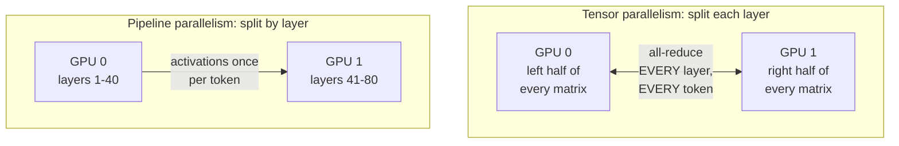

## Before you start

[gpu-memory-math](gpu-memory-math) — you need to have seen the arithmetic say "this does not fit on one card". This topic is what you do next, and it is the second of the two answers; the first is [quantization-explained](quantization-explained).

## In one sentence

Multi-GPU serving splits either the requests or the model itself across several GPUs, and the three ways of doing it — replicating the whole model, splitting each layer's matrices, or putting different layers on different cards — have very different communication costs.

## Why it matters

Two reasons, and only one is about speed.

The unavoidable one: a 70B model at fp16 needs about 130 GiB of weights and no single card holds that. If you will not quantize, you must shard.

The one people get wrong: "we have 8 GPUs, so we get 8x." Depending on which parallelism you pick and what wires connect the cards, eight GPUs might give close to 8x, or under 2x, or — for pipeline parallelism at low concurrency — a fraction of one GPU. Knowing which is which is both the interview question and the production decision.

## The intuition

You have a long document to translate and several translators.

**Data parallelism** — each translator gets a complete dictionary and a different document. Perfect scaling, no coordination, but every desk needs the full dictionary. Requires the model to fit on one GPU.

**Tensor parallelism** — one document, and the *dictionary* is split by page range across translators. To translate a single word, every translator checks their pages and they must confer before agreeing. That happens for **every word**. Extremely chatty, and the only way forward when the dictionary is too big for one desk.

**Pipeline parallelism** — an assembly line. Translator 1 does paragraphs 1–10, hands off to translator 2 for 11–20, and so on; each holds only their own pages. But at the start, translators 2 through 4 sit idle waiting — a **bubble** — and the same at the end.



The diagram is the whole comparison. Tensor parallelism communicates twice per layer per token; pipeline parallelism communicates once per token, total. That single difference drives every decision below.

## How it actually works

**Data parallelism.** Each GPU holds a complete copy of the model and serves different requests. No inter-GPU communication during inference — you are running N independent replicas behind a load balancer. Scaling is close to linear, and the constraint is absolute: **the model must fit on one GPU.** For serving, this is the default and the thing to prefer.

**Tensor parallelism (TP).** A single layer's weight matrices are split across GPUs, so one large matrix multiply becomes several smaller ones and the partial results must be combined with an **all-reduce** — every GPU sends its partial sum to every other until all hold the total.

The cost is frequency. A transformer layer needs an all-reduce after attention and another after the feed-forward block: roughly **two collectives per layer per token**, so around 160 synchronisation points per token for an 80-layer model. Each is small — a few hundred kilobytes — but each is a full barrier.

TP shards the KV cache too and cuts per-GPU weight memory by the TP degree. It is the standard way to make a model that does not fit, fit.

**Pipeline parallelism (PP).** Different layers on different GPUs. GPU 0 runs layers 1–40, passes the activations to GPU 1 for 41–80. Communication is one activation tensor per token per boundary — far less traffic than TP.

The cost is idleness. With one request in flight only one GPU works at a time and the rest wait: a **pipeline bubble**, so 4-way PP on a single stream can be *worse* than one GPU. Micro-batching fills the bubble — several requests in flight at different stages — so PP is a throughput technique, not a latency one. It also does not reduce per-layer memory, so if one layer's tensors will not fit on one card, only TP can help.

**The interconnect is the real limit.** TP's all-reduces run at the speed of the wire between GPUs, and the two wires you might have differ enormously (as of September 2026 — verify current figures):

- **NVLink**, a direct GPU-to-GPU link, offers hundreds of gigabytes per second per GPU — high hundreds or more on recent generations.
- **PCIe Gen5 x16** offers roughly 60 GB/s nominal, and on many hosts GPU-to-GPU traffic routes *through* the CPU root complex, so the effective rate for small frequent collectives is far lower still.

That is an order of magnitude or more, landing directly on TP's ~160 barriers per token. So on NVLink, TP across 2–8 GPUs is efficient and standard; on PCIe-only hosts it scales poorly and each extra GPU adds synchronisation without adding useful bandwidth.

Check before you assume: `nvidia-smi topo -m` prints the link type for every pair. `NV#` means NVLink; `PHB` or `SYS` means you are crossing PCIe or worse.

**Combining them.** The standard multi-node recipe: TP *within* a node where NVLink is available, PP *across* nodes where you only have Ethernet or InfiniBand. TP's chatty traffic stays on the fast wire; PP's occasional traffic tolerates the slow one.

**The honest framing: prefer the smallest number of GPUs that fits.** Every GPU added to a TP group adds synchronisation and costs efficiency. For inference, **scale up before scaling out** — one 80 GB card beats two 40 GB cards for the same model, because the second configuration pays communication the first does not. Reach for multiple GPUs when one card genuinely cannot hold the model, not to make a model that already fits go faster.

## Worked example

Model the trade-off. Communication cost against bubble cost:

```js
function serve({ label, gpus, mode, layers, bytesPerTokenPerLayer, linkGBs, computeMsPerLayer }) {
  const computeMs = (layers * computeMsPerLayer) / (mode === 'tp' ? gpus : 1);

  let commMs = 0;
  if (mode === 'tp') {
    // Two all-reduces per layer, per token. Ring all-reduce moves ~2x(N-1)/N of the payload.
    const perOp = (bytesPerTokenPerLayer * 2 * (gpus - 1) / gpus) / (linkGBs * 1e9) * 1000;
    commMs = layers * 2 * perOp;
  } else if (mode === 'pp') {
    // One activation handoff per stage boundary, per token.
    commMs = (gpus - 1) * (bytesPerTokenPerLayer / (linkGBs * 1e9)) * 1000;
  }

  // Pipeline bubble: single-stream PP leaves gpus-1 stages idle.
  const bubbleFactor = mode === 'pp' ? gpus : 1;
  const msPerToken = computeMs * bubbleFactor + commMs;
  return { label, msPerToken, tokPerSec: 1000 / msPerToken, commShare: commMs / msPerToken };
}

const base = { layers: 80, bytesPerTokenPerLayer: 128 * 1024, computeMsPerLayer: 0.12 };

const rows = [
  serve({ ...base, label: 'TP=2, NVLink (600GB/s)', gpus: 2, mode: 'tp', linkGBs: 600 }),
  serve({ ...base, label: 'TP=4, NVLink (600GB/s)', gpus: 4, mode: 'tp', linkGBs: 600 }),
  serve({ ...base, label: 'TP=8, NVLink (600GB/s)', gpus: 8, mode: 'tp', linkGBs: 600 }),
  // 8 GB/s: effective GPU-to-GPU rate once traffic crosses the CPU root complex,
  // well below the nominal PCIe link rate. Measure yours; do not assume the spec sheet.
  serve({ ...base, label: 'TP=4, PCIe   (8GB/s)  ', gpus: 4, mode: 'tp', linkGBs: 8 }),
  serve({ ...base, label: 'TP=8, PCIe   (8GB/s)  ', gpus: 8, mode: 'tp', linkGBs: 8 }),
  serve({ ...base, label: 'PP=4, single stream   ', gpus: 4, mode: 'pp', linkGBs: 8 }),
];

for (const r of rows) {
  console.log(`${r.label}  ${r.msPerToken.toFixed(2)} ms/tok  ${r.tokPerSec.toFixed(0)} tok/s  comm ${(100 * r.commShare).toFixed(0)}%`);
}
```

Output:

```
TP=2, NVLink (600GB/s)  4.83 ms/tok  207 tok/s  comm 1%
TP=4, NVLink (600GB/s)  2.45 ms/tok  408 tok/s  comm 2%
TP=8, NVLink (600GB/s)  1.26 ms/tok  793 tok/s  comm 5%
TP=4, PCIe   (8GB/s)    6.33 ms/tok  158 tok/s  comm 62%
TP=8, PCIe   (8GB/s)    5.79 ms/tok  173 tok/s  comm 79%
```

The single-GPU baseline here is 9.6 ms/token, or 104 tokens/sec. Compare everything against that.

The NVLink rows scale nearly linearly — 207, 408, 793 against 104 — because communication stays a few percent of the token budget.

The PCIe rows are the lesson. At TP=4, **62% of every token's time goes to moving bytes rather than computing.** Doubling to 8 GPUs buys 9% — 158 to 173 tokens/sec — because you doubled the compute *and* the synchronisation, and they nearly cancelled. Eight GPUs deliver 1.7x one GPU for 8x the hardware.

Treat the figures as illustrative; the parameters are estimates and the ratios are the point. What is robust is the direction: **communication share rises with TP degree and falls with link bandwidth**, so a configuration that scales cleanly on NVLink stalls on PCIe. Hence checking `nvidia-smi topo -m` first on an unfamiliar host.

## A second example — when it gets harder

Now the pipeline row, which the first example printed but did not explain:

```
PP=4, single stream     38.42 ms/tok  26 tok/s  comm 0%
```

Communication is effectively zero — PP moves almost nothing. And at 26 tokens/sec it is **four times slower than the single-GPU baseline of 104**, because with one request in flight three of the four GPUs sit idle at any moment — and each stage now does only a quarter of the layers, so no stage finishes faster. Four GPUs delivering a quarter of one.

This is the trap in reading parallelism benchmarks. PP looks catastrophic at batch 1 and fine at batch 32, because micro-batches fill the bubble: while GPU 3 handles request A's later layers, GPU 0 starts request B. **PP trades latency for throughput and needs concurrency to break even**, so a single-stream benchmark tells you almost nothing about it.

Two more cases break the naive picture.

**TP degree must divide the model's structure.** Attention heads and hidden dimensions have to split evenly across the group. A model with 32 KV heads shards cleanly by 2, 4, or 8; an awkward head count may not shard by 8 at all, and vLLM rejects the configuration rather than misbehaving quietly — its guidance is to fall back to pipeline parallelism when GPUs do not divide the model evenly.

**Memory does not divide as cleanly as you hope.** TP=2 does not halve your VRAM needs: weights and KV cache shard, but CUDA context and framework overhead are **per GPU**, so you pay that tax N times. Two 40 GB cards give less usable capacity than one 80 GB card — the arithmetic behind "scale up before scaling out."

And the failure mode nobody warns you about: a TP group runs in lockstep, so the slowest GPU sets the pace. One card thermally throttling, or one behind a slower link, degrades the whole group. TP turns N independent machines into one machine with N times the ways to fail.

## Quick reference

| | Data | Tensor | Pipeline |
|---|---|---|---|
| What is split | Requests | Each layer's matrices | Layers across GPUs |
| Model must fit on 1 GPU | Yes | No | No |
| Communication | None | ~2 all-reduces per layer per token | 1 handoff per boundary per token |
| Interconnect sensitivity | None | Very high | Low |
| Latency effect | Neutral | Improves it | Worsens it |
| Needs concurrency to pay off | No | No | Yes |
| Reduces per-layer memory | No | Yes | No |
| Use when | Model fits | Model does not fit; NVLink available | Crossing nodes, or TP degree will not divide |

| Situation | Do this |
|---|---|
| Model fits on one GPU | Data parallelism — N replicas behind a load balancer |
| Does not fit, NVLink host | TP at the smallest degree that fits |
| Does not fit, PCIe-only host | Quantize first; TP=2 at most, and measure |
| Multi-node | TP inside each node, PP across nodes |
| Choosing 2x40GB or 1x80GB | 1x80GB — no communication, overhead paid once |

## Tools & frameworks

| Tool | What it's for | Reach for it when |
|---|---|---|
| [PyTorch FSDP](https://docs.pytorch.org/docs/stable/fsdp.html) | Shard parameters, gradients and optimizer state | You are training a model that does not fit on one GPU — Python |
| [DeepSpeed](https://www.deepspeed.ai/) | ZeRO stages and CPU or NVMe offload | You need offload to fit the model at all, not just to fit it faster — Python |
| [vLLM](https://docs.vllm.ai/en/latest/) | `tensor_parallel_size` for serving | You are splitting *inference* across GPUs, which is a different problem from training |
| [Nsight Systems](https://developer.nvidia.com/nsight-systems) | See what NCCL collectives cost | Scaling is sublinear and you suspect the interconnect rather than the compute |

Keep the two halves of this table apart: FSDP and DeepSpeed are training parallelism, vLLM's tensor parallelism is inference, and conflating them is the standard confusion.

## Common mistakes

- Expecting 8 GPUs to give 8x. With TP over PCIe it can be closer to 1x past a low degree.
- Not checking `nvidia-smi topo -m` before choosing a TP degree, then blaming the software.
- Using tensor parallelism to speed up a model that already fits. You paid for synchronisation you did not need.
- Benchmarking pipeline parallelism at batch 1 and concluding it is broken. It needs concurrency to fill the bubble.
- Assuming TP=2 halves memory requirements. Weights and KV cache shard; CUDA overhead is per GPU.
- Scaling out to more small cards instead of up to one bigger card, for a model that would fit on the bigger card.
- Ignoring that a TP group runs at the speed of its slowest member.

## What interviewers ask

- **Explain data, tensor, and pipeline parallelism.** — Data parallelism replicates the whole model per GPU and sends different requests to each, needing no communication but requiring the model to fit on one card; tensor parallelism splits each layer's matrices across GPUs so every token needs an all-reduce at every layer; pipeline parallelism puts different layers on different GPUs, communicating only at stage boundaries but idling GPUs unless enough requests are in flight.
- **Why isn't 8 GPUs 8x faster?** — Tensor parallelism synchronises roughly twice per layer per token, so throughput is bounded by interconnect bandwidth; on NVLink that overhead stays a few percent and scaling is near-linear, while on PCIe it can consume most of the token budget so extra GPUs buy very little.
- **A 70B model at fp16 won't fit on one 80 GB card. Options?** — Quantize to int4 so weights drop to about 33 GiB and fit one card, or shard with tensor parallelism across two or more; prefer whichever keeps you on the fewest cards, since quantizing costs quality and sharding costs communication on every token.
- **When would you choose pipeline over tensor parallelism?** — When crossing a slow link such as between nodes, since pipeline parallelism communicates once per stage boundary rather than twice per layer; also when the tensor-parallel degree will not divide the model's attention heads evenly.
- **Why prefer one 80 GB GPU over two 40 GB GPUs?** — The single card needs no inter-GPU communication and pays CUDA and framework overhead once rather than twice, giving more usable memory and lower latency for the same model.
- **What happens if one GPU in a tensor-parallel group is slower?** — The whole group runs at its speed, because every all-reduce is a barrier all GPUs wait on, so one throttling card degrades the entire deployment.

## Practice

1. Run `nvidia-smi topo -m` on any multi-GPU machine you can reach and classify every pair as NVLink or PCIe. Predict which TP degrees are worth trying and what you expect to measure.
2. Extend the model above to take a batch size and add pipeline micro-batching. Find the batch size at which PP=4 finally beats a single GPU, and explain what that number depends on.
3. For a 70B model, cost three working configurations — int4 on one card, fp16 with TP=2, fp16 with TP=4 — on hardware price, tokens/sec, and quality risk. Write the recommendation you would defend, and name the measurement that would change your mind.

## Where to go next

[inference-servers-vllm-and-tgi](inference-servers-vllm-and-tgi) is where these choices become configuration flags — `tensor_parallel_size`, `pipeline_parallel_size`, `gpu_memory_utilization` — and the server handles the sharding for you once you have decided what it should do.
