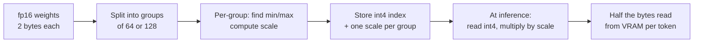

## Before you start

[gpu-memory-math](gpu-memory-math) — you need the bytes-per-parameter table and the reason a model does not fit. Quantization is the first lever you pull when that arithmetic says no.

## In one sentence

**Quantization** stores a model's weights in fewer bits than they were trained in — 8 or 4 instead of 16 — by recording, for each group of weights, a scale factor that maps a small range of integers back onto the original floating-point values.

## Why it matters

It is the difference between a model you can run and one you cannot. A 70B model at fp16 needs about 130 GiB of weights and fits on no single card available today; at int4 it is 33 GiB and fits on one 40 GB card. That is not an optimisation, it is a change in what is possible.

The second reason is speed, and it catches people out. Because generation is memory-bandwidth-bound — every token reads every weight, as [gpu-fundamentals-for-engineers](gpu-fundamentals-for-engineers) works through — halving the bytes roughly halves the read time. **Quantization usually makes inference faster, not just smaller**, and the mechanism is bandwidth rather than arithmetic.

The cost is quality, and the difficulty is that the cost hides.

## The intuition

Think about writing down temperatures for a week. You could record 21.847263 °C, or you could record 22 °C. You threw away information, and for deciding what to wear you threw away nothing that mattered.

Two things made that work, and both hold for neural network weights.

First, **the values cluster in a narrow range.** Weekly temperatures live between about −10 and 40 °C, while a 32-bit float can represent 10^38 and 10^−38 and spends much of its precision on magnitudes your data never visits. Trained weights are the same: overwhelmingly small values packed near zero.

Second, **you only need to preserve differences that change the answer.** Outputs depend on sums of thousands of weight-times-activation products, and small independent rounding errors in those products largely cancel.

So instead of 16 bits per weight, store a **scale** for a group of weights and represent each weight as a small integer — 0 to 15 for int4 — multiplied by that scale. Sixteen buckets spread across the range the weights actually occupy, rather than 65,536 values across a range they never use.

The failure mode is in the analogy too. If one day hit 200 °C, a scale stretched to cover 200 forces every ordinary day into the same bucket. **Outlier weights are the whole difficulty of quantization**, and every serious method is a strategy for handling them.

## How it actually works

**Scale and zero-point.** Take a group of weights, find its minimum and maximum, and map that range onto the integer range you have:

```
scale      = (max - min) / (q_max - q_min)
zero_point = q_min - round(min / scale)
quantized  = round(value / scale + zero_point)
recovered  = scale x (quantized - zero_point)
```

That is **asymmetric** (affine) quantization. **Symmetric** quantization assumes the range is centred on zero, so the zero-point is fixed at 0 and only the scale is stored — cheaper, and a good fit for weights, which really do centre near zero.

**Granularity is where quality comes from.** One scale per tensor is cheap and crude: a single outlier stretches the range and everything else loses resolution. One scale **per group** — commonly 64 or 128 weights — costs a little storage and quarantines each outlier's damage to its own group. This is why real 4-bit models are not exactly 0.5 bytes per parameter: the scales add roughly 0.1–0.5 bits per weight.



**Post-training quantization (PTQ)** converts an already-trained model in minutes, and is what you will almost always use. **Quantization-aware training (QAT)** simulates rounding error during training so the model adapts to it — better quality at very low bit widths, at the price of a training run, which is why it is rare outside teams that own the pretraining.

**Weight-only versus weight-and-activation.** Weight-only quantization stores weights in 4 or 8 bits, then converts back to fp16 for the arithmetic. It captures the bandwidth win — which for memory-bound generation is most of the win — and is low-risk. Quantizing **activations** too lets the matrix multiply itself run in int8 or fp8, a genuine compute speedup, but activation outliers are far nastier and this is where quality problems concentrate. Most 4-bit LLM deployments are weight-only.

**The formats you will actually meet.** What each is *for*:

- **GPTQ** — 4-bit weight-only PTQ that uses a calibration dataset to minimise error layer by layer. Strong quality, broad tooling, needs a calibration pass (roughly 20 minutes for an 8B model on one A100).
- **AWQ** (Activation-aware Weight Quantization) — also 4-bit weight-only, but finds the small fraction of weights that matter most to activations and protects them. Often fastest at inference, competitive or better on quality, shorter calibration than GPTQ.
- **GGUF** — a *file format*, not an algorithm, from the llama.cpp ecosystem. One file holding weights, tokenizer, and metadata, supporting many quantization types (`Q4_K_M`, `Q5_K_M`). Reach for it on CPU or consumer hardware.
- **bitsandbytes** — quantizes on the fly at load time, no calibration dataset. Easiest to try and the standard path for QLoRA fine-tuning; inference typically slower than GPTQ or AWQ.

**The trade curve, honestly.** Memory falls proportionally with bits. Throughput usually rises, because fewer bytes cross the memory bus per token. Quality falls slightly — **and non-uniformly, which is the part that matters.**

Degradation is not spread evenly. It appears first on multi-step reasoning and arithmetic, on long-context tasks where small errors compound across many tokens, and on rare tokens and less-represented languages. It appears last on short, common, single-step requests — which is exactly what a benchmark average is full of. **A benchmark can move half a point while the specific capability you built your product on degrades badly.**

## Worked example

Quantize and dequantize a realistic weight distribution, and measure what you lost:

```js
function quantizeGroup(values, bits) {
  const qMax = 2 ** bits - 1;
  const min = Math.min(...values), max = Math.max(...values);
  const scale = (max - min) / qMax || 1e-9;
  const codes = values.map((v) => Math.round((v - min) / scale));  // small integer index
  const recovered = codes.map((c) => c * scale + min);             // approximate original
  return { scale, codes, recovered };
}

// Relative RMS error after quantizing the tensor group by group.
function relError(vals, bits, groupSize) {
  let sqErr = 0;
  for (let i = 0; i < vals.length; i += groupSize) {
    const g = vals.slice(i, i + groupSize);
    const { recovered } = quantizeGroup(g, bits);
    g.forEach((v, j) => { sqErr += (v - recovered[j]) ** 2; });
  }
  const signal = Math.sqrt(vals.reduce((s, v) => s + v * v, 0) / vals.length);
  return 100 * Math.sqrt(sqErr / vals.length) / signal;
}

// Gaussian weights, as trained networks actually look: clustered near zero.
function fakeWeights(n, seed = 7) {
  let s = seed, out = [];
  for (let i = 0; i < n; i++) {
    s = (s * 1103515245 + 12345) % 2147483648;
    const u1 = (s / 2147483648) || 1e-9;
    s = (s * 1103515245 + 12345) % 2147483648;
    const u2 = s / 2147483648;
    out.push(Math.sqrt(-2 * Math.log(u1)) * Math.cos(2 * Math.PI * u2) * 0.02);
  }
  return out;
}

const weights = fakeWeights(4096);
for (const bits of [8, 4, 3, 2]) {
  // Group size 64 — what real 4-bit formats use.
  console.log(`int${bits}: rel error ${relError(weights, bits, 64).toFixed(2)}%  bytes/weight ${(bits / 8).toFixed(3)}`);
}
```

Output:

```
int8: rel error 0.53%  bytes/weight 1.000
int4: rel error 9.00%  bytes/weight 0.500
int3: rel error 19.65%  bytes/weight 0.375
int2: rel error 45.43%  bytes/weight 0.250
```

Read the shape, not the exact figures — a real tensor's distribution differs, and this measures weight error rather than output quality. **int8 costs half a percent**, which is why 8-bit is widely treated as a safe default. int4 costs 9%: substantial at the weight level, yet tolerable in output because those errors largely cancel across thousands of summed products — and it is why 4-bit is the practical floor for serving. Below that, error roughly doubles per bit removed.

That last point is the one to carry: **error grew about 17x from int8 to int4 while memory only halved.** The trade is steeply non-linear, which is exactly why the useful range is so narrow.

## A second example — when it gets harder

Now inject the thing that actually breaks quantization: one outlier.

```js
const clean = fakeWeights(4096);
const withOutlier = [...clean];
withOutlier[1000] = 0.9;              // one weight ~15x the typical magnitude

console.log(`clean,   per-tensor (4096): ${relError(clean, 4, 4096).toFixed(2)}%`);
console.log(`outlier, per-tensor (4096): ${relError(withOutlier, 4, 4096).toFixed(2)}%`);
console.log(`outlier, group 256:         ${relError(withOutlier, 4, 256).toFixed(2)}%`);
console.log(`outlier, group 64:          ${relError(withOutlier, 4, 64).toFixed(2)}%`);
console.log(`outlier, group 16:          ${relError(withOutlier, 4, 16).toFixed(2)}%`);
```

Output:

```
clean,   per-tensor (4096): 17.09%
outlier, per-tensor (4096): 84.10%
outlier, group 256:         20.50%
outlier, group 64:          12.81%
outlier, group 16:           6.79%
```

**One weight in 4,096 took the error from 17% to 84%.** The scale had to stretch to cover 0.9, so the 4,095 ordinary weights — all living near zero — collapsed into the bottom couple of buckets. A single value destroyed the representation of everything else.

Then watch granularity repair it. Group 256 brings it back to 20%, group 64 to 12.8%, group 16 to 6.8% — better than the *clean* per-tensor baseline, because the outlier's damage is now confined to one group of 16 while every other group gets a scale fitted tightly to its own range.

This is the entire design space in five lines of output. Per-group scales, GPTQ's layer-wise error minimisation, AWQ's protection of salient weights: all strategies for this one problem. It also explains why activation quantization is harder — activation outliers are larger, and they depend on the input, so you cannot inspect them once and be finished.

**When quantization is the wrong answer.** Three cases where it does not help or actively hurts:

- **You are latency-bound, not memory-bound.** If the model already fits with headroom and your problem is time-to-first-token, this is the wrong constraint: prefill is compute-bound, so weight-only quantization barely moves it and dequantization can make it marginally worse. Use the levers in [llm-cost-and-latency](llm-cost-and-latency) instead.
- **Quality is already marginal.** If your task passes at 82% and you need 80%, you have no room. Quantization spends quality to buy memory, and you are out of quality to spend.
- **You have no eval that would detect the regression.** The most dangerous case, because the deployment looks like a success. Without a task-specific eval you have not shown quality held — only that nothing crashed.

Hence the rule: **quantize, then re-run your evals — weighted toward the hard cases, not a benchmark average.** Test long-context, multi-step, and rare-input examples specifically, because that is where degradation lands first and where an averaged score hides it.

## Quick reference

| Precision | Bytes/param | 70B weights | Typical quality impact | Use when |
|---|---|---|---|---|
| fp32 | 4 | 280 GB | Baseline | Almost never for inference |
| fp16 / bf16 | 2 | 140 GB | Baseline in practice | Default when it fits |
| fp8 | 1 | 70 GB | Very small | Newer GPUs with fp8 support |
| int8 | 1 | 70 GB | Usually negligible | Safe first step |
| int4 | 0.5 | 35 GB | Small but real; reasoning and long context first | Model will not otherwise fit |
| int3 and below | <0.5 | <35 GB | Noticeable | Experiments only |

Figures are weights only and exclude per-group scales; add KV cache and overhead per [gpu-memory-math](gpu-memory-math). Card and format landscape as of September 2026 — verify current figures.

| Format | Bits | Calibration | Best for |
|---|---|---|---|
| GPTQ | 4 (also 8, 3, 2) | Yes, dataset | GPU serving, mature tooling |
| AWQ | 4 | Yes, shorter | GPU serving, fastest inference |
| GGUF | Many types | Varies | CPU and consumer hardware, llama.cpp |
| bitsandbytes | 8, 4 | None | Quick experiments, QLoRA fine-tuning |

## Tools & frameworks

This is a Python ecosystem end to end — from Node you consume a quantized checkpoint through a server, you do not produce one.

| Tool | What it's for | Reach for it when |
|---|---|---|
| [bitsandbytes](https://huggingface.co/docs/bitsandbytes/main/en/index) | 8-bit and 4-bit NF4 loading | You are doing QLoRA fine-tuning, or want the simplest way to watch quantization work |
| [AutoAWQ](https://github.com/casper-hansen/AutoAWQ) | Activation-aware weight quantization | You are serving quantized weights and want quality retained |
| [GPTQ via AutoGPTQ](https://github.com/AutoGPTQ/AutoGPTQ) | Post-training weight quantization | You want the other standard PTQ method to compare against AWQ on your own data |
| [llama.cpp](https://github.com/ggml-org/llama.cpp) | GGUF K-quant formats for CPU and edge | You are running locally, where GGUF is the practical format |
| [vLLM](https://docs.vllm.ai/en/latest/) | Serve AWQ, GPTQ and FP8 checkpoints | You already have a quantized model and now need it served |

## Common mistakes

- Deploying a quantized model without re-running evals, then learning of the regression from user complaints months later.
- Judging quality on a benchmark average, which dilutes exactly the reasoning and long-context cases where degradation lands.
- Going straight to int4 when int8 would have fit. int8 costs a fraction of a percent of weight error; int4 costs far more.
- Quantizing to fix latency when the model already fits comfortably — a memory lever applied to a compute problem.
- Assuming int4 means exactly 0.5 bytes per parameter. Per-group scales add roughly 0.1–0.5 bits per weight.
- Treating GGUF as an algorithm. It is a container format supporting many quantization types.
- Quantizing activations as casually as weights. Activation outliers are worse and input-dependent.

## What interviewers ask

- **Why can a model work at 4 bits when it was trained at 16?** — Trained weights cluster near zero, so most of a float's precision covers magnitudes they never take; a per-group scale plus a small integer index preserves the differences that affect the output, and the rounding errors largely cancel across thousands of summed products.
- **Does quantization make inference faster or only smaller?** — Usually both, and the speedup is bandwidth rather than arithmetic: generation is memory-bound because every token reads every weight, so halving the bytes roughly halves the read time even when the math still runs in fp16.
- **PTQ versus QAT?** — PTQ converts a trained model in minutes and is what almost everyone uses; QAT simulates quantization error during training so the model adapts, buying better quality at very low bit widths for the price of a training run.
- **GPTQ versus AWQ versus bitsandbytes — how would you choose?** — bitsandbytes needs no calibration and is fastest to try or fine-tune with; GPTQ and AWQ calibrate on a dataset for better 4-bit quality, with AWQ typically fastest at inference; GGUF is the format for CPU or consumer hardware.
- **Your quantized model scores within half a point on a benchmark. Ship it?** — Not on that evidence: degradation is non-uniform and lands first on multi-step reasoning, long context, and rare tokens, all of which an averaged benchmark dilutes. You need task-specific evals weighted toward your hard cases.
- **When is quantization the wrong tool?** — When you are latency-bound rather than memory-bound, when quality is already marginal so there is nothing to spend, or when you have no eval capable of detecting the regression — which means you cannot tell success from silent failure.

## Practice

1. Extend the group-size experiment to include the storage cost of the scales, then find the group size where shrinking further stops paying for itself.
2. Load a small instruction-tuned model at fp16 and again at 4-bit with bitsandbytes. Compare memory, tokens/sec, and outputs on twenty prompts, including several multi-step arithmetic questions, and note where the two diverge.
3. Build a 30-example eval set for a task you care about, weighted toward long inputs and multi-step reasoning. Score fp16 and int4, then score both on a generic benchmark, and explain which measurement you would defend in a design review.

## Where to go next

[multi-gpu-and-model-parallelism](multi-gpu-and-model-parallelism) is the other answer when a model will not fit — and the comparison is the real decision: quantize on one card, or shard across several.
