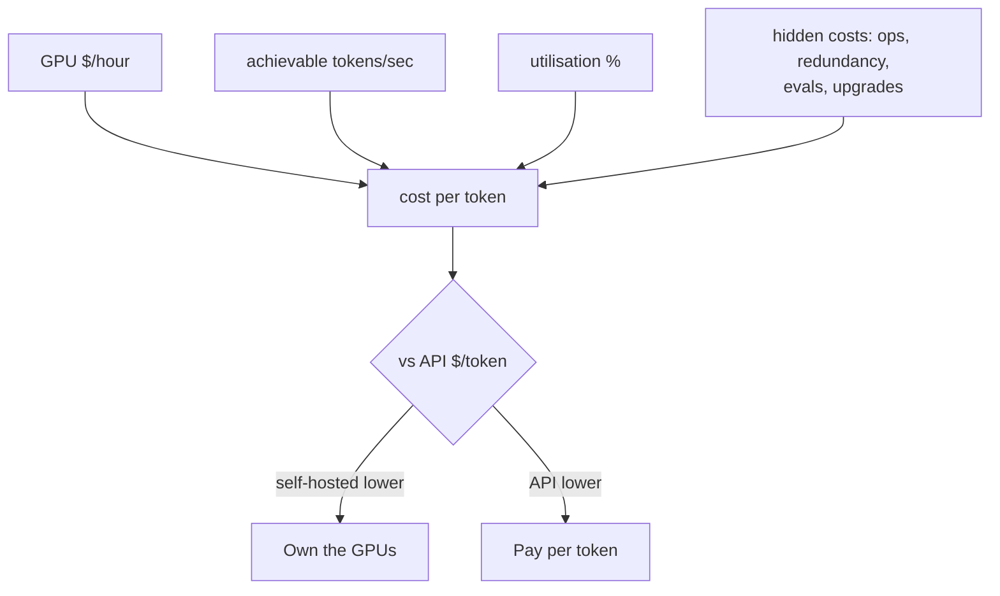

## Before you start

You need [llm-cost-and-latency](llm-cost-and-latency) for token accounting and the API-side levers — this topic assumes you have pulled those, and asks a different question. And [gpu-autoscaling-and-cold-starts](gpu-autoscaling-and-cold-starts), because the utilisation number that decides everything here is set by how well you can keep GPUs busy.

> All prices and rates below are **illustrative, as of September 2026 — verify current figures**. The point is the method; the method survives price changes that the numbers will not.

## In one sentence

Self-hosting a model means renting a GPU by the **hour** and keeping it busy, while an API means paying by the **token** — so the decision is not ideology but arithmetic about how full your GPU actually is.

## Why it matters

Teams make this call badly in both directions and the error is expensive. One team self-hosts to "save money", runs a GPU at 8% utilisation, and pays several times the API price while also owning an on-call rotation. Another stays on an API through a volume they could serve for a fifth of the cost.

In an interview this is a favourite because it is unbluffable. "It depends" is worthless, and a confident single number is worse — it shows you did not notice which variable dominates.

## The intuition

Compare owning a delivery van against paying a courier per parcel.

The courier charges per parcel. Send three parcels a month, you pay for three. The van costs the same whether it makes ninety deliveries a day or sits on the drive. So the van is cheaper per parcel only above some volume, and the volume that gets you there depends on how full each trip is, not on the van's sticker price.

Two things follow, and they are the whole topic. **A half-empty van is not half price** — it is full price for half the value, so the per-parcel cost doubles. And the van comes with jobs the courier did for free: servicing, insurance, someone to drive it, and a second van for the day the first one breaks. Those frequently exceed the finance payment.

## How it actually works

**A GPU is billed by time; an API is billed by tokens.** Converting one to the other is the whole calculation:

```
cost per token = GPU hourly cost / (achievable tokens per second x 3600)
```

At full tilt, a GPU at $2.20/hour producing 2,500 tokens/second generates 9 million tokens an hour, or about $0.24 per million. Against an API at $0.50 per million that looks like a rout.

It is not, because **you rarely run at full tilt.** Real traffic has nights, weekends, and a peak-to-average ratio of two or three ([capacity-planning](capacity-planning) has the arithmetic), so provisioning for peak makes average utilisation low by construction. The divisor is *utilised* throughput:

```
cost per token = GPU hourly cost / (tokens per second x 3600 x utilisation)
```

Utilisation sits alone in the denominator, so it scales the answer linearly and without mercy. **The same GPU at 10% utilisation costs 10x per token.** Nothing else has that leverage: halving the hourly rate halves the cost, but going from 50% to 5% utilisation multiplies it by ten.



Note where `H` points. Hidden costs enter the *same* numerator as the GPU rate, so they raise the break-even utilisation exactly as a more expensive GPU would.

**The achievable throughput term is where most estimates go wrong.** Nobody serves at a benchmark number. Real throughput depends on batch size, sequence lengths, quantisation, and how much VRAM the KV cache gets after weights — [gpu-memory-math](gpu-memory-math) and [continuous-batching-and-throughput](continuous-batching-and-throughput) applied — so measure it on your own traffic shape. A vendor blog's figure, taken with long batches of short prompts, can be several times what your workload achieves.

**The hidden costs interviewers probe for**, roughly in order of how often they are omitted:

**Engineer time** is the largest line item at small scale and the one nobody puts in the spreadsheet — at a loaded rate, one engineer spending a quarter of their week on serving infrastructure costs more per month than several GPUs. **On-call**: someone answers at 3 a.m. when a driver wedges or a node dies. **Redundancy**: one GPU is not a production deployment, because every restart, node upgrade, and hardware fault is then an outage — realistic sizing is at least two, doubling fixed cost before serving a single extra token. **Evaluation infrastructure**: with an API you inherit the vendor's testing; self-hosted, you own the eval suite proving your deployment is not silently worse. **Model upgrades**: an API vendor ships an improved model and you get it; self-hosted, every upgrade is a re-benchmark, re-evaluate, re-deploy project.

**The reasons that override cost entirely**, in both directions — raise them before being asked. Towards self-hosting: data residency or regulation forbidding a third party; a contractual no-third-party-processors requirement; predictable latency without a shared multi-tenant queue; a fine-tuned model, or one no vendor hosts ([fine-tuning-and-lora](fine-tuning-and-lora)). Towards the API: bursty or low volume, where you pay for idle GPUs; a small team with no infrastructure capacity; fast-moving model requirements where you want the next model for free; and frontier capability, which you cannot self-host at all.

## Worked example

The calculator. Feed it your own four numbers:

```js
// Illustrative rates, September 2026 — verify current figures before deciding.
function selfHostedCostPerMillion({ gpuHourly, tokensPerSecond, utilisation, replicas = 1, opsHoursPerMonth = 0, engineerHourly = 0 }) {
  const gpuMonthly = gpuHourly * 730 * replicas;
  const opsMonthly = opsHoursPerMonth * engineerHourly;
  // Only the utilised fraction of the hour produces tokens; you pay for all of it.
  const tokensPerMonth = tokensPerSecond * 3600 * 730 * utilisation * replicas;
  const perMillion = ((gpuMonthly + opsMonthly) / tokensPerMonth) * 1e6;
  return { gpuMonthly, opsMonthly, tokensPerMonth, perMillion };
}

function breakEvenUtilisation({ gpuHourly, tokensPerSecond, apiPerMillion, replicas = 1, opsHoursPerMonth = 0, engineerHourly = 0 }) {
  const monthlyFixed = gpuHourly * 730 * replicas + opsHoursPerMonth * engineerHourly;
  const tokensAtFull = tokensPerSecond * 3600 * 730 * replicas;
  // Solve monthlyFixed / (tokensAtFull * u) * 1e6 = apiPerMillion
  return (monthlyFixed * 1e6) / (tokensAtFull * apiPerMillion);
}

const gpuHourly = 2.20;        // one inference-class GPU, on-demand
const tokensPerSecond = 2500;  // measured aggregate throughput, continuous batching
const apiPerMillion = 0.50;    // comparable hosted small model, blended in+out

console.log('utilisation   self-hosted $/M tokens   API $/M tokens   winner');
for (const u of [0.05, 0.10, 0.25, 0.50, 0.80]) {
  const { perMillion } = selfHostedCostPerMillion({ gpuHourly, tokensPerSecond, utilisation: u });
  const winner = perMillion < apiPerMillion ? 'self-hosted' : 'API';
  console.log(
    `${(u * 100).toFixed(0).padStart(9)}%   ${('$' + perMillion.toFixed(3)).padStart(20)}   ${('$' + apiPerMillion.toFixed(3)).padStart(14)}   ${winner}`
  );
}

const bareBreakEven = breakEvenUtilisation({ gpuHourly, tokensPerSecond, apiPerMillion });
console.log(`\nbreak-even utilisation, GPU cost only: ${(bareBreakEven * 100).toFixed(1)}%`);

const honest = breakEvenUtilisation({
  gpuHourly, tokensPerSecond, apiPerMillion,
  replicas: 2,                 // one GPU is not a production deployment
  opsHoursPerMonth: 20,        // on-call, upgrades, eval runs
  engineerHourly: 90,
});
console.log(`break-even with 2 replicas + 20 ops hours:  ${(honest * 100).toFixed(1)}%`);
```

Output:

```
utilisation   self-hosted $/M tokens   API $/M tokens   winner
        5%                 $4.889           $0.500   API
       10%                 $2.444           $0.500   API
       25%                 $0.978           $0.500   API
       50%                 $0.489           $0.500   self-hosted
       80%                 $0.306           $0.500   self-hosted

break-even utilisation, GPU cost only: 48.9%
break-even with 2 replicas + 20 ops hours:  76.3%
```

Read the table before the verdict. The self-hosted column spans **sixteen times** — $4.889 down to $0.306 — from one variable, on identical hardware serving an identical model. Utilisation is not a modifier on this decision; it *is* the decision.

Then the two break-even figures. On GPU cost alone you need **48.9%** sustained utilisation. Add the second replica that makes it a production deployment, plus 20 monthly hours of ops at $90, and the requirement climbs to **76.3%**. Sustaining 76% average utilisation on traffic with nights and weekends is genuinely hard — it means aggressive batching, and probably backfilling idle hours with batch work. The honest reading is not "self-hosting wins above 49%"; it is that **the naive calculation understates the bar by more than half**, which is the gap most enthusiastic self-hosting proposals fall into.

## A second example — when it gets harder

Now change one number that most people never question, and watch it beat everything else.

Suppose your measured throughput is 900 tokens/second rather than 2,500 — entirely plausible with long prompts, a larger model, or a KV cache squeezed by weights. Rerun the break-even and it moves from 48.9% to about 136%: **impossible at any utilisation.** The hardware did not change and the price did not change. The workload shape changed, and self-hosting went from viable to arithmetically excluded.

That is the sensitivity ranking worth carrying into an interview. Achievable throughput and utilisation each move the answer by multiples; the GPU hourly rate moves it linearly, so a 45% cheaper instance improves your position by 45% — real, but it cannot rescue a workload off by 3x. The two questions that decide this are "what throughput do you actually get on your traffic?" and "how full can you keep it?", not "which cloud is cheapest".

Three complications change the shape rather than the number. **Fine-tuning and LoRA** shift things towards self-hosting: serving many adapters over one base model raises utilisation on hardware you already own, which is precisely the lever the whole model turns on. **Spot and reserved capacity** cut the hourly rate, but spot instances can be reclaimed mid-generation — fine for batch, dangerous for interactive — and reservations trade the discount for a commitment that makes your peak-provisioned idle permanent. **A hybrid** is often the honest answer: self-host the predictable, high-volume workload where you can keep GPUs busy, and route spikes and frontier-capability requests to an API. That keeps self-hosted utilisation high by construction, because the bursty traffic that would have created the idle never lands on your GPUs.

**How to present this** is a skill in its own right. Lead with the break-even as a *model*, not a verdict: "this is a utilisation question — at our measured throughput the break-even is around 50% before ops, and closer to 75% once I include a second replica and on-call time." State your assumptions out loud, so a disagreeing interviewer corrects an input rather than dismissing your reasoning — the discipline [capacity-planning](capacity-planning) teaches. Give a range, not a point. Then name what would flip it: a compliance requirement, a throughput measurement 2x off your estimate, or a need for frontier capability. A clear model plus its sensitivities beats a confident single number, because the number will be wrong and the model will not.

## Quick reference

| Dimension | Self-hosted | API |
|---|---|---|
| Cost shape | Fixed per hour; per-token cost falls with utilisation | Variable per token; scales exactly with usage |
| Cost at low volume | Terrible — you pay for idle | Excellent |
| Cost at high, steady volume | Strong — often several times cheaper | Higher but predictable |
| Latency | Controllable, no shared queue or rate limits | Subject to vendor queue and rate limits |
| Ops burden | On-call, upgrades, drivers, capacity, evals | Essentially none |
| Compliance / residency | Full control; sometimes the only legal option | Depends on vendor terms and region |
| Upgrade path | You re-benchmark, re-evaluate, re-deploy | Vendor upgrades; you re-test prompts |
| Model choice | Any open-weights model or fine-tune | Vendor's catalogue only |
| Frontier capability | Not available | Available |

| Variable | Effect on the answer |
|---|---|
| Utilisation | Linear and dominant — 10x worse utilisation is 10x the cost per token |
| Achievable tokens/sec | Linear and dominant; commonly mis-estimated by 2–3x |
| Replica count for HA | Multiplies fixed cost; 1 replica is not production |
| Ops hours x engineer rate | Often exceeds the GPU bill below a few GPUs |
| GPU hourly rate | Linear, and the least important of these |

## Tools & frameworks

| Tool | What it's for | Reach for it when |
|---|---|---|
| [LiteLLM](https://docs.litellm.ai/) | One API over both hosted and self-hosted models | You want to run the comparison without rewriting client code for each side |
| [OpenRouter](https://openrouter.ai/docs/quickstart) | Live per-token pricing across models | You need the API side of the arithmetic from real prices rather than a blog post |
| [RunPod](https://docs.runpod.io/overview) | GPU hourly pricing | You need the self-hosted side of the arithmetic, denominated in GPU-hours |
| [GuideLLM](https://github.com/vllm-project/guidellm) | Measure your achievable tokens per second | Your cost per token needs *your* throughput, not a vendor's benchmark |
| [Langfuse](https://langfuse.com/docs) | Actual token volume in production | The break-even depends on volume, and volume is measured rather than guessed |

There is no universal answer in this table: the break-even is throughput-dependent, so it is a calculation with two inputs you have to measure yourself.

## Common mistakes

- Comparing the GPU hourly rate to the API price without dividing by utilisation — the error behind every "10x cheaper" claim.
- Using a vendor benchmark throughput instead of a measurement on your own prompt and output lengths.
- Costing one GPU, then discovering that availability requires two and the break-even moved.
- Leaving engineer time out entirely — usually the largest line item below a few GPUs.
- Forgetting that an API vendor's model upgrades are free to you and self-hosted upgrades are a project each time.
- Treating it as an identity question ("we're an infra team, we self-host") rather than a utilisation measurement.
- Quoting a confident single break-even without stating the assumptions or the range it is sensitive to.
- Comparing a small open model against frontier API pricing, so the quality difference silently disappears.

## What interviewers ask

- **Is it cheaper to self-host or use an API?** — It is a utilisation question: divide GPU hourly cost by achievable tokens per second times 3600 times utilisation, compare to the API's per-token price, and note that the break-even is driven far more by utilisation and measured throughput than by the hourly rate.
- **Walk me through the break-even calculation.** — A $2.20/hour GPU at 2,500 tokens/second produces 9M tokens/hour, about $0.24 per million; against a $0.50 API that needs roughly 49% sustained utilisation, rising to about 76% once you add a second replica for availability and 20 monthly ops hours.
- **What costs do people forget?** — Engineer and on-call time, redundancy (one GPU is not a deployment), evaluation infrastructure, the re-test cost of every model upgrade, and idle capacity from provisioning for peak.
- **When would you self-host despite it being more expensive?** — When data residency, regulation, or a no-third-party-processors requirement makes an API impossible, when you need a fine-tuned or unhosted model, or when you need latency free of a vendor's shared queue and rate limits.
- **When would you use an API despite high volume?** — Bursty traffic that would leave GPUs idle, a team with no capacity to run infrastructure, fast-moving model requirements where free vendor upgrades matter, or a need for frontier capability you cannot self-host.
- **How does utilisation change the answer?** — It is a linear divisor, so the identical GPU at 10% costs ten times per token what it does at 100% — the highest-leverage variable in the model, and the reason the decision is about keeping hardware busy rather than buying it cheaply.

## Practice

1. Run the calculator with a real current GPU price from a provider's pricing page and a real current API price. Report the break-even utilisation and say honestly whether your traffic could sustain it.
2. Extend the calculator to derive utilisation from a peak-to-average ratio (peak-provisioned capacity divided by average demand). Find the ratio at which self-hosting stops winning, and explain why that ratio — not the GPU price — is the number to argue over.
3. Write the two-minute spoken answer to "should we self-host?" for a service doing 50 million tokens a day at a 3:1 peak-to-average ratio, with a requirement that data stay in one region. Lead with the model, state assumptions, give a range, and name what would flip it.

## Where to go next

[quantization-explained](quantization-explained) is the most direct lever on the break-even — smaller weights leave more VRAM for the KV cache, raising achievable throughput and lowering cost per token on hardware you already have. [multi-gpu-and-model-parallelism](multi-gpu-and-model-parallelism) covers what happens when the model no longer fits on one card and the fixed cost multiplies.
