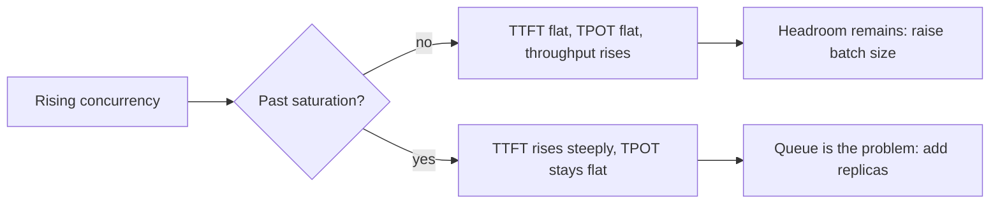

## Before you start

[continuous-batching-and-throughput](continuous-batching-and-throughput) — you need to know that throughput and per-request latency pull against each other, and that prefill and decode behave differently. This topic is how to measure both without fooling yourself.

## In one sentence

Measuring an LLM endpoint means separating **time to first token** from **time per output token**, reporting both as percentiles under a stated concurrency, and finding the load at which the queue starts to form.

## Why it matters

A single latency number is worse than useless for a streaming endpoint — it is actively misleading, and it misleads in a way that hides real regressions.

Consider two systems that both average 8 seconds end to end. The first waits 7.5 seconds in silence, then dumps the whole answer. The second shows a word after 300ms and streams steadily for 8 seconds. Identical on your dashboard. One feels broken and the other feels fast.

The same number also cannot tell you whether a change helped. Ship an optimisation, average latency rises 20%, and you cannot tell whether the system got slower or users simply asked questions with longer answers that week. Without splitting the metric, you are measuring your traffic as much as your service.

## The intuition

Think of ordering at a busy kitchen. Two waits, and they have different causes.

**Time to first token (TTFT)** is how long until the first plate lands. It covers standing in line (queueing) and the kitchen reading and prepping your whole order (prefill). If TTFT is bad, either the queue is long or your order was enormous.

**Time per output token (TPOT)** — also called **inter-token latency (ITL)** — is the gap between each subsequent plate. Once the kitchen is cooking your order, this is set by how much other work shares the stoves. If TPOT is bad, the kitchen is serving too many tables at once.

The total is the identity you should be able to write from memory:

```
end-to-end = TTFT + TPOT x (output_tokens - 1)
```

Two systems with equal end-to-end latency can feel entirely different because that total can be reached in completely different ways: a huge TTFT with fast tokens, or an instant first token with a slow crawl. The identity is why you must report the parts, not the sum.

## How it actually works

**TTFT is dominated by queueing and prefill.** Prefill scales with prompt length, so a 4,000-token prompt has a much worse TTFT than a 100-token one on an idle server. Under load, queue wait dominates instead. TTFT is the metric that responds to load.

**TPOT is dominated by memory bandwidth and batch size.** Each decode step reads the full weight set, and adding sequences to the batch makes the step longer. On an unsaturated server TPOT is remarkably stable, which is precisely what makes it a useful diagnostic.

### Per-stream versus aggregate tokens/sec

These are different metrics that move in **opposite directions** as batch size grows, and conflating them is the most common benchmarking error.

- **Per-stream tokens/sec** = `1000 / TPOT`. What one user experiences. Falls as the batch grows.
- **Aggregate tokens/sec** = total tokens produced ÷ wall-clock time, across all streams. What the server produces. Rises as the batch grows.

A vendor claiming "3,000 tokens/sec" is quoting aggregate at high concurrency. A user seeing 12 tokens/sec on the same system is quoting per-stream. Both are correct. Any tokens/sec figure without a stated concurrency and which-kind label is unusable.

### Why average latency lies here specifically

Every service has the usual reason to distrust averages: outliers hide in them. Streaming LLM endpoints have a second, sharper reason.

**Output length varies enormously per request** — 20 tokens for "what's the capital of Peru", 800 for "explain this codebase". Since end-to-end latency is roughly proportional to output length, averaging it across a mixed workload measures your **prompt distribution** as much as your system. A week where users asked longer questions shows as a latency regression that no code caused.

Two fixes, and you want both:

1. **Normalise per token.** Report TPOT (ms per output token), which is independent of how long the answer happened to be.
2. **Report percentiles at a stated concurrency.** p50, p95, p99 for TTFT and TPOT separately, always annotated with the concurrency they were measured at. A latency number without a concurrency is meaningless, because latency *is* a function of load.

### How to actually load-test an endpoint

**Use a realistic prompt distribution.** Hammering one fixed prompt is the classic mistake: prefix caching serves every request after the first from cached KV blocks, and your TTFT looks superb in a way production will never reproduce. Sample real prompt lengths, or at minimum rotate several genuinely different prompts.

**Ramp concurrency; do not pick one point.** Run at 1, 2, 4, 8, 16, 32 concurrent streams and plot the curve. A single measurement tells you nothing about where the cliff is.

**Find saturation, not a number.** Saturation is where aggregate throughput stops rising with added concurrency. Below it, extra load is absorbed. Above it, requests only queue. That point is your capacity, and it is what you scale on.

**Discard warmup.** The first requests pay kernel compilation. Always throw them away, as covered in [deploying-a-model-end-to-end](deploying-a-model-end-to-end).

### The queueing signature

Past saturation, a distinctive pattern appears, and it is the most useful diagnostic in this topic:



**TTFT climbs steeply while TPOT stays flat.** That combination is diagnostic. Flat TPOT means the GPU is decoding at full speed for whoever is in the batch, so the model and the hardware are fine. Rising TTFT means requests are waiting to get *into* the batch. The problem is admission, not execution — so more replicas will help and a faster GPU largely will not.

The opposite signature — TPOT rising while TTFT stays flat — means the batch itself is too large: everyone is in the batch and everyone is being slowed by everyone else. That is fixed by *lowering* the batch size, which is counterintuitive until you have seen the two signatures side by side.

## Worked example

A benchmark harness that streams from any OpenAI-compatible endpoint. It computes TTFT, TPOT, and percentiles, and works unmodified against a local Ollama, a vLLM server, or a hosted API — which is the whole point of that standard.

To run it against a local Ollama: install Ollama, `ollama pull llama3.2`, then `BASE=http://localhost:11434/v1 MODEL=llama3.2 node bench.js`.

```js
// Benchmark harness for ANY OpenAI-compatible endpoint.
// Local Ollama:  BASE=http://localhost:11434/v1 MODEL=llama3.2 node bench.js
// vLLM:          BASE=http://localhost:8000/v1  MODEL=my-assistant node bench.js
const BASE = process.env.BASE || 'http://localhost:11434/v1';
const MODEL = process.env.MODEL || 'llama3.2';
const KEY = process.env.API_KEY || 'not-needed';
const CONCURRENCY = Number(process.env.CONCURRENCY || 4);

// Varied prompts: a single fixed prompt lets prefix caching flatter your numbers.
const PROMPTS = [
  'Name three uses for a paperclip.',
  'Explain a hash table in two sentences.',
  'Write a haiku about slow disks.',
  'List four causes of high tail latency in web services.',
  'What is the capital of Peru? Answer in one word.',
];

async function oneRequest(prompt) {
  const t0 = performance.now();
  let ttft = null, tokens = 0;

  const res = await fetch(`${BASE}/chat/completions`, {
    method: 'POST',
    headers: { 'Content-Type': 'application/json', Authorization: `Bearer ${KEY}` },
    body: JSON.stringify({ model: MODEL, messages: [{ role: 'user', content: prompt }],
                           max_tokens: 120, stream: true }),
  });
  if (!res.ok) throw new Error(`HTTP ${res.status}: ${await res.text()}`);

  // Parse Server-Sent Events, counting each content delta as one token.
  const reader = res.body.getReader();
  const decoder = new TextDecoder();
  let buf = '';
  for (;;) {
    const { done, value } = await reader.read();
    if (done) break;
    buf += decoder.decode(value, { stream: true });
    const lines = buf.split('\n');
    buf = lines.pop();
    for (const line of lines) {
      if (!line.startsWith('data: ')) continue;
      const payload = line.slice(6).trim();
      if (payload === '[DONE]') continue;
      let delta;
      try { delta = JSON.parse(payload).choices?.[0]?.delta?.content; } catch { continue; }
      if (!delta) continue;
      if (ttft === null) ttft = performance.now() - t0;   // FIRST token only
      tokens++;
    }
  }
  const e2e = performance.now() - t0;
  // TPOT excludes the prefill+queue time captured by TTFT.
  const tpot = tokens > 1 ? (e2e - ttft) / (tokens - 1) : null;
  return { ttft, tpot, e2e, tokens };
}

const pct = (xs, p) => {
  const s = [...xs].sort((a, b) => a - b);
  return s[Math.min(s.length - 1, Math.floor(p / 100 * s.length))];
};
const f = (n) => n === null ? '  n/a' : n.toFixed(0).padStart(5);

async function run() {
  console.log(`warming up ${BASE} (${MODEL})...`);
  await oneRequest('hi').catch(e => { console.error('warmup failed:', e.message); process.exit(1); });

  const jobs = [];
  for (let i = 0; i < CONCURRENCY * 3; i++) jobs.push(PROMPTS[i % PROMPTS.length]);

  const results = [];
  const wall0 = performance.now();
  let next = 0;
  // A fixed pool of CONCURRENCY workers keeps offered load constant.
  await Promise.all(Array.from({ length: CONCURRENCY }, async () => {
    while (next < jobs.length) {
      const p = jobs[next++];
      try { results.push(await oneRequest(p)); } catch (e) { console.error('req failed:', e.message); }
    }
  }));
  const wall = (performance.now() - wall0) / 1000;

  const ttfts = results.map(r => r.ttft).filter(Number.isFinite);
  const tpots = results.map(r => r.tpot).filter(Number.isFinite);
  const e2es = results.map(r => r.e2e);
  const totalTokens = results.reduce((a, r) => a + r.tokens, 0);

  console.log(`\nconcurrency ${CONCURRENCY}, ${results.length} requests, ${wall.toFixed(1)}s wall\n`);
  console.log('metric            p50    p95    p99');
  console.log(`TTFT (ms)      ${f(pct(ttfts, 50))} ${f(pct(ttfts, 95))} ${f(pct(ttfts, 99))}`);
  console.log(`TPOT (ms/tok)  ${f(pct(tpots, 50))} ${f(pct(tpots, 95))} ${f(pct(tpots, 99))}`);
  console.log(`end-to-end (ms)${f(pct(e2es, 50))} ${f(pct(e2es, 95))} ${f(pct(e2es, 99))}`);
  console.log(`\nper-stream  ${(1000 / pct(tpots, 50)).toFixed(1)} tok/s   (what one user sees)`);
  console.log(`aggregate   ${(totalTokens / wall).toFixed(1)} tok/s   (what the server produces)`);
  // Verify the identity: e2e should be ~ TTFT + TPOT x (tokens-1)
  const r = results.find(x => Number.isFinite(x.tpot));
  console.log(`\nidentity check on one request: TTFT ${r.ttft.toFixed(0)} + ${r.tpot.toFixed(1)} x ${r.tokens - 1}` +
              ` = ${(r.ttft + r.tpot * (r.tokens - 1)).toFixed(0)}ms vs measured ${r.e2e.toFixed(0)}ms`);
}

run();
```

Run against an endpoint with roughly 120ms of prefill and 20ms per token, at concurrency 3 (exact milliseconds vary run to run — this is a timing measurement):

```
warming up http://localhost:8123/v1 (stub)...

concurrency 3, 9 requests, 2.9s wall

metric            p50    p95    p99
TTFT (ms)        127   141   141
TPOT (ms/tok)     22    22    22
end-to-end (ms)  962  1006  1006

per-stream  46.4 tok/s   (what one user sees)
aggregate   122.4 tok/s   (what the server produces)

identity check on one request: TTFT 137 + 22.0 x 39 = 997ms vs measured 997ms
```

Three things to notice.

The **identity holds exactly** — 997ms predicted, 997ms measured. That is not a coincidence; it is the definition, and it means TTFT and TPOT together fully describe the latency. If you know both, you can predict the end-to-end latency of any output length.

**TPOT is far tighter than TTFT.** p50 and p99 are both 22ms, while TTFT spreads 127 to 141. TPOT is a steady-state property of the hardware and batch; TTFT absorbs queueing variance. That is why TPOT's stability makes it a good diagnostic.

**Per-stream is 46 tok/s while aggregate is 122 tok/s** — a 2.6x gap at concurrency 3. Neither is wrong. Report the wrong one and you are off by that factor.

## A second example — when it gets harder

Now the failure mode. Two systems with *identical* per-token performance, differing only in the questions users happen to ask.

```js
// Two systems, IDENTICAL per-token speed. Only the prompt mix differs.
const systems = {
  'A (short answers)': { ttft: 250, tpot: 25, outputs: [40, 50, 45, 60, 55] },
  'B (long answers)':  { ttft: 250, tpot: 25, outputs: [400, 700, 550, 900, 650] },
};

for (const [name, s] of Object.entries(systems)) {
  const e2e = s.outputs.map(n => s.ttft + s.tpot * n);
  const avg = e2e.reduce((a, b) => a + b, 0) / e2e.length;
  const avgTokens = s.outputs.reduce((a, b) => a + b, 0) / s.outputs.length;
  console.log(`${name.padEnd(19)} avg e2e ${avg.toFixed(0).padStart(6)}ms` +
              ` | avg output ${avgTokens.toFixed(0).padStart(4)} tok` +
              ` | normalised ${(avg / avgTokens).toFixed(1)} ms/tok`);
}

console.log('\nNow a REAL regression: system A, but TPOT doubles to 50ms.');
const slow = { ttft: 250, tpot: 50, outputs: [40, 50, 45, 60, 55] };
const e2e = slow.outputs.map(n => slow.ttft + slow.tpot * n);
const avg = e2e.reduce((a, b) => a + b, 0) / e2e.length;
const avgTokens = slow.outputs.reduce((a, b) => a + b, 0) / slow.outputs.length;
console.log(`A degraded          avg e2e ${avg.toFixed(0).padStart(6)}ms` +
            ` | avg output ${avgTokens.toFixed(0).padStart(4)} tok` +
            ` | normalised ${(avg / avgTokens).toFixed(1)} ms/tok`);
```

Output:

```
A (short answers)   avg e2e   1500ms | avg output   50 tok | normalised 30.0 ms/tok
B (long answers)    avg e2e  16250ms | avg output  640 tok | normalised 25.4 ms/tok

Now a REAL regression: system A, but TPOT doubles to 50ms.
A degraded          avg e2e   2750ms | avg output   50 tok | normalised 55.0 ms/tok
```

Read that carefully, because it contains two errors that average latency would cause you to make.

**First, a false alarm.** System B's average end-to-end latency is 16,250ms against A's 1,500ms — nearly 11x worse. On the normalised metric B is *better*: 25.4 ms/token against 30.0. B is not slower at all; its users asked longer questions. Chase this and you will spend a week optimising a system that was never slow.

**Second, a missed regression.** System A with genuinely doubled TPOT — a serious, user-visible degradation — shows as average latency rising from 1,500ms to 2,750ms, a factor of 1.8. Sitting inside normal week-to-week variation in prompt mix, it is easy to dismiss. The normalised metric shows it plainly: 30.0 to 55.0 ms/token, unambiguously a doubling.

Notice why the factor is 1.8 and not 2. The fixed 250ms TTFT does not scale with output length, so it dilutes the ratio — and it dilutes it *most* for short outputs, exactly where a TPOT regression is hardest to spot. Report TTFT and TPOT separately and neither error is possible.

## Quick reference

| Metric | What it measures | What dominates it | How to improve it |
|---|---|---|---|
| TTFT | wait until first token appears | queue depth, then prompt length (prefill) | more replicas, prefix caching, shorter prompts, chunked prefill |
| TPOT / ITL | gap between output tokens | memory bandwidth, batch size | smaller batch, quantisation, faster VRAM |
| End-to-end | `TTFT + TPOT x (tokens-1)` | output length, above all | cap `max_tokens`, ask for shorter answers |
| Per-stream tok/s | `1000 / TPOT` | batch size | lower the batch — costs throughput |
| Aggregate tok/s | server total ÷ wall time | batch size, VRAM | raise the batch — costs per-stream speed |
| Saturation point | where throughput stops rising | KV-cache ceiling | add replicas, cut `--max-model-len` |

| Signature | Meaning | Action |
|---|---|---|
| TTFT up, TPOT flat | queue forming; GPU decoding fine | add replicas |
| TPOT up, TTFT flat | batch too large | lower the batch size |
| Both up | over capacity and over-batched | add replicas and lower the batch |
| Both flat, throughput flat | bottleneck is not the GPU | check client, network, tokenizer |

## Common mistakes

- Reporting one end-to-end latency number for a streaming endpoint, hiding whether the wait is before the first token or between tokens.
- Averaging end-to-end latency across variable output lengths, which measures your prompt mix more than your system.
- Quoting tokens/sec without saying per-stream or aggregate, and without a concurrency — the two move in opposite directions.
- Benchmarking with one fixed prompt, so prefix caching produces a TTFT you will never see in production.
- Measuring at a single concurrency and calling it capacity, instead of ramping to find saturation.
- Including warmup requests, so kernel compilation lands in your p99.
- Comparing your own p50 against a vendor's p50 without matching prompt lengths, output lengths, and concurrency.
- Counting SSE chunks as tokens without checking they map one-to-one — a server that batches deltas inflates your TPOT.

## What interviewers ask

- **What is TTFT and what drives it?** — Time to first token: how long before anything appears. Queue wait dominates under load and prompt-length-driven prefill dominates on an idle server, so it is the metric that responds to traffic.
- **How do TTFT and TPOT combine?** — `end-to-end = TTFT + TPOT x (output_tokens - 1)`. Two systems can hit the same total via a slow start with fast tokens or an instant start with a slow crawl, which feel completely different, so you must report both parts.
- **Why is average latency especially misleading for LLMs?** — End-to-end latency is roughly proportional to output length, which varies hugely per request, so averaging it measures your prompt distribution as much as your system. Normalise per token and report percentiles at a stated concurrency.
- **TTFT rose sharply but TPOT is unchanged. What is happening?** — You are past saturation and a queue has formed. Flat TPOT proves the GPU decodes at full speed for whoever is in the batch, so the problem is admission, not execution: add replicas rather than a faster GPU.
- **A vendor advertises 3,000 tokens/sec but users see 15. Who is lying?** — Neither. The vendor quotes aggregate throughput across many concurrent streams; the user experiences per-stream speed, which falls as batch size rises. The figures are compatible and both need a concurrency label.
- **How would you load-test a model endpoint?** — Discard warmup, use a realistic distribution of prompt and output lengths rather than one fixed prompt, ramp concurrency through several levels, and report TTFT and TPOT percentiles at each, looking for the concurrency where aggregate throughput stops rising.

## Practice

1. Run the harness against a local Ollama at concurrency 1, then 4, then 16. Plot TTFT p95 and TPOT p50 against concurrency and identify the saturation point.
2. Modify it to send one fixed prompt instead of rotating five, and compare TTFT. Quantify how much prefix caching flattered the fixed-prompt run, and explain why that number would not survive production.
3. Add a prompt-length sweep — 100, 1,000, and 4,000 input tokens at fixed output length. Show that TTFT scales with input length while TPOT does not, then explain which of the two a user would notice first and why.

## Where to go next

[gpu-autoscaling-and-cold-starts](gpu-autoscaling-and-cold-starts) — you can now find your saturation point, which is exactly the signal an autoscaler needs. That topic covers scaling on queue depth rather than CPU, and why GPU cold starts make the decision harder than for a stateless web service.
