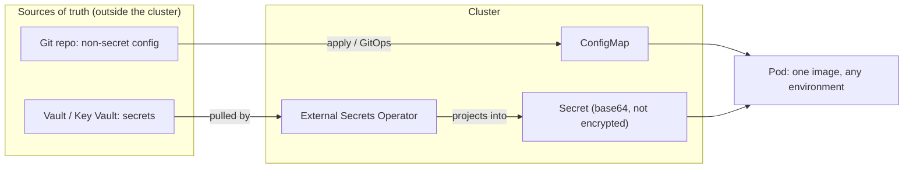
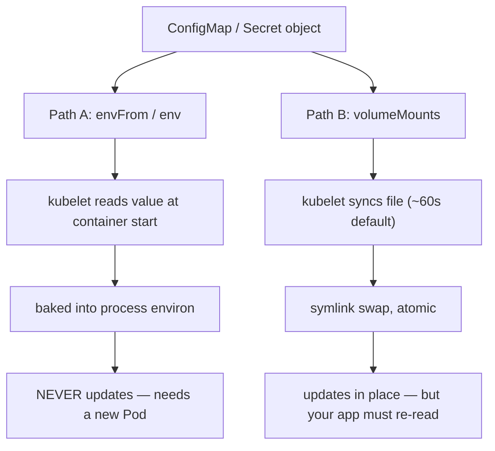

## Before you start

You need [kubernetes-basics](kubernetes-basics) for Pods and Deployments. [secrets-management](secrets-management) covers *why* secrets belong in a vault and never in git — this topic covers how they reach a container, so read that one for the principles and this one for the plumbing.

## In one sentence

A **ConfigMap** and a **Secret** are Kubernetes objects that hold configuration as key–value pairs outside your container image, so one image can run in dev, staging and production with nothing but the values changing.

## Why it matters

Bake a database URL into your image and you have created two images that are not really the same software. The one you tested in staging is not the one in production, so every test result is a claim about a different artefact and promoting a build stops meaning anything.

The fix is a rule worth memorising: **the image is the code, the ConfigMap is the environment.** Build once, ship the same digest everywhere, let the cluster supply the differences — [container-images-and-oci](container-images-and-oci) explains why that digest identity is what makes a promotion trustworthy.

Then there is the security half, where interviews get sharp. Teams reach for a Secret, see the base64 blob, and conclude the data is protected. It is not, and knowing exactly what a Secret does and does not do reliably separates someone who has run Kubernetes from someone who has read about it.

## The intuition

Think of your image as an appliance and your config as the plug. The appliance is manufactured once, identically, and sealed; what varies by country is the plug and the voltage, supplied at installation rather than welded in at the factory. Nobody manufactures a separate toaster per country.

A **ConfigMap** is that voltage label: not secret, just environment-specific. A **Secret** is the same mechanism with a different intent — Kubernetes handles it slightly more carefully and RBAC on it is usually tighter — but structurally it is a bag of key–value pairs exactly like a ConfigMap.

Here is the part to be honest about: a Secret is **base64-encoded, not encrypted**. Base64 is a transport format, not a protection — `base64 -d` recovers it instantly, no key required. The official docs say it plainly: "Kubernetes Secrets are, by default, stored unencrypted in the API server's underlying data store (etcd). Anyone with API access can retrieve or modify a Secret, and so can anyone with access to etcd."

So a Secret buys two real things: a separate RBAC surface you can lock down independently, and a hook where actual encryption can be enabled. It does not, by itself, encrypt anything.



## How it actually works

### The two injection paths, and why they behave differently

This is the single most useful thing in the topic. Config reaches a container two ways, and they have **opposite update semantics**.



**Path A — environment variables.** The kubelet reads the values once, at container start, and passes them into the process environment. A process's environment is fixed at exec time on Unix, so when you edit the ConfigMap, running Pods **never** see the new value. Not slowly — never. Only a new Pod picks it up.

**Path B — mounted volumes.** The kubelet projects the keys as files and keeps syncing them, roughly every minute by default (`--sync-frequency` plus cache TTL, so budget a minute or two). The update is atomic: the kubelet writes a new hidden directory and swings a symlink, so a reader never sees a half-written file.

But "the file updated" is not "your app reconfigured". Most applications read config once at startup and cache it, so a mounted ConfigMap gives you the *ability* to reload live — your app still has to watch the file or accept a SIGHUP.

That gives the classic support ticket — *"I updated the ConfigMap and nothing changed"* — two completely different diagnoses. **Used env vars?** Working as designed; restart the Pods. **Used a volume?** Either you checked before the sync landed, or your app never re-reads the file.

One more asymmetry: `subPath` mounts do **not** get updates. Mounting a single file with `subPath` freezes it at Pod start, exactly like an env var — which surprises people who chose a volume specifically for live updates.

### Triggering a rollout on config change

Kubernetes deliberately does not restart Pods when a ConfigMap changes — it has no idea whether your app can cope. So when you *want* a change to roll out, make it visible to the Deployment: put a **checksum of the config into the Pod template annotations**.

```yaml
spec:
  template:
    metadata:
      annotations:
        # changes whenever the ConfigMap changes -> new pod template -> rolling update
        checksum/config: "8f14e45fceea167a5a36dedd4bea2543"
```

Changing an annotation changes the Pod template hash, which means a new ReplicaSet and a normal rolling update with all its safety. Helm generates this with `{{ include (print $.Template.BasePath "/configmap.yaml") . | sha256sum }}` — see [helm-and-templating](helm-and-templating). The alternative is **immutable** ConfigMaps: set `immutable: true`, never edit in place, create `app-config-v2` and change the reference.

Immutability also helps at scale. The kubelet normally **watches** every ConfigMap and Secret a Pod mounts, so the apiserver holds an open watch per Pod per object. An immutable object can never change, so the kubelet stops watching it — removing a meaningful chunk of apiserver load on large clusters.

### External secret operators

Neither object is a good source of truth for credentials. Non-secret config can live in git; secrets cannot, because git history is permanent (see [secrets-management](secrets-management)).

The mature pattern inverts ownership: the **vault** is the source of truth, and the cluster Secret is a **projection** of it, recreated by a controller. With the External Secrets Operator you write two objects — a `SecretStore` saying *how to reach the vault* and an `ExternalSecret` saying *what to fetch and what Secret to write* — and the operator reconciles the Kubernetes Secret to match. Rotate in the vault and the cluster follows without a commit.

Two operational realities worth carrying into an interview. **Syncs tend to be all-or-nothing per store**: an `ExternalSecret` listing twelve keys typically fails as a unit if one is missing or misnamed, so the target Secret is not written at all and every Pod mounting it stays stuck at start-up. A single typo fails wider than you expect. And **the operator needs its own credential**, which is a chicken-and-egg problem — a static vault token in the cluster reintroduces the secret you were removing. The good answer skips the credential entirely: let the platform attest what the Pod is and exchange that for vault access, the ServiceAccount-token federation described in [workload-identity-and-spiffe](workload-identity-and-spiffe).

The **Secrets Store CSI Driver** is the sibling approach: mount vault values as files at Pod start without creating a Kubernetes Secret at all. Stronger, since the value never lands in etcd, at the cost of not working with anything that expects a Secret.

Since base64 is not protection, three things do the real work: **encryption at rest** on etcd (an `EncryptionConfiguration` on the apiserver, ideally KMS-backed so the key is not beside the data), **RBAC** on `secrets`, and **not mounting what you do not need** — a Secret a Pod never mounts is one a compromised Pod cannot read.

## Worked example

A ConfigMap and a Pod that consumes it **both** ways, so you can watch the difference:

```yaml
apiVersion: v1
kind: ConfigMap
metadata:
  name: app-config
data:
  LOG_LEVEL: "info"
  feature.json: |
    { "newCheckout": false }
---
apiVersion: v1
kind: Pod
metadata:
  name: demo
spec:
  containers:
    - name: app
      image: busybox:1.36
      command: ["sh", "-c", "sleep 3600"]
      env:
        - name: LOG_LEVEL                 # PATH A: snapshot at start, never updates
          valueFrom:
            configMapKeyRef:
              name: app-config
              key: LOG_LEVEL
      volumeMounts:
        - name: cfg                       # PATH B: file, kubelet keeps it in sync
          mountPath: /etc/app
  volumes:
    - name: cfg
      configMap:
        name: app-config
```

Read both sources, then change the ConfigMap and read again:

```bash
kubectl apply -f demo.yaml

kubectl exec demo -- sh -c 'echo "env : $LOG_LEVEL"; echo "file: $(cat /etc/app/LOG_LEVEL)"'
# env : info
# file: info

# Change ONE value in the ConfigMap
kubectl patch configmap app-config --type merge -p '{"data":{"LOG_LEVEL":"debug"}}'

# ...wait past the kubelet sync interval (~60-90s), then read both again
kubectl exec demo -- sh -c 'echo "env : $LOG_LEVEL"; echo "file: $(cat /etc/app/LOG_LEVEL)"'
# env : info      <- UNCHANGED, and will never change for this Pod
# file: debug     <- updated in place
```

One ConfigMap, one Pod, one edit, two different answers. Now look at what the mount actually is:

```bash
kubectl exec demo -- ls -la /etc/app
# lrwxrwxrwx  LOG_LEVEL    -> ..data/LOG_LEVEL
# lrwxrwxrwx  feature.json -> ..data/feature.json
# lrwxrwxrwx  ..data       -> ..2026_09_09_10_14_22.83019
```

Every key is a symlink into a timestamped directory, and `..data` points at the current one. An update writes a whole new directory and re-points `..data` — that is how the swap stays atomic. It is also why `subPath` cannot update: it bind-mounts the resolved file, bypassing the symlink the swap relies on.

## A second example — when it gets harder

Now prove to yourself that a Secret is not encrypted. This is the interview question, and doing it once makes the answer permanent:

```bash
kubectl create secret generic db-creds --from-literal=password='hunter2'

kubectl get secret db-creds -o jsonpath='{.data.password}'
# aHVudGVyMg==

kubectl get secret db-creds -o jsonpath='{.data.password}' | base64 -d
# hunter2
```

No key, no cryptography, no credential beyond the RBAC that let you `get` the Secret. Base64 is there because the field is byte data that must survive JSON transport — that is the entire reason.

The load-bearing consequence: **`get secrets` in a namespace is equivalent to holding every credential in it.** A Role granting `["get","list"]` on `secrets` "for debugging" hands over the database password, the API keys and the TLS private keys — and `list` is worse than `get`, because it returns everything without needing to know a name.

Where it becomes a full compromise is the ServiceAccount token. A Pod with a mounted token and that Role gives anyone who achieves code execution in the container every credential in the namespace, from inside the network:

```bash
# from inside a compromised Pod
TOKEN=$(cat /var/run/secrets/kubernetes.io/serviceaccount/token)
curl -sk -H "Authorization: Bearer $TOKEN" \
  https://kubernetes.default.svc/api/v1/namespaces/default/secrets | grep -o '"name":"[^"]*"'
```

Three defences, in order of leverage. **Do not grant `get`/`list` on `secrets`** — it is almost never the right way to debug. **Set `automountServiceAccountToken: false`** on Pods that never call the API, which is most of them, so there is no token to steal. **Turn on encryption at rest**, noting it does nothing about the API path above — it protects a stolen etcd backup, a different threat, which is why RBAC is the primary control.

Hence the honest conclusion, and why external secret operators exist: a Kubernetes Secret is a reasonable *delivery* mechanism and a poor *storage* mechanism.

## Quick reference

| | Env var (`env` / `envFrom`) | Volume mount |
|---|---|---|
| When read | Once, at container start | Continuously, kubelet re-syncs |
| Sees a ConfigMap edit | **Never** | Yes, after ~60–90s |
| App must re-read? | Impossible — needs a new Pod | Yes, or the file updates unnoticed |
| Atomic update | n/a | Yes, via symlink swap |
| `subPath` caveat | n/a | **Breaks updates** — frozen at start |
| Visible in `docker inspect` / crash dumps | Yes | No |
| Good for | Simple scalars, 12-factor apps | TLS certs, large files, live reload |

| Concern | Mechanism | Reality check |
|---|---|---|
| Config outside the image | ConfigMap | One image per commit, values per environment |
| Sensitive values | Secret | base64 only — **not** encryption |
| Encryption at rest | `EncryptionConfiguration` on apiserver | Off by default; use a KMS key |
| Who can read a Secret | RBAC on `secrets` | `get`/`list` ≈ all credentials in the namespace |
| Vault as source of truth | External Secrets Operator | Sync is usually all-or-nothing per `ExternalSecret` |
| Never touches etcd | Secrets Store CSI Driver | Files only; no Secret object to steal |
| Roll out a config change | `checksum/config` annotation | Changes the Pod template, so a normal rolling update |
| Reduce apiserver load | `immutable: true` | Kubelet stops watching it; requires create-new-name workflow |

## Tools & frameworks

| Tool | What it's for | Reach for it when |
|---|---|---|
| [ConfigMap docs](https://kubernetes.io/docs/concepts/configuration/configmap/) | Semantics, mounting, immutability | You need to understand why an env-var ConfigMap change needs a restart but a mounted one does not |
| [Kustomize](https://kubectl.docs.kubernetes.io/references/kustomize/) | Overlays and `configMapGenerator` content hashes | You want a config change to trigger a rollout automatically instead of remembering to restart |
| [Helm](https://helm.sh/docs/) | Values-driven templating | One chart has to serve many environments and the differences are variables, not patches |
| [External Secrets Operator](https://external-secrets.io/latest/) | Pull secrets from an external store into the cluster | The value is a credential — config belongs in a ConfigMap, secrets do not |

The classic bug this tooling papers over: a mounted-volume ConfigMap updates in place while env vars do not, so half your config goes stale.

## Common mistakes

- Believing a Secret is encrypted. It is base64-encoded; encryption at rest is a separate opt-in that does not stop anyone with `get secrets`.
- Using env vars, editing the ConfigMap, and waiting for a change that can never arrive.
- Using a volume and concluding updates do not work, when the app simply never re-reads the file.
- Mounting with `subPath` to get one file, then wondering why that file alone stopped updating.
- Granting `get`/`list` on `secrets` for convenience, which hands over every credential in the namespace.
- Leaving `automountServiceAccountToken` on for Pods that never talk to the API, so a compromise gets a free cluster credential.
- Storing base64-encoded Secret YAML in git and calling it safe. It is plaintext with extra steps.
- Assuming a change is live because `kubectl get configmap` shows the new value — that is the object, not what the Pods hold.

## What interviewers ask

- **Is a Kubernetes Secret encrypted?** — No. It is base64-encoded, which is transport formatting, not protection, and by default it is stored unencrypted in etcd. Anyone with `get` on it reads the plaintext. Real protection is encryption at rest plus tight RBAC. This is a deliberate trap; the confident wrong answer is what they are listening for.
- **What is the difference between a ConfigMap and a Secret?** — Structurally almost nothing: both are key–value objects mounted the same two ways. The difference is intent and handling — Secrets get a separate RBAC surface and are the object encryption-at-rest applies to.
- **You changed a ConfigMap and nothing happened. Debug it.** — Ask which injection path. Env vars are snapshotted at container start and never update, so the Pods need replacing. Volumes update after the kubelet sync, so either you looked too early, the app caches config at startup, or it is a `subPath` mount, which never updates.
- **How do you make a config change trigger a rollout?** — Put a checksum of the config in the Pod template annotations, so the template hash changes and you get a normal rolling update. Immutable ConfigMaps with versioned names achieve the same by forcing a reference change.
- **Why use an external secrets operator?** — Because the vault should be the source of truth and the cluster Secret merely a projection. Rotation then happens in one audited place and no credential is ever committed. Worth adding: the sync is usually all-or-nothing per store, so one bad key blocks a whole set.
- **Why does `immutable: true` reduce apiserver load?** — The kubelet watches every mounted ConfigMap and Secret, so each Pod holds open watches. An immutable object can never change, so the kubelet stops watching it.
- **How would a compromised Pod escalate through Secrets?** — It reads its mounted ServiceAccount token and calls the API. If that ServiceAccount can `list secrets`, the attacker gets every credential in the namespace with no further exploitation.

## Practice

1. Reproduce the worked example. Confirm from inside the Pod that the env var never changes while the file does, then run `ls -la` on the mount and explain the `..data` symlink and why it makes the update atomic.
2. Change the volume to a `subPath` mount of a single key, patch the ConfigMap, and confirm the file no longer updates. Explain why, referring to what `subPath` bind-mounts.
3. Create a Secret, recover its value with `base64 -d`, then write a Role that grants `get` on exactly one Secret by name and verify with `kubectl auth can-i --as=system:serviceaccount:default:test get secret/other-secret` that it cannot read a different one. Describe what encryption at rest would and would not have changed about this exercise.

## Where to go next

Go to [kubernetes-rbac-and-security](kubernetes-rbac-and-security) — you have just seen that RBAC, not encoding, is what actually protects a Secret, and that topic covers how the API decides who may read what. Then [gitops-and-argocd](gitops-and-argocd) shows the workflow where non-secret config lives in git and secrets are projected in by an operator alongside it.
