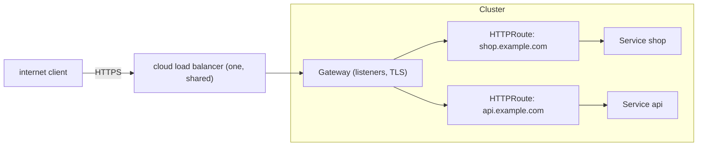
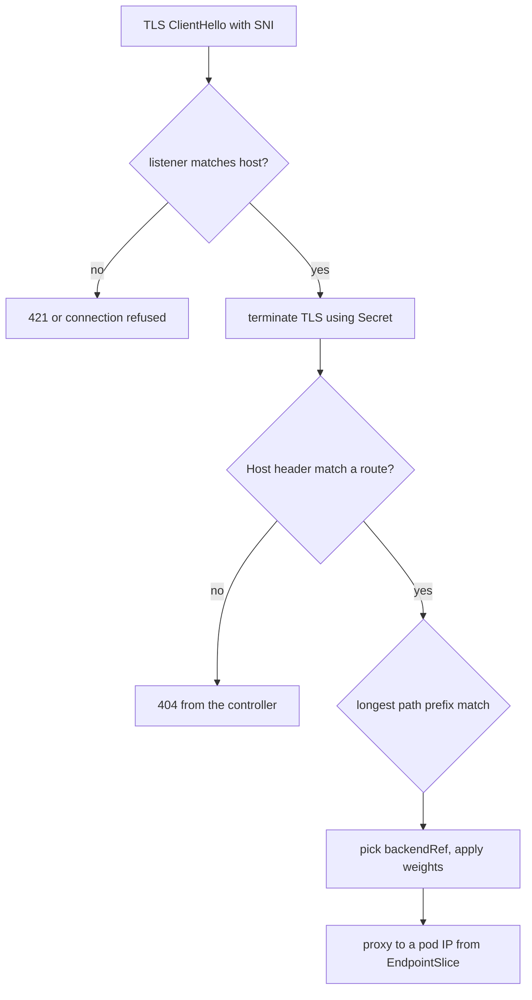

## Before you start

Read `kubernetes-networking` first — this topic exists precisely because a Service matches on IP and port only and cannot read a hostname or path. You also need `tls-and-certificates` for what a certificate is; the handshake itself is not repeated here.

## In one sentence

**Ingress** and its successor the **Gateway API** are the objects that describe HTTP-level routing into a cluster — which hostname and path goes to which Service, and where TLS is terminated — while a separate piece of software called a **controller** is what actually does the work.

## Why it matters

Two practical problems drive everything here.

The first is money. A `LoadBalancer` Service provisions one cloud load balancer per Service, each with its own public IP and its own monthly charge. Forty microservices means forty load balancers. Ingress collapses them into one entry point that routes internally by hostname and path.

The second is capability. TLS termination, host-based routing, path rewriting, header matching, canary weighting and redirects are all **L7** concerns — they require reading the HTTP request. A Service performs destination NAT on packets and never sees the payload, so it structurally cannot do any of this.

And one failure mode matters more than the rest: an Ingress object with no controller installed does absolutely nothing, silently, forever. It is a very common first-week Kubernetes experience.

## The intuition

A `LoadBalancer` Service is a private street entrance for one shop. It works, and if you have forty shops you are paying for forty streets.

Ingress is a **shopping-mall reception desk**. One entrance, one address, one security system. You arrive and say which shop you want; reception directs you inside. The mall pays for one entrance instead of forty.

Now the part that people miss. An Ingress object is not the reception desk — it is the **directory board** listing which shop is on which floor. If nobody has actually hired a receptionist, the board hangs there, perfectly accurate and entirely useless. Visitors arrive, find nobody to direct them, and leave. That receptionist is the **ingress controller**, and Kubernetes does not ship one. You install it yourself.

Gateway API keeps the mall but fixes who owns which decisions. Previously one board held everything — the building's wiring, the entrance security, and each shop's own floor listing — so any shop wanting to change its own line needed the building manager. Gateway API splits it: the building's contractor type (**GatewayClass**), the entrance itself with its locks and certificates (**Gateway**), and each shop's own routing entry (**HTTPRoute**) which the shop maintains without touching anyone else's.

## How it actually works



### The resource is not the implementation

This is the central mechanic, and it is the same for both APIs.

An **Ingress** is a declarative record in etcd. An **ingress controller** — nginx-ingress, Traefik, HAProxy, Envoy Gateway, or your cloud provider's — runs as a Deployment in the cluster, watches Ingress objects through the API server, and reconfigures a real proxy to match. That proxy is what terminates TLS and forwards requests.

So the data path is: client → cloud load balancer → the controller's proxy Pods → **directly to a Pod IP**. Notice the last hop. The controller reads EndpointSlices itself and load balances across Pod IPs in its own process, which means it usually bypasses the Service's ClusterIP entirely. The Service is used as a *label query for which Pods exist*, not as the transport. That is why an ingress controller can do per-request balancing, retries and sticky sessions where a bare Service cannot.

If no controller is installed, nothing watches the object. There is no error, no event and no warning — `kubectl get ingress` shows your rules and an empty `ADDRESS` column. That empty address is the tell.

You select which controller handles an Ingress with `ingressClassName`, since a cluster can run several — for example one internal-facing and one internet-facing.

### Host and path routing, and TLS

An Ingress carries a list of rules keyed by host, each with paths and a backend Service. Path matching has three types: `Exact`, `Prefix` (path-segment aware, so `/api` matches `/api/v1` but not `/apifoo`), and `ImplementationSpecific`, which means whatever your controller decides — usually a regex, and a major source of behaviour that does not transfer between controllers.

TLS termination is a `tls` block naming a Secret of type `kubernetes.io/tls` holding `tls.crt` and `tls.key`. The controller loads it and selects a certificate per connection using **SNI**, the hostname the client sends in the ClientHello. One Gateway can therefore serve dozens of domains with different certificates on one IP.

Nobody should be renewing those by hand. **cert-manager** is an operator that watches Ingress and Gateway objects, requests certificates from an issuer such as Let's Encrypt via ACME, proves domain ownership, writes the resulting Secret, and renews before expiry — a reconciliation loop applied to certificates. You annotate the Ingress with an issuer and the Secret appears. See `certificate-lifecycle-and-rotation` for the renewal mechanics and `pki-and-certificate-authorities` for the trust model.

For mTLS and the choice between terminating TLS at the edge versus passing it through untouched to the Pod, see `tls-termination-and-passthrough` — the trade-off is identical here, with the ingress controller as the terminating party. The short version is that terminating lets you route on paths and headers but means the controller sees plaintext, while passthrough preserves end-to-end encryption and reduces you to SNI-level routing.

### The L7 decision path



Two things worth extracting. Hostname is evaluated **twice** — once from SNI before decryption to pick a certificate, and again from the HTTP `Host` header afterwards to pick a route. They can disagree, and a mismatch is what produces a valid TLS connection followed by a 404. And a 404 from the controller looks identical to a 404 from your application; distinguishing them is what the controller's access log is for.

### Why Gateway API exists

Ingress became the standard and then hit three structural limits.

**Annotation sprawl.** The Ingress spec covers host, path, backend and TLS. Everything else — rewrites, timeouts, rate limits, canary weights, CORS, header manipulation — was implemented as vendor annotations. `nginx.ingress.kubernetes.io/rewrite-target` has no meaning to Traefik. So a "portable" resource became unportable in practice, and migrating controllers meant rewriting every Ingress.

**No protocol beyond HTTP.** TCP, UDP and gRPC routing all needed vendor extensions.

**No role separation** — the important one. An Ingress is a single object mixing decisions owned by different people: which load balancer infrastructure to use, which TLS certificates and listeners to expose, and which paths route to which app. Give an application team write access to Ingress and they can also change TLS configuration and hostnames belonging to other teams. Withhold it and every routing change becomes a platform-team ticket. There is no middle ground, because the permission boundary is the object and the object contains everything.

Gateway API splits the concerns along the lines organisations actually have:

| Resource | Owned by | Decides |
|---|---|---|
| `GatewayClass` | Infrastructure provider | Which controller implementation backs this class |
| `Gateway` | Cluster operator / platform team | Listeners, ports, protocols, TLS certificates, which namespaces may attach |
| `HTTPRoute` | Application team | Hostnames, paths, headers, backends, weights for *their own* service |

Now RBAC can be meaningful. An app team gets write access to HTTPRoute in their own namespace and nothing else. They ship routing changes without a ticket and cannot touch the platform's TLS configuration or another team's routes. The platform team owns the Gateway and controls, via `allowedRoutes`, which namespaces may attach to which listener. Route attachment is bidirectional consent: the route requests a Gateway, and the Gateway must permit that namespace.

The features that used to be annotations are now typed fields — header matching, request mirroring, redirects, path rewriting, and traffic splitting by weight, which is native canary support and the foundation for `progressive-delivery`. Gateway, GatewayClass and HTTPRoute have been stable API since v0.5.0, and Ingress is not deprecated — it simply is not receiving new features.

## Worked example

The same routing expressed both ways. First Ingress:

```yaml
apiVersion: networking.k8s.io/v1
kind: Ingress
metadata:
  name: site
  annotations:
    cert-manager.io/cluster-issuer: letsencrypt-prod   # cert-manager creates the Secret below
spec:
  ingressClassName: nginx        # WITHOUT a matching installed controller, nothing happens
  tls:
    - hosts: ["shop.example.com"]
      secretName: shop-tls       # must hold tls.crt and tls.key
  rules:
    - host: shop.example.com     # matched from the HTTP Host header, after TLS termination
      http:
        paths:
          - path: /api
            pathType: Prefix     # segment-aware: /api/v1 matches, /apifoo does not
            backend:
              service: { name: api, port: { number: 80 } }
          - path: /
            pathType: Prefix     # longest prefix wins, so /api never falls through to here
            backend:
              service: { name: web, port: { number: 80 } }
```

Now Gateway API, where the same thing becomes two objects with two owners:

```yaml
# --- platform team owns this ---
apiVersion: gateway.networking.k8s.io/v1
kind: Gateway
metadata:
  name: shared-gw
  namespace: infra
spec:
  gatewayClassName: envoy
  listeners:
    - name: https
      protocol: HTTPS
      port: 443
      hostname: "*.example.com"      # SNI-level selection happens here
      tls:
        certificateRefs: [{ name: wildcard-tls }]
      allowedRoutes:
        namespaces: { from: Selector  # only namespaces we label may attach
          selector: { matchLabels: { routing: allowed } } }
---
# --- application team owns this, in their OWN namespace ---
apiVersion: gateway.networking.k8s.io/v1
kind: HTTPRoute
metadata:
  name: shop
  namespace: shop
spec:
  parentRefs:
    - { name: shared-gw, namespace: infra }   # requests attachment; Gateway must allow it
  hostnames: ["shop.example.com"]
  rules:
    - matches:
        - path: { type: PathPrefix, value: /api }
      backendRefs:                  # native weighting: no vendor annotation needed
        - { name: api, port: 80, weight: 90 }
        - { name: api-canary, port: 80, weight: 10 }
```

The app team can change that canary weight, add a header match, or ship a redirect entirely on their own. They cannot alter the certificate, the port, or the wildcard hostname.

Verify the thing people get wrong most often:

```bash
kubectl get ingress site
# NAME   CLASS   HOSTS              ADDRESS         PORTS     AGE
# site   nginx   shop.example.com   203.0.113.40    80, 443   4m

# An EMPTY ADDRESS after a few minutes means no controller is reconciling this object.
kubectl get pods -n ingress-nginx        # is a controller even installed?
kubectl get ingressclass                 # does the name in ingressClassName exist?

# Gateway API reports attachment status, which Ingress never did:
kubectl get gateway shared-gw -n infra -o jsonpath='{.status.listeners[0].attachedRoutes}'
# 3
```

That `attachedRoutes` count is a genuine improvement. With Ingress you discovered a rejected rule from controller logs; Gateway API puts acceptance in status, so a route the Gateway refused reports why.

A small Node.js check for the failure this topic keeps warning about:

```js
const { execFileSync } = require('node:child_process');
const j = (a) => JSON.parse(execFileSync('kubectl', [...a, '-o', 'json'], { encoding: 'utf8' }));

const classes = new Set(j(['get', 'ingressclass']).items.map((c) => c.metadata.name));

for (const ing of j(['get', 'ingress', '-A']).items) {
  const cls = ing.spec.ingressClassName;
  // An empty status.loadBalancer.ingress is the signature of "no controller acted on this".
  const addr = ing.status?.loadBalancer?.ingress?.[0];
  const problem =
    !classes.has(cls) ? `ingressClass "${cls}" does not exist`
    : !addr ? 'no controller has assigned an address'
    : null;
  console.log(`${ing.metadata.namespace}/${ing.metadata.name}: ${problem ?? 'ok'}`);
}
```

```
shop/site: ok
legacy/old-app: ingressClass "nginx-internal" does not exist
demo/test: no controller has assigned an address
```

Both failing lines would show perfectly valid rules in `kubectl describe` while serving no traffic at all.

## A second example — when it gets harder

The naive model: "TLS works and the rules are right, so requests reach my app." Here is the case that breaks it, and it is genuinely confusing the first time.

You have a wildcard certificate for `*.example.com` on the Gateway listener, and an HTTPRoute for `shop.example.com`. You `curl https://shop.example.com/api/orders` and get a **404 from nginx**, not from your API. The certificate is valid. The route exists. The Service has endpoints.

The cause is that hostname is evaluated at two different layers. SNI matched `*.example.com`, so the TLS handshake succeeded and the connection was established. Then the controller looked at the HTTP `Host` header to select a route — and something rewrote it. A cloud load balancer configured to send a fixed `Host`, an intermediate proxy, or a client using an IP with a `Host: 203.0.113.40` header. No route declares that hostname, so the controller returns its default 404.

Everything about the TLS layer says success, because the TLS layer *did* succeed. The tell is that the 404 body is the controller's, not your application's, and the controller access log shows the actual `Host` it received. This same split explains why passthrough mode can only route on SNI: without terminating, the `Host` header is still encrypted and unavailable.

The subtler trap is path matching across controllers. Consider a `Prefix` path of `/api` pointing at a Service, where your app expects to receive `/orders` rather than `/api/orders`. With nginx-ingress you reach for `nginx.ingress.kubernetes.io/rewrite-target: /$2` plus a capture-group regex in the path — and now `pathType` is effectively `ImplementationSpecific`, your Ingress is nginx-only, and the regex interacts with `Prefix` semantics in ways that surprise people. Migrate to Traefik and every one of those rules must be rewritten in a different annotation dialect.

Gateway API turns exactly this into a typed field:

```yaml
    - matches:
        - path: { type: PathPrefix, value: /api }
      filters:
        - type: URLRewrite
          urlRewrite:
            path: { type: ReplacePrefixMatch, replacePrefixMatch: / }
```

Portable across every conformant implementation, and validated by the API server rather than by a controller parsing a string at runtime. This is the concrete payoff of the redesign — not new capability, but capability that survives changing vendors.

## Quick reference

| Need | Service alone | Ingress | Gateway API |
|---|---|---|---|
| Route by hostname | No | Yes | Yes |
| Route by path | No | Yes | Yes |
| Route by header / method | No | Annotations only | Native |
| TLS termination | No | Yes | Yes, per listener |
| Traffic splitting / canary | No | Annotations only | Native `weight` |
| Path rewrite | No | Vendor annotation | Native filter |
| Protocols beyond HTTP | L4 only | HTTP(S) only | HTTP, gRPC, TCP, UDP, TLS |
| Role separation via RBAC | n/a | None — one object | GatewayClass / Gateway / Route |
| One cloud LB for many apps | No | Yes | Yes |

| Symptom | Cause | Check |
|---|---|---|
| `ADDRESS` column empty | No controller, or wrong `ingressClassName` | `kubectl get ingressclass` |
| Controller 404, valid TLS | `Host` header does not match any rule | Controller access log |
| Certificate warning in browser | Secret missing, or SNI matched no listener | The Secret, and listener hostname |
| 503 from the controller | Backend Service has no ready endpoints | `kubectl get endpointslices` |
| Rules work on nginx, break on Traefik | Vendor annotations | Move to Gateway API filters |
| HTTPRoute ignored | Gateway did not permit that namespace | `HTTPRoute` status conditions |

## Common mistakes

- Creating an Ingress with no controller installed and expecting traffic. Nothing watches the object and nothing warns you; the empty `ADDRESS` is the only signal.
- Thinking Ingress *is* the proxy. It is a record; the controller runs the proxy and does the routing.
- Assuming a 404 came from your app. Controllers return their own 404 when no rule matches the `Host`.
- Using a `LoadBalancer` Service per microservice and paying for a cloud load balancer each time.
- Relying on vendor annotations and calling the result portable.
- Confusing SNI hostname with the `Host` header. Both are checked, at different layers, and they can disagree.
- Expecting `ImplementationSpecific` path behaviour to transfer between controllers.
- Renewing TLS Secrets manually instead of running cert-manager, then discovering expiry at 3am.
- Reading Gateway API as a rename of Ingress. The point is role separation and typed features, not new nouns.

## What interviewers ask

- **What is the difference between a Service and an Ingress?** — A Service is L4: it DNATs packets by IP and port and cannot see HTTP. An Ingress describes L7 routing — hostname, path, TLS — which requires reading the request, so it needs a proxy that terminates the connection.
- **Why doesn't my Ingress work?** — Most often no ingress controller is installed, or `ingressClassName` names a class that does not exist. The Ingress object is only a declaration; without a controller watching it, nothing happens and nothing errors.
- **Why does Gateway API exist if Ingress works?** — Ingress needed vendor annotations for anything beyond host/path/TLS, so it stopped being portable, and it packed infrastructure, TLS and application routing into one object with no way to grant an app team just their own routes. Gateway API splits GatewayClass, Gateway and HTTPRoute so RBAC follows real ownership, and makes rewrites, header matching and traffic weighting typed fields.
- **Where does TLS get terminated, and how does one IP serve many certificates?** — At the ingress controller's proxy, which picks a certificate per connection using the SNI hostname from the ClientHello. That is why one Gateway can host many domains on a single address.
- **How does traffic reach a Pod through an Ingress?** — Client to cloud load balancer, to the controller's proxy Pods, then directly to a Pod IP the controller read from EndpointSlices. It usually bypasses the ClusterIP, which is how it can balance per request rather than per connection.
- **How do you do a canary release?** — With Gateway API, two `backendRefs` with weights on one HTTPRoute. With Ingress it requires controller-specific canary annotations, which is one of the concrete reasons the API was redesigned.

## Practice

1. Install nginx-ingress on a local cluster, then create an Ingress with `ingressClassName: does-not-exist`. Observe that `kubectl describe` shows valid rules while the `ADDRESS` stays empty and no traffic flows. Fix the class name and watch the address populate. Explain why Kubernetes raised no error.
2. Serve two hostnames from one Ingress with separate TLS Secrets. Use `openssl s_client -servername` to confirm each returns a different certificate on the same IP, then `curl` with a deliberately wrong `Host` header against the correct SNI to reproduce the valid-TLS-then-404 case.
3. Take an Ingress that uses `rewrite-target` and reimplement it as a Gateway plus HTTPRoute with a `URLRewrite` filter. Add a 90/10 weighted split to a canary Service, then write down which resource each of a platform engineer and an app developer should be allowed to edit, and what breaks if you get that boundary wrong.

## Where to go next

Continue to `kubernetes-storage` — you can now get traffic to a stateless app, so the remaining question is what happens when that app needs data that outlives the Pod serving it.
