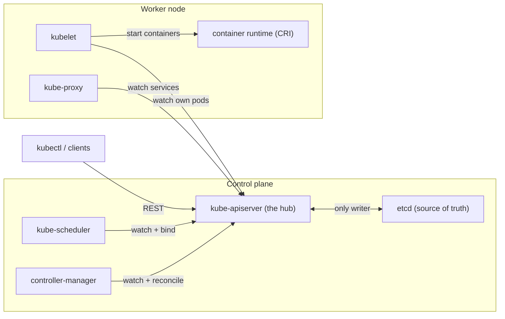
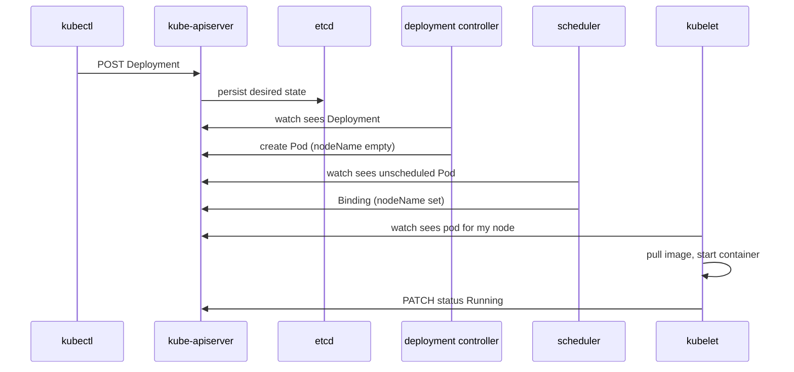

## Before you start

Read `kubernetes-basics` first. Pods, Deployments, ReplicaSets and Services are assumed knowledge here and never re-explained — this topic is about the machinery underneath them: which process actually creates a Pod, and who decides where it runs.

## In one sentence

A Kubernetes cluster splits into a **control plane** that decides what should be running and a **data plane** of worker nodes that actually run it, with every component talking through one central API server and no component talking directly to any other.

## Why it matters

Almost every confusing Kubernetes failure becomes obvious once you know which component owns which decision. A Pod stuck in `Pending` is a scheduler statement, not a kubelet problem. A Deployment that never produces Pods is a controller problem, not a node problem. Pods that keep running fine while `kubectl` times out tells you the control plane is down but the data plane is not — the cluster is unmanageable but not dead.

Without this map you debug by guessing, restarting things and hoping. With it you can name the suspect before running a single command.

## The intuition

Think of a large restaurant kitchen.

There is a **ticket rail** where every order is posted. Nobody shouts across the kitchen; if it isn't on the rail, it isn't happening. That is the **API server**, and the written tickets themselves live in a locked ledger — **etcd**.

An **expediter** reads each new ticket and decides which station has the capacity and the right equipment to cook it. She writes the station name on the ticket and hands it back to the rail. She never cooks anything. That is the **scheduler**.

Each **station chef** watches the rail for tickets assigned to their own station, and cooks only those. Nobody hands them a plate; they pull work themselves. That is the **kubelet**.

Finally, a **head chef** walks the line comparing the rail against reality — three orders posted but only two plates up, so she re-posts the missing one. She does this forever, not once. That is a **controller**, and it is the single most important idea in the system.

## How it actually works



Notice what the diagram does *not* contain: an arrow from the scheduler to the kubelet. There is no such path. Every component is a spoke on a hub, which is why you can lose any single one and the rest keep functioning in degraded form.

**kube-apiserver** is the front door and the only component that talks to etcd. It authenticates you, authorises the action, runs admission control, validates the object, and persists it. Everything else — scheduler, controllers, kubelets, `kubectl`, dashboards — is just another API client. It is stateless, so you scale it horizontally and put a load balancer in front.

**etcd** is the sole source of truth. Every object you have ever created lives there and nowhere else; the entire cluster state is recoverable from an etcd backup and unrecoverable without one. It uses the Raft consensus protocol, which needs a **quorum** — a strict majority of members — to accept a write. This is why member counts are odd. Three members tolerate one failure; four members also tolerate only one, because losing two of four leaves you with two, which is not a majority of four. The fourth member adds cost and failure surface while adding zero fault tolerance.

**kube-scheduler** watches for Pods with an empty `nodeName`, picks a node, and writes that choice back to the API server. It creates nothing. It starts nothing. It makes one decision and records it — a detail worth stating plainly in an interview, because many candidates describe the scheduler as if it launches containers.

**kube-controller-manager** is one process running dozens of independent control loops: the Deployment controller, the ReplicaSet controller, the Job controller, the node lifecycle controller. Each watches a slice of the API and works to make reality match intent.

**cloud-controller-manager** holds the logic that must talk to a specific cloud provider — provisioning a load balancer for a `LoadBalancer` Service, attaching a disk, noticing that the VM behind a node was deleted. Separating it is what lets the core project stay cloud-neutral.

On each node, **kubelet** is the only component in the whole system that actually causes a container to start. It watches the API server for Pods assigned to *its own* node — it is never pushed to. That pull direction is why a node that loses connectivity keeps its existing containers running: nothing was ever holding them up from the outside. **kube-proxy** programs the node's packet-forwarding rules for Services, and the **container runtime** (containerd, CRI-O) does the actual container work behind the **CRI** interface.

### The reconciliation loop

Every one of those controllers runs the same four steps, forever:

1. Read the **desired state** you declared.
2. Observe the **actual state** of the world.
3. Take one action to narrow the gap.
4. Go back to step one.

This is the whole system. `replicas: 3` is not a command that runs once; it is a standing fact that a loop re-checks continuously. Delete a Pod and it returns, because you changed reality but not intent. Scaling, rollouts, node failure recovery, certificate renewal, load balancer creation and volume attachment are all the same loop with different nouns.

The pattern's real payoff is **level-triggered** behaviour. An edge-triggered system reacts to events, so a missed event means permanent drift. A level-triggered controller compares current state against desired state, so a missed event just means it corrects slightly later. That is why Kubernetes recovers from controller restarts and network blips without manual repair.

### Watch, not poll

Controllers do not poll the API server. They open a **watch** — a long-lived streaming connection that pushes changes as they happen. Because thousands of watchers would still crush the API server, client libraries wrap watches in an **informer**: it does one initial `LIST`, then keeps a local in-memory cache updated by the watch stream. Controller code reads its own cache, so a controller checking Pod state does zero API calls.

This also explains a real class of bug. That cache is *eventually* consistent, so a controller can act on data a few hundred milliseconds stale. Well-written controllers therefore treat their own writes as possibly-conflicting and retry on conflict, rather than trusting what they just read.

### The path of one `kubectl apply`



Five components cooperate and none of them ever speak to each other. Every arrow terminates at the API server. Trace the failure points: if the Pod never appears, the controller is stuck; if it appears with no `nodeName`, the scheduler is stuck; if `nodeName` is set but nothing starts, the kubelet is stuck.

## Worked example

Ask the cluster to describe its own architecture. `kubectl get --raw` hits the API server directly, so this works on any conformant cluster:

```bash
# Which API groups does this server actually serve?
kubectl get --raw /apis | head -c 200

# Health of the individual control plane subsystems
kubectl get --raw '/readyz?verbose' | head -20
```

```
[+]ping ok
[+]log ok
[+]etcd ok
[+]etcd-readonly ok
[+]informer-sync ok
[+]poststarthook/start-kube-apiserver-admission-initializer ok
[+]shutdown ok
readyz check passed
```

`[+]etcd ok` is the API server confirming it can reach its datastore. When that line reads `[-]etcd failed`, every `kubectl` command starts timing out while your workloads keep serving traffic — the exact signature of a control-plane-only outage.

Now watch the reconciliation loop from the outside, in Node.js. This parses real `kubectl` JSON rather than inventing a client:

```js
const { execFileSync } = require('node:child_process');

function get(args) {
  return JSON.parse(execFileSync('kubectl', [...args, '-o', 'json'], { encoding: 'utf8' }));
}

// The scheduler's decision is visible as one field: spec.nodeName.
const pods = get(['get', 'pods', '-A']).items;

const unscheduled = pods.filter((p) => !p.spec.nodeName);
const byNode = {};
for (const p of pods) {
  if (p.spec.nodeName) byNode[p.spec.nodeName] = (byNode[p.spec.nodeName] || 0) + 1;
}

console.log('pods awaiting a scheduler decision:', unscheduled.length);
for (const [node, count] of Object.entries(byNode)) {
  console.log(`${node}: ${count} pods bound`);
}
```

```
pods awaiting a scheduler decision: 0
kind-control-plane: 9
kind-worker: 4
kind-worker2: 3
```

`spec.nodeName` is the entire output of the scheduler. A non-zero first line means the scheduler has not placed those Pods — either it is unhealthy, or no node passes its filters.

## A second example — when it gets harder

The naive model says "the control plane runs the cluster, so if it dies the cluster dies". Test that.

Stop the control plane on a running cluster. Your applications keep serving traffic indefinitely. Kubelets keep restarting crashed containers, because a kubelet already holds its assigned Pod specs locally and its restart logic is entirely local. kube-proxy keeps forwarding, because the rules are already programmed into the kernel.

What you lose is every *change*: no new Pods, no rescheduling of a failed node's Pods, no rollouts, no scaling, no `kubectl`. The cluster is frozen, not dead.

This is deliberate. The data plane's steady-state operation does not depend on the control plane being reachable, which is what makes a rolling control plane upgrade a safe operation. It also produces the counterintuitive incident where a node dies and its Pods are *not* rescheduled: if the control plane is also unhealthy, no controller is running the loop that notices.

The sharper version of the same lesson concerns etcd. Lose quorum — two of three members gone — and etcd goes **read-only**. It will still serve reads, so `kubectl get` works and looks reassuring, but every write fails. Deployments freeze mid-rollout, and the cluster appears healthy on inspection while being unable to change anything. Restoring quorum, not restarting the API server, is the fix. This is exactly why the odd-number rule matters in practice rather than as trivia.

## Quick reference

| Component | Owns | Talks to | Losing it means |
|---|---|---|---|
| kube-apiserver | Auth, admission, validation, persistence | etcd (exclusively) | Nothing can change; workloads keep running |
| etcd | All cluster state | API server only | No writes; total loss without a backup |
| kube-scheduler | Choosing a node, writing `nodeName` | API server | New Pods stay `Pending`; existing ones fine |
| controller-manager | The reconciliation loops | API server | No new Pods, no rollouts, no self-healing |
| cloud-controller-manager | Cloud load balancers, disks, node lifecycle | Cloud API + API server | `LoadBalancer` Services stay `<pending>` |
| kubelet | Actually starting containers | API server + CRI | That node's Pods go stale; node turns `NotReady` |
| kube-proxy | Service forwarding rules on the node | API server + kernel | Service virtual IPs stop working on that node |

## Common mistakes

- Saying the scheduler "starts" or "places" Pods. It writes one field and stops; the kubelet starts everything.
- Believing components call each other. Every interaction goes through the API server, which is why RBAC and the audit log see all of it.
- Running an even number of etcd members. Four gives the same fault tolerance as three at higher cost.
- Assuming a control plane outage stops running workloads. It stops *changes*.
- Treating `replicas: 3` as a one-time command. It is a continuously re-evaluated fact, which is why deleting a Pod cannot reduce the count.
- Thinking components poll. They watch, through informers backed by a local cache — which is also why they occasionally act on slightly stale data.

## What interviewers ask

- **Walk me through what happens when you run `kubectl apply -f deployment.yaml`.** — `kubectl` POSTs to the API server, which authenticates, admits, validates and writes to etcd; the Deployment controller creates a ReplicaSet, the ReplicaSet controller creates Pods with no `nodeName`, the scheduler binds each to a node, and that node's kubelet pulls the image and starts the container. They want to hear that the components never talk to each other.
- **Why must etcd have an odd number of members?** — Raft needs a strict majority for writes, so four members tolerate the same single failure as three while costing more and adding failure surface. Losing quorum makes etcd read-only, which looks deceptively healthy.
- **What is the reconciliation loop?** — Read desired state, observe actual state, act to close the gap, repeat forever. It is level-triggered, not event-triggered, so a missed event causes a slight delay rather than permanent drift — the reason Kubernetes self-heals after controller restarts.
- **Which component actually starts a container?** — Only the kubelet, via the CRI. It pulls the work by watching the API server rather than being pushed to, which is why a disconnected node keeps its containers running.
- **If the control plane is down, does my app go down?** — No. Existing Pods keep serving and kubelets keep restarting crashed containers locally. You lose all scheduling, scaling, rollouts and rescheduling — the cluster is frozen.

## Practice

1. On a local cluster (`kind` or `minikube`), run `kubectl get --raw '/readyz?verbose'` and identify which subsystem each line represents. Then create a Deployment and use `kubectl get pod -w -o wide` to watch `NODE` change from empty to a node name — you are watching the single field the scheduler writes.
2. Create a Pod with `spec.nodeName` set manually to a real node, and no scheduler involvement. Explain why it runs anyway, and what the scheduler's absence from that path means for the resource accounting it normally performs.
3. Delete a Pod that a Deployment owns and time how long the replacement takes. Then delete the ReplicaSet instead and explain, in terms of which loop noticed what, why the outcomes differ.

## Where to go next

Continue to `pod-lifecycle-and-scheduling` — you now know the scheduler writes one field, so the next question is how it chooses that node, and what the Pod goes through between `Pending` and serving traffic.
