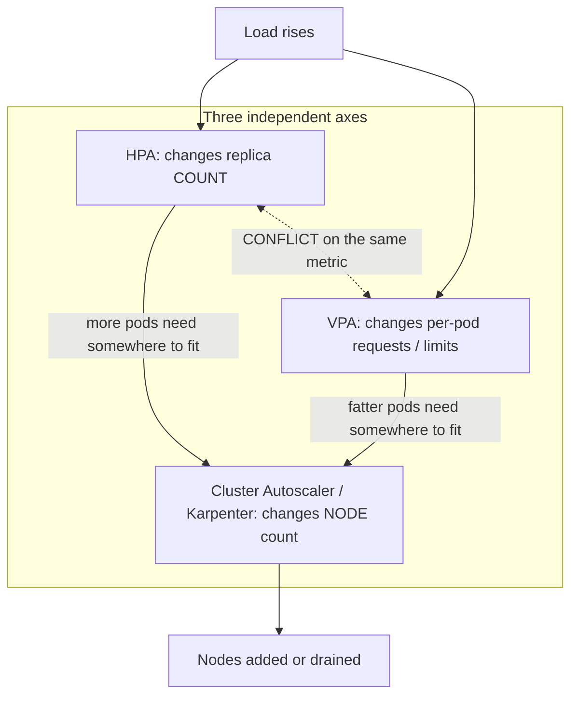
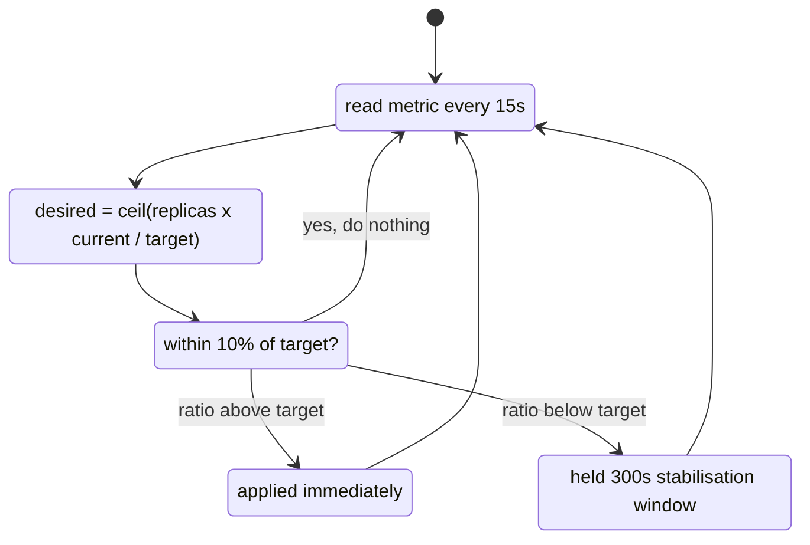

## Before you start

You need [pod-lifecycle-and-scheduling](pod-lifecycle-and-scheduling) — the whole topic rests on requests, limits and why a Pod goes Pending, and this one will not make sense without them. For GPU model serving, read [gpu-autoscaling-and-cold-starts](gpu-autoscaling-and-cold-starts) instead or afterwards; the arithmetic here applies, but minutes-long cold starts change every conclusion.

## In one sentence

Kubernetes autoscaling is three separate systems that people call one thing: one adds **Pods**, one makes each Pod **bigger**, and one adds **machines** — and they can work against each other.

## Why it matters

"We'll just turn on autoscaling" is where most capacity problems begin rather than end, because the three systems get confused for interchangeable knobs.

Turn on the wrong one and nothing happens: scale a queue worker on CPU when it spends its life blocked on network I/O and it sits at one replica while the queue grows to a hundred thousand. Turn on two and they fight. Turn on Pod scaling with no node scaling and you get twenty Pods where twelve fit and eight Pending forever.

Underneath all three sits one root cause: **if your resource requests are wrong, every autoscaler is wrong**, because requests are the denominator in the HPA's percentage and the input to every scheduling decision. Autoscaling does not fix an unmeasured workload — it amplifies whatever you already told Kubernetes.

## The intuition

Think about a restaurant that suddenly gets busy. There are exactly three responses, and they are not substitutes.

**Hire more waiters** — more people sharing the same load. That is the **Horizontal Pod Autoscaler**: more replicas, same size each. **Give each waiter a bigger tray** — same people, more carried per trip. That is the **Vertical Pod Autoscaler**: same replica count, more CPU and memory each. **Add another dining room** — somewhere to put the extra tables. That is the **Cluster Autoscaler** (or **Karpenter**): more nodes.

The relationships fall out of the analogy. Hiring waiters is pointless without floor space, which is why Pod scaling and node scaling are partners. But *deciding between* more waiters and bigger trays simultaneously, from the same signal, is incoherent — which is precisely what HPA and VPA do when you point both at CPU.



## How it actually works

### HPA: the formula, and the damping around it

The HPA runs a control loop every 15 seconds by default. Its core calculation is one line:

```
desiredReplicas = ceil( currentReplicas × currentMetricValue / desiredMetricValue )
```

Work it with numbers. You run 4 replicas, target 50% CPU, and observe 90%:

```
ceil(4 × 90 / 50) = ceil(7.2) = 8 replicas
```

Note what the metric *is*. For `type: Utilization`, "90%" means **90% of the Pod's CPU request** — not of a core, not of the node. A Pod requesting `100m` and using `90m` is at 90%. So identical real load produces wildly different percentages depending on the request you wrote, which is the mechanism behind "requests drive autoscaling": halve the request and you double the reported utilisation.

Two damping mechanisms stop the loop thrashing. **Tolerance**: if the ratio is within 10% of 1.0 the HPA does nothing, which is why a 50% target observing 52% will not scale — and why people report an HPA "not working" when it is deliberately ignoring noise. **The stabilisation window**: scale-up is immediate, while scale-down consults the highest replica count recommended over the last **300 seconds** by default, so after a spike the HPA holds the higher count for five minutes because brief over-provisioning is far cheaper than flapping. Both are configurable under `behavior`.



### Where the metrics come from, and why CPU is often wrong

**metrics-server** provides resource metrics — CPU and memory per Pod. It is a separate component; without it, `kubectl top` fails and a CPU-based HPA reports `<unknown>`. This is the single most common "my HPA does nothing" cause.

**Custom and external metrics** come through an adapter, most often **KEDA**. KEDA does not replace the HPA — it creates one and feeds it metrics from Kafka lag, SQS depth, Prometheus queries, cron schedules and dozens of other scalers. It also adds scale-to-zero, which plain HPA cannot do (its minimum is 1).

Now the judgement call. **CPU is a proxy for load, not a measure of it**, and it fails in one common case: a service whose bottleneck is not CPU. A worker pulling from a queue and waiting on a database spends most of its life blocked, so its CPU sits at 15% whether the queue holds ten messages or ten thousand, and a CPU-based HPA never fires while the backlog grows without bound.

The honest signal there is **queue depth** — honest by definition, since a message waits only because no worker could take it, which is exactly "demand exceeds capacity". For a synchronous HTTP service, in-flight request concurrency plays the same role.

A useful rule: **scale on the metric that saturates first.** CPU-bound rendering, CPU. A queue consumer, backlog. A connection-bound proxy, active connections. If you cannot name what saturates, you are not ready to autoscale it.

### VPA, and the conflict

The Vertical Pod Autoscaler observes actual usage over time and adjusts **requests and limits**. It solves a different problem: not "too much traffic for this many Pods" but "nobody knew what to request, so we guessed wrong". Guessed requests are usually wrong by several times over, which wastes capacity and, per the formula above, silently miscalibrates the HPA.

Historically VPA had to evict a Pod to resize it, since requests were immutable after creation. **In-place Pod resize** has been progressing through the API to remove that restriction, but plan for eviction unless you have verified your cluster resizes in place.

**Now the conflict, stated plainly: do not run HPA and VPA on the same metric.** Point both at CPU and here is the loop. CPU rises, so VPA raises the CPU request — making the same absolute usage a *lower* percentage of a bigger request — so the HPA sees utilisation fall and removes replicas. Fewer replicas means each handles more traffic, utilisation climbs, VPA grows the request again. The two chase each other, and because VPA has historically resized by eviction, the oscillation churns Pods.

Three combinations work. **HPA on CPU + VPA on memory only** is the standard answer: different resources, no shared signal. **HPA on a custom metric (queue depth, RPS) + VPA on CPU and memory** is cleanest, since the HPA scales on business load while the VPA right-sizes the container with no overlap at all. And **VPA in `Off` mode** as a recommender only, letting a human or CI apply its suggestions — very common, because it gives the sizing intelligence without the eviction risk.

### Cluster Autoscaler: it reacts to Pending, so Pods wait first

This mechanic surprises people. The Cluster Autoscaler watches neither CPU, nor load, nor the HPA. It watches for **unschedulable Pods** — ones the scheduler could not place — and asks whether adding a node of an existing node-group shape would let them fit, checking roughly every 10 seconds.

The consequence is a strict ordering: **Pods must go Pending before a node is added.** The real path is load rises → HPA adds Pods → some Pods Pending → Cluster Autoscaler notices → cloud API provisions a node → node joins → kubelet pulls images → Pods start. Minutes, not seconds, and the Pending state at step three is the trigger, not an error.

Which is why the highest-leverage way to speed up node scaling is not autoscaler tuning but making the node useful faster: smaller images, pre-pulled layers, a regional registry cache — see [container-images-and-oci](container-images-and-oci).

Scale-*down* is more constrained, and this is where clusters get stuck expensive. A node is removed only when it has been under-utilised — below 50% by default — and unneeded for over 10 minutes, *and* every Pod on it can be evicted elsewhere. What blocks it: a **PodDisruptionBudget** that would be violated (a `minAvailable: 1` PDB on a single-replica Deployment means that Pod can never be voluntarily evicted, so its node can never be drained); **local storage** such as `emptyDir` or `hostPath`, since evicting destroys data the autoscaler cannot know is disposable, overridable with the `safe-to-evict` annotation; Pods with no controller, since nothing would recreate them; and `kube-system` Pods lacking a PDB.

The recurring outcome: a cluster that scales up beautifully and never back down, because a handful of Pods with restrictive PDBs or `emptyDir` volumes sit one per node. **Karpenter** addresses exactly this — provisioning right-sized nodes from Pod requirements rather than scaling fixed node groups, and actively consolidating workloads onto fewer nodes.

## Worked example

An HPA with explicit `behavior`, so the damping is visible rather than implied:

```yaml
apiVersion: autoscaling/v2          # v2 — v1 supported CPU only
kind: HorizontalPodAutoscaler
metadata:
  name: api
spec:
  scaleTargetRef:
    apiVersion: apps/v1
    kind: Deployment
    name: api
  minReplicas: 3                    # floor: survive a spike's first seconds
  maxReplicas: 30                   # ceiling: a runaway loop cannot bankrupt you
  metrics:
    - type: Resource
      resource:
        name: cpu
        target:
          type: Utilization
          averageUtilization: 60    # 60% OF THE POD'S CPU REQUEST, not of a core
  behavior:
    scaleUp:
      stabilizationWindowSeconds: 0     # react immediately
      policies:
        - type: Percent
          value: 100                    # at most double
          periodSeconds: 30
    scaleDown:
      stabilizationWindowSeconds: 300   # the default: hold 5 min before shrinking
      policies:
        - type: Percent
          value: 10                     # shed at most 10% per minute
          periodSeconds: 60
```

The Deployment it targets **must** declare a CPU request, or `Utilization` has no denominator:

```yaml
resources:
  requests:
    cpu: "200m"      # the denominator for the HPA percentage
    memory: "256Mi"
  limits:
    memory: "512Mi"
```

Watch it under load:

```bash
kubectl get hpa api -w
# NAME   REFERENCE       TARGETS         MINPODS  MAXPODS  REPLICAS
# api    Deployment/api  12%/60%         3        30       3
# api    Deployment/api  118%/60%        3        30       3      <- computing
# api    Deployment/api  118%/60%        3        30       6      <- ceil(3*118/60)=6
# api    Deployment/api  74%/60%         3        30       6
# api    Deployment/api  74%/60%         3        30       8      <- ceil(6*74/60)=8
# api    Deployment/api  55%/60%         3        30       8      <- inside tolerance, settled
```

Check the arithmetic: at 3 replicas and 118%, `ceil(3 × 118/60) = 6`. Then at 6 and 74%, `ceil(6 × 74/60) = 8`. At 55% against a 60% target the ratio is 0.92, inside the 10% tolerance, so it stops. The HPA converges in steps rather than jumping, because each observation already reflects the previous correction.

When load drops, note what does *not* happen:

```bash
# api    Deployment/api  8%/60%   3  30  8    <- 8 replicas, load is gone
# ... five minutes pass ...
# api    Deployment/api  22%/60%  3  30  3
```

Eight replicas at 8% utilisation for five full minutes is the stabilisation window working, not a bug.

## A second example — when it gets harder

Now the case where all of the above is correct and useless. A worker consuming an SQS queue, doing mostly I/O:

```bash
kubectl get hpa worker
# NAME     REFERENCE          TARGETS   MINPODS  MAXPODS  REPLICAS
# worker   Deployment/worker  14%/70%   2        50       2

aws sqs get-queue-attributes --queue-url ... --attribute-names ApproximateNumberOfMessages
# { "ApproximateNumberOfMessages": "184000" }
```

184,000 messages waiting, and the HPA is idle at two replicas — behaving perfectly. CPU genuinely is 14%, because the worker is blocked on network calls, and 14% is nowhere near 70%. The metric is not lying; it is answering a question nobody needed.

The fix is to scale on the backlog, which KEDA expresses directly:

```yaml
apiVersion: keda.sh/v1alpha1
kind: ScaledObject
metadata:
  name: worker
spec:
  scaleTargetRef:
    name: worker
  minReplicaCount: 0          # scale to zero — plain HPA cannot go below 1
  maxReplicaCount: 50
  cooldownPeriod: 300
  triggers:
    - type: aws-sqs-queue
      metadata:
        queueURL: https://sqs.eu-west-1.amazonaws.com/123/jobs
        queueLength: "50"     # target ~50 messages per replica
```

`queueLength: "50"` means one replica per 50 waiting messages, so 184,000 messages asks for 3,680 replicas — clamped to `maxReplicaCount: 50`. That clamp is doing real work: without it a backlog spike would try to create thousands of Pods, exhaust the node pool, and hit your database with 3,680 concurrent connections. **`maxReplicas` is a blast-radius control, not a formality.** Underneath, KEDA created an ordinary HPA — same formula, same stabilisation window, just fed a metric that reflects reality.

Two more traps once this runs. **HPA and PodDisruptionBudget deadlock on scale-down**: a PDB of `minAvailable: 90%` against an HPA halving replicas produces a scale-down that cannot complete, because eviction would violate the budget. Nothing errors loudly; the replica count simply does not move. Prefer `maxUnavailable` to a high `minAvailable` where you can — see [sre-slos-and-error-budgets](sre-slos-and-error-budgets).

**Scaling faster than a dependency can take**: 5 to 50 replicas multiplies database connections by ten, so a pool of 20 per Pod becomes 1,000 connections against a database accepting 500, and autoscaling has converted a slow service into a hard outage. Autoscaling a tier means knowing its dependencies' ceilings ([connection-pooling](connection-pooling)).

## Quick reference

| | HPA | VPA | Cluster Autoscaler / Karpenter |
|---|---|---|---|
| Changes | Replica count | Per-Pod requests and limits | Node count |
| Reacts to | Metric vs target | Observed usage over time | **Unschedulable (Pending) Pods** |
| Speed | Seconds | Minutes to hours | Minutes (cloud API + boot + image pull) |
| Needs | metrics-server or an adapter | VPA components installed | Cloud provider integration |
| Solves | Load varies | Requests were guessed wrong | Pods do not fit |
| Trap | Wrong metric → never fires | Historically resizes by eviction | Scale-down blocked by PDB / local storage |

| Symptom | Likely cause |
|---|---|
| Targets show `<unknown>` | metrics-server missing, or the Pod declares no request for that resource |
| HPA never scales up | Metric does not reflect saturation (CPU on an I/O-bound worker) |
| Sits at target ±5% doing nothing | Working correctly — inside the 10% tolerance |
| Slow to shrink after a spike | The 300s scale-down stabilisation window |
| Pods Pending, no new nodes | At max node count, quota exhausted, or no node shape fits the request |
| Nodes never removed | Restrictive PDBs, `emptyDir`/`hostPath` Pods, or above the utilisation threshold |
| Replica count oscillates | HPA and VPA on the same metric |
| Scale-down stalls silently | PDB would be violated by the eviction |

## Tools & frameworks

| Tool | What it's for | Reach for it when |
|---|---|---|
| [Autoscaling docs](https://kubernetes.io/docs/concepts/workloads/autoscaling/) | HPA, VPA, and how they interact | You need to understand why HPA and VPA fighting over the same metric is a real failure mode |
| [metrics-server](https://github.com/kubernetes-sigs/metrics-server) | Supplies CPU and memory readings to HPA | HPA reports `<unknown>` — this missing component is almost always why |
| [KEDA](https://keda.sh/docs/2.20/) | Scale on queue depth, Kafka lag, or cron | The right signal is not CPU, and CPU-based scaling lags the actual load |
| [Karpenter](https://karpenter.sh/docs/) | Provision right-sized nodes on demand | Pods are `Pending` because no node fits, not because replica count is too low |
| [Cluster Autoscaler](https://github.com/kubernetes/autoscaler) | Node-group scaling | You need broad cloud support and predictable, pre-declared node groups |

Pod autoscaling and node autoscaling are different layers — "scaled to 20 replicas, 12 Pending" is the symptom that teaches the difference.

## Common mistakes

- Treating HPA, VPA and Cluster Autoscaler as one feature, then wondering which knob did nothing.
- Running HPA and VPA on the same resource. VPA grows the request, lowering the utilisation percentage, so the HPA removes replicas, raising utilisation again — an indefinite oscillation.
- Autoscaling on CPU for an I/O-bound service, so the HPA idles while the queue grows without bound.
- Omitting resource requests, so `Utilization` has no denominator and the HPA reports `<unknown>` forever.
- Forgetting metrics-server, then debugging the HPA rather than the missing component.
- Reading `averageUtilization: 60` as 60% of a core or of the node rather than of the Pod's request.
- Leaving `maxReplicas` generous "to be safe", turning a metric spike into thousands of Pods and an overwhelmed database.
- Expecting the Cluster Autoscaler to pre-empt demand, or alerting on the Pending Pods that are its trigger.
- Attaching a restrictive PDB, then being surprised that neither scale-down nor node drain completes.
- Scaling a stateless tier without checking whether its database, cache or upstream APIs can absorb the multiplied load.
- Never testing scale-down. Most autoscaling incidents are capacity that will not go away, not capacity that will not arrive.

## What interviewers ask

- **What are the three kinds of autoscaling in Kubernetes?** — HPA changes replica count, VPA changes each Pod's requests and limits, and Cluster Autoscaler (or Karpenter) changes node count. They solve different problems: load varying, requests being wrong, and Pods not fitting.
- **How does the HPA decide how many replicas to run?** — `ceil(currentReplicas × currentMetric / targetMetric)`, every 15 seconds, with a 10% tolerance so near-target noise is ignored, immediate scale-up, and a 300-second stabilisation window on scale-down to prevent flapping.
- **What does `averageUtilization: 60` actually measure?** — 60% of the Pod's CPU *request*, not of a core or of the node. The request you write is the denominator of your autoscaling, so changing it changes scaling behaviour without touching the HPA.
- **Can you run HPA and VPA together?** — Not on the same metric. VPA raises the request, lowering the utilisation percentage for identical real usage, so the HPA removes replicas, raising utilisation, and they oscillate. Valid combinations: HPA on CPU with VPA on memory only, HPA on a custom metric with VPA on both, or VPA in recommendation-only mode.
- **Why isn't your HPA scaling a queue worker?** — It is scaling on CPU and the worker is I/O-bound, so CPU stays flat regardless of backlog. Scale on queue depth via KEDA, which is honest by definition: a message waits only because no worker could take it.
- **What triggers the Cluster Autoscaler?** — Unschedulable Pods, not load or CPU. Pods go Pending first, then the autoscaler checks whether adding a node would let them fit, so Pending is the trigger rather than an error.
- **Why won't your cluster scale down?** — Usually a Pod that cannot be evicted: a restrictive PodDisruptionBudget, an `emptyDir` or `hostPath` volume, or a Pod with no controller. One such Pod pins a whole node, and spread one per node they keep the cluster permanently large.
- **What breaks when a service scales from 5 to 50 replicas?** — Whatever it depends on: ten times the database connections, cache traffic and upstream calls, which can exceed a connection or rate limit and turn a slow service into a hard outage.

## Practice

1. Deploy something CPU-bound with a `200m` CPU request and an HPA targeting 60%. Generate load, record the percentage and replica count at each step, and verify by hand that every transition matches `ceil(replicas × current / target)`. Then halve the request and explain why behaviour changes with no HPA edit.
2. Remove the CPU request and observe what the HPA reports. Reinstate it, stop the load, and time scale-down — then explain the delay without looking it up.
3. Add a PodDisruptionBudget with `minAvailable` equal to the current replica count, then try to scale down and to drain the node. Describe what blocks, what error surfaces (if any), and how to express the same availability goal without deadlocking.

## Where to go next

Go to [sre-slos-and-error-budgets](sre-slos-and-error-budgets) — autoscaling is only correct relative to a target you have defined, and that topic covers choosing the number the autoscaler is defending. [observability-with-opentelemetry](observability-with-opentelemetry) then covers producing the custom metrics that make KEDA-style scaling possible in the first place.
