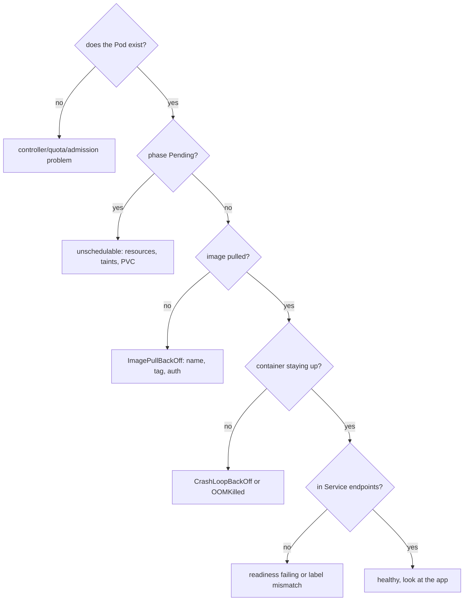
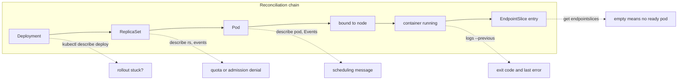

## Before you start

This topic assumes the rest of the chapter: `kubernetes-architecture` for which component owns which decision, `pod-lifecycle-and-scheduling` for phases and probes, `kubernetes-networking` for endpoints and policy, and `kubernetes-storage` for volume binding. Debugging is not separate knowledge — it is those four topics used backwards.

## In one sentence

Debugging Kubernetes means walking **down the reconciliation chain** — resource, controller, Pod, node, image, container, probe, endpoint — checking at each link whether the desired state got translated into the next thing, and stopping at the first link where it did not.

## Why it matters

The difference between an engineer who takes twenty minutes and one who takes four hours is almost never command knowledge. It is method.

Without a method you pattern-match. You see `CrashLoopBackOff`, remember it was a bad env var last time, check env vars, find nothing, and start restarting things. Every check is a guess, and a guess that comes back clean teaches you nothing because you never had a hypothesis.

With a method, each step **eliminates a class of causes**. By the time you reach the broken link you already know it is not the six things above it. This also happens to be how senior interviews are structured: given a symptom, the interviewer is watching whether you narrow the space systematically or start listing commands.

## The intuition

Think of a factory order travelling down an assembly line. Paperwork arrives, a supervisor turns it into a work order, the work order is assigned to a station, parts are fetched, the item is assembled, and finally it passes inspection and goes on the shipping shelf.

When a customer says "my order never arrived", you do not inspect the shipping shelf and guess. You **walk the line from the start** and find the last station where the order was present. Everything upstream of that station is proven fine. Everything downstream never got the chance to run.

Kubernetes has the same line, and it is exactly the chain of components from `kubernetes-architecture`:

paperwork (**Deployment**) → work order (**ReplicaSet**) → item (**Pod**) → station assigned (**node bound**) → parts fetched (**image pulled**) → assembled (**container running**) → inspected (**probes passing**) → on the shelf (**in EndpointSlices**).

One question per link, asked in order. The first "no" is your answer, and you stop.

## How it actually works



### The chain, with the specific check at each link



The chain has seven links. Each row is one question, the command that answers it, and the class of cause you have found if the answer is no:

| # | Question | Command | If no, the cause is |
|---|---|---|---|
| 1 | Resource as you intended? | `get deploy -o yaml` | Wrong context, GitOps drift, bad image tag |
| 2 | Did a controller act? | `describe rs` | ResourceQuota, admission webhook, PSS, missing ServiceAccount |
| 3 | Was it scheduled? | `get pod -o wide` (`NODE`) | Insufficient requests, taints, affinity, unbound PVC |
| 4 | Did the image pull? | `describe pod` events | Bad name/tag, registry auth, node cannot reach registry |
| 5 | Container up and staying up? | `logs --previous` | App error, OOMKill, no foreground process |
| 6 | Probes passing? | `get pod` READY column | Probe path/port wrong, or it tests a dependency |
| 7 | In the Service endpoints? | `get endpointslices` | Label mismatch **or** failing readiness |

Three links deserve elaboration because they are where people get stuck.

**Link 2 is the one everyone skips.** A Deployment showing `DESIRED 3, CURRENT 0` means the ReplicaSet controller tried to create Pods and was refused. Those refusals are invisible on the Pod because no Pod was ever created, so `kubectl describe rs` is the only place the reason appears. This is exactly why "there are no Pods to debug" feels like a dead end.

**Link 3 hands you the answer verbatim.** `kubectl describe pod` states the scheduling failure with counts — `0/5 nodes are available: 3 Insufficient cpu, 2 node(s) had untolerated taint`. That message is the diagnosis, not a hint. Remember that only **requests** count toward the resource filter, and requests are reserved whether or not they are used.

**Link 5 splits on the exit code**, which is the highest-value distinction in this topic because these cases look identical in `kubectl get pods`:

| Exit code | Signal | Means | Fix |
|---|---|---|---|
| 0 | — | Process completed; no long-running foreground process | A design mistake, not a crash |
| 1 (or small) | — | Application failed: config, missing env var, dead startup dependency | Read `logs --previous` |
| 137 | SIGKILL | **OOMKilled** — exceeded the memory limit | Raise the limit or fix consumption |
| 143 | SIGTERM | Terminated normally | Often an over-eager liveness probe |

`kubectl logs --previous` is essential here: the container running *right now* is a fresh one that may have logged nothing yet, so plain `kubectl logs` often returns empty or a truncated startup. `--previous` gives you the instance that actually died. Confirm an OOMKill via `lastState.terminated.reason`, and watch for the case where a *sidecar* was killed rather than your app.

### describe and its Events section

`kubectl describe pod` is the highest-value first command, because of the **Events** section at the bottom — that is where components explain what they tried. Read bottom-up: `FailedScheduling` then `Scheduled` then `Pulled` then `Unhealthy` tells a complete story of waiting, placement, a clean pull, and now-failing health checks.

**The trap: events expire**, with a default TTL of about one hour. On a Pod broken since yesterday, an empty Events section means *nothing at all* — not "no problems occurred". People read it as reassurance and go looking elsewhere. For older problems use `status.containerStatuses[].lastState`, the restart count, or log aggregation. And because events are per-object, `kubectl get events --sort-by=.lastTimestamp` across the namespace often reveals a cluster-level cause — a node going `NotReady`, a quota exhausted — that no single Pod's description shows.

### Getting inside the container

`kubectl exec -it pod -- sh` fails in two situations that matter. If the container has **crashed** there is no process to attach to, so use `--previous` logs or run a copy with the entrypoint replaced:

```bash
# Run a copy with a shell instead of the real entrypoint, so it stays up
kubectl debug my-pod --copy-to=my-pod-debug --container=app -it --image=busybox -- sh
```

If the image is **distroless**, there is no shell to exec *with* and you get `executable file not found`. This is increasingly common, since distroless is the right security default (see `container-images-and-oci`). The answer is **ephemeral containers**, which attach a new container into the *running* Pod without restarting it:

```bash
# Attach a debug container into the live pod — shares its network namespace
kubectl debug -it my-pod --image=nicolaka/netshoot --target=app
# Now curl localhost:8080/healthz exactly as the kubelet's probe would
```

Sharing the network namespace is the point: you test the readiness endpoint from precisely the probe's perspective, which instantly separates "the app is not listening" from "the probe path is wrong".

### Timeout with no verdict

One signature sends people down the wrong path for hours. A Pod starts, logs a few lines, then **hangs forever with no error** — no crash, no restart, nothing in the events.

When a process waits on a network call and never receives *any* answer, that means packets are being **dropped**, not rejected, and the usual culprit is an egress NetworkPolicy silently black-holing every unlisted destination. The reasoning generalises well beyond Kubernetes:

- **A rejection answers you.** Bad credentials return 401/403, a bad hostname returns NXDOMAIN, a closed port returns connection-refused immediately. Every one is a *verdict*, and verdicts appear in your logs.
- **A drop says nothing.** The packet vanishes and the client waits out its full timeout. No verdict, no log line, no event.

So a hang with no verdict is evidence about the network path, not about auth or the image. Confirm it in seconds by attaching a netshoot ephemeral container and checking for established sockets — zero connections plus a hang rather than a refusal points at egress policy, then the CNI, then cloud firewall rules. The corollary matters just as much: if the failure *did* produce an error message, the path works and you should read that message instead of suspecting the network. **Classify the failure as verdict-or-silence before theorising about causes**, because those two branches share almost no causes.

## Worked example

The method as one script. Give it a Deployment name and it walks the chain and stops at the first broken link:

```js
const { execFileSync } = require('node:child_process');

const kube = (args) => {
  try { return execFileSync('kubectl', args, { encoding: 'utf8', stdio: ['ignore','pipe','pipe'] }); }
  catch (e) { return null; }
};
const j = (args) => { const o = kube([...args, '-o', 'json']); return o ? JSON.parse(o) : null; };

const [ns, name] = [process.argv[2] || 'default', process.argv[3]];

// LINK 1: does the resource exist as intended?
const dep = j(['get', 'deploy', name, '-n', ns]);
if (!dep) { console.log(`STOP link1: no Deployment ${ns}/${name}`); process.exit(0); }
console.log(`link1 ok: image=${dep.spec.template.spec.containers[0].image} replicas=${dep.spec.replicas}`);

// LINK 2: did a controller turn it into Pods? Zero pods means quota/admission/webhook.
const sel = Object.entries(dep.spec.selector.matchLabels).map(([k, v]) => `${k}=${v}`).join(',');
const pods = j(['get', 'pods', '-n', ns, '-l', sel]).items;
if (pods.length === 0) {
  console.log('STOP link2: no Pods created — read the ReplicaSet events for quota/admission denial');
  console.log(kube(['get', 'events', '-n', ns, '--field-selector', 'involvedObject.kind=ReplicaSet']));
  process.exit(0);
}
console.log(`link2 ok: ${pods.length} pods exist`);

for (const p of pods) {
  const n = p.metadata.name;
  // LINK 3: scheduled? spec.nodeName is the scheduler's entire output.
  if (!p.spec.nodeName) { console.log(`STOP link3 ${n}: unscheduled — describe names the failed filter`); continue; }

  const cs = (p.status.containerStatuses || [])[0];
  const w = cs?.state?.waiting?.reason;
  // LINK 4: image pulled?
  if (w === 'ImagePullBackOff' || w === 'ErrImagePull') { console.log(`STOP link4 ${n}: ${w} — name, tag or auth`); continue; }

  // LINK 5: container staying up? The exit code partitions the cause.
  const last = cs?.lastState?.terminated;
  if (w === 'CrashLoopBackOff') {
    const code = last?.exitCode;
    const why = code === 137 ? 'OOMKilled — memory limit' : code === 143 ? 'SIGTERM — likely liveness probe'
              : code === 0 ? 'exited 0 — no foreground process' : 'app-level failure, read logs --previous';
    console.log(`STOP link5 ${n}: CrashLoopBackOff exit=${code} => ${why}`);
    continue;
  }

  // LINK 6: probes passing?
  if (!cs?.ready) { console.log(`STOP link6 ${n}: Running but not ready — readiness probe or a dependency`); continue; }
  console.log(`${n}: ready on ${p.spec.nodeName}`);
}

// LINK 7: in the Service endpoints?
for (const svc of j(['get', 'svc', '-n', ns]).items) {
  if (!svc.spec.selector) continue;
  const slices = j(['get', 'endpointslices', '-n', ns, '-l', `kubernetes.io/service-name=${svc.metadata.name}`]);
  const addrs = (slices?.items || []).flatMap((s) => (s.endpoints || []).flatMap((e) => e.addresses));
  if (addrs.length === 0) console.log(`STOP link7 svc/${svc.metadata.name}: NO endpoints — check labels AND readiness`);
}
```

Against a broken cluster:

```
link1 ok: image=my-api:1.4.2 replicas=3
link2 ok: 3 pods exist
STOP link5 api-7d9f8b7c4c-k2xqp: CrashLoopBackOff exit=137 => OOMKilled — memory limit
STOP link6 api-7d9f8b7c4c-mn4zt: Running but not ready — readiness probe or a dependency
api-7d9f8b7c4c-p8vwl: ready on kind-worker2
STOP link7 svc/api: NO endpoints — check labels AND readiness
```

That output is a diagnosis, not data. Links 1 and 2 are proven fine, one Pod needs more memory, one is failing readiness, and the Service is serving nothing despite one ready Pod — which means the ready Pod's labels do not match the selector. Three distinct problems, correctly separated, in one pass.

## A second example — when it gets harder

The naive method is "read the error message". Here are the cases where the message is missing, misleading, or belongs to something else.

**No Pods at all.** A Deployment shows `0/3` and `kubectl get pods` is empty, so there is nothing to describe. Instinct says the Deployment is broken; the truth is a controller was refused. `kubectl describe rs` reveals it:

```
Warning  FailedCreate  replicaset-controller
  Error creating: pods "api-7d9f8b7c4c-" is forbidden:
  exceeded quota: compute-quota, requested: requests.memory=2Gi,
  used: requests.memory=14Gi, limited: requests.memory=16Gi
```

The entire explanation lives one level up the chain from where you were looking. Same pattern for a denying admission webhook, a missing ServiceAccount, or a Pod Security Standard violation.

**The error that is not the cause.** A Pod reports `ImagePullBackOff` and you spend twenty minutes on registry credentials. `kubectl get events` for the namespace shows the node went `NotReady` two minutes earlier — the pull failed because the node lost network. Fixing credentials would have achieved nothing. Per-object events tell you what happened *to that object*; namespace-wide events, sorted by time, tell you whether it was actually about that object at all.

**Empty events on an old problem.** A Pod has been `Pending` since yesterday. `kubectl describe` shows an empty Events section, someone concludes "no errors reported", and the scheduling message that would have named the exact failed filter expired hours ago. Recover it by deleting the Pod so the controller recreates it and the scheduler re-emits a fresh `FailedScheduling` event with the current reason.

**The hang with no verdict.** A Pod logs `initializing key provider` and stops. No error, no crash, no events. Hours get spent on credentials, RBAC, the image, and the secret contents — because a startup failure "should" be an auth problem. But an auth failure *answers*: it returns 403 and logs it. A hang that never receives any answer means the packets are being dropped, and the check takes seconds:

```bash
kubectl debug -it stuck-pod --image=nicolaka/netshoot --target=app
# inside:
ss -tan | grep -c ESTAB          # 0 established connections to anything external
timeout 5 nc -vz vault.internal 443   # hangs, rather than "refused" or connecting
```

Zero sockets and a hang, not a refusal, points at egress NetworkPolicy — check for a policy selecting these Pods that names `Egress` without allowing that destination. It is worth internalising the general rule, because it generalises well beyond Kubernetes: **classify the failure as verdict-or-silence before you theorise about causes.** A verdict means the path works and something decided to say no; silence means something in the path is discarding traffic. Those two branches share almost no causes, and picking the wrong one is how a one-hour problem becomes a one-day problem.

## Quick reference

The signature failures, and what each actually means:

| Signature | Phase | Really means | First check |
|---|---|---|---|
| `Pending`, no node | `Pending` | No node passed filtering | `describe pod` — the message names the filter |
| `ImagePullBackOff` | `Pending` | Bad name/tag, auth, or registry unreachable | `manifest unknown`=tag, `unauthorized`=creds, timeout=network |
| `Init:0/1` | `Pending` | Waiting on an init container | `logs <pod> -c <init-container>` |
| `CrashLoopBackOff`, exit 1 | `Running` | App exits on its own | `logs --previous` |
| `CrashLoopBackOff`, exit 137 | `Running` | OOMKilled by the memory limit | Raise limit, or fix the leak |
| `Running` but `0/1` READY | `Running` | Readiness failing; pulled from endpoints | Probe path/port, then dependencies |
| Service has no endpoints | n/a | Label mismatch **or** failing readiness | Both — they look identical |
| `Terminating` for minutes | `Running` | Grace period or a stuck finalizer | `preStop`, grace period, finalizers |

Note the `BackOff` suffix on the pull failures: the kubelet retries with increasing delay, so a corrected registry permission resolves itself within a couple of minutes with no restart needed.

| Signature | Points at |
|---|---|
| Error message returned | Path works; read the message |
| Hang, no verdict, zero sockets | Dropped packets: egress policy, CNI, firewall |
| Immediate connection refused | Wrong port, or app not listening |
| NXDOMAIN | Wrong name, or DNS/`ndots` problem |
| 403 / 401 | Genuine auth problem — it answered you |

## Common mistakes

- Guessing instead of walking the chain, so a clean check eliminates nothing because there was no hypothesis.
- Reading "no events" as "no problems". Events expire after about an hour; delete the Pod to get a fresh one.
- Using `kubectl logs` on a crash-looping container. The current container is new and often empty — you need `--previous`.
- Debugging a Pod that does not exist. Zero Pods is a ReplicaSet-level story: quota, admission, or RBAC.
- Trusting a per-object event without checking namespace-wide events for a node or quota problem that explains it.
- Reaching for `exec` on a distroless image and concluding the Pod is unreachable. Use `kubectl debug` with an ephemeral container.
- Checking only one cause of empty endpoints. Label mismatch and failing readiness are indistinguishable by symptom.
- Assuming a startup hang is an auth or credentials problem. Auth failures answer; hangs mean drops.
- Restarting Pods to make a symptom go away, which destroys the evidence — including the `--previous` logs.

## What interviewers ask

- **A Pod is stuck in `Pending`. Walk me through it.** — `kubectl describe pod` and read the scheduling message, which names the filter and the node counts. Then check requests against node allocatable (remembering requests are reserved regardless of use), taints versus tolerations, node affinity, and whether a PVC is unbound.
- **What is your first command for a broken workload?** — `kubectl describe`, for the Events section, since that is where the components explain what they tried. Then note that events expire in about an hour, so an empty section on an old problem means nothing.
- **`CrashLoopBackOff` — how do you diagnose it?** — `kubectl logs --previous` for the container that actually died, then the exit code: 137 is OOMKilled and a memory limit issue, 143 is SIGTERM and often an over-eager liveness probe, and a small non-zero code is the application failing for reasons the logs will state.
- **A Service has no endpoints. Diagnose it.** — Only two causes and both need checking: the selector does not match the Pods' labels, or no Pod is ready, since only ready Pods enter EndpointSlices. `READY 0/1` distinguishes them. DNS resolving proves nothing, because the ClusterIP exists independently of any backend.
- **How do you debug a distroless container with no shell?** — `kubectl debug` with an ephemeral container, which attaches into the running Pod sharing its network namespace, so you can test the readiness endpoint from exactly the probe's perspective without restarting anything.
- **A Deployment shows zero Pods. Where do you look?** — At the ReplicaSet, not the Pod, because no Pod was ever created. `kubectl describe rs` surfaces the `FailedCreate` reason: exceeded ResourceQuota, an admission webhook denial, a missing ServiceAccount, or a Pod Security Standard violation.
- **A Pod hangs at startup with no error at all. What do you suspect?** — Dropped packets rather than rejected ones, so an egress NetworkPolicy or firewall, not auth. An authentication failure returns a verdict you can read in the logs; silence with zero established sockets means something in the path is discarding traffic.

## Practice

1. Deliberately break a Deployment four ways — a wrong image tag, memory requests larger than any node, a memory limit far below actual use, and a readiness probe on a path the app does not serve. For each, predict the link at which your chain walk will stop *before* running anything, then verify. Note which two produce the same `kubectl get pods` output.
2. Set a namespace ResourceQuota lower than your Deployment needs and apply it. Confirm zero Pods exist, then find the explanation from the ReplicaSet's events. Write down why no amount of Pod-level debugging could have found this.
3. Deploy a distroless image with a readiness probe on `/healthz`, then break the probe by changing the port. Confirm `kubectl exec` fails for lack of a shell, use `kubectl debug` with a netshoot ephemeral container to curl the endpoint from inside the Pod's network namespace, and state whether the app or the probe was wrong. Finally add an egress NetworkPolicy with no DNS rule and contrast the failure signature with the probe failure.

## Where to go next

Continue to `observability-with-opentelemetry` — this chapter's method finds a broken cluster resource, and the next skill is having metrics, logs and traces already in place so you are not reconstructing history from events that expired an hour ago.
