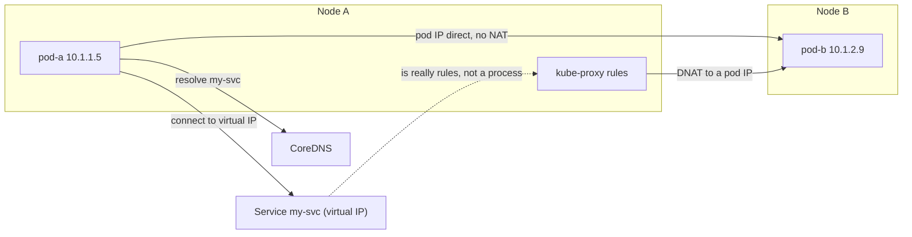
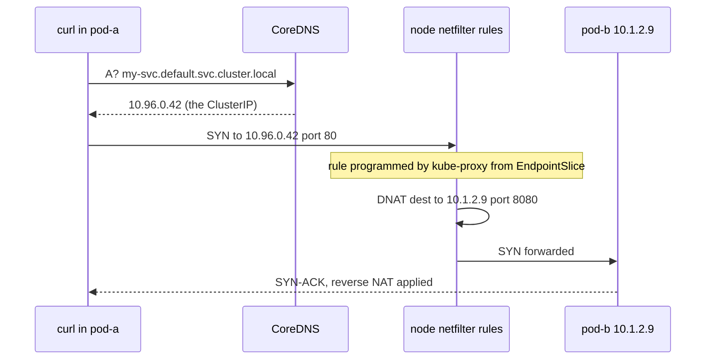

## Before you start

Read `kubernetes-architecture` first, for kube-proxy's role and the watch mechanism; `tcp-ip-udp` helps, since this is mostly about what happens to a packet's destination address. Service basics come from `kubernetes-basics` — here we open the Service up and look inside.

## In one sentence

Kubernetes gives every Pod its own IP address on one flat network where any Pod can reach any other without address translation, and a **Service** is not a server but a set of packet-rewriting rules programmed into every node's kernel.

## Why it matters

The single most common misconception in Kubernetes interviews is that a Service is a load balancer process sitting between your client and your Pods. It is not, and the difference explains real behaviour: why Services add almost no latency, why you cannot get path-based routing from one, why `tcpdump` on a Service IP finds nothing, and why a Service can exist happily while sending traffic nowhere.

Get this right and a whole class of "the DNS resolves but nothing connects" problems becomes readable.

## The intuition

Compare two ways to run a mail room.

**The proxy model** — the one most people assume — has a clerk at a desk. Every parcel goes to the clerk, who looks up the recipient and walks it over. The clerk is a real person in a real place: they add delay, they can be overwhelmed, and if they go home nothing moves.

**The rule model** — what Kubernetes actually does — has no clerk. Every sorting machine in the building is pre-programmed: "anything addressed to *Accounts* gets its label rewritten to desk 4B, 7C or 9A, pick one." The parcel never detours, there is nobody to overwhelm, and nobody to go home. The address is simply rewritten in flight.

A Service's ClusterIP is that *Accounts* label — an address no machine owns, existing only inside the rules. kube-proxy is not the clerk; it is the technician who walks around updating what the machines are programmed to do, then leaves. This is why kube-proxy can be restarted with no effect on existing traffic: the rules stay in the kernel.

## How it actually works



### The flat network model as a contract

Kubernetes does not implement pod networking. It specifies a contract and requires a plugin to satisfy it:

- Every Pod gets its own cluster-unique IP address.
- Every Pod can reach every other Pod's IP **without NAT**, on any node.
- Agents on a node (kubelet, for probes) can reach Pods on that node.
- A Pod sees its own IP as the same address others use to reach it.

That "without NAT" clause is the load-bearing one. It means no port mapping, no `-p 8080:80`, no port collisions between teams. Two Pods can both listen on port 80 because they have different IPs. An application can register its own IP in a service registry and other Pods can dial it directly — which is what makes service discovery and mesh sidecars possible at all.

### CNI: who actually satisfies the contract

A **CNI** (Container Network Interface) plugin is a binary the kubelet invokes when a Pod is created. It allocates an IP from the node's range, creates a virtual ethernet pair into the Pod's network namespace, and programs whatever routing cross-node traffic needs. On delete, it tears that down.

How plugins move packets between nodes is the main axis of difference. **Overlay/VXLAN** encapsulation wraps each pod packet inside a node-to-node UDP packet, which works on any underlying network without touching router config — the safe default, at the cost of a smaller usable MTU and CPU per packet. **Native/BGP routing** does no wrapping: nodes advertise their pod ranges as real routes so the physical network forwards pod IPs directly, which is faster and trivially debuggable with `traceroute` but needs a network that accepts those routes. **eBPF** attaches programs to kernel hooks, handling routing, load balancing and policy without the long iptables chain, and can replace kube-proxy entirely.

For a backend engineer the useful summary: Flannel is simple overlay networking, Calico is the policy-and-routing workhorse, Cilium is the eBPF option that also brings L7 awareness and better performance at scale.

### Service types as a progression

Each type builds on the previous one rather than replacing it. **ClusterIP** is the base case — a stable virtual IP reachable only inside the cluster — and every other type includes one. **NodePort** adds a port in the 30000–32767 range on *every* node, so hitting any node's IP works even where no backing Pod runs. **LoadBalancer** adds a cloud-provisioned external load balancer pointing at those node ports, which is how internet traffic arrives; the catch is one load balancer, IP and bill per Service, which is the direct motivation for Ingress.

Two types break the pattern. **ExternalName** does no proxying at all — CoreDNS simply returns a `CNAME` to an external hostname, which is handy for pointing an in-cluster name at a managed database, but because it is pure DNS your TLS certificate hostnames and HTTP `Host` headers still refer to the external name. **Headless** (`clusterIP: None`) deliberately has no virtual IP and no NAT rules, so DNS returns the **individual Pod IPs**. That is essential for StatefulSets, where you must address a specific replica (`db-0.db.default.svc.cluster.local`) rather than a random one — exactly what leader election or a shard-aware client needs.

### What a Service actually is

There is no proxy process in the data path. When you create a Service, the endpoint controller lists the Pods matching its selector and writes their IPs into **EndpointSlice** objects. kube-proxy watches those and programs the node's kernel:

| Mode | Mechanism | Scaling behaviour |
|---|---|---|
| iptables (default) | NAT rule chains; DNAT to a random backend, conntrack pins the connection | Rule evaluation roughly linear — slow updates at tens of thousands of Services |
| IPVS | In-kernel load balancer using hash tables | O(1) lookup, real balancing algorithms |
| eBPF (Cilium) | Programs at socket or driver level, often rewriting the destination before the packet is built | Replaces kube-proxy entirely |

The consequences of "rules, not a process" are worth stating explicitly. Nothing listens on a ClusterIP — you cannot meaningfully `ping` it and `tcpdump` on it shows nothing, because the address exists only as a match condition. Load balancing is per-**connection**, not per-request, so many HTTP requests over one keep-alive connection all land on the same Pod. And because the rules match on IP and port only, a Service **cannot** route by hostname, path or header — that requires reading the HTTP payload, which is what Ingress and Gateway API exist to do.



**EndpointSlices** link selector to reality. A selector is just a label query; the slices hold the resolved IPs, and crucially only **ready** Pods appear. They replaced a single Endpoints object that had to be rewritten in full on every change — a 5000-Pod Service produced enormous objects pushed to every node on each Pod restart. Slices cap at 100 endpoints, so one Pod change rewrites one small slice.

### Cluster DNS and the ndots trap

**CoreDNS** runs as a Deployment, watches the API for Services, and serves records under `cluster.local` in the shape `<service>.<namespace>.svc.cluster.local`. The kubelet points every Pod's `/etc/resolv.conf` at it.

That resolv.conf also carries `options ndots:5`, which means: if a name has fewer than five dots, try every search-path entry **before** trying it as an absolute name. So `api.github.com` has two dots and gets tried as `api.github.com.default.svc.cluster.local`, then `.svc.cluster.local`, then `.cluster.local`, then the node's search domains — four or more NXDOMAIN round trips, each usually doubled by IPv4 and IPv6 lookups, before the real answer.

The result is measurable latency on every external call plus needless CoreDNS load, and it hits hardest on short-lived connections that resolve repeatedly. Fixes: a trailing dot to make the name absolute (`api.github.com.`), a lower `ndots` via `dnsConfig`, NodeLocal DNSCache, or reusing connections so you resolve once (see `connection-reuse-and-handshake-cost`).

### NetworkPolicy: the default that surprises everyone

By default, **all Pod-to-Pod traffic is allowed**, across every namespace — a flat network with no NAT means total reachability.

A NetworkPolicy selects some Pods and, for the directions it mentions, flips them to default-deny, with its rules as the exceptions. Two details cause most confusion. Policies are **additive and never deny**: there is no deny rule, and multiple policies selecting the same Pod are unioned, so you cannot block what another policy allows. And **merely mentioning a direction isolates it** — a policy listing `policyTypes: [Ingress, Egress]` with an empty egress rule set has just blocked all outbound traffic.

Egress is the notorious one. Restrict it and you very often forget to allow **DNS to CoreDNS on port 53**, so every lookup fails and the app reports errors that look like the remote service being down. The other classic is outbound calls to cloud services hanging with no error at all, because policy **drops** packets rather than rejecting them. **A dropped packet produces a timeout; a refused connection produces an immediate error.** That distinction is the fastest way to separate "network policy" from "wrong credentials" — an auth failure answers you, a policy does not.

## Worked example

A Service, a headless Service, and a policy — the three things you will actually write:

```yaml
apiVersion: v1
kind: Service
metadata:
  name: my-svc
spec:
  selector:
    app: web            # a label QUERY, not a list; EndpointSlices hold the resolved IPs
  ports:
    - port: 80          # the ClusterIP port clients dial
      targetPort: 8080  # the container port DNAT rewrites the packet to
---
apiVersion: v1
kind: Service
metadata:
  name: db
spec:
  clusterIP: None       # headless: no virtual IP, no NAT; DNS returns pod IPs directly
  selector:
    app: db
  ports:
    - port: 5432
---
apiVersion: networking.k8s.io/v1
kind: NetworkPolicy
metadata:
  name: web-egress
spec:
  podSelector:
    matchLabels: { app: web }
  policyTypes: [Egress]  # naming Egress here makes egress default-deny for these pods
  egress:
    - to:                # WITHOUT this block, every DNS lookup fails
        - namespaceSelector:
            matchLabels: { kubernetes.io/metadata.name: kube-system }
      ports:
        - { protocol: UDP, port: 53 }
        - { protocol: TCP, port: 53 }
    - to:
        - podSelector:
            matchLabels: { app: db }
      ports:
        - { protocol: TCP, port: 5432 }
```

Verify the machinery from inside the cluster:

```bash
# The selector resolved to actual ready pod IPs
kubectl get endpointslices -l kubernetes.io/service-name=my-svc \
  -o jsonpath='{.items[*].endpoints[*].addresses[*]}'
# 10.1.2.9 10.1.3.14 10.1.1.22

# Headless DNS returns every pod, not one virtual IP
kubectl run t --rm -it --image=busybox:1.36 --restart=Never -- nslookup db.default.svc.cluster.local
# Address 1: 10.1.2.9  db-0.db.default.svc.cluster.local
# Address 2: 10.1.3.14 db-1.db.default.svc.cluster.local

# The rule that IS the Service (iptables mode)
kubectl debug node/kind-worker -it --image=nicolaka/netshoot -- \
  iptables -t nat -L KUBE-SERVICES -n | grep my-svc
# KUBE-SVC-XYZ  tcp dpt:80  /* default/my-svc cluster IP */  10.96.0.42
```

That last output is the whole point of the topic: the Service is a NAT rule, and you just read it.

Quantify the `ndots` cost with plain Node.js:

```js
const dns = require('node:dns').promises;

async function timeResolve(name) {
  const t = process.hrtime.bigint();
  try { await dns.resolve4(name); } catch { /* NXDOMAIN still costs the round trips */ }
  return Number(process.hrtime.bigint() - t) / 1e6;
}

(async () => {
  // Two dots: fewer than ndots:5, so the search path is tried first.
  console.log('api.github.com  :', (await timeResolve('api.github.com')).toFixed(1), 'ms');
  // Trailing dot makes it absolute — the search path is skipped entirely.
  console.log('api.github.com. :', (await timeResolve('api.github.com.')).toFixed(1), 'ms');
})();
```

```
api.github.com  : 41.7 ms
api.github.com. : 5.2 ms
```

Roughly 36ms of pure search-path overhead, paid on every fresh resolution in the cluster.

## A second example — when it gets harder

The naive model: "DNS resolved, so the network is fine." Here is the case that breaks it.

You deploy a Service and a Deployment. `nslookup my-svc` returns `10.96.0.42` immediately. `curl my-svc` hangs and times out. Nothing in any log.

DNS working proves only that the **Service object** exists — CoreDNS builds a record from the Service and never checks whether any Pod backs it. The ClusterIP is allocated at creation and resolves forever, backends or not.

Check the endpoints and the list is empty. Now there are exactly two causes, and you must check both:

1. **Selector/label mismatch.** The Service selects `app: web`; the Pods are labelled `app: web-api`. Compare `kubectl get svc my-svc -o jsonpath='{.spec.selector}'` against `kubectl get pods --show-labels`, character by character, since this is usually a typo or a stale label.
2. **Readiness failing.** The labels match perfectly, but no Pod is ready, and only ready Pods enter EndpointSlices. `kubectl get pods` shows `Running` with `0/1` READY.

Same symptom, same empty list, entirely different fixes. Note the signature too: with no endpoints there is no DNAT rule to match, so packets are dropped and you get a **timeout**, not a connection refused — the same tell as the egress-policy case, for the same reason.

The genuinely subtle version involves per-connection balancing. A client using HTTP keep-alive opens one connection, DNAT pins it to one Pod, and every later request rides it. Scale from 2 replicas to 10 under load and traffic does not rebalance — existing connections stay put, so 8 new Pods idle while the original 2 stay saturated. Nothing is broken; the Service is balancing connections exactly as designed, and you wanted requests balanced. This is much of why teams adopt a mesh or an L7 proxy for internal traffic (see `service-discovery-and-mesh`), and why gRPC — long-lived HTTP/2 connections carrying many streams — is famously badly balanced by a plain ClusterIP.

## Quick reference

| Type | Gets a ClusterIP | Reachable from | Use for |
|---|---|---|---|
| `ClusterIP` | Yes | Inside cluster only | Internal service-to-service |
| `NodePort` | Yes | Any node IP + high port | Dev, or behind your own LB |
| `LoadBalancer` | Yes | Internet, via cloud LB | Public entry (one LB per Service) |
| `ExternalName` | No | DNS CNAME only | Pointing a cluster name at a managed service |
| Headless | No (`None`) | Individual pod IPs via DNS | StatefulSets, addressing a specific replica |

| Symptom | Likely cause | Command |
|---|---|---|
| DNS resolves, connection times out | Empty endpoints, or egress policy drop | `kubectl get endpointslices` |
| Empty endpoints, Pods `Running` | Readiness failing, or selector mismatch | Check READY column, then compare labels |
| Connection **refused** immediately | Something answered and said no — app or port, not policy | Check `targetPort` vs the listening port |
| Slow external DNS | `ndots:5` search-path expansion | Trailing dot, or `dnsConfig` |
| New replicas get no traffic | Per-connection balancing with keep-alive | Needs L7 balancing or a mesh |
| All name lookups fail after a policy | Egress policy without a DNS allow rule | Add UDP/TCP 53 to kube-system |

## Tools & frameworks

| Tool | What it's for | Reach for it when |
|---|---|---|
| [Services docs](https://kubernetes.io/docs/concepts/services-networking/service/) | ClusterIP, NodePort, LoadBalancer, headless | You need the model everything else builds on |
| [Cilium](https://docs.cilium.io/en/stable/) | eBPF CNI, network policy and observability | You want policy enforcement and visibility in the same layer, including default-deny egress rules |
| [CoreDNS](https://coredns.io/manual/toc/) | Cluster DNS and its configuration | Service resolution is failing or slow — `ndots` is the classic culprit |
| [Gateway API](https://gateway-api.sigs.k8s.io/) | North-south traffic entry | The question is external traffic reaching the cluster, as distinct from pod-to-pod |

A default-deny egress NetworkPolicy silently blocking outbound traffic looks exactly like an auth or DNS failure — check policy before you re-read your credentials.

## Common mistakes

- Describing a Service as a proxy or load balancer process. It is NAT rules in every node's kernel, which is why it adds no hop and cannot do L7 routing.
- Concluding the network is healthy because DNS resolves. A ClusterIP resolves whether or not any Pod backs it.
- Checking only one cause of empty endpoints. Selector mismatch and failing readiness produce identical symptoms.
- Confusing `port` and `targetPort`. `port` is what clients dial on the ClusterIP; `targetPort` is what the container listens on.
- Expecting a Service to balance requests. It balances connections, so keep-alive and gRPC pin traffic to one Pod.
- Writing an egress NetworkPolicy without allowing DNS on port 53, then debugging the application instead of the policy.
- Assuming NetworkPolicy is default-deny. Everything is allowed until a policy selects a Pod, and then only for the directions that policy names.

## What interviewers ask

- **How does a Service actually route traffic to Pods?** — kube-proxy watches EndpointSlices and programs iptables/IPVS/eBPF rules on every node; traffic to the ClusterIP is DNAT'd straight to a Pod IP, with conntrack keeping the connection consistent. There is no proxy process and no extra hop, which is exactly why a Service cannot route on host or path.
- **What is the Kubernetes network model?** — Every Pod gets a unique IP and can reach every other Pod without NAT, on any node. Kubernetes only specifies the contract; a CNI plugin implements it via overlay encapsulation, native routing, or eBPF.
- **A Service has no endpoints. How do you diagnose it?** — Either the selector does not match the Pods' labels, or no Pod is ready, since only ready Pods enter EndpointSlices. Check the READY column and compare labels — and note DNS still resolves, so resolution succeeding proves nothing.
- **Why is a headless Service needed?** — It skips the virtual IP so DNS returns individual Pod IPs, letting you address one specific replica by ordinal. StatefulSet workloads need per-replica identity, not a random backend.
- **What is `ndots:5` and why does it matter?** — Names with fewer than five dots are tried against the whole cluster search path before being treated as absolute, so every external lookup costs several extra NXDOMAIN round trips. A trailing dot or a lower `ndots` removes it.
- **Are Pods isolated by default?** — No, everything is allowed. A NetworkPolicy makes the Pods it selects default-deny for the directions it names, and since policies only ever allow, they are unioned together.
- **Why do new replicas sometimes receive no traffic?** — Balancing is per-connection, so clients holding keep-alive connections keep hitting the original Pods. Rebalancing needs L7 load balancing or a mesh.

## Practice

1. Create a Service whose selector deliberately does not match its Deployment's labels. Confirm DNS still resolves the ClusterIP, then show the empty EndpointSlice. Fix the label and watch the endpoint appear. Explain to yourself why DNS was never a useful signal here.
2. From inside a Pod, resolve an external name with and without a trailing dot and measure both. Then read `/etc/resolv.conf`, count the search domains, and predict the number of failed lookups before observing them with `tcpdump` or CoreDNS logs.
3. Apply an egress NetworkPolicy allowing only TCP 5432 to a database Pod, and observe that your application now fails on every request. Identify the missing rule from first principles, add it, and articulate why the failure was a timeout rather than an immediate error.

## Where to go next

Continue to `ingress-and-gateway-api` — you have just seen that a Service matches only IP and port and cannot route on hostname or path, and that one `LoadBalancer` per Service does not scale. Ingress and Gateway API are the answer to both.
