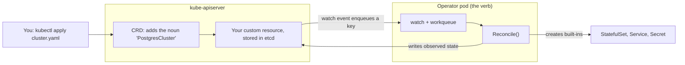
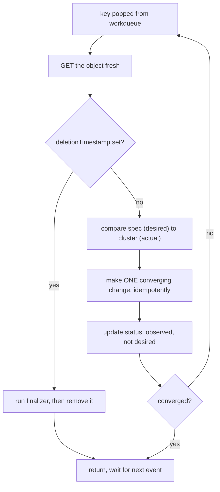

## Before you start

You need [kubernetes-architecture](kubernetes-architecture) for the apiserver and the controller pattern — an operator is a controller you wrote, so the loop you learned there is the loop here. Everything in [kubernetes-rbac-and-security](kubernetes-rbac-and-security) matters too, because operators need broad permissions and are a common place over-privileged ServiceAccounts arrive.

## In one sentence

A **Custom Resource Definition** (CRD) adds your own object type to the Kubernetes API, and an **operator** is the controller that watches those objects and does the work — together, a new noun plus the loop that knows how to run it.

## Why it matters

Kubernetes ships with controllers for its own nouns. A Deployment controller knows what a rollout means. Nothing built in knows what *your* system means.

Take PostgreSQL with replication. The desired state is not "three Pods". It is one primary and two replicas following its write-ahead log, a failover procedure that promotes a replica and repoints clients, nightly base backups, and a major-version upgrade that dumps and reloads in the right order. That knowledge normally lives in a runbook a human follows at 3am, badly, under pressure.

An operator is that runbook as code, running continuously. And once it is in a controller, `kubectl get postgrescluster` works, RBAC applies, GitOps reconciles it, and your database is managed by the same declarative machinery as everything else.

The catch, worth saying in interviews: **operators are frequently over-adopted**, because writing a correct one is hard — mostly for the reason below.

## The intuition

Think about installing a new appliance in a smart home.

The hub understands a fixed set of device types. Add a coffee machine it has never seen and two things are needed: a **description** of what a coffee machine is — bean level, water level, schedule, and the valid values for each — and a **driver** that knows how to talk to that machine and make its state match what you asked for.

The CRD is the description; the operator is the driver. Neither is useful alone: a CRD with no controller is a database row that does nothing, and a controller with no CRD has no vocabulary to be instructed in.



Now the crucial part. A **bad** driver listens for "the user pressed brew" and reacts to that event: miss it and nothing happens, receive it twice and you get two coffees. A **good** driver instead looks at the machine, looks at what was asked for, and closes the gap — and can be asked to do that as often as you like with no harm. That difference has a name, and it is the whole topic.

## How it actually works

### CRDs: the schema, and the spec/status split

A CRD registers a new API type. Once applied, the apiserver serves `/apis/<group>/<version>/<plural>` and the usual machinery — `kubectl`, RBAC, watches, labels, events, GitOps — works on it for free. That inheritance is why extending Kubernetes beats building a side API.

The schema is **OpenAPI v3** validation, enforced by the apiserver, so bad input is rejected at admission rather than confusing your controller later. Real schemas do real work: enums, minimums and maximums, `required` fields, defaults, and CEL rules for cross-field constraints.

Every custom resource is split in two, and the split is load-bearing. **`spec` is desired state, owned by the user**: the operator reads it and must never write it, because a controller that "fixes" a spec value gets reverted by the user's next `kubectl apply` and you have built a fight. **`status` is observed state, owned by the controller**: the user reads it and never writes it. Status is a **subresource**, with its own endpoint and RBAC verb, so a controller can be granted `patch` on status without permission to change spec.

The rule that follows is easy to state and easy to violate: **never store controller state in `spec`, and never decide by reading `status`.** Status is a report, not a memory. A controller deciding from status is remembering — and remembering breaks the moment status is stale, the controller restarts, or someone edits the object.

CRDs also carry **versions**. You can serve `v1alpha1` and `v1` at once, marking one as the storage version, with a **conversion webhook** so old clients keep working while you migrate. That is the sane path for evolving an API; the alternative, breaking every existing resource, is why people fear CRD upgrades.

### The reconcile loop: level-triggered, not edge-triggered

This is the single most important design point, and the source of most bad operators.

**Edge-triggered** means reacting to transitions: "a resource was created", "a field changed". **Level-triggered** means reacting to current state: "here is what is desired and here is what exists — close the gap."

Kubernetes controllers are level-triggered. Events are only a *hint that it is worth looking again*. Your `Reconcile` function is not handed "what happened" but an object's **name and namespace**, and it must go and look — a controller-runtime signature takes a `Request` containing only a name, with no event payload, deliberately.

Two consequences follow. **Reconcile must be idempotent**, because it will be called repeatedly with nothing changed: periodic resyncs, operator restarts that re-list everything, unrelated field edits, watch reconnects. A hundred calls must be indistinguishable from one. And **Reconcile must not rely on having seen anything**, so no missed event can break it. That is why Kubernetes survives partitions, dropped watches and crashes: afterwards the controller re-lists and re-derives. There is no state to lose because it never kept any.



Two practical habits fall out. **Make one converging change per pass, then requeue** — do not reach the final state in a single invocation with sleeps inside it; return and let the next pass observe the result. And **be careful writing status**, since writing to the object you watch generates an event that reconciles you again. Patch only when the value actually changed, or you build an infinite loop.

### Finalizers and owner references

**Owner references** handle cleanup for free. Set `ownerReferences` on the objects your operator creates and Kubernetes garbage-collects them when the owner goes — no cleanup code at all, and the right default for anything in-cluster.

**Finalizers** handle what garbage collection cannot: external resources. Cloud load balancers, S3 buckets, DNS records, a managed database — Kubernetes knows nothing about these, so deleting the custom resource would orphan them and bill you forever.

A finalizer is a string in `metadata.finalizers`, and its effect is a contract:

1. `kubectl delete` does **not** remove the object; the apiserver sets `metadata.deletionTimestamp`.
2. The object is now `Terminating`, and your controller sees the timestamp.
3. Your controller does the external cleanup, then **removes its own finalizer string**.
4. Only when `finalizers` is empty does the apiserver actually delete the object.

Which produces the most memorable operational trap in Kubernetes. **A namespace stuck in `Terminating` forever is almost always a stuck finalizer.** Deleting a namespace requires deleting everything in it; if one object carries a finalizer whose controller is gone — uninstalled, or crash-looping — nobody will ever remove that string. The object never deletes, the namespace never empties, and it sits `Terminating` indefinitely. Hence the ordering rule: **delete the custom resources before uninstalling the operator.**

Diagnose it by finding the object that will not go:

```bash
kubectl api-resources --verbs=list --namespaced -o name \
  | xargs -n1 kubectl get -n stuck --ignore-not-found 2>/dev/null
# postgrescluster.db.example.com/orders   Terminating
```

Force-removing the finalizer is a last resort, not a fix:

```bash
kubectl patch postgrescluster orders -n stuck -p '{"metadata":{"finalizers":[]}}' --type merge
```

That deletes the Kubernetes object while **skipping the cleanup the finalizer existed to perform**, so the load balancer, bucket or managed database survives, unowned and still billing. The docs warn against exactly this. The correct fix is usually to get the controller running again and let it finish.

### When an operator is genuinely worth it

Be sceptical. A Helm chart is templating: it renders YAML at install time, then it is gone. An operator is a **running control loop** that keeps acting forever. So the question is whether there is ongoing operational work, or just installation work.

An operator earns its complexity when the answer is genuinely "ongoing": failover and promotion, backups and point-in-time restore, ordered version upgrades, resharding, scheduled certificate renewal. Databases, brokers and cert-manager qualify. A stateless web service does not, and templating-only needs are what Helm is for ([helm-and-templating](helm-and-templating)). "We wrote an operator" is often a costlier way to say "we have a Helm chart with a control loop bolted on" — and now you own a distributed system whose bugs corrupt state rather than merely failing an install.

**cert-manager** is worth studying because the case is unarguable. You declare a `Certificate`; it requests one from an issuer, stores the key pair in a Secret, and — the part templating fundamentally cannot do — **renews it before expiry, forever** ([certificate-lifecycle-and-rotation](certificate-lifecycle-and-rotation)).

## Worked example

A CRD with real validation, then a reconciler you can run.

```yaml
apiVersion: apiextensions.k8s.io/v1
kind: CustomResourceDefinition
metadata:
  name: postgresclusters.db.example.com   # MUST be <plural>.<group>
spec:
  group: db.example.com
  scope: Namespaced
  names:
    plural: postgresclusters
    singular: postgrescluster
    kind: PostgresCluster
    shortNames: ["pgc"]                   # kubectl get pgc
  versions:
    - name: v1
      served: true
      storage: true                       # exactly one version is the storage version
      subresources:
        status: {}                        # status gets its own endpoint and RBAC verb
        scale:
          specReplicasPath: .spec.replicas
          statusReplicasPath: .status.readyReplicas   # enables kubectl scale
      schema:
        openAPIV3Schema:
          type: object
          properties:
            spec:
              type: object
              required: ["replicas", "version"]
              properties:
                replicas:
                  type: integer
                  minimum: 1
                  maximum: 9              # the apiserver rejects 10 — no controller code
                version:
                  type: string
                  enum: ["15", "16"]      # invalid versions never reach your operator
                backupSchedule:
                  type: string
                  default: "0 2 * * *"    # defaulted at admission
            status:                       # controller-owned, never user-written
              type: object
              properties:
                phase:
                  type: string
                readyReplicas:
                  type: integer
      additionalPrinterColumns:           # what kubectl get shows
        - name: Phase
          type: string
          jsonPath: .status.phase
```

And a resource against it:

```yaml
apiVersion: db.example.com/v1
kind: PostgresCluster
metadata:
  name: orders
spec:
  replicas: 3
  version: "16"
```

Now the reconciler. This models the API server so you can watch level-triggered behaviour directly:

```js
// A level-triggered reconciler. It is NEVER told what happened —
// only what is desired (spec) and what exists (actual).

const cluster = { statefulSets: {}, services: {} };   // stands in for the API server

function reconcile(name, spec, status) {
  const actions = [];

  // Always DERIVE the desired shape from spec. Never from an event.
  const wantSts = { name: `${name}-db`, replicas: spec.replicas, version: spec.version };
  const wantSvc = { name: `${name}-db`, port: 5432 };

  if (!cluster.services[wantSvc.name]) {
    cluster.services[wantSvc.name] = wantSvc;
    actions.push(`create Service/${wantSvc.name}`);
  }

  const haveSts = cluster.statefulSets[wantSts.name];
  if (!haveSts) {
    cluster.statefulSets[wantSts.name] = { ...wantSts, ready: 0 };
    actions.push(`create StatefulSet/${wantSts.name} replicas=${wantSts.replicas}`);
  } else {
    // ONE converging change per pass, then requeue. Compare, don't remember.
    if (haveSts.version !== wantSts.version) {
      haveSts.version = wantSts.version; haveSts.ready = 0;
      actions.push(`update image to ${wantSts.version}`);
    } else if (haveSts.replicas !== wantSts.replicas) {
      haveSts.replicas = wantSts.replicas;
      actions.push(`scale to ${wantSts.replicas}`);
    } else if (haveSts.ready < haveSts.replicas) {
      haveSts.ready++;                       // a pod became Ready
      actions.push(`observed ready ${haveSts.ready}/${haveSts.replicas}`);
    }
  }

  const sts = cluster.statefulSets[wantSts.name];
  const ready = sts.ready === sts.replicas && sts.version === spec.version;

  // status is OBSERVED and controller-owned. Never read it to decide what to do.
  const newStatus = { readyReplicas: sts.ready, phase: ready ? 'Ready' : 'Progressing' };

  return { actions, status: newStatus, requeue: !ready };
}

function run(label, spec, status = {}) {
  console.log(`\n=== ${label} ===`);
  for (let pass = 1; pass <= 8; pass++) {
    const r = reconcile('orders', spec, status);
    status = r.status;
    const did = r.actions.length ? r.actions.join('; ') : 'no change (converged)';
    console.log(`pass ${pass}: ${did.padEnd(46)} phase=${status.phase} requeue=${r.requeue}`);
    if (!r.requeue) break;
  }
  return status;
}

let st = run('create, replicas=3', { replicas: 3, version: 'pg:16.1' });
st = run('called AGAIN with no change (idempotence)', { replicas: 3, version: 'pg:16.1' }, st);
st = run('user edits spec.replicas 3 -> 5', { replicas: 5, version: 'pg:16.1' }, st);
run('operator restarted, cache lost, spec unchanged', { replicas: 5, version: 'pg:16.1' }, {});
```

Output:

```
=== create, replicas=3 ===
pass 1: create Service/orders-db; create StatefulSet/orders-db replicas=3 phase=Progressing requeue=true
pass 2: observed ready 1/3                             phase=Progressing requeue=true
pass 3: observed ready 2/3                             phase=Progressing requeue=true
pass 4: observed ready 3/3                             phase=Ready requeue=false

=== called AGAIN with no change (idempotence) ===
pass 1: no change (converged)                          phase=Ready requeue=false

=== user edits spec.replicas 3 -> 5 ===
pass 1: scale to 5                                     phase=Progressing requeue=true
pass 2: observed ready 4/5                             phase=Progressing requeue=true
pass 3: observed ready 5/5                             phase=Ready requeue=false

=== operator restarted, cache lost, spec unchanged ===
pass 1: no change (converged)                          phase=Ready requeue=false
```

Four things to read out of that output. The first block **converges in steps**, one change per pass, requeueing until reality matches — nothing sleeps and waits.

The second is the point of the whole topic: called again with identical input it does **nothing**. Not a duplicate, not an error — nothing. That is idempotence, and it is why the loop is safe to run continuously.

The third shows a spec edit handled with no notion of "a change event arrived". It compared and found a difference, and the same code path would handle the object being restored from a backup or created for the first time.

The fourth is the strongest: the operator restarted with **empty status**, every scrap of memory gone, and still did the right thing, because the answer was derivable from spec and the cluster. An edge-triggered controller would be lost here — it missed every event while down and has no record of what it already did.

## A second example — when it gets harder

The reconciler above ignores deletion, and adding it is where subtlety appears. Suppose each cluster also provisions an external S3 bucket for backups.

```js
const FINALIZER = 'db.example.com/backup-bucket';

function reconcileWithDeletion(obj, externalBuckets) {
  // Handle deletion FIRST — before any create/update logic.
  if (obj.metadata.deletionTimestamp) {
    if (!obj.metadata.finalizers.includes(FINALIZER)) {
      return { action: 'nothing to do; apiserver will delete it', done: true };
    }
    // Idempotent: the bucket may already be gone from a previous attempt.
    if (externalBuckets.has(obj.metadata.name)) {
      externalBuckets.delete(obj.metadata.name);
      return { action: 'deleted S3 bucket; requeue to drop finalizer', done: false };
    }
    obj.metadata.finalizers = obj.metadata.finalizers.filter((f) => f !== FINALIZER);
    return { action: 'removed finalizer -> object can now actually delete', done: true };
  }

  // Add the finalizer BEFORE creating the external thing, or a crash in between
  // leaks a bucket with nothing recording that it exists.
  if (!obj.metadata.finalizers.includes(FINALIZER)) {
    obj.metadata.finalizers.push(FINALIZER);
    return { action: 'added finalizer; requeue before provisioning', done: false };
  }
  if (!externalBuckets.has(obj.metadata.name)) {
    externalBuckets.add(obj.metadata.name);
    return { action: 'created S3 bucket', done: false };
  }
  return { action: 'converged', done: true };
}
```

Two orderings in that code are the whole lesson.

**Deletion is checked first.** A `Terminating` object still has a valid `spec`, so a reconciler that checks spec first will happily recreate the StatefulSet it is supposed to be tearing down, fighting the garbage collector.

**The finalizer is added before the external resource exists.** Reverse it and a crash between "created bucket" and "added finalizer" leaves a bucket with nothing recording it — a permanent leak. Adding the finalizer first means the worst case is a finalizer with nothing to clean up, which the idempotent path handles harmlessly.

The failure mode this produces is the one above. `kubectl delete` returns immediately and reports success, but the object sits in `Terminating`:

```bash
kubectl delete postgrescluster orders
# postgrescluster.db.example.com "orders" deleted     <- a LIE; it is Terminating

kubectl get postgrescluster orders -o jsonpath='{.metadata.finalizers}'
# ["db.example.com/backup-bucket"]

kubectl delete namespace app
# ... hangs forever in Terminating
```

Two more traps. **Reconciling on your own status writes**: patching status unconditionally is a change to an object you watch, which enqueues you again, which patches again — the loop spins forever, so patch only when the value differs. And **over-permissioned RBAC**: operators legitimately need broad permissions, and the path of least resistance is a ClusterRole with `*` on `*`, which means installing an operator hands cluster-admin to whatever that image contains. Scope it to the API groups it actually touches.

## Quick reference

| | `spec` | `status` |
|---|---|---|
| Owned by | The user | The controller |
| Means | Desired state | Observed state |
| Controller should | Read only | Write only |
| Decide from it? | **Yes** — this is the input | **No** — it is a report, not a memory |
| API surface | The main resource | A subresource, separately RBAC-controlled |

| | Edge-triggered | Level-triggered (Kubernetes) |
|---|---|---|
| Reacts to | "X happened" | "here is desired vs actual" |
| Missed event | Work is lost forever | Harmless — next pass re-derives |
| Called twice | Duplicates or errors | Identical to once |
| After a restart | Lost; no record of progress | Correct; re-lists and re-derives |
| Needs to remember | Yes | No |

| Mechanism | Use for | Failure mode |
|---|---|---|
| `ownerReferences` | Cleaning up in-cluster objects | None significant — prefer this |
| Finalizer | Cleaning up **external** resources | Stuck finalizer → object and namespace `Terminating` forever |
| CRD versions + conversion webhook | Evolving your API | Webhook down → resources unreadable |
| `status` subresource | Reporting progress | Unconditional writes → infinite reconcile loop |
| Operator vs Helm chart | Ongoing operations vs install-time templating | Operator adopted for templating = complexity with no payoff |

## Tools & frameworks

| Tool | What it's for | Reach for it when |
|---|---|---|
| [Custom Resources docs](https://kubernetes.io/docs/concepts/extend-kubernetes/api-extension/custom-resources/) | CRDs versus aggregated API servers | You are deciding whether you need an operator at all |
| [Kubebuilder](https://book.kubebuilder.io/) | Scaffold controllers in Go | You are writing a real operator — this is the standard path and where the ecosystem's examples live |
| [Operator SDK](https://sdk.operatorframework.io/docs/) | Go, Ansible or Helm operators | You want an operator without writing Go |
| [Metacontroller](https://metacontroller.github.io/metacontroller/) | Write controllers as webhooks in any language | Your team is Node or Python and Go is the actual blocker |
| [kubernetes-client/javascript](https://github.com/kubernetes-client/javascript) | Watch and reconcile from Node | You are building a small controller in TypeScript rather than adopting a framework |

Most teams should configure an existing operator rather than write one — and if you do write one, the reconcile loop must be idempotent and level-triggered, which is the single most common operator bug.

## Common mistakes

- Writing an edge-triggered controller that acts on "what changed" instead of comparing desired to actual. It breaks on the first missed event, restart or replay.
- A non-idempotent `Reconcile`, so the periodic resync creates duplicates or errors.
- Storing controller state in `spec`, which the user's next `apply` reverts, or deciding by reading `status`, which is a report rather than a memory.
- Patching status unconditionally, generating an event that reconciles you again — an infinite loop.
- Reaching for the final state in one invocation with sleeps inside it, rather than one change and a requeue.
- Checking `spec` before `deletionTimestamp`, so the controller recreates resources for an object being deleted.
- Adding a finalizer *after* creating the external resource, so a crash in between leaks it permanently.
- Uninstalling an operator before deleting its custom resources, guaranteeing stuck finalizers. Delete the CRs first.
- Force-removing a finalizer as the fix rather than a last resort, skipping the cleanup it existed to perform.
- A schema with no validation, so bad input becomes a controller bug instead of an admission rejection.
- Granting the operator `*` on `*`, making its ServiceAccount an escalation path to cluster-admin.
- Writing an operator when a Helm chart would do, because there is no ongoing operational work to encode.

## What interviewers ask

- **What is the difference between a CRD and an operator?** — The CRD adds the type, so the apiserver stores and serves your objects and `kubectl` and RBAC work on them. The operator is the controller that gives them behaviour. A CRD alone is inert storage; the pair is the operator pattern.
- **What does level-triggered mean, and why does Kubernetes work that way?** — The controller reacts to current state rather than events: handed a name, it fetches the object, compares desired to actual, and closes the gap. That makes missed events harmless and repeated calls safe, which is why the system survives partitions, dropped watches and restarts.
- **Why must `Reconcile` be idempotent?** — It will be called repeatedly with nothing changed: periodic resyncs, restarts that re-list everything, unrelated field edits, watch reconnects. A hundred calls must be indistinguishable from one, or normal operation creates duplicates.
- **Why separate `spec` from `status`?** — `spec` is user-owned desired state, `status` is controller-owned observed state — opposite ownership. Writing spec from the controller starts a fight with the user's next apply; deciding from status means remembering, which breaks on restart or staleness.
- **What are finalizers for?** — Cleanup ordering for what Kubernetes cannot garbage-collect: external resources like buckets, DNS records and cloud load balancers. Delete sets `deletionTimestamp` rather than removing the object; the controller cleans up, removes its finalizer, and only then does the apiserver delete it.
- **A namespace has been `Terminating` for an hour. What is happening?** — Almost certainly a stuck finalizer: some object carries one whose controller is gone or crash-looping, so nobody removes the string, the object never deletes, and the namespace never empties. Find it by listing all namespaced resources there. Force-patching clears the namespace but skips the cleanup it existed to do, leaking external resources.
- **When would you build an operator rather than ship a Helm chart?** — When there is ongoing operational work: failover, backups, restores, ordered upgrades, scheduled renewal. Helm renders YAML once and stops; an operator keeps acting. For install-time work a chart is right — operators are commonly over-adopted.
- **Why is cert-manager a good example?** — Its value is continuous: it issues a certificate, stores it in a Secret, and renews it before expiry forever. Renewal is work on a clock, which no install-time templating can do.

## Practice

1. Run the reconciler above, then break it deliberately: change the `else if` chain so one pass applies every difference at once, and describe what you lose in observability and safety versus converging over several passes.
2. Extend it so a `spec.version` change triggers a rolling replacement requiring each replica Ready before the next. Then call `reconcile` with an empty status mid-rollout and confirm it resumes — if it cannot, you built an edge-triggered controller.
3. Apply a CRD with a finalizer, delete the resource while the controller is scaled to zero, and watch the object and namespace stick in `Terminating`. Recover it both ways — restore the controller, and force-patch — then state exactly what the second approach leaked.

## Where to go next

Go to [gitops-and-argocd](gitops-and-argocd) — Argo CD is itself an operator reconciling `Application` custom resources against git, so you will recognise every mechanism here in a tool you already use. [platform-engineering](platform-engineering) then covers when a CRD is the right interface for your own developers versus complexity they never asked for.
