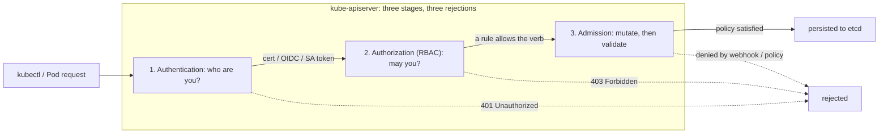
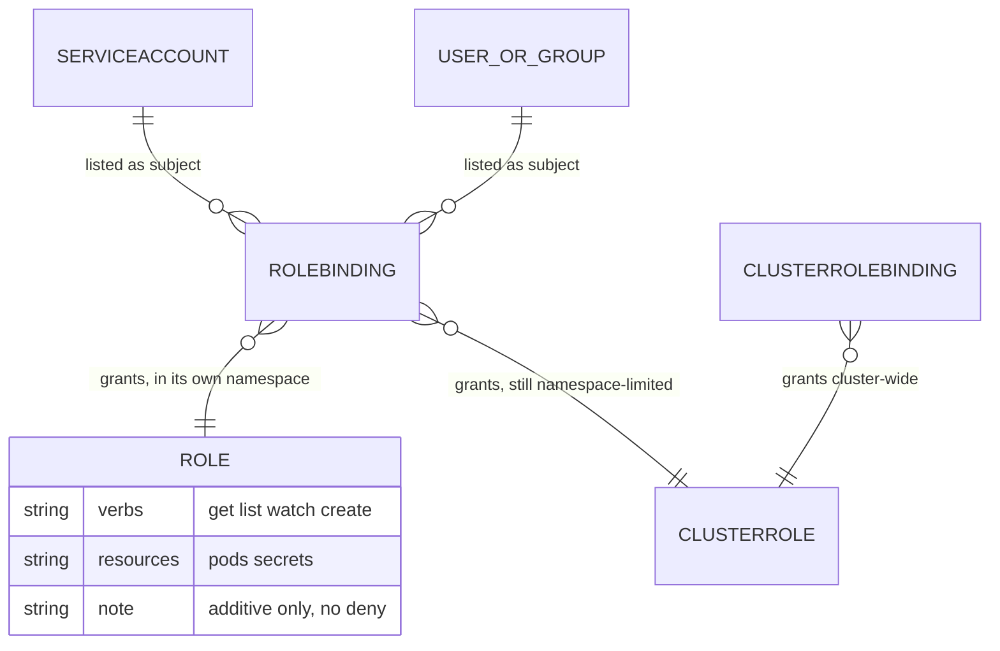

## Before you start

You need [kubernetes-architecture](kubernetes-architecture) for what the apiserver is and why every change funnels through it — that single choke point is what makes cluster security tractable. [authentication-authorization](authentication-authorization) covers tokens, OIDC and the general difference between proving who you are and being allowed to act; this topic is how Kubernetes implements both.

## In one sentence

Every change to a Kubernetes cluster is an HTTP request to one server, and that server runs each request through three separate gates — **authentication** (who are you), **authorization** (may you), and **admission** (is this object acceptable) — each of which rejects for a different reason.

## Why it matters

Kubernetes has no side doors. Creating a Pod, reading a Secret, draining a node — all of it is a REST call to the apiserver. That is good news for security: there is exactly one place to enforce policy rather than dozens.

It also means a loose permission costs more than it looks. A ServiceAccount that can `create pods` can mount any Secret in its namespace into a Pod it controls. One that can `list secrets` holds every credential in the namespace. These are not exotic exploits but the documented behaviour of permissions people grant to make an error message go away.

The practical failure is diagnostic: three gates produce three different rejections, and engineers who conflate them debug the wrong one — adding RBAC rules to fix an admission failure, or regenerating certificates to fix a 403. Knowing which gate said no is most of the fix.

## The intuition

Think of getting into a secure building for a meeting.

At the door a guard checks your **ID**. They do not care why you are here, only who you are. Fail and you get "I don't know who you are" — **authentication**, a **401**.

Past the door a receptionist checks your name against the access list for the floor you asked for. You are definitely you; you are simply not on the list — **authorization**, a **403**.

Inside the room a compliance officer inspects what you brought. Your ID is fine and you are on the list, but the laptop you carried in has no disk encryption, so it does not come in — or they hand you a compliant one instead. That is **admission control**, and it can either *modify* your request or *reject* it.



## How it actually works

### Stage 1 — Authentication: there are no users

The single most surprising fact: **Kubernetes has no User object.** You cannot `kubectl create user`. Identity comes from outside and is *asserted* to the apiserver by one of three mechanisms:

- **Client certificates.** The CN becomes the username, the O fields become groups. This is how `kubectl` works out of the box. Certificates cannot be revoked individually in Kubernetes, which is why long-lived user certificates are a bad habit — see [certificate-lifecycle-and-rotation](certificate-lifecycle-and-rotation).
- **OIDC tokens** from an external identity provider — the right answer for humans. Your SSO issues a token, the apiserver validates its signature and reads username and groups from claims, so offboarding happens in one place.
- **ServiceAccount tokens** — the only in-cluster identity, and the one for workloads.

A **ServiceAccount** is a real namespaced object that authenticates as `system:serviceaccount:<namespace>:<name>`. Every Pod gets one (the namespace's `default` if you do not choose), mounted at `/var/run/secrets/kubernetes.io/serviceaccount/token`.

Modern clusters use **projected, bound tokens**: short-lived and auto-refreshed by the kubelet, audience-scoped, and bound to the Pod's lifetime so they are useless once it is deleted — a large improvement on the old permanent Secret-backed tokens that never expired and worked from anywhere. Those same tokens let a workload trade cluster identity for cloud or vault credentials with no stored secret, the pattern in [workload-identity-and-spiffe](workload-identity-and-spiffe).

### Stage 2 — Authorization: RBAC's four objects and two rules

RBAC splits "what may be done" from "who may do it", which is why there are four objects and not two:

| | Defines permissions (the *what*) | Grants them (the *who*) |
|---|---|---|
| **Namespaced** | Role | RoleBinding |
| **Cluster-wide** | ClusterRole | ClusterRoleBinding |

A Role or ClusterRole is a list of rules, each combining **apiGroups**, **resources** and **verbs** (`get`, `list`, `watch`, `create`, `update`, `patch`, `delete`). A binding attaches one to **subjects** — users, groups, or ServiceAccounts. Two rules catch people.

**Rule one: a ClusterRole bound with a RoleBinding grants only within that namespace.** This combination confuses everyone, and it is deliberate — it lets you define a role like `secret-reader` once and reuse it in twenty namespaces without twenty copies. The docs are explicit that even though the RoleBinding refers to a ClusterRole, the subject can only read Secrets in the RoleBinding's own namespace. **The binding's scope wins, not the role's.**

So three combinations are meaningful and one does not exist:

- Role + RoleBinding → one namespace.
- ClusterRole + RoleBinding → *the same* permissions, still limited to one namespace.
- ClusterRole + ClusterRoleBinding → every namespace, plus cluster-scoped resources like nodes.
- Role + ClusterRoleBinding → **not a thing.** A namespaced Role cannot be granted cluster-wide.

**Rule two: RBAC is purely additive. There is no deny.** The docs state it flatly: "Permissions are purely additive (there are no 'deny' rules)." A request is allowed if *any* rule permits it, so you cannot grant broadly and carve out an exception like "all Secrets except the TLS ones". If someone needs less, grant less from the start. Anyone reasoning from firewall or IAM experience, where explicit deny overrides allow, gets this backwards.



Because permissions accumulate across every binding a subject appears in, reading YAML is a poor way to answer "can this thing do that". Ask the apiserver — `kubectl auth can-i` runs the real evaluation:

```bash
kubectl auth can-i list secrets --as=system:serviceaccount:prod:api
# no

kubectl auth can-i --list --as=system:serviceaccount:prod:api -n prod   # everything it CAN do
```

### Stage 3 — Admission: mutate, then validate

Authorization answers "may this subject perform this verb on this resource type" and says nothing about the object's *contents*. Nothing in RBAC can express "Pods must not run as root" — the verb is `create pods` either way.

That is admission control's job, in two ordered phases. **Mutating admission** runs first and may *change* the object: injecting a sidecar, adding labels, setting a resource request. Order matters, since a later mutator sees the earlier one's output. **Validating admission** runs second and may only accept or reject; it runs after all mutation so it judges the final object, otherwise a mutator could reintroduce what a validator had rejected.

Your options, roughly in order of weight:

- **Pod Security Admission** — built in, nothing to install. Label a namespace with one of three profiles (`privileged`, `baseline`, `restricted`) and a mode (`enforce`, `audit`, `warn`). It replaced **PodSecurityPolicy**, removed in v1.25, which was confusing because when multiple policies matched, which applied depended on an ordering nobody could predict. PSA is namespace-labelled and boring — that is the improvement.
- **ValidatingAdmissionPolicy** — in-tree policy in CEL, evaluated inside the apiserver. No webhook, no network hop, so it cannot time out or take the cluster down.
- **Policy engines** — **Kyverno** (policies are Kubernetes YAML) and **OPA Gatekeeper** (Rego, more expressive, steeper curve). Both mutate and validate, and handle cross-object logic CEL cannot.

One sharp note: a validating webhook with `failurePolicy: Fail` that becomes unreachable **blocks every matching request cluster-wide**. Point it at all Pods and a crashed webhook means no Pod can be created anywhere — including the webhook's own replacements. That self-inflicted outage is why in-tree policies are preferred where they suffice.

### Workload hardening that earns its place

```yaml
apiVersion: v1
kind: Pod
metadata:
  name: hardened
spec:
  serviceAccountName: app-sa
  automountServiceAccountToken: false   # no API token to steal; most Pods never need one
  securityContext:
    runAsNonRoot: true                  # refuse to start as UID 0
    runAsUser: 10001
    seccompProfile:
      type: RuntimeDefault              # blocks unusual syscalls
  containers:
    - name: app
      image: app@sha256:abc123...       # digest, not a mutable tag
      securityContext:
        allowPrivilegeEscalation: false # no setuid escape
        readOnlyRootFilesystem: true    # attacker cannot drop a binary and run it
        capabilities:
          drop: ["ALL"]                 # containers get ~14 by default; almost none are needed
      resources:
        limits:                         # a limit is a DoS control, not just a cost control
          cpu: "500m"
          memory: "512Mi"
```

Two deserve emphasis. `resources.limits` is a security control: without it one compromised or looping container consumes the node's CPU and memory and evicts its healthy neighbours — denial of service by resource exhaustion. And `automountServiceAccountToken: false` is the highest-leverage line here, because it removes the credential the main escalation path depends on.

### The realistic threat model

Forget cluster-breakout exotica. The common path is: an attacker gets code execution in a container (app vulnerability, malicious dependency, SSRF), reads the mounted ServiceAccount token, calls the apiserver from inside the cluster network, and does whatever that ServiceAccount can do. Every step after the first is *free* if the token is mounted and over-permissioned.

So the defence that matters is unglamorous: the default ServiceAccount should have no permissions, most Pods should not mount a token at all, and no workload should hold `get`/`list` on `secrets` or `create pods`.

`create pods` is dangerous because a Pod spec can mount any Secret in its namespace, `hostPath` the node's filesystem, request `hostNetwork`, or run privileged. So "can create Pods" is close to "can read everything here and possibly own the node" unless Pod Security Admission also constrains what those Pods may look like. RBAC and admission control are not alternatives; they close each other's gaps.

## Worked example

A least-privilege ServiceAccount — read one ConfigMap, nothing else — and then proof of its limits:

```yaml
apiVersion: v1
kind: ServiceAccount
metadata:
  name: app-sa
  namespace: prod
---
apiVersion: rbac.authorization.k8s.io/v1
kind: Role
metadata:
  name: config-reader
  namespace: prod            # a Role is ALWAYS namespaced
rules:
  - apiGroups: [""]          # "" is the core API group
    resources: ["configmaps"]
    resourceNames: ["app-config"]   # one named object, not all ConfigMaps
    verbs: ["get"]           # not list, not watch — get requires knowing the name
---
apiVersion: rbac.authorization.k8s.io/v1
kind: RoleBinding
metadata:
  name: app-sa-config-reader
  namespace: prod
subjects:
  - kind: ServiceAccount
    name: app-sa
    namespace: prod
roleRef:
  kind: Role
  name: config-reader
  apiGroup: rbac.authorization.k8s.io
```

Now interrogate it with the real evaluator rather than trusting the YAML:

```bash
SA=system:serviceaccount:prod:app-sa

kubectl auth can-i get configmap/app-config --as=$SA -n prod
# yes

kubectl auth can-i get configmap/other-config --as=$SA -n prod
# no          <- resourceNames pins it to exactly one object

kubectl auth can-i list configmaps --as=$SA -n prod
# no          <- we granted get, not list

kubectl auth can-i get secrets --as=$SA -n prod
# no

kubectl auth can-i get configmap/app-config --as=$SA -n staging
# no          <- the RoleBinding lives in prod
```

The `get` versus `list` distinction is a genuine security boundary: `get` requires knowing the object's name, while `list` returns everything and is how an attacker enumerates. Granting `list` "so the app can find its config" is a much bigger grant than it appears.

Now the trap. Swap the Role for a ClusterRole, keep the RoleBinding, and watch what does *not* change:

```bash
kubectl create clusterrole cm-reader --verb=get,list --resource=configmaps
kubectl create rolebinding app-sa-cm --clusterrole=cm-reader \
  --serviceaccount=prod:app-sa -n prod

kubectl auth can-i list configmaps --as=$SA -n prod
# yes
kubectl auth can-i list configmaps --as=$SA -n staging
# no          <- ClusterRole, but the RoleBinding's namespace still bounds it
kubectl auth can-i list configmaps --as=$SA --all-namespaces
# no
```

The ClusterRole is cluster-*scoped* as an object; it is not cluster-*wide* as a grant. Only a ClusterRoleBinding makes it that.

## A second example — when it gets harder

Here is a permission that looks modest and is not. A developer asks for `get pods/exec` in their namespace so they can shell into containers to debug.

```yaml
rules:
  - apiGroups: [""]
    resources: ["pods/exec"]     # a SUBRESOURCE, granted separately from pods
    verbs: ["create"]
```

Reasonable on its face. But `exec` is code execution inside every Pod in that namespace, which means:

```bash
# from a shell obtained via exec, in any Pod in the namespace
cat /var/run/secrets/kubernetes.io/serviceaccount/token
cat /etc/app/db-password        # any mounted Secret
env                             # any Secret injected as an env var
```

The developer's own RBAC has not changed, but they have inherited the union of every ServiceAccount and every mounted Secret in the namespace — so if any Pod there runs with a powerful ServiceAccount, `pods/exec` is a path to that ServiceAccount's permissions. Hence `exec` is a privileged verb, best time-boxed and audited rather than standing.

The same shape appears in Kubernetes's own escalation guard. You cannot create a Role granting permissions you do not hold — otherwise anyone with `create roles` would be cluster-admin a step later. There are exactly two ways past it: hold the permissions yourself, or hold the **`escalate`** verb, which bypasses the check by design.

So `escalate` and `bind` are administrative verbs. A subject with `create rolebindings` and `bind` on `cluster-admin` **is** cluster-admin, one command away, however narrow its other permissions look. Verify the guard rather than trusting it:

```bash
kubectl auth can-i --list --as=system:serviceaccount:prod:app-sa -n prod
# Resources        Non-Resource URLs   Resource Names   Verbs
# configmaps       []                  [app-config]     [get]
# selfsubjectaccessreviews.authorization.k8s.io  []  []  [create]
```

`--list` is the audit command: it shows the *effective, accumulated* permissions from every binding the subject appears in, which is exactly what reading YAML cannot tell you.

## Quick reference

| Gate | Question | Failure | Debug with |
|---|---|---|---|
| Authentication | Who are you? | `401 Unauthorized` | Check cert expiry, OIDC token, kubeconfig context |
| Authorization | May you do this? | `403 Forbidden` + the rule that was missing | `kubectl auth can-i`, `--list` |
| Admission (mutating) | Should this be changed? | Silent — the object differs from what you sent | `kubectl get -o yaml` and compare |
| Admission (validating) | Is this object acceptable? | `admission webhook ... denied the request` | Read the message; check webhook health |

| Combination | Where it applies |
|---|---|
| Role + RoleBinding | One namespace |
| **ClusterRole + RoleBinding** | **One namespace only — the binding's** |
| ClusterRole + ClusterRoleBinding | Every namespace + cluster-scoped resources |
| Role + ClusterRoleBinding | Invalid; does not exist |

| Grant | Why it is bigger than it looks |
|---|---|
| `list secrets` | Every credential in the namespace, no names needed |
| `create pods` | Mount any Secret, `hostPath` the node, request privileged |
| `create pods/exec` | Code execution in every Pod → their tokens and Secrets |
| `create rolebindings` + `bind` | One command from cluster-admin |
| `escalate` on roles | Bypasses the privilege-escalation guard by design |
| `impersonate` | Become any user or group, including `system:masters` |

## Common mistakes

- Conflating the three gates: adding RBAC rules to fix an admission denial, or regenerating a certificate to fix a 403.
- Expecting a deny rule. RBAC is additive only, so scope narrowly from the start rather than granting broadly and subtracting.
- Binding a ClusterRole with a RoleBinding and believing it granted cluster-wide access — or using a ClusterRoleBinding when one namespace was intended, silently granting everything.
- Granting `list` where `get` with `resourceNames` would do, handing over enumeration for free.
- Reading YAML to answer "can this thing do that" instead of asking the apiserver with `kubectl auth can-i`.
- Leaving Pods on the `default` ServiceAccount with its token mounted, so any code execution yields a cluster credential.
- Treating `pods/exec` as a read-only debugging convenience rather than the privileged verb it is.
- Setting resource limits purely as a cost measure, missing that they are a denial-of-service control.
- Deploying a validating webhook with `failurePolicy: Fail` matching all Pods, so the webhook going down blocks its own replacement.
- Assuming admission control substitutes for RBAC, or vice versa — each leaves the other's gap open.

## What interviewers ask

- **Walk through what happens when you run `kubectl apply`.** — The request hits the apiserver and passes authentication (establishing a username and groups), then authorization (does any RBAC rule permit that verb on that resource), then admission — mutating webhooks may alter the object, validating ones may reject it — and only then is it persisted to etcd.
- **How are users created in Kubernetes?** — They are not. There is no User object; identity is asserted from outside via client certificates, OIDC tokens, or ServiceAccount tokens — the last being the only in-cluster identity, for workloads rather than people.
- **What are the four RBAC objects and how do they combine?** — Role and ClusterRole define permissions; RoleBinding and ClusterRoleBinding grant them. The subtlety is that a ClusterRole bound by a RoleBinding applies only in that binding's namespace — the binding's scope wins — so one role definition can be reused across many namespaces.
- **Can you write a rule denying access to one Secret?** — No. RBAC is purely additive with no deny rules, so a request is allowed if any rule permits it. You must grant less rather than subtract, which is why narrow `resourceNames` and `get` over `list` matter.
- **A Pod is getting 403s. How do you debug it?** — Identify its ServiceAccount, then run `kubectl auth can-i --as=system:serviceaccount:<ns>:<name>` and `--list` for effective permissions. Reading YAML is unreliable because grants accumulate across every binding.
- **What is the difference between authorization and admission?** — Authorization decides whether a subject may perform a verb on a resource type; admission inspects the object's contents. RBAC cannot express "no privileged Pods" because the verb is `create pods` either way — that needs Pod Security Admission or a policy engine, which also answers what replaced PodSecurityPolicy.
- **What is the most likely real-world attack path?** — Code execution in a container, read the mounted ServiceAccount token, call the apiserver from inside the network, do whatever that ServiceAccount can. Which is why `automountServiceAccountToken: false` and a permissionless default ServiceAccount beat exotic hardening.
- **This ServiceAccount only has `create rolebindings`. Is that safe?** — No. With `bind` on a powerful ClusterRole it is one command from cluster-admin. Kubernetes guards against granting permissions you do not hold, but `escalate` and `bind` exist specifically to bypass that check.

## Practice

1. Build the least-privilege example above and verify each boundary with `kubectl auth can-i`: the named ConfigMap yes, a different one no, `list` no, another namespace no. Then swap the Role for a ClusterRole with a RoleBinding and confirm the namespace boundary still holds.
2. Give a ServiceAccount `list secrets`, run a Pod using it, and from inside that Pod use its token and `curl` against `kubernetes.default.svc` to retrieve every Secret. Then set `automountServiceAccountToken: false` and confirm which step breaks.
3. Label a namespace `pod-security.kubernetes.io/enforce=restricted` and try to create a root, privileged Pod. Identify which gate produced the rejection, then explain why no RBAC change could have prevented that Pod instead.

## Where to go next

Go to [kubernetes-operators-and-crds](kubernetes-operators-and-crds) — operators need broad RBAC by nature, making them the most common place over-permissioned ServiceAccounts get installed, usually by a Helm chart nobody read. Then [workload-identity-and-spiffe](workload-identity-and-spiffe) covers how these ServiceAccount tokens become credentials outside the cluster with no stored secret.
