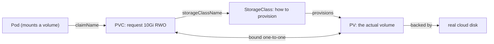
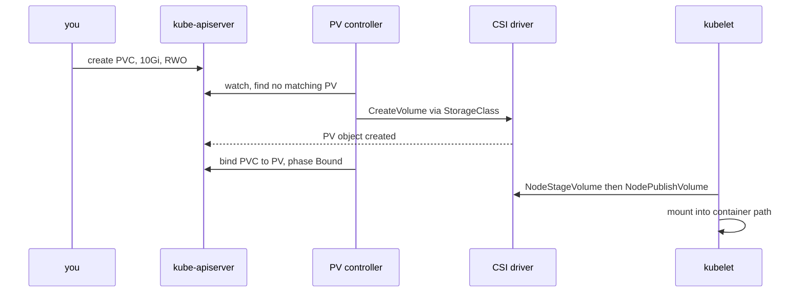

## Before you start

Read `kubernetes-architecture` first — dynamic provisioning is another reconciliation loop and reads far more clearly once you expect one. Pods and Deployments come from `kubernetes-basics`.

## In one sentence

A container's filesystem is erased on every restart, so Kubernetes separates the app's **request** for storage (a PersistentVolumeClaim) from the **actual volume** satisfying it (a PersistentVolume), with a StorageClass creating volumes on demand so nobody pre-provisions disks by hand.

## Why it matters

Containers are deliberately ephemeral. Write a file inside one, let the container restart, and the file is gone — not because anything failed, but because the container filesystem is a disposable layer over the image (see `docker-containerization`). That is right for a stateless API and exactly wrong for a database, a queue, an upload directory or a model cache.

Two mistakes here destroy data rather than merely causing downtime: `ReadWriteOnce` misread as "one Pod", which leads people to attach one volume to a multi-replica database and corrupt it; and a `Delete` reclaim policy plus a deleted PVC, which removes the underlying cloud disk permanently with no prompt.

## The intuition

Think of a self-storage business.

You fill out a form: "I need about 10 cubic metres, ground floor, drive-up access." That form is a **PersistentVolumeClaim** — a statement of requirements, naming no specific unit because you neither know nor care which one. The **PersistentVolume** is unit B-14: a real space with a real door. The clerk matches your form to a suitable free unit and hands you the key, and the two are now **bound** one-to-one and exclusively.

The old way to run this business was building every unit in advance and hoping the sizes matched demand. The modern way is a **StorageClass**: a standing arrangement with a builder — "when a form arrives, construct a unit to these specifications and hand over the key."

Two details carry real weight. Your contract **survives you leaving the building** — the Pod is a visit, the claim is the lease. And when you cancel that lease, what happens to your belongings depends on a clause you agreed to up front: the unit is either emptied and demolished, or kept as-is. That clause is the **reclaim policy**, and people sign it without reading it.

## How it actually works



### The PV/PVC split as a contract

The split separates two roles. An application developer knows they need 20Gi of fast storage; they should not need to know the cloud provider, disk product, encryption key or zone. A cluster administrator knows all of that and should not be involved in every deployment.

So the **PVC** is the app's request, lives in its namespace, and travels with its manifests. The **PV** is a cluster-scoped object representing real storage. Binding is exclusive and one-to-one: a bound PV serves exactly one PVC for its lifetime, and an unmatched PVC stays `Pending`. A Pod references the claim by name, never the volume — that indirection is what makes the manifest portable across entirely different backends.

### StorageClass and dynamic provisioning

Static provisioning — an administrator pre-creating PVs — does not scale and wastes capacity. A **StorageClass** replaces it with a named recipe: which provisioner to call, what parameters to pass, what reclaim policy new volumes get, and when to bind.



That is the reconciliation loop again: desired state is "a bound 10Gi volume exists", the controller observes no match, and it acts by asking the driver to create one.

One field deserves attention. The default `volumeBindingMode: Immediate` provisions as soon as the PVC exists, before any Pod does — a trap on multi-zone clusters, because a disk in `us-east-1a` can only be attached by a node in that zone, so the scheduler inherits a constraint it never influenced and the Pod is permanently `Pending` if that zone is full. `WaitForFirstConsumer` delays provisioning until a Pod is scheduled, creating the volume in the zone actually chosen.

### Access modes, honestly

The reason this is the most misread part of Kubernetes storage is one word: the modes describe **nodes**, not Pods. `ReadWriteOnce` means one *node* may mount it read-write, so Pods co-scheduled there all share it while a Pod anywhere else cannot mount it at all. `ReadWriteMany` needs a filesystem that supports it, because block storage like EBS attaches to one machine at a time. Only `ReadWriteOncePod` guarantees a single writer.

The classic design mistake follows directly. A 3-replica database Deployment sharing one RWO PVC either scatters across nodes — where the extras stick in `ContainerCreating` with a multi-attach error, annoying but safe — or lands on one node, where the mount succeeds and three processes write one data directory and corrupt it. The second case is worse precisely because it looks like it worked. **The fix is one volume per replica**, which is what StatefulSets provide.

### volumeClaimTemplates in StatefulSets

A Deployment's Pods are interchangeable, so a PVC reference in its template is shared by every replica. A **StatefulSet** instead declares a `volumeClaimTemplate`, and the controller creates **one PVC per replica**, named deterministically — `data-postgres-0`, `data-postgres-1`, `data-postgres-2`.

That naming is the mechanism. `postgres-1` always claims `data-postgres-1`, so deleting the Pod and rescheduling it onto a different node re-binds it by **ordinal** to the identical volume with identical data. Combined with per-replica DNS from a headless Service (see `kubernetes-networking`), each replica gets a fixed name and a fixed disk — exactly what a replicated database needs.

Two sharp edges. Scaling *down* deliberately does **not** delete the PVCs, so scaling back up reattaches the old data while you keep paying for those disks meanwhile. And `volumeClaimTemplates` is immutable after creation, so resizing means editing each PVC individually where the StorageClass allows expansion, or recreating the StatefulSet. See `statefulsets-daemonsets-and-jobs` for the identity guarantees themselves.

### Reclaim policies and the data-loss path

A PV's `persistentVolumeReclaimPolicy` decides what happens when its PVC is deleted. **Delete** destroys the PV *and the real underlying disk*, and it is the default for dynamically provisioned volumes. **Retain** keeps the PV and its data in `Released`, where it will not re-bind until an administrator clears `claimRef`.

So the data-loss path is short and ordinary: `kubectl delete pvc`, or `kubectl delete namespace staging`, or a GitOps sync pruning a renamed resource. The claim goes, the policy says `Delete`, the driver deletes the cloud disk, and the data is gone — no confirmation, no recycle bin, no undo. Two protections: set `reclaimPolicy: Retain` on any StorageClass backing stateful data, and rely on **storage object in use protection** (on by default), whose finalizer holds a PVC in `Terminating` while a Pod still mounts it — which saves you from a careless delete, but not from deleting a claim whose Pod is already gone.

### CSI, and the everyday volume types

**CSI** (Container Storage Interface) is the plugin standard that moved storage drivers out of the Kubernetes codebase. A driver implements a defined gRPC interface — `CreateVolume`, `DeleteVolume`, `ControllerPublishVolume` to attach to a node, then `NodeStageVolume` and `NodePublishVolume` to mount into the Pod. Anyone can ship one without touching Kubernetes, which is why snapshots, cloning and volume expansion arrived as portable features.

Not every volume is persistent. **emptyDir** is scratch space created with the Pod and deleted with it — it survives a container *restart* but not Pod deletion, which suits caches and sharing a directory between containers in one Pod; `medium: Memory` makes it a RAM disk that counts against the container's memory limit and can get you OOMKilled. **configMap** and **secret** volumes project config and credentials in as read-only files, updating without a restart though your app must re-read them (see `configmaps-and-configuration`, `secrets-management`).

### Databases on Kubernetes — the honest answer

Kubernetes makes stateless services easier and databases harder. A Deployment assumes replicas are interchangeable and disposable; every database assumes the opposite — replicas have distinct roles, data has locality, restarts must be ordered, and failover carries real split-brain risk. StatefulSets recover identity and storage but give you no backups, point-in-time recovery, safe leader election, or major-version upgrade path. An **operator** (see `kubernetes-operators-and-crds`) encodes that expertise as a controller, and the mature ones — CloudNativePG, Vitess, the Percona and Zalando Postgres operators — genuinely work.

So prefer a **managed service** when the database is not your differentiator: you are buying backups, HA and patching from people who do it full time. Choose **Kubernetes** for a real reason — many small per-tenant databases, air-gapped or on-premise, unusual extensions, or latency that makes co-location matter — and then use a mature operator, fast block storage rather than network filesystems, and a *tested* restore. The middle ground is the failure mode: a hand-rolled StatefulSet holding production data with no operator, no tested restore, and a `Delete` reclaim policy.

## Worked example

A StatefulSet with per-replica storage, and a StorageClass configured to protect it:

```yaml
apiVersion: storage.k8s.io/v1
kind: StorageClass
metadata:
  name: db-retain
provisioner: ebs.csi.aws.com
parameters:
  type: gp3
reclaimPolicy: Retain              # default is Delete: deleting the PVC would destroy the disk
allowVolumeExpansion: true         # lets you grow a PVC later without recreating it
volumeBindingMode: WaitForFirstConsumer  # provision in the zone the scheduler actually picks
---
apiVersion: apps/v1
kind: StatefulSet
metadata:
  name: postgres
spec:
  serviceName: postgres            # headless Service: gives each replica stable DNS
  replicas: 3
  selector:
    matchLabels: { app: postgres }
  template:
    metadata:
      labels: { app: postgres }
    spec:
      containers:
        - name: postgres
          image: postgres:16
          volumeMounts:
            - name: data           # matches the template name below
              mountPath: /var/lib/postgresql/data
  volumeClaimTemplates:            # ONE PVC PER REPLICA, not one shared claim
    - metadata:
        name: data
      spec:
        accessModes: ["ReadWriteOnce"]   # correct here: each replica has its own volume
        storageClassName: db-retain
        resources:
          requests: { storage: 20Gi }
```

Apply it and the per-ordinal naming is immediately visible:

```bash
kubectl get pvc
# NAME               STATUS   VOLUME                 CAPACITY   STORAGECLASS   AGE
# data-postgres-0    Bound    pvc-8f1a...            20Gi       db-retain      2m
# data-postgres-1    Bound    pvc-3c9e...            20Gi       db-retain      1m
# data-postgres-2    Bound    pvc-b722...            20Gi       db-retain      45s

# Delete a pod and it comes back bound to the SAME volume
kubectl delete pod postgres-1
kubectl get pvc data-postgres-1 -o jsonpath='{.spec.volumeName}'
# pvc-3c9e...     <- unchanged: same disk, same data, possibly a different node
```

Now audit a whole cluster for the data-loss risk:

```js
const { execFileSync } = require('node:child_process');
const j = (a) => JSON.parse(execFileSync('kubectl', [...a, '-o', 'json'], { encoding: 'utf8' }));

const pvs = j(['get', 'pv']).items;
const claimOf = new Map(
  pvs.filter((p) => p.spec.claimRef)
     .map((p) => [`${p.spec.claimRef.namespace}/${p.spec.claimRef.name}`, p])
);

for (const pvc of j(['get', 'pvc', '-A']).items) {
  const key = `${pvc.metadata.namespace}/${pvc.metadata.name}`;
  const pv = claimOf.get(key);
  const risks = [];
  // Delete policy means deleting this PVC destroys the real disk.
  if (pv?.spec.persistentVolumeReclaimPolicy === 'Delete') risks.push('DELETE-ON-RELEASE');
  // RWO shared by pods on different nodes cannot work; shared on one node corrupts data.
  if (pvc.status.phase === 'Pending') risks.push(`PENDING (${pvc.status.phase})`);
  console.log(`${key.padEnd(34)} ${(pvc.spec.storageClassName || '-').padEnd(12)} ${risks.join(' ') || 'ok'}`);
}
```

```
default/uploads                    standard     DELETE-ON-RELEASE
db/data-postgres-0                 db-retain    ok
db/data-postgres-1                 db-retain    ok
staging/cache                      standard     DELETE-ON-RELEASE
```

Every `DELETE-ON-RELEASE` line is one `kubectl delete pvc` away from permanent data loss.

## A second example — when it gets harder

The naive model: "ReadWriteOnce means one Pod, so my single-replica app is safe." Both halves fail, and the second failure is the interesting one.

First, the mode is per **node**. Scale a Deployment with an RWO PVC from 1 to 2 replicas: if the second Pod lands on the same node it mounts fine — and if the app is a database, two processes now write one data directory. If it lands elsewhere you get:

```
Warning  FailedAttachVolume  Multi-Attach error for volume "pvc-8f1a..."
         Volume is already exclusively attached to one node and can't be attached to another
```

Second, and more subtle: this bites a **single-replica** Deployment during an ordinary rolling update. `RollingUpdate` creates the new Pod *before* terminating the old one, so two briefly coexist, and a new Pod on a different node cannot attach the volume. It waits. The old Pod still serves, so there is no outage — the rollout just hangs forever with a multi-attach warning, looking like a storage failure rather than a strategy mismatch. The fix is `strategy: { type: Recreate }`, trading brief downtime for a rollout that completes.

Now the costly one. A team needs shared uploads across replicas and requests RWX on a `standard` StorageClass backed by EBS. The PVC sits `Pending` because the provisioner does not support that mode, so someone switches to RWO. It binds, and works in staging where one node runs everything; in production across three nodes, two replicas cannot start. The real fix was a filesystem-backed StorageClass (EFS, Azure Files, CephFS) from the start — or object storage, since shared POSIX semantics under concurrent writers bring their own problems.

And the recovery case, worth rehearsing before you need it. With `Retain`, deleting a PVC leaves the PV in `Released` with data intact, but it will **not** re-bind to a new PVC of the same name because `spec.claimRef` still points at the old claim's UID. Clear `claimRef` with `kubectl edit pv` and it returns to `Available`. Knowing this is the difference between a five-minute recovery and reporting data loss that never happened.

## Quick reference

| Access mode | Concurrent scope | Backed by | Correct use |
|---|---|---|---|
| `ReadWriteOnce` | One **node** (many Pods on it) | Block storage: EBS, PD, Azure Disk | Per-replica volumes via StatefulSet |
| `ReadOnlyMany` | Many nodes, read-only | Most types | Shared static assets, model weights |
| `ReadWriteMany` | Many nodes, read-write | Filesystem: NFS, EFS, CephFS | Genuinely shared directories |
| `ReadWriteOncePod` | Exactly one Pod, cluster-wide | CSI drivers supporting it | Strict single-writer guarantee |

| Setting | Default | Change it when |
|---|---|---|
| `reclaimPolicy` | `Delete` (dynamic) | Always, to `Retain`, for stateful data |
| `volumeBindingMode` | `Immediate` | Multi-zone cluster: use `WaitForFirstConsumer` |
| `allowVolumeExpansion` | `false` | You want to grow volumes without recreating |
| Deployment `strategy` | `RollingUpdate` | Single replica + RWO volume: use `Recreate` |

| Symptom | Cause |
|---|---|
| PVC `Pending`, no matching PV | No StorageClass, or access mode unsupported |
| `Multi-Attach error` | RWO volume wanted by a second node |
| Rollout hangs, app still up | RollingUpdate + RWO on a single-replica Deployment |
| Pod `Pending`, volume in wrong zone | `Immediate` binding on a multi-zone cluster |
| PV `Released`, will not re-bind | Stale `claimRef` — clear it manually |
| Data gone after namespace delete | `Delete` reclaim policy |

## Common mistakes

- Reading `ReadWriteOnce` as "one Pod". It is one **node**, so Pods co-scheduled there all mount it — which is how data gets corrupted rather than merely blocked.
- Sharing one PVC across database replicas. Use `volumeClaimTemplates` for one volume per replica.
- Leaving the default `Delete` reclaim policy on data you care about, so a deleted PVC or namespace destroys the disk.
- Using `RollingUpdate` on a single-replica Deployment with an RWO volume, producing a rollout that hangs forever while the app stays up.
- Leaving `volumeBindingMode: Immediate` on a multi-zone cluster, so volumes land in zones the scheduler cannot use.
- Expecting `emptyDir` to survive Pod deletion; it survives container restarts only, and `medium: Memory` counts against the memory limit.
- Assuming RWX fixes concurrent access. It permits concurrent mounting; the application still has to tolerate concurrent writers.
- Giving up on a `Released` PV when clearing `claimRef` would recover the data.
- Running production data as a hand-rolled StatefulSet with no operator and no tested restore.

## What interviewers ask

- **What is the difference between a PV and a PVC?** — The PVC is the app's request ("10Gi, ReadWriteOnce") in its own namespace; the PV is the actual cluster-scoped volume, and they bind one-to-one and exclusively. Because a Pod names only the claim, the same manifest runs on clusters with entirely different storage backends.
- **What does `ReadWriteOnce` actually restrict?** — One **node**, not one Pod. Pods co-scheduled on that node share it, which is how database replicas silently corrupt a data directory — a failure that looks like success. RWX permits concurrent mounting but does not make a database tolerate concurrent writers.
- **How do StatefulSets handle storage differently from Deployments?** — `volumeClaimTemplates` creates one PVC per replica, named by ordinal, so `postgres-1` always re-binds to `data-postgres-1` and keeps its data across rescheduling. Scaling down intentionally leaves those PVCs behind.
- **How does a PVC get storage with no administrator involved?** — Dynamic provisioning: the PV controller sees an unmatched PVC, reads its StorageClass, calls the CSI driver's `CreateVolume`, then creates and binds the PV. It is the reconciliation loop applied to disks.
- **How can Kubernetes permanently destroy your data?** — Dynamically provisioned PVs default to `reclaimPolicy: Delete`, so deleting the PVC — directly or by deleting the namespace — deletes the real cloud disk with no confirmation and no undo. `Retain` prevents it.
- **Should you run a database on Kubernetes?** — Prefer a managed service when one exists and the database is not your differentiator, since you are buying backups, HA and patching. Choose Kubernetes for many small per-tenant databases, air-gapped environments or real portability needs, and then use a mature operator: StatefulSets give identity and storage but no backups, PITR or safe failover.
- **Why is `WaitForFirstConsumer` recommended?** — `Immediate` binding provisions the volume before any Pod is scheduled, so on a multi-zone cluster the disk can land in a zone with no capacity and the Pod stays permanently `Pending`. Delaying lets the scheduler choose first.

## Practice

1. Create a PVC, write a file through a Pod, delete the Pod, and confirm the file survives in a replacement. Then delete the PVC — once with `reclaimPolicy: Delete` and once with `Retain` — and recover the `Retain` case by clearing `claimRef`.
2. Deploy a single-replica Deployment with an RWO PVC on a multi-node cluster and trigger a rolling update. Reproduce the hung rollout, explain which two Pods are competing, then fix it with `strategy: Recreate`.
3. Convert it into a 3-replica StatefulSet with `volumeClaimTemplates`. Confirm three PVCs exist, delete `-1`, and prove it re-binds to the same volume. Then scale to 1 and explain why Kubernetes kept the other two and what that costs you.

## Where to go next

Continue to `kubernetes-debugging` — you now know enough of the machinery that the useful next skill is a systematic method for finding which part of it broke.
