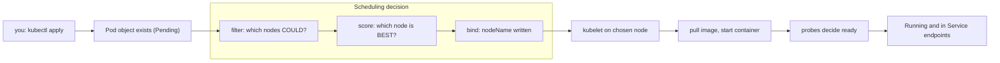
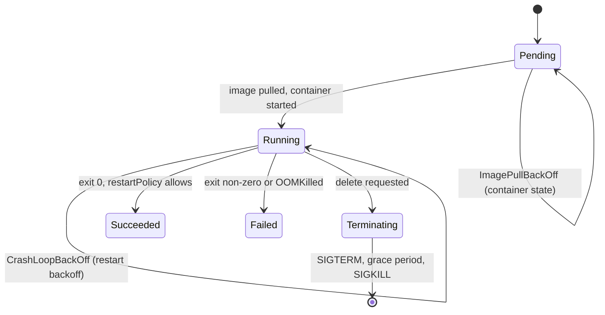

## Before you start

Read `kubernetes-architecture` first — you need to know that the scheduler only writes `spec.nodeName` and the kubelet does everything after that. This topic fills in both halves: how the node gets chosen, and what happens to the container once it is.

## In one sentence

A Pod moves through a small set of **phases** from `Pending` to a final state, and the decision that gets it out of `Pending` is a two-stage scheduler pass that first eliminates impossible nodes and then ranks the survivors.

## Why it matters

This is where the majority of real Kubernetes incidents live, and where interviews concentrate. A Pod that will not schedule, a container restarting in a loop, a deploy that drops requests, a memory limit that kills a process at 3am — every one of them is a lifecycle or scheduling question.

More specifically, two details in this topic cause outages repeatedly: a liveness probe whose delay is shorter than the app's startup time, and a misunderstanding of what `requests` versus `limits` actually control. Both are covered below, and both come up in interviews precisely because they separate people who have run production from people who have read a tutorial.

## The intuition

Scheduling is hiring for a role, in two rounds.

The first round is **screening**, and it is strictly pass or fail. Does the candidate have the required certification? Are they willing to relocate? Nobody is "almost eligible" — you either meet the hard requirements or you are out of the pool. That is **filtering**: does this node have enough unreserved CPU and memory, does it tolerate the node's taints, does it match the node selector, can it attach the volume.

The second round **ranks the shortlist**. Everyone left can do the job; now you pick the best fit. Maybe you prefer the candidate who spreads your team across offices, or the one who already has the tooling installed. That is **scoring**: prefer the least-utilised node, prefer a node that already holds the image, spread replicas across failure domains.

Then you make the offer, and that is **binding** — one field written, decision final.

The lifecycle itself is better understood plainly than by analogy: a Pod is created, waits, runs, and ends. What confuses people is that the *interesting* failures are not phases at all, which is the next section.

## How it actually works



### Phases, and the things that are not phases

A Pod has exactly five phases: `Pending`, `Running`, `Succeeded`, `Failed`, and `Unknown`. That is the complete list.

`CrashLoopBackOff` and `ImagePullBackOff` are **not phases**. They are container states — `waiting` with a reason — reported inside a phase. This trips up a lot of candidates, and it matters practically because `kubectl get pods` prints the container reason in the `STATUS` column, which makes it look like a phase. A Pod displaying `ImagePullBackOff` is still in phase `Pending`; a Pod displaying `CrashLoopBackOff` is in phase `Running`, because its containers were created and the kubelet is dutifully restarting them with an increasing backoff that caps at five minutes.

Say that precisely in an interview and it lands: *"the phase is Running, the container state is waiting with reason CrashLoopBackOff."*



### Filtering, then scoring, then binding

**Filtering** removes every node that cannot possibly host the Pod. The checks are boolean: does the node have enough *unreserved* CPU and memory, does the Pod tolerate the node's taints, does it satisfy `nodeSelector` and required node affinity, can the required volume be attached in this zone, are ports free. If nothing survives filtering, the Pod stays `Pending` and the scheduler records exactly why — `0/5 nodes are available: 3 Insufficient memory, 2 node(s) had untolerated taint`. That message is the answer, not a hint.

**Scoring** ranks the survivors. Every node gets a weighted score from plugins: `NodeResourcesFit` prefers a node with more room, `ImageLocality` prefers a node that already has the image cached, `PodTopologySpread` and inter-pod anti-affinity push replicas apart. Highest total wins; ties break randomly.

**Binding** writes `spec.nodeName`. Nothing is created; the kubelet takes over from there.

### requests vs limits — the asymmetry

This is the single highest-value distinction in the topic.

**`requests` drive scheduling. `limits` drive runtime enforcement.** They are consumed by different components at different times and never interact.

The scheduler only ever looks at `requests`. It sums the requests of all Pods already bound to a node and asks whether this Pod's requests still fit. It does not care about limits and it does not care what the node is *actually* using. A node whose Pods requested 8 cores but are idling at 0.2 cores is, to the scheduler, a full node.

The kubelet and the kernel only ever enforce `limits`, and they do it differently for the two resources:

- **CPU over its limit is throttled.** CPU is compressible. Your process is simply given fewer time slices — it runs slower, it does not die. The symptom is latency, and the evidence is `container_cpu_cfs_throttled_seconds_total` climbing, not a restart.
- **Memory over its limit is OOMKilled.** Memory is incompressible; you cannot give a process 90% of a byte. The kernel kills the container, exit code `137`, and the kubelet restarts it per `restartPolicy`.

That asymmetry is the interview question. A CPU limit degrades you silently; a memory limit kills you loudly. It is also why many teams set memory requests equal to memory limits, and set CPU requests without CPU limits.

### QoS classes and eviction order

Kubernetes derives a **QoS class** from your requests and limits — you never set it directly:

- **Guaranteed** — every container sets both, and requests equal limits for both CPU and memory.
- **Burstable** — at least one request is set, but the Guaranteed condition is not met.
- **BestEffort** — no requests or limits anywhere.

The class decides who dies first when a node runs out of memory. Under node pressure the kubelet evicts **BestEffort** first, then **Burstable** Pods exceeding their requests, and **Guaranteed** Pods last. So a Pod with no resource spec at all is not being modest — it is volunteering to be killed first.

### Probes, done properly

Three probes, three distinct jobs:

- **readiness** — "should traffic come to me right now?" Failing removes the Pod from Service endpoints. It does **not** restart anything. This is the probe that makes rolling updates safe.
- **liveness** — "am I wedged and beyond recovery?" Failing **restarts the container**. Use it only for genuine deadlock.
- **startup** — "am I still booting?" While it is failing, the liveness and readiness probes are suspended entirely. Once it passes once, it never runs again.

**The classic outage:** an app that takes 90 seconds to boot, with a liveness probe using the default `initialDelaySeconds: 0` and `failureThreshold: 3` at a 10-second period. At 30 seconds the liveness probe has failed three times, so the kubelet kills a perfectly healthy container that was still starting. It restarts, gets killed at 30 seconds again, and enters `CrashLoopBackOff` forever. The logs show a normal, truncated startup with no error, so it looks like a broken image or a bad build.

The fix is a **startup probe** with a generous `failureThreshold`, not a longer liveness delay — a startup probe lets a slow boot take as long as it needs while still catching a container that never becomes live. This gets acute for model serving, where loading weights into memory can take minutes; see `deploying-a-model-end-to-end`.

### Placement controls, and what each is actually for

| Mechanism | Direction | Purpose |
|---|---|---|
| Taints + tolerations | Node repels Pods | Reserve nodes; keep general workloads off special hardware |
| Node affinity / `nodeSelector` | Pod seeks nodes | Attract a Pod to a *kind* of node (zone, instance type) |
| Pod affinity | Pod seeks Pods | Co-locate with related Pods (cache near its app) |
| Pod anti-affinity | Pod avoids Pods | Spread replicas across nodes or zones for availability |

The pairing that confuses people: a **taint** keeps others *out*, node **affinity** pulls you *in*. You usually need both, because a toleration is only permission to land on a tainted node — it never attracts the Pod there.

### Graceful termination, and the race that drops requests

Deleting a Pod runs two sequences **concurrently**, and that concurrency is the bug:

1. The Pod is marked `Terminating`, and the endpoint controller begins removing it from EndpointSlices. That removal then has to propagate to kube-proxy on **every node**.
2. The kubelet sends `SIGTERM` immediately, waits `terminationGracePeriodSeconds` (default 30), then sends `SIGKILL`.

Nothing synchronises these. Your app can receive `SIGTERM` and shut down its listener while nodes still hold forwarding rules pointing at it — so in-flight and newly-arriving requests hit a closed port and users see connection resets during every deploy.

Two fixes, used together. Add a `preStop` hook that simply sleeps a few seconds: the Pod stops accepting new work only after endpoint removal has propagated, because the grace period does not begin until `preStop` finishes. And make the app handle `SIGTERM` by draining — stop accepting new connections, finish in-flight requests, then exit — rather than exiting immediately.

## Worked example

A Pod spec with every mechanism in this topic, and the reason for each line:

```yaml
apiVersion: v1
kind: Pod
metadata:
  name: slow-api
spec:
  terminationGracePeriodSeconds: 45   # must exceed preStop sleep + real drain time
  tolerations:
    - key: workload                    # permission to land on tainted nodes...
      value: api
      effect: NoSchedule
  affinity:
    nodeAffinity:                      # ...and this is what actually attracts it
      requiredDuringSchedulingIgnoredDuringExecution:
        nodeSelectorTerms:
          - matchExpressions:
              - key: topology.kubernetes.io/zone
                operator: In
                values: ["us-east-1a", "us-east-1b"]
  containers:
    - name: api
      image: my-api:1.4.2
      resources:
        requests:                      # the ONLY numbers the scheduler reads
          cpu: "250m"
          memory: "512Mi"
        limits:
          memory: "512Mi"              # equal to request => no OOM surprise from overcommit
          # no cpu limit: throttling would add latency, and requests already reserve share
      startupProbe:                    # tolerates a 150s boot (30 x 5s)
        httpGet: { path: /healthz, port: 8080 }
        periodSeconds: 5
        failureThreshold: 30
      livenessProbe:                   # only runs AFTER startupProbe passes
        httpGet: { path: /healthz, port: 8080 }
        periodSeconds: 10
        failureThreshold: 3
      readinessProbe:                  # gates Service endpoints, never restarts
        httpGet: { path: /ready, port: 8080 }
        periodSeconds: 5
      lifecycle:
        preStop:
          exec:
            command: ["sleep", "10"]   # let endpoint removal propagate before SIGTERM
```

This Pod is **Burstable**: memory request equals its limit, but CPU has a request and no limit, so it fails the Guaranteed condition. That is a deliberate trade — protected from OOM, free to burst on CPU, and not first in line for eviction.

Now read the phase/container-state distinction straight out of the API:

```js
const { execFileSync } = require('node:child_process');

const pods = JSON.parse(
  execFileSync('kubectl', ['get', 'pods', '-A', '-o', 'json'], { encoding: 'utf8' })
).items;

for (const p of pods) {
  // The phase and the reason you see in kubectl's STATUS column are different fields.
  const phase = p.status.phase;
  const states = (p.status.containerStatuses || []).map((c) => {
    const s = c.state.waiting || c.state.terminated || c.state.running || {};
    const detail = s.reason || 'running';
    const exit = c.lastState?.terminated?.exitCode;
    return `${c.name}=${detail}${exit !== undefined ? ` (last exit ${exit})` : ''}`;
  });
  console.log(`${p.metadata.name.padEnd(28)} phase=${phase.padEnd(9)} ${states.join(', ')}`);
}
```

```
slow-api                     phase=Running   api=running
bad-image-7d9f8b7c4c-k2xqp   phase=Pending   app=ImagePullBackOff
crasher-5f8c9d6b4b-mn4zt     phase=Running   app=CrashLoopBackOff (last exit 1)
hungry-6b7d8f9c5c-p8vwl      phase=Running   app=CrashLoopBackOff (last exit 137)
```

Read the last two lines carefully. Both show `CrashLoopBackOff` inside phase `Running`, but `exit 1` means the application itself failed, while `exit 137` means the kernel OOMKilled it — a memory limit problem, not a code problem. Same displayed status, completely different fix.

## A second example — when it gets harder

The naive model: "my Pod is `Running`, so it is serving traffic." Both halves of that can be false at once.

Consider a Deployment of three replicas where the readiness probe checks a database connection. The database goes down. All three readiness probes fail. Now:

- All three Pods stay in phase `Running`. Nothing restarts, because readiness never restarts anything.
- All three are removed from the Service's EndpointSlices.
- The Service still exists with a valid ClusterIP and **zero endpoints**.
- Callers get connection refused, or a 503 from an ingress controller.

`kubectl get pods` shows `Running` with `0/1` in the READY column and everyone looks past it. The tell is `READY 0/1`, and the confirmation is an empty endpoint list.

Now make it worse by adding a liveness probe that also checks the database — a very common mistake. The database outage now causes all three containers to be killed and restarted repeatedly. You have converted a dependency outage into a crash loop of your own healthy service, and when the database recovers your Pods are mid-backoff, extending your own outage past the dependency's.

The rule that falls out: **a liveness probe must only test whether this process is wedged, never whether its dependencies are up.** Dependencies belong in readiness, where the consequence is "take me out of rotation", not "kill me".

One more layer, on the scheduling side. A three-replica Deployment with `podAntiAffinity` set to `requiredDuringScheduling` across nodes, on a three-node cluster, works fine — until you drain a node for maintenance. Now three Pods need three distinct nodes and only two exist, so one Pod is permanently `Pending` and your rolling update deadlocks. Using `preferredDuringScheduling` instead lets the scheduler degrade to two-on-one node rather than refusing, which is nearly always the behaviour you actually want.

## Quick reference

| Signal | Phase | What it means | First check |
|---|---|---|---|
| `Pending`, no node | `Pending` | No node passed filtering | `describe pod` — the message names the reason |
| `ImagePullBackOff` | `Pending` | Bad name/tag or registry auth | Image string, then pull secret |
| `CrashLoopBackOff`, exit 1 | `Running` | App exits on its own | `logs --previous` |
| `CrashLoopBackOff`, exit 137 | `Running` | OOMKilled by memory limit | Raise memory limit or fix the leak |
| `Running` but `0/1` READY | `Running` | Readiness failing; no endpoints | Probe path, port, and dependencies |
| `Terminating` for minutes | `Running` | Grace period or a stuck finalizer | `preStop`, grace period, finalizers |
| CPU throttling, no restarts | `Running` | Over the CPU limit | Throttling metric; consider no CPU limit |

| | Read by | When | Effect of exceeding |
|---|---|---|---|
| `requests` | Scheduler | Placement time | Pod is not placed at all |
| `limits` (CPU) | Kernel CFS | Continuously | Throttled — slower, alive |
| `limits` (memory) | Kernel OOM killer | Continuously | Container killed, exit 137 |

## Common mistakes

- Calling `CrashLoopBackOff` a phase. It is a container waiting reason inside phase `Running`.
- Putting dependency checks in a liveness probe, which turns someone else's outage into your own crash loop.
- Leaving `initialDelaySeconds` at 0 on a slow-booting app and getting an infinite restart loop that mimics a broken image. Use a startup probe.
- Believing limits affect scheduling. Only requests do; a node full of idle-but-reserved requests will reject your Pod.
- Setting a CPU limit reflexively and then debugging mysterious latency that is actually CFS throttling.
- Omitting requests entirely, which makes the Pod BestEffort and first to be evicted.
- Assuming endpoint removal happens before `SIGTERM`. They race, which is why you need a `preStop` sleep.
- Using `requiredDuringScheduling` anti-affinity with replicas equal to node count, which deadlocks the first time you drain a node.

## What interviewers ask

- **What is the difference between requests and limits?** — Requests are what the scheduler reserves to place the Pod; limits are what the kernel enforces at runtime. The asymmetry is the real answer: exceeding a CPU limit throttles you and you keep running, while exceeding a memory limit gets the container OOMKilled with exit 137, because CPU is compressible and memory is not.
- **Liveness versus readiness?** — Liveness failure restarts the container; readiness failure only removes it from Service endpoints. Dependency checks belong in readiness, since putting them in liveness converts a dependency outage into a self-inflicted crash loop.
- **A Pod is `Running` but gets no traffic. Why?** — Readiness is failing, so it has been pulled from the Service's EndpointSlices while remaining in phase `Running`. Look for `0/1` in the READY column and confirm with an empty endpoint list.
- **Is `CrashLoopBackOff` a Pod phase?** — No. The phases are Pending, Running, Succeeded, Failed and Unknown; `CrashLoopBackOff` is a container waiting reason surfaced inside phase Running.
- **How does the scheduler pick a node?** — Filtering eliminates nodes that cannot host the Pod (resources, taints, affinity, volumes), scoring ranks the survivors by utilisation, image locality and topology spread, and binding writes `spec.nodeName`.
- **Why do requests get dropped during a deploy?** — Endpoint removal and `SIGTERM` happen concurrently with no synchronisation, so the container can stop listening while nodes still forward to it. A `preStop` sleep plus real `SIGTERM` draining fixes it.
- **What decides eviction order under memory pressure?** — QoS class, derived from your requests and limits: BestEffort first, then Burstable Pods over their requests, then Guaranteed.

## Practice

1. Deploy a container that sleeps 60 seconds before serving, with a liveness probe at `initialDelaySeconds: 5` and `failureThreshold: 3`. Watch it enter `CrashLoopBackOff`, confirm from the logs that nothing was actually wrong, then fix it with a startup probe and explain why that works when a longer liveness delay is the inferior fix.
2. Create three Pods requesting 1Gi memory each on a node with 2Gi allocatable. Read the exact `describe` message on the third and identify which filter rejected it. Then set limits far above requests on the running two and explain why the third still will not schedule.
3. Run a Pod with a 100Mi memory limit and a process that allocates in a loop. Capture the exit code and the `lastState.terminated.reason`. Repeat with a CPU limit of `100m` and a busy loop — measure the latency change and confirm there are zero restarts. Write down which resource kills and which merely slows.

## Where to go next

Continue to `kubernetes-networking` — you have seen readiness gate a Pod's membership in a Service, so the next question is what a Service actually is, and how a packet reaches the Pod it selected.
