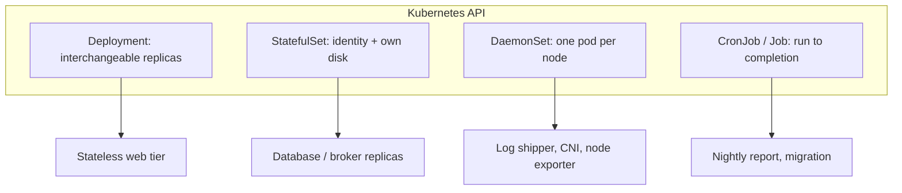
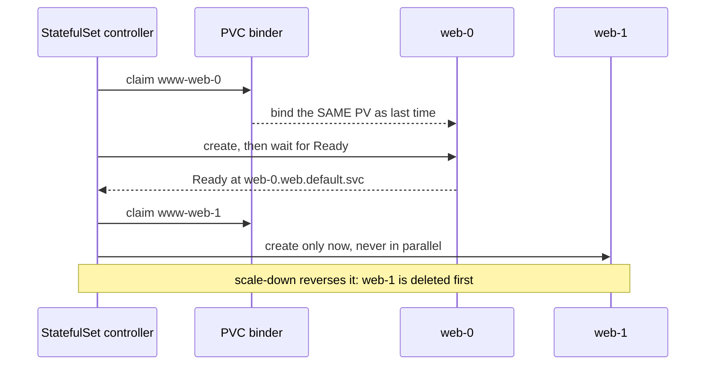

## Before you start

You need [kubernetes-basics](kubernetes-basics) — Pods, Deployments, ReplicaSets and Services are assumed here, not re-explained. [kubernetes-storage](kubernetes-storage) covers the PersistentVolume and PersistentVolumeClaim mechanics that StatefulSets lean on; you can read this first and that second.

## In one sentence

Kubernetes has four workload **controllers** — a controller being a loop that watches your desired state and makes reality match it — because "keep N identical copies running" is only one of four genuinely different shapes work comes in.

## Why it matters

A Deployment makes one very specific promise: your replicas are **interchangeable**. Any Pod can serve any request, they can start in any order, and killing one loses nothing, because nothing important lived inside it.

That promise is a lie for most infrastructure. Run a three-node PostgreSQL cluster as a Deployment and you get three Pods with random names, sharing one volume or none, starting simultaneously, each convinced it might be the primary. Run a log shipper as a Deployment with `replicas: 3` on a ten-node cluster and seven nodes' logs are silently never collected. Run a database migration as a Deployment and it finishes, exits 0, and Kubernetes — doing exactly its job — restarts it forever.

None of those are bugs in Kubernetes. They are cases where you asked for the wrong shape.

## The intuition

Think about how a company staffs different kinds of work.

**Call-centre agents** are interchangeable. Any agent takes any call, you can hire a tenth without telling the other nine, and if one goes home mid-shift the queue reroutes. That is a **Deployment**.

**Regional managers** are not interchangeable. There is exactly one for the North region, they hold the North filing cabinet, and when they are replaced the new person needs *that same cabinet*, not a fresh empty one. Numbering matters, and handover happens one at a time so the region is never leaderless. That is a **StatefulSet**.

**Fire extinguishers** are placed one per floor. You do not decide "we want eleven extinguishers" — you say "every floor gets one", and when a new floor opens it gets one automatically. That is a **DaemonSet**.

**An annual audit** runs, produces a report, and stops. Its success condition is finishing, not staying alive. That is a **Job**, and putting it on the calendar makes it a **CronJob**.



## How it actually works

### StatefulSet: identity that survives rescheduling

A StatefulSet gives each Pod an **ordinal** — a stable integer from 0 to N-1 — and names it `<set>-<ordinal>`: `web-0`, `web-1`, `web-2`. Delete `web-1` and the replacement is also called `web-1`. That name is not cosmetic; it is the hook everything else hangs from.

Three guarantees follow, and each one exists because a distributed database needs it.

**Stable network identity.** Pair the StatefulSet with a **headless Service** — a Service with `clusterIP: None`, which does no load balancing and instead publishes one DNS record per Pod. Now `web-0.web.default.svc.cluster.local` always resolves to replica 0. This is what lets a Cassandra or Kafka node write its own address into a peer list and have that address still be correct after a restart. A normal Service cannot do this: it hands out one address that round-robins across replicas, which is exactly wrong when you need to reach *a specific* replica.

**Stable storage.** `volumeClaimTemplates` is the piece people miss. It is a template Kubernetes stamps out **once per replica**, creating PersistentVolumeClaims named `<template>-<set>-<ordinal>` — `data-web-0`, `data-web-1`. When `web-0` is rescheduled to a different node, it re-binds `data-web-0` and gets its own data back. Compare a Deployment, where every replica shares whatever volume the template names, or gets nothing.

Note the sharp edge: those PVCs deliberately **outlive** the Pods, and by default they outlive the StatefulSet too. Deleting a StatefulSet leaves its PVCs behind, which is a safety feature the first time it saves your data and a billing surprise the first time it does not.

**Ordered operations.** Pods come up one at a time, 0 first, each waiting for the previous to be Ready. Scale-down reverses: highest ordinal dies first. Rolling updates also go highest-to-lowest. This is what makes a replicated database safe to restart — you never take down two members at once, so quorum holds.



That ordering is also the trap. If `web-0` never becomes Ready — bad image, failing readiness probe, unbound volume — the StatefulSet **stops** and `web-1` is never created. The rollout does not partially succeed; it stalls. You are meant to fix `web-0`, not wait.

### DaemonSet: one Pod per node, by construction

A DaemonSet has no `replicas` field, because the count is not yours to choose: it is however many eligible nodes exist. Add a node and a Pod appears on it within seconds. This is the only correct shape for anything that must observe the node it runs on — log collectors reading `/var/log`, CNI plugins wiring up Pod networking, metrics exporters reading host counters.

The scheduling works differently too. The DaemonSet controller creates one Pod per node and writes **node affinity** pinning it to that specific node by name, so the scheduler has no choice to make.

Then there are **taints**. A taint marks a node as "do not schedule here unless you explicitly accept this"; a **toleration** on a Pod is that acceptance. Teams taint GPU nodes, spot nodes, and control-plane nodes to keep general workloads off them — and that is precisely how your monitoring agent ends up missing your most expensive nodes.

Kubernetes helps partway. The DaemonSet controller automatically adds tolerations for node conditions like `node.kubernetes.io/not-ready`, `unreachable`, and `disk-pressure`, so agents keep running on sick nodes — which is when you need them most. It does **not** add tolerations for taints you invented. For those you write them yourself, and a monitoring DaemonSet usually wants a blanket one:

```yaml
tolerations:
  - operator: Exists   # tolerate every taint, including ones added later
```

### Job and CronJob: success means stopping

A Job runs Pods until they **succeed**, then stops. `restartPolicy` must be `Never` or `OnFailure`, never `Always` — "always restart" and "run to completion" are contradictory instructions.

Four fields decide behaviour, and two of them are commonly misread:

- `completions` — how many successful Pods you need in total.
- `parallelism` — how many may run at once. With `completions: 10, parallelism: 3`, ten units of work run three at a time.
- `backoffLimit` — how many Pod failures before the Job is marked Failed. Default 6, with exponential backoff between retries. Retries are counted **across the whole Job**, not per Pod.
- `activeDeadlineSeconds` — a wall-clock cap on the entire Job. It beats `backoffLimit`: when it expires the Job is terminated even mid-retry, and even mid-successful-run. That makes it a genuine safety net and a genuine footgun.

A CronJob is a controller that creates Jobs on a schedule. Its own two traps:

**`concurrencyPolicy`** defaults to `Allow` — overlapping runs are permitted. If your hourly sync sometimes takes seventy minutes, `Allow` gives you two copies racing on the same data. `Forbid` skips the new run; `Replace` kills the old one. Pick deliberately.

**Missed schedules accumulate.** If the CronJob controller is down, or the CronJob was suspended, it counts how many start times it missed — and past **100** it gives up permanently with `Cannot determine if job needs to be started: Too many missed start times`. It logs one line and no Kubernetes Event, so a CronJob can be quietly dead for weeks. Setting `startingDeadlineSeconds` bounds the window it counts over and is the standard fix.

## Worked example

Here is a StatefulSet with the three pieces that make it one — headless Service, ordinals, and per-replica storage:

```yaml
apiVersion: v1
kind: Service
metadata:
  name: web              # this NAME becomes the DNS middle segment
spec:
  clusterIP: None        # headless: one DNS record per Pod, no load balancing
  selector:
    app: web
  ports:
    - port: 80
---
apiVersion: apps/v1
kind: StatefulSet
metadata:
  name: web
spec:
  serviceName: web       # must match the headless Service above
  replicas: 3
  selector:
    matchLabels:
      app: web
  template:
    metadata:
      labels:
        app: web
    spec:
      containers:
        - name: nginx
          image: nginx:1.27
          volumeMounts:
            - name: data
              mountPath: /usr/share/nginx/html
  volumeClaimTemplates:  # stamped ONCE PER REPLICA, not once per set
    - metadata:
        name: data
      spec:
        accessModes: ["ReadWriteOnce"]
        resources:
          requests:
            storage: 1Gi
```

Apply it and watch the ordering:

```bash
kubectl apply -f web.yaml
kubectl get pods -w

# NAME    READY   STATUS              AGE
# web-0   0/1     ContainerCreating   2s
# web-0   1/1     Running             8s     <- only now does web-1 begin
# web-1   0/1     Pending             8s
# web-1   1/1     Running             15s
# web-2   1/1     Running             23s
```

The PVCs it created, one per replica:

```bash
kubectl get pvc
# NAME          STATUS   VOLUME     CAPACITY   AGE
# data-web-0    Bound    pvc-a1f...  1Gi       30s
# data-web-1    Bound    pvc-b2e...  1Gi       23s
# data-web-2    Bound    pvc-c3d...  1Gi       15s
```

Now the guarantee that matters. Delete `web-1` and check what comes back:

```bash
kubectl delete pod web-1
kubectl get pods web-1
# NAME    READY   STATUS    RESTARTS   AGE
# web-1   1/1     Running   0          9s      <- same name, not web-3

kubectl get pvc data-web-1
# NAME         STATUS   VOLUME       AGE
# data-web-1   Bound    pvc-b2e...   2m      <- same volume, data intact
```

Same name, same DNS record, same disk. A Deployment would have given you `web-7d9f8b-xk2ln` with none of the three.

## A second example — when it gets harder

The naive model is "StatefulSet means my database is safe". Watch it fail.

Take a CronJob doing a nightly export, and suppose one night the export hangs on a slow query instead of erroring:

```yaml
apiVersion: batch/v1
kind: CronJob
metadata:
  name: nightly-export
spec:
  schedule: "0 2 * * *"
  concurrencyPolicy: Allow       # the DEFAULT, and usually wrong here
  jobTemplate:
    spec:
      backoffLimit: 3
      template:
        spec:
          restartPolicy: OnFailure
          containers:
            - name: export
              image: exporter:2.1
```

There is no `activeDeadlineSeconds`, so the hung Pod runs forever — it never fails, so `backoffLimit` never triggers. And `concurrencyPolicy: Allow` means tomorrow at 02:00 a second Job starts alongside it. A week later:

```bash
kubectl get jobs
# NAME                      COMPLETIONS   DURATION   AGE
# nightly-export-28394640   0/1           7d2h       7d2h
# nightly-export-28396080   0/1           6d2h       6d2h
# nightly-export-28397520   0/1           5d2h       5d2h
# ... seven concurrent exports, all writing to the same bucket
```

Seven Pods holding seven database connections, and nothing has alerted, because nothing has *failed*. The fix is two fields:

```yaml
spec:
  concurrencyPolicy: Forbid      # never overlap
  startingDeadlineSeconds: 600   # also bounds the missed-schedule count
  jobTemplate:
    spec:
      activeDeadlineSeconds: 3600  # hard stop: a hang becomes a failure
      backoffLimit: 3
```

`activeDeadlineSeconds` is the key insight. `backoffLimit` only protects you from work that *fails*. Work that hangs is invisible to it, and hanging is the more common production failure.

The same lesson applies to StatefulSets from the other direction. Ordered rollout protects quorum only if readiness is honest. If your readiness probe returns 200 as soon as the process binds a port — before the database has replayed its write-ahead log and joined the cluster — then Kubernetes cheerfully moves on to `web-1` while `web-0` is still catching up, and the ordering guarantee bought you nothing. The guarantee is "wait for Ready", so it is only as good as your definition of Ready. See [pod-lifecycle-and-scheduling](pod-lifecycle-and-scheduling) for how probes are evaluated.

## Quick reference

| Workload shape | Controller | What it guarantees | Choose it when |
|---|---|---|---|
| Interchangeable stateless replicas | Deployment | N Pods alive; rolling updates; no identity | Web servers, stateless APIs, workers off a shared queue |
| Replicas with individual identity | StatefulSet | Stable name + DNS + own PVC; ordered start, stop, update | Databases, Kafka, ZooKeeper, anything with peer lists or per-replica disks |
| One Pod per node | DaemonSet | Exactly one Pod on every eligible node, including new ones | Log shippers, CNI, node exporters, security agents |
| Finite work, run once | Job | Runs until `completions` succeed, then stops | Migrations, batch imports, one-off backfills |
| Finite work, on a schedule | CronJob | Creates a Job per schedule tick | Nightly reports, periodic cleanup, scheduled syncs |

| Field | Belongs to | Default | Why it bites |
|---|---|---|---|
| `volumeClaimTemplates` | StatefulSet | none | PVCs outlive Pods **and** the set — orphaned volumes keep billing |
| `serviceName` | StatefulSet | required | Must match a headless Service or per-Pod DNS never works |
| `podManagementPolicy` | StatefulSet | `OrderedReady` | `Parallel` gives faster starts and drops the ordering guarantee |
| `backoffLimit` | Job | 6 | Counts failures across the whole Job; useless against hangs |
| `activeDeadlineSeconds` | Job | unset | The only thing that stops a hung Job; overrides `backoffLimit` |
| `concurrencyPolicy` | CronJob | `Allow` | Default permits overlapping runs racing on shared state |
| `startingDeadlineSeconds` | CronJob | unset | Without it, 100 missed schedules kills the CronJob silently |

## Tools & frameworks

| Tool | What it's for | Reach for it when |
|---|---|---|
| [StatefulSet docs](https://kubernetes.io/docs/concepts/workloads/controllers/statefulset/) | Stable identity, ordered rollout, PVC templates | You need stable network IDs and per-replica storage |
| [Kueue](https://kueue.sigs.k8s.io/docs/) | Job queueing with quotas | Batch jobs should queue and wait rather than fail to schedule |
| [Volcano](https://volcano.sh/docs/home/introduction/) | Gang scheduling for batch and ML | You need all-or-nothing scheduling, as distributed training does |
| [Argo project](https://argoproj.github.io/cd/) | Argo Workflows for DAG-based job orchestration | Your jobs have dependencies and a plain `Job` cannot express them |

A StatefulSet is not a database — it gives you identity and storage, and says nothing about replication or leader election.

## Common mistakes

- Reaching for a StatefulSet because the app "has state". If the state lives in an external database or object store, the Pods are still interchangeable and a Deployment is correct and simpler.
- Forgetting the headless Service, or mismatching `serviceName`. You get ordinals and per-replica volumes but no per-Pod DNS, so peers cannot find each other.
- Assuming deleting a StatefulSet reclaims its storage. The PVCs stay, on purpose.
- Debugging a stalled StatefulSet rollout by scaling up. Nothing past a non-Ready ordinal will ever be created — fix that Pod.
- Running a node agent as a Deployment with a guessed replica count, so coverage silently depends on how the scheduler felt.
- Writing a DaemonSet with no tolerations and concluding your tainted GPU or spot nodes have no metrics problem, when they simply have no agent.
- Setting `restartPolicy: Always` in a Job template. The API rejects it, and the reason is worth internalising rather than working around.
- Relying on `backoffLimit` as a timeout. It counts failures, not minutes; only `activeDeadlineSeconds` bounds duration.
- Leaving `concurrencyPolicy: Allow` on any CronJob that touches shared state.

## What interviewers ask

- **When would you use a StatefulSet instead of a Deployment?** — When replicas are not interchangeable: they need a stable name and DNS record, their own persistent volume, and ordered start/stop. Databases and brokers need all three; a stateless API needs none.
- **What exactly does a headless Service give a StatefulSet?** — `clusterIP: None` means no load balancing and one DNS record per Pod, so `web-0.web` reaches replica 0 specifically. That is required whenever a replica must address a *particular* peer rather than any peer.
- **Why is StatefulSet scale-down in reverse ordinal order?** — Removing the highest ordinal first keeps the lower-numbered members — typically including whichever bootstrapped the cluster — running longest, so quorum is preserved throughout rather than being lost mid-operation.
- **Why does a DaemonSet have no replicas field?** — Its count is derived from eligible nodes, not chosen. That is the whole point: coverage stays correct as the cluster grows, which a hardcoded number cannot do.
- **Your DaemonSet is missing from some nodes. What do you check?** — Taints on those nodes without matching tolerations first, then `nodeSelector`/affinity on the DaemonSet, then whether the Pods are Pending because the nodes lack resources.
- **A Job hangs instead of failing. Does `backoffLimit` save you?** — No. `backoffLimit` caps failures, and a hung Pod has not failed. Only `activeDeadlineSeconds` bounds wall-clock time and will terminate it.
- **Why did a CronJob just stop firing with no error?** — Most likely it accumulated more than 100 missed start times — from controller downtime, suspension, or clock skew — and permanently gave up, logging a single line with no Event. `startingDeadlineSeconds` bounds that count.

## Practice

1. Deploy the StatefulSet above, then `kubectl exec` into `web-2` and `nslookup web-0.web`. Delete `web-0`, wait for it to return, and resolve it again — confirm the name and address behaviour, and explain why a normal Service could not provide this.
2. Break the rollout on purpose: set the image to a tag that does not exist, scale to 5, and observe how many Pods get created. Then explain why scaling further changes nothing, and what a `Parallel` `podManagementPolicy` would have done differently.
3. Write a CronJob every minute whose container runs `sleep 300`, with `concurrencyPolicy: Allow` and no deadlines. Watch overlapping Jobs pile up, then fix it with `Forbid` and `activeDeadlineSeconds` and verify from `kubectl get jobs` that only one runs at a time and that a hang now terminates.

## Where to go next

Go to [kubernetes-storage](kubernetes-storage) — you have now seen `volumeClaimTemplates` create one volume per replica, and that topic explains what a PersistentVolume actually binds to and why access modes decide whether replicas can share storage at all. After that, [configmaps-and-configuration](configmaps-and-configuration) covers how all four workload shapes get their configuration without rebuilding the image.
