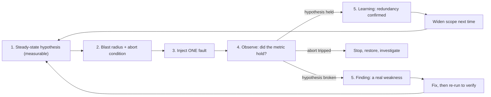
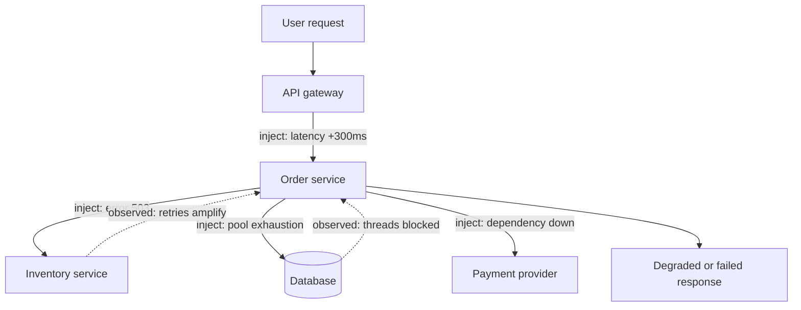

## Before you start

You need [designing-for-failure](designing-for-failure) — chaos testing exists to verify that timeouts, circuit breakers, bulkheads and fallbacks actually work, so you must know what they are first. You also need [sre-slos-and-error-budgets](sre-slos-and-error-budgets), because an experiment spends error budget and you must know whether you have any to spend.

## In one sentence

**Chaos engineering** is deliberately injecting a specific failure into a running system to test a prediction you wrote down first — that redundancy holds, that a fallback fires, that latency stays acceptable — so you find weaknesses on a Tuesday afternoon instead of at 3am.

## Why it matters

**You do not know whether your redundancy works until it has been tested.** A circuit breaker never tripped, a replica never promoted, a fallback never taken — these are hypotheses, not capabilities. They fail in embarrassing ways: the fallback that throws because its own config was never populated, the retry that stampedes the dependency at scale, the failover that works but takes nine minutes because a DNS record has a long time-to-live nobody checked.

This has to happen in production eventually, because the failure modes worth finding come from properties staging lacks: real traffic shape, data volumes, dependency behaviour and concurrency. Staging with 400 rows and three users tells you the happy path works. It does not tell you a query degrades non-linearly at ten million rows, or that a pool sized for staging exhausts under production concurrency.

## The intuition

**Chaos engineering is an experiment, not vandalism.** This framing is the whole topic, and it is what separates a professional practice from recklessness — so it is also exactly what an interviewer is listening for.

An experiment has a shape borrowed from science:

1. A **steady-state hypothesis** in measurable terms: "with one of three replicas terminated, checkout success rate stays above 99% and p95 latency stays under 400ms."
2. A **blast radius** — the smallest scope that can still produce a real answer: one instance, one availability zone, 1% of traffic, one non-critical dependency.
3. **One injected fault.** One, because two simultaneous faults give you an outcome you cannot attribute to either.
4. **Observation** against the hypothesis.
5. An **abort condition** defined in advance, with a mechanism to stop instantly.

**Form the hypothesis first, and the ordering is not a formality.** If you cannot say what you expect, you learn nothing from the result, because any outcome looks like the expected one. Break something with no prediction and you get "huh, interesting" — not a finding, and if users are degraded you have caused an incident with extra steps. Writing the prediction down is also where much of the value appears: teams routinely discover at this step that nobody knows what should happen, which is itself a free finding.



Note that a *held* hypothesis is a useful result — it converts an assumption into evidence and earns you the right to widen the blast radius next time.

## How it actually works

**The prerequisites, which are not optional.** Running chaos without these is not an experiment, it is an outage you scheduled:

- **Observability good enough to detect the impact.** If you cannot see the effect within seconds, you cannot tell a held hypothesis from a broken one, and you cannot abort in time. This is the hardest prerequisite and the most commonly skipped.
- **A tested rollback or stop mechanism.** The experiment must be reversible by one action that you have already exercised.
- **Error budget with room in it.** An experiment consumes budget. Running one while the budget is exhausted is spending money you do not have — see [sre-slos-and-error-budgets](sre-slos-and-error-budgets).
- **Stakeholder awareness.** Support and on-call must know the experiment is running, or the first anomaly triggers a full incident response and you have wasted everyone's night. This one line is also what makes it an experiment rather than sabotage.

**The failure classes worth injecting**, and what each actually tests:

| Fault | Tests | Typical finding |
|---|---|---|
| Instance termination | Redundancy, rescheduling, stateless assumptions | Sticky state on the dead instance; slow rescheduling |
| Latency injection | Timeouts, pool sizing, timeout budgets | No timeout at all; pools exhausting; retry storms |
| Error injection | Circuit breakers, fallbacks, error handling | Fallback path itself broken or unconfigured |
| Resource exhaustion | Limits, autoscaling, back-pressure | No memory limit; OOM kill cascades to neighbours |
| Dependency unavailability | Graceful degradation, criticality assumptions | An "optional" dependency is actually required |
| Network partition | Split-brain handling, consistency, quorum | Both sides accept writes; no leader; stale reads |

**Latency is often more revealing than outright failure**, and this is the single most valuable insight in the topic.

A hard failure is *easy*. The connection is refused, the error arrives immediately, the circuit breaker counts it, trips, and the fallback fires — a path designed for this and exercised in milliseconds.

Slowness is quietly catastrophic. A dependency answering in 8 seconds instead of 80ms returns **success**, so nothing counts a failure and no breaker trips. Meanwhile every in-flight request holds a connection and a thread, so your pool fills with perfectly successful requests and you cannot serve traffic unrelated to that dependency. Health checks pass, error rate looks fine, the service is dead. Hence circuit breakers must treat "slower than the timeout" as a failure, and [connection-pooling](connection-pooling) sizing is a resilience decision, not a performance tweak.

Slowness also interacts badly with retries. A request that timed out client-side while the server keeps working means the original work continues *and* a duplicate begins, so injected latency multiplies real load exactly when the dependency is struggling. Retries without backoff turn a slow dependency into a self-inflicted denial of service, which is why idempotency matters when an operation may arrive twice; see [idempotency-and-retries](idempotency-and-retries).



**Game days** are the human-side equivalent: a scheduled exercise where you inject a failure and let the on-call process run for real — the alert fires, someone is paged, they open the runbook and follow it. What it tests is the *response*, not the system: whether the runbook is accurate, the dashboard link still works, the new joiner can find the rollback command, anyone knows who declares an incident. The findings are consistently mundane and consistently valuable, because a runbook referencing a renamed dashboard is best discovered on a Wednesday.

**Start in staging, but be honest about its limits.** Staging is right for building confidence in the tooling, verifying the abort mechanism, and catching obvious findings — a missing timeout shows up anywhere. It cannot reproduce production's traffic shape, data size, dependency behaviour or concurrency, so a whole class of failure appears only in production: pool exhaustion under real concurrency, queries degrading at scale, thundering herds, cache stampedes when a hot key expires. Saying this plainly is a strength — claiming staging suffices signals you have not looked, and claiming you would immediately break production signals you have not considered blast radius.

## Worked example

A fault-injection wrapper plus a demonstration of retry amplification under injected latency.

```js
let inFlight = 0, peakInFlight = 0, upstreamCalls = 0;

const dependency = async () => {                 // the real work: normally 5ms
  upstreamCalls++; inFlight++;
  peakInFlight = Math.max(peakInFlight, inFlight);
  await new Promise((r) => setTimeout(r, 5));
  inFlight--;
  return 'ok';
};

// The injector: wraps a dependency and adds faults at a configured probability.
function withFaults(fn, { latencyMs = 0, latencyProb = 0, errorProb = 0, rng = Math.random } = {}) {
  return async (...args) => {
    if (rng() < errorProb) throw new Error('injected error');
    if (rng() < latencyProb) {                   // the slow path still occupies a slot
      inFlight++; peakInFlight = Math.max(peakInFlight, inFlight);
      await new Promise((r) => setTimeout(r, latencyMs));
      inFlight--;
    }
    return fn(...args);
  };
}

function seeded(seed) {                          // deterministic: an experiment must repeat
  let s = seed;
  return () => (s = (s * 1103515245 + 12345) & 0x7fffffff) / 0x7fffffff;
}

// Client timeout + immediate retry. The timeout abandons the CALLER, not the upstream work.
async function callWithRetries(dep, { attempts, timeoutMs }) {
  for (let i = 1; i <= attempts; i++) {
    try {
      return await Promise.race([
        dep(),
        new Promise((_, rej) => setTimeout(() => rej(new Error('timeout')), timeoutMs)),
      ]);
    } catch (err) {
      if (i === attempts) return `fail:${err.message}`;
    }
  }
}

async function experiment(label, faults, client) {
  upstreamCalls = 0; peakInFlight = 0; inFlight = 0;
  const dep = withFaults(dependency, { ...faults, rng: seeded(20260909) });
  const t0 = Date.now();
  const out = await Promise.all(Array.from({ length: 100 }, () => callWithRetries(dep, client)));
  await new Promise((r) => setTimeout(r, 400));  // let abandoned work drain
  const ok = out.filter((r) => r === 'ok').length;
  console.log(
    `${label.padEnd(38)} ok ${String(ok).padStart(3)}/100 | ` +
    `upstream calls ${String(upstreamCalls).padStart(3)} | ` +
    `peak concurrent ${String(peakInFlight).padStart(3)} | ${String(Date.now() - t0).padStart(4)}ms`
  );
}

(async () => {
  console.log('hypothesis: 100 requests succeed, upstream sees ~100 calls\n');
  await experiment('no faults',                    {},                                   { attempts: 3, timeoutMs: 100 });
  await experiment('30% hard errors, 3 retries',   { errorProb: 0.3 },                   { attempts: 3, timeoutMs: 100 });
  await experiment('30% slow (+300ms), 3 retries', { latencyProb: 0.3, latencyMs: 300 }, { attempts: 3, timeoutMs: 100 });
  await experiment('30% slow (+300ms), 1 attempt', { latencyProb: 0.3, latencyMs: 300 }, { attempts: 1, timeoutMs: 100 });
})();
```

Real output (the counts are deterministic; wall-clock times vary by a few ms per run):

```
hypothesis: 100 requests succeed, upstream sees ~100 calls

no faults                              ok 100/100 | upstream calls 100 | peak concurrent 100 |  408ms
30% hard errors, 3 retries             ok  97/100 | upstream calls  97 | peak concurrent  97 |  408ms
30% slow (+300ms), 3 retries           ok  96/100 | upstream calls 142 | peak concurrent 100 |  704ms
30% slow (+300ms), 1 attempt           ok  68/100 | upstream calls 100 | peak concurrent 100 |  505ms
```

The numbers make the central point precisely.

**Hard errors are handled cleanly.** Row two injects a 30% error rate and the retries do their job: 97 of 100 requests succeed, and upstream sees **97 calls** — *fewer* than baseline, because an injected error fails before reaching the dependency at all. Errors are cheap, fast and attributable. This is what people imagine chaos testing looks like, and it is the least informative row.

**Injected latency is what amplifies load.** Row three injects the same 30% rate as slowness instead of failure. Success stays at 96, so a dashboard watching only error rate sees nothing wrong — but upstream calls jump to **142**, a 42% load increase on a dependency already struggling. The client's 100ms timeout fires while the 300ms delay is still running, the caller retries, and the abandoned work keeps occupying the dependency. In reality that 42% arrives precisely when the dependency can least absorb it, which is how a slow dependency becomes a dead one.

**Row four isolates the cause.** Remove the retries, keep the latency: upstream calls fall back to exactly **100** and the amplification vanishes. The cost is visible — success drops to 68, because requests that would have succeeded on a second attempt now fail. That is the real trade-off, and why the fix is bounded retries with backoff and jitter against a deadline rather than either extreme.

## A second example — when it gets harder

Now the experiment that produces a finding you did not predict, which is the outcome that justifies the practice.

You hypothesise: "terminating one of three recommendation-service instances leaves checkout success rate above 99%." You have a fallback to bestsellers, so this looks safe and slightly boring.

You run it. Checkout success holds at 99.8% — hypothesis confirmed. But the **search** service, which nobody connected to recommendations, sees p95 latency triple.

The cause is a shared resource nobody documented: both services call a common user-profile service through the same connection pool. When recommendations started retrying against its surviving instances, it consumed pool capacity search was quietly depending on. Neither team knew the coupling existed, because it appears in no architecture diagram — it lives in a configuration default.

This is the characteristic finding of chaos engineering and why the practice exists. The *predicted* result was already known to be fine; the value came from the **unexpected coupling**, which no amount of reasoning would have surfaced because the dependency was invisible in the design. The fix is a bulkhead — separate pools per dependency — and then you re-run the experiment to verify it, rather than assuming it worked.

Two disciplines that keep this productive:

**Widen the blast radius gradually and only after success.** One instance, then one zone; staging, then off-peak production, then peak. Each held hypothesis earns the next increment. A team starting by partitioning a production region has skipped the part where they discover their observability is inadequate.

**Automate experiments that have passed, so they become regression tests.** A resilience property verified once decays as someone changes a timeout, resizes a pool or adds a dependency. Running the experiment continuously is what stops resilience quietly regressing and what makes chaos engineering a practice rather than an event. Tools such as Chaos Mesh and Litmus define these experiments declaratively so they run on a schedule with an automatic abort.

## Quick reference

| Element | What it means | Failure if missing |
|---|---|---|
| Steady-state hypothesis | Measurable prediction, written first | Any result looks expected; no learning |
| Blast radius | Smallest scope giving a real answer | An experiment becomes an outage |
| Abort condition | Pre-agreed stop trigger and mechanism | You debate stopping while users suffer |
| One fault at a time | Single variable | Outcome cannot be attributed |
| Stakeholder notice | Support and on-call know | Real incident response triggered |
| Re-run after fixing | Verify the remedy | You assume a fix you never tested |

## Tools & frameworks

| Tool | What it's for | Reach for it when |
|---|---|---|
| [Principles of Chaos Engineering](https://principlesofchaos.org/) | The method: hypothesis, blast radius, abort conditions | Before any tool — chaos without a hypothesis is just an outage you caused |
| [Chaos Mesh](https://chaos-mesh.org/docs/) | Kubernetes-native fault injection as CRDs | You are on Kubernetes and want experiments reviewed and version-controlled as manifests |
| [LitmusChaos](https://docs.litmuschaos.io/) | Chaos experiments with a hub of prebuilt scenarios | You want ready-made experiments and a control-plane UI rather than authoring each fault |
| [tc (netem)](https://man7.org/linux/man-pages/man8/tc.8.html) | Latency, loss and partition at the host | You need one precise network fault and a whole framework is overkill |
| [Chaos Monkey](https://github.com/Netflix/chaosmonkey) | The original instance-termination tool | Historical reference, and as the "randomly kill things" baseline to compare against |

`grafana/xk6-disruptor` now redirects to a `grafana-cold-storage/` org — treat it as no longer maintained and prefer Chaos Mesh or LitmusChaos.

## Common mistakes

- Injecting a fault with no written hypothesis, which yields anecdotes instead of findings and is indistinguishable from causing an incident.
- Running an experiment before observability is good enough to detect the impact or to abort in time.
- Starting in production at large scale, rather than earning scope with successful smaller runs.
- Injecting only hard failures, which are the easy case; latency is what exposes pool and timeout defects.
- Two faults at once, leaving the result unattributable.
- No abort condition agreed in advance, so stopping becomes a judgement call made under pressure.
- Not telling on-call and support, converting an experiment into an unplanned incident response.
- Treating a confirmed hypothesis as a waste of time — it is evidence, and it earns a wider blast radius.
- Assuming staging is sufficient, when the failures worth finding depend on production's data size, concurrency and traffic shape.
- Running one experiment, fixing the finding, and never re-running to verify the fix or catch the regression.
- Running chaos with no error budget left, which spends reliability you have already promised away.

## What interviewers ask

- **What is chaos engineering, and how is it not just breaking things?** — It is a controlled experiment: a measurable steady-state hypothesis written first, the smallest blast radius that still answers the question, one injected fault, observation against the hypothesis, and a pre-agreed abort condition. Without the hypothesis and the boundaries, you are causing an incident.
- **Why must the hypothesis come first?** — Because if you cannot say what you expect, every outcome looks like the expected one and you learn nothing. Writing it down also frequently reveals that nobody knows what should happen, which is a finding in itself.
- **Why is injected latency more revealing than a hard failure?** — A hard failure returns an error immediately, so the circuit breaker counts it, trips and the fallback fires: the path is designed for it and is exercised in milliseconds. Slowness returns *success*, so no breaker trips and no error rate moves, while every waiting request holds a connection and a thread until the pool is full of successful-but-slow calls and the service can serve nobody. It also multiplies load, because a client-side timeout retries work the server is still doing.
- **What must be true before your first experiment?** — Observability sufficient to detect impact within seconds, a tested one-action rollback, error budget with room in it, and stakeholder awareness so the first anomaly does not trigger a full incident response.
- **Why run in production at all?** — Because the failures worth finding depend on real traffic shape, data volumes, concurrency and dependency behaviour. Staging catches missing timeouts; it will not catch a query that degrades at ten million rows or a pool that exhausts only under production concurrency.
- **What is a game day?** — A scheduled exercise testing the human response as well as the system: the alert fires for real, someone is paged, and they follow the runbook. It reliably finds stale runbooks, broken dashboard links and unclear ownership.
- **What does a good finding look like?** — Usually an unexpected coupling. The predicted behaviour holds, and something apparently unrelated degrades because it shared a resource nobody had documented — the class of problem that reasoning alone does not surface.

## Practice

1. Extend the injector with a circuit breaker that counts a call slower than the timeout as a failure, and show from the upstream-call count that it suppresses the amplification visible in row three.
2. Add bounded exponential backoff with jitter to `callWithRetries`, then find the maximum attempt count at which upstream calls stay within 10% of baseline under the same injected latency.
3. Write a complete experiment plan for a dependency you know: the steady-state hypothesis with a specific metric and threshold, the blast radius, the single fault, the abort condition, and who you would notify. Then state which of the four prerequisites you currently could not satisfy.

## Where to go next

[designing-for-failure](designing-for-failure) is where the fixes live — bulkheads for the shared-pool finding, latency-aware circuit breakers for the slow dependency. [progressive-delivery](progressive-delivery) is the companion practice: it limits the damage from changes you make deliberately, while chaos testing verifies you survive failures you did not choose. [observability-with-opentelemetry](observability-with-opentelemetry) is the prerequisite you will most often find you are missing.
