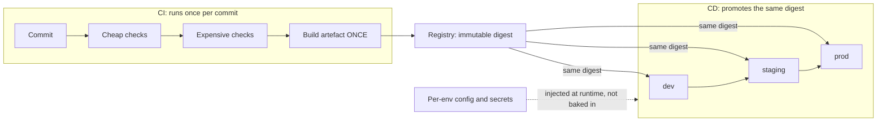
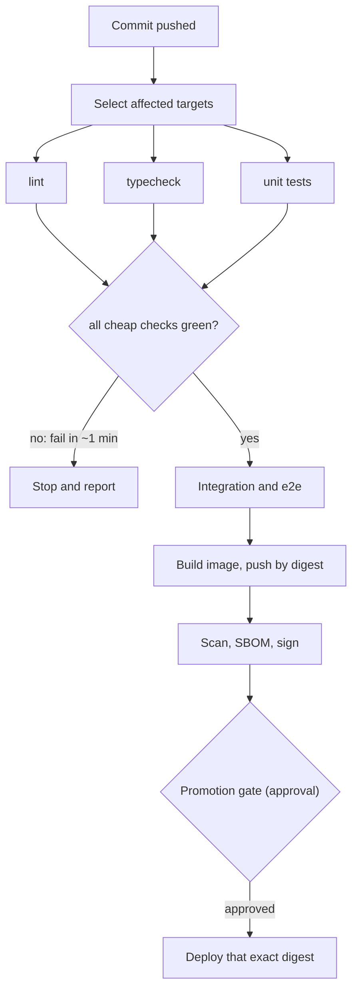

## Before you start

Read `cicd-pipelines` first — stages, jobs, `needs:`, and why a failing stage stops the line. This topic assumes you can write a working pipeline and asks how it should be *shaped*. `docker-containerization` helps, since the artefact here is usually an image.

## In one sentence

Designing a pipeline means choosing what runs, in what order, and what gets carried between environments — so failures surface in the first minute rather than the twentieth, and the thing you tested is bit-for-bit the thing that reaches production.

## Why it matters

A pipeline that works and one that is well designed differ in two measurable ways.

The first is **time to a red signal**. If a missing semicolon takes eighteen minutes to report because the end-to-end suite runs before the linter, developers context-switch, batch their pushes, and stop watching. The pipeline still catches bugs; it stops changing behaviour, which was the point.

The second is **whether you can trust what production runs**. A pipeline that rebuilds per environment gives prod a different binary from the one staging validated — same commit, different bytes. Every test ran against something else. That is the mechanism behind a large share of "but it passed in staging" incidents.

Everything below serves those two properties.

## The intuition

Two ideas carry most of the design.

**Fail fast means order by cost, not by importance.** Airport security screens boarding passes before X-raying luggage — not because documents matter more, but because the cheap check eliminates people before you spend the expensive resource on them. Your linter is the boarding-pass check.

**Build once and promote.** A bakery bakes a cake, then delivers it. It does not re-bake from the recipe at each address and hope all three come out the same. The artefact is made once, identified precisely, and moved. Environments differ in the address label, never in the cake.

Hold on to the second especially — it is the spine of this topic, and the question interviewers use to separate people who have designed a pipeline from people who copied one.



The three arrows from the registry carry the *same* digest. If any environment gets a different one, the design has failed however green the pipeline looks.

## How it actually works

### Stage ordering

Order stages by information gained per unit of time spent.

Cheap and fast first: format, lint, typecheck, unit tests — seconds to minutes, catching a large fraction of mistakes. Expensive next: integration tests needing real dependencies, browser-driven end-to-end tests, image builds, security scans.

Within the cheap tier, run everything in **parallel** — those checks need no output from each other, so the tier costs its slowest member, not their sum. Then a gate: all cheap checks green before any expensive stage begins. Within a tier, put the check most likely to fail first.

### Build once, promote the digest

The pipeline builds **one** artefact per commit and pushes it to a registry, which returns an immutable **digest** — a content hash. Every deployment then references that digest, not a tag, which can be repointed.

```text
registry.example.com/checkout@sha256:9b2c...  ← deployed to dev, then staging, then prod
```

Promotion becomes a metadata change: the same digest is recorded as approved for the next environment. No rebuild, so no opportunity for divergence.

Why rebuilding fails, concretely. Between your staging and prod builds, `FROM node:20-alpine` may resolve to a different image because the tag moved; a transitive dependency published a patch; a cache warmed differently. Individually unlikely, collectively routine, and all produce a prod binary no test has executed.

A corollary people miss: **if the image must be rebuilt to change environments, it is environment-specific, and build-once is impossible.** So it cannot hold the database URL, log level, or feature flags — those are runtime inputs. Build time carries only the universal: source, dependencies, compiled output. Hence the test: could this exact image run in prod and dev, differing only in what is injected at start-up?

### Caching

Caching improves time-to-signal without changing what is checked. Cache expensive, rarely-changing work: dependency downloads, compiler output, build layers. The key must hash whatever the content depends on — a lockfile hash for dependencies. Key on branch name and you serve stale content; key on commit SHA and you never hit.

The rule: **a cache key must change exactly when the cached content should change.** Too coarse gives wrong results, too fine gives no benefit.



### Secrets: OIDC instead of static keys

A pipeline needs cloud credentials. A long-lived access key in CI secrets never expires, works from anywhere, and can be exfiltrated by anyone who can edit a workflow file — staying valid until someone notices and rotates it.

**OIDC federation** replaces it. The CI system issues a short-lived signed token describing the run: which repository, branch and workflow. Your cloud provider trusts that issuer and exchanges the token for temporary credentials, but only when the claims match a policy you wrote.

```yaml
permissions:
  id-token: write   # allows requesting the OIDC token
  contents: read
steps:
  - uses: aws-actions/configure-aws-credentials@v4
    with:
      role-to-assume: arn:aws:iam::111122223333:role/deploy-prod
      aws-region: eu-west-1
      # No access key anywhere. The token is exchanged for
      # credentials valid for minutes.
```

Three properties improve at once. Credentials expire in minutes, so a leak has a tiny window. They are scoped by claim, so a role can be restricted to `refs/heads/main` in one repository — a pull-request branch cannot assume the prod role. And there is nothing to rotate, because nothing is stored. See `secrets-management` for the vault side and `workload-identity-and-spiffe` for the same idea applied to running services.

### Supply chain, at an awareness level

Your pipeline pulls third-party code and produces something you deploy. Four practices:

**Pin by digest**, not tag — `actions/checkout@v4` is a mutable pointer, and a retagged release changes what runs in your pipeline with your credentials.

**SBOM** — an inventory of your artefact's contents, so "are we affected?" takes minutes when a CVE lands rather than a manual audit.

**Provenance and signing** — a signed statement of which commit, builder and inputs produced this artefact, verified before deploy. This stops an artefact that never went through your pipeline being deployed as if it had.

**Base-image currency** — most CVEs come from the base image, so rebuilding on a current base is the highest-leverage security action available.

### Test strategy

Not everything belongs on every commit.

| Runs | What | Why |
|---|---|---|
| Every commit | Lint, typecheck, unit, fast integration | Under ~10 minutes total; the feedback loop |
| Every merge to main | Full integration, image build, scan | Slower, but on a lower-frequency event |
| Nightly | Full e2e, load tests, long-running suites | Too slow to gate on; still needed |
| Pre-release | Performance regression, smoke against prod-like | Gates promotion, not commits |

**Flaky tests** need explicit handling, because the default is worse. A suite that fails randomly teaches developers to re-run rather than investigate, and once that habit exists real failures get re-run too. Quarantine the flaky test — non-blocking suite, a ticket, visible on a dashboard — so the blocking suite stays trustworthy.

### Monorepo concerns

Running everything on every commit does not scale in a monorepo. **Affected-target selection** builds the dependency graph and tests only what a change can reach. Correctness is the whole game: miss an edge and you skip a test that would have failed. Prefer tooling that derives the graph from real imports and build files over hand-maintained path filters, which go stale silently. **Remote build caches** let CI reuse work from another machine — effective, with a failure mode covered below.

## Worked example

A pipeline with the ordering and promotion discipline made structural:

```yaml
name: build-and-promote
on:
  push:
    branches: [main]

permissions:
  contents: read
  id-token: write        # OIDC — no static cloud keys anywhere
  packages: write

jobs:
  # TIER 1 — cheap, parallel, fails in about a minute
  cheap:
    runs-on: ubuntu-latest
    strategy:
      fail-fast: true                       # one failure cancels the siblings
      matrix:
        check: [lint, typecheck, unit]
    steps:
      - uses: actions/checkout@v4
      - uses: actions/setup-node@v4
        with:
          node-version: '20'
          cache: npm                        # keyed on the lockfile hash
      - run: npm ci
      - run: npm run ${{ matrix.check }}

  # TIER 2 — expensive, gated on tier 1
  expensive:
    needs: cheap
    runs-on: ubuntu-latest
    services:
      postgres:
        image: postgres:16
    steps:
      - uses: actions/checkout@v4
      - run: npm ci
      - run: npm run test:integration

  # BUILD ONCE — the only place an artefact is produced
  build:
    needs: expensive
    runs-on: ubuntu-latest
    outputs:
      digest: ${{ steps.push.outputs.digest }}   # the digest downstream jobs consume
    steps:
      - uses: actions/checkout@v4
      - uses: docker/build-push-action@v6
        id: push
        with:
          push: true
          tags: ghcr.io/acme/checkout:${{ github.sha }}
          provenance: true                  # signed statement of how this was built
          cache-from: type=gha
          cache-to: type=gha,mode=max

  # PROMOTE — deploys the digest, never rebuilds
  deploy-staging:
    needs: build
    runs-on: ubuntu-latest
    environment: staging
    steps:
      - run: |
          # Reference by DIGEST. A tag could be repointed; this cannot.
          echo "deploying ghcr.io/acme/checkout@${{ needs.build.outputs.digest }}"

  deploy-prod:
    needs: deploy-staging
    runs-on: ubuntu-latest
    environment: production          # required reviewers configured here
    steps:
      - run: |
          echo "deploying ghcr.io/acme/checkout@${{ needs.build.outputs.digest }}"
```

The design decisions, line by line:

`strategy.matrix` with `fail-fast: true` runs the cheap checks in parallel and cancels the rest as soon as one fails, so a failure stops paying for the others.

`needs: cheap` is the gate. Expensive work is structurally unable to start until cheap work passes. A comment saying "run lint first" enforces nothing; the job graph does.

`outputs.digest` makes build-once real. The build job publishes the digest; both deploy jobs consume it. No `docker build` exists downstream, so a per-environment rebuild is impossible by construction rather than by discipline.

`environment: production` attaches the approval gate to the environment, so the reviewer requirement lives in configuration rather than a step someone can delete.

A successful run:

```text
✓ cheap (lint)        41s
✓ cheap (typecheck)   58s
✓ cheap (unit)        1m 12s     ← tier cost = 1m 12s, not 2m 51s
✓ expensive           6m 03s
✓ build               3m 28s   digest=sha256:9b2c4f...e81a
✓ deploy-staging      22s      deploying ghcr.io/acme/checkout@sha256:9b2c4f...e81a
⏸ deploy-prod         waiting for review
```

And a failing one:

```text
✗ cheap (typecheck)   47s   src/order.ts(88,7): Type 'string' is not assignable to 'number'
⊘ cheap (lint)        cancelled
⊘ cheap (unit)        cancelled
⊘ expensive           skipped
⊘ build               skipped
```

Forty-seven seconds to a red signal, no expensive compute spent. Put the e2e suite first and this is an eighteen-minute wait for the same information.

## A second example — when it gets harder

Two failure modes that mislead you about *where* the problem is. Both reliably burn hours.

### A shared time budget makes the wrong step look guilty

Three security tools run as sequential steps in one job with a single overall timeout — say ten minutes. The first is slow and takes nine and a half. The second gets thirty seconds. The third never starts.

The reported failure is that the *last* tool timed out. So you investigate it: raise resources, tune config, exclude paths. Nothing changes, because it never ran — it was starved of a clock a preceding step had already spent.

The diagnostic tell is easy to check: **the accused step shows no evidence of having done any work.** No CPU consumed, no throttling, no process present, no output beyond a start line. A tool genuinely too slow leaves traces of working; one never scheduled leaves none.

```js
// Attribute a shared budget to the step that actually consumed it.
const BUDGET_MS = 10 * 60 * 1000;

const steps = [
  { name: 'scanner-a', durationMs: 9.5 * 60 * 1000, cpuSeconds: 512, processSeen: true  },
  { name: 'scanner-b', durationMs: 0.5 * 60 * 1000, cpuSeconds:  28, processSeen: true  },
  { name: 'scanner-c', durationMs: 0,               cpuSeconds:   0, processSeen: false }, // blamed
];

let spent = 0;
for (const s of steps) {
  const before = spent;
  spent += s.durationMs;
  const share = ((s.durationMs / BUDGET_MS) * 100).toFixed(1);
  const starved = before >= BUDGET_MS || (!s.processSeen && s.cpuSeconds === 0);
  console.log(
    `${s.name.padEnd(11)} used ${share.padStart(5)}% of budget  ` +
    `cpu=${String(s.cpuSeconds).padStart(4)}s  ` +
    (starved ? 'STARVED — never ran; not the culprit' : 'did work')
  );
}
console.log(`\nBudget consumed before the blamed step: ${(spent - steps.at(-1).durationMs) / 1000}s of ${BUDGET_MS / 1000}s`);
```

Output:

```text
scanner-a   used  95.0% of budget  cpu= 512s  did work
scanner-b   used   5.0% of budget  cpu=  28s  did work
scanner-c   used   0.0% of budget  cpu=   0s  STARVED — never ran; not the culprit

Budget consumed before the blamed step: 600s of 600s
```

A second trap layers on this. Some CI systems **ignore per-step resource limits** and apply one allocation to the whole job. So you raise the CPU limit on the blamed step, see no improvement, and conclude the tool is slow — when your limit was never applied at all. Two mechanisms pointing away from the real cause is why this eats so much time.

The general lesson for any shared-budget system: **verify the blamed component actually executed before tuning it.** Zero work done is not a performance problem, and tuning will never fix it. Structurally, give tools that need their own clock their own job.

### A cache that reports success while doing nothing

Remote build caches have the same shape: silent failure, reassuring status. A misconfigured cache — wrong team or scope, a token not valid for writes — leaves every build a cache miss while the pipeline stays green. You pay for a cache, get nothing, and no log line says so.

Worse, some cache status endpoints return success for *any* token. So the natural verification — hit the endpoint, see 200, conclude it works — confirms only reachability. A wrong scope also risks the opposite failure: serving artefacts built from different inputs.

**Probe the real thing, not the status endpoint.** Request an artefact whose identity you know: a `404` for one that should not exist and a `200` for one that should are both real signals. Then confirm from build timings that hits occur — the only proof that matters.

The pattern behind both halves: **a green status is not evidence that work happened.** Verify the effect, not the report.

## Quick reference

| Decision | Do this | Because |
|---|---|---|
| Stage order | Cheap and parallel first, gate, then expensive | Red signal in a minute, not twenty |
| Artefact | Build once per commit, promote the digest | Rebuilding means prod runs untested bytes |
| Image contents | No environment-specific values | Otherwise per-env rebuild is unavoidable |
| Deploy reference | Digest, never a mutable tag | Tags can be repointed under you |
| Cache key | Hash of the content's real inputs | Too coarse serves stale, too fine never hits |
| Cache verification | Probe a real artefact; check timings | Status endpoints can pass any token |
| Cloud credentials | OIDC to short-lived credentials | Static keys never expire, work anywhere |
| Third-party actions | Pin by commit SHA or digest | Tags are mutable and run with your secrets |
| Flaky test | Quarantine out of the blocking suite | Retrying in place destroys trust in all tests |
| Slow tools | Own job with its own timeout | Shared budgets starve later steps |
| Monorepo | Affected-target selection from the real graph | Path filters go stale silently |

## Tools & frameworks

| Tool | What it's for | Reach for it when |
|---|---|---|
| [GitHub Actions](https://docs.github.com/en/actions) | Reusable workflows, matrices, caching | You are designing pipeline *structure*, not just running commands in sequence |
| [Argo CD](https://argo-cd.readthedocs.io/en/stable/) | The deploy half of CI/CD, pull-based | You are separating build from deploy — the core design decision in this topic |
| [Dagger](https://docs.dagger.io/getting-started/introduction/) | Portable pipelines you can run locally | Pipeline logic must not be locked into one CI vendor, and "works on my machine" must include the pipeline |
| [Turborepo](https://turborepo.dev/docs) | Task graph with remote caching | Monorepo CI time is the bottleneck and most of each run is rebuilding unchanged packages |
| [cosign](https://github.com/sigstore/cosign) | Sign and verify artifacts | The pipeline must produce provenance a deploy step can actually verify |

## Common mistakes

- Ordering stages by perceived importance instead of cost, so trivial errors take twenty minutes to report.
- Rebuilding the artefact per environment, so production runs bytes no test ever executed.
- Baking environment configuration into the image, which makes build-once impossible.
- Deploying by mutable tag, so what ran in prod is not knowable from the pipeline.
- Cache keys on a branch name (stale hits) or a commit SHA (never hits).
- Trusting a cache status endpoint that passes any token, instead of probing a real artefact and checking timings.
- Long-lived static cloud keys in CI, when OIDC gives scoped credentials that expire in minutes.
- Pinning third-party actions by tag — a mutable pointer executing in a job that holds your credentials.
- Retrying flaky tests in place until nobody believes any failure.
- Tuning a step that timed out without first checking whether it ran at all.

## What interviewers ask

- **Why build the artefact once and promote it?** — Rebuilding per environment can produce different bytes from the same commit: a moved base-image tag, a new transitive dependency, a different build environment. Prod then runs something no test executed. Promoting an immutable digest makes tested and deployed identical by construction, and forces configuration out of the image.
- **How do you order pipeline stages and why?** — By cost, not importance: parallel cheap checks, a gate, then expensive ones. Time-to-red-signal determines whether developers actually use the pipeline, and there is no value in compiling code that fails a linter.
- **A step in a shared job reports a timeout. How do you diagnose it?** — First check whether it ran: CPU consumed, process present, any output. Zero work done means an earlier step spent the shared budget, so the failure names the wrong component. Also check whether the system honours per-step resource limits — if not, raising them changes nothing. Only tune after confirming it executed.
- **Why OIDC instead of storing cloud keys?** — Static keys never expire, work from anywhere, and are readable by anyone who can edit a workflow. OIDC exchanges a signed token describing the run for credentials valid for minutes, scoped by claims like repository and branch, with nothing stored to leak or rotate.
- **What goes in the image versus at runtime?** — Only universal things at build time: code, dependencies, compiled output. Anything environment-specific is injected at start-up. The test is whether this image could run in every environment.
- **How do you handle flaky tests?** — Quarantine them out of the blocking suite with a ticket and visible tracking. Retrying in place trains everyone to re-run failures, which hides real ones.
- **How do you keep a monorepo pipeline fast?** — Affected-target selection from a real dependency graph plus remote caching. A missed edge skips a test that would have failed, so derive the graph from imports and build files rather than hand-written path filters.

## Practice

1. Take a pipeline whose stages run sequentially in arbitrary order. Measure time-to-first-failure for a type error and a broken e2e test. Restructure into parallel cheap tier, gate, expensive tier, and measure again. Which number matters more?
2. Build a pipeline where one job builds and pushes an image, outputs the digest, and two deploy jobs consume it. Then try to make a deploy job use a different build, and describe what prevented or permitted it.
3. Misconfigure a remote cache so it silently misses while the pipeline stays green. Find a check that detects it, and explain why hitting a status endpoint does not.

## Where to go next

`container-images-and-oci` — digests, tags and layer caching are the substance of what you promoted. Then `progressive-delivery` for what happens after the digest reaches prod, and `sre-slos-and-error-budgets` for how fast you should ship.
