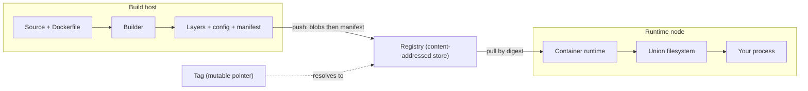
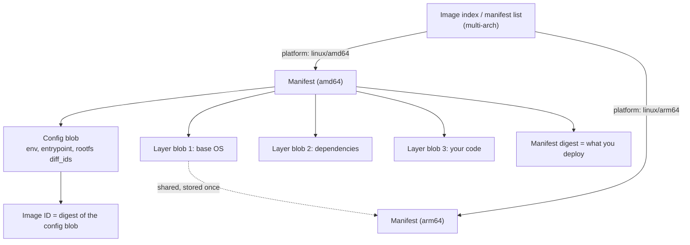

## Before you start

Read `docker-containerization` first — images versus containers, the Dockerfile, layers, and why instruction order affects build speed. This topic opens the image up: what the bytes actually are, how a registry stores and identifies them, and the operational consequences of the choices you make while building.

## In one sentence

A container image is not a file but a set of **content-addressed blobs** — some filesystem layers plus one configuration document — tied together by a **manifest**, where every piece is named by the hash of its own content.

## Why it matters

Three practical problems all resolve to the same understanding.

**"It worked yesterday."** You deployed `myapp:v2` on Monday and again on Friday and got different software, because a tag is a name someone can repoint. Nothing recorded which bytes ran.

**"Why is the build slow?"** A layer changed early in the chain and invalidated every layer after it. The fix is ordering, which only makes sense once you know layers form a chain.

**"Why can't I debug this container?"** The minimal image you chose for security has no shell, so `kubectl exec` gives you nothing. A real trade-off with a real answer.

Underneath all three is one idea: **content addressing.** Once every part of an image is named by its own hash, mutable tags, deduplication, cache invalidation and multi-arch dispatch stop being separate facts and become consequences.

## The intuition

Think of an image as a recipe card in a library, not a cake in a box.

The card lists ingredients by catalogue number, and each number is a hash of the ingredient itself. The library stores each ingredient once no matter how many recipes reference it, so two recipes sharing a base sauce genuinely share one jar.

The **manifest** is the card: a short document listing which config and which layers make up this image. The **layers** are the ingredients — tar archives of filesystem changes. The **config** is the preparation notes: entrypoint, environment variables, working directory.

Now the crucial distinction. A **digest** is a catalogue number, derived from content, so it can only ever refer to those exact bytes. A **tag** is a sticky note on the shelf reading "latest sauce" — helpful, and movable to a different jar tonight without telling you.

`:latest` is a sticky note. It is not a version.



Note the dashed arrow. The tag is not part of the image; it is a lookup that happens *before* you get one, and the arrow can be repointed.

## How it actually works

### The object graph

The **OCI Image Specification** standardises the format, which is why images built by one tool run under another.

An image is:

- **Layer blobs** — compressed tar archives of filesystem changes, applied in order. Each is addressed by the digest of its content.
- **A config blob** — JSON holding `Entrypoint`, `Cmd`, `Env`, `WorkingDir`, `User`, plus `rootfs.diff_ids` listing the layers in order.
- **A manifest** — JSON referencing the config by digest and the layers by digest, with sizes and media types.
- **Optionally an image index** — a manifest list mapping platforms to per-platform manifests, which is how one reference serves both `amd64` and `arm64`.



Two digests exist and confusing them is common. The **image ID** you see in `docker images` is the digest of the *config blob*. The **manifest digest** — what appears after `@sha256:` when you deploy — identifies the manifest. The manifest digest is the one to pin, because it covers the config and the layer list together.

### What a pull actually does

Resolve the reference to a manifest digest (a tag lookup, or directly if you gave a digest). Fetch the manifest. Read which layers it needs, and fetch only the blobs not already present locally. Verify each blob's hash against its digest — content addressing makes integrity checking free. Unpack and stack the layers.

**Deduplication** falls out of this. Ten images on the same base share those layer blobs, stored once in the registry and once on each node. Pull the tenth image and only its unique layers transfer.

### Layer caching and the ordering rule

Each Dockerfile instruction that changes the filesystem creates a layer. The builder caches them, and the invalidation rule is:

**When a layer's inputs change, that layer and every layer after it are rebuilt.** Never anything before it.

Layers are an ordered chain, and each is a diff against everything beneath. Change layer 2 and layer 3's meaning changes with it, so it cannot be reused.

The consequence is a hard ordering rule: **things that change rarely go before things that change often.** Your source changes constantly; your dependencies rarely. So:

```dockerfile
# WRONG — dependencies reinstall on every code change
COPY . .
RUN npm ci

# RIGHT — the install layer survives code changes
COPY package*.json ./
RUN npm ci
COPY . .
```

In the wrong version, `COPY . .` invalidates on any file change, so `npm ci` reruns every time. In the right version, changing `src/app.js` leaves the manifest files untouched, so the install layer is reused and rebuilds take seconds. Same instructions, same result, an order-of-magnitude difference in feedback speed.

### Multi-stage builds

A build needs compilers, headers and dev dependencies. Runtime needs none of them. Shipping them wastes bandwidth on every pull and enlarges your attack surface.

**Multi-stage builds** use several `FROM` statements. Early stages build; the final stage copies only the outputs. Everything in the discarded stages is absent from the final image — not deleted in a later layer, which would leave it recoverable in the layer beneath, but genuinely never present.

That distinction matters for secrets. `RUN rm secret.txt` in a later layer does not remove it from the image; the file is still in the earlier layer. Multi-stage avoids the whole class, because the discarded stage never contributes layers.

### Distroless, and the operational cost

**Distroless** images contain your app and its runtime dependencies — no shell, no package manager, no coreutils. `scratch` is empty. Both cut size and CVE surface enormously, since most vulnerabilities in a scan come from base-image packages you never invoke.

Then the on-call reality: `kubectl exec -it pod -- sh` returns `exec: "sh": executable file not found`. No shell, no `ls`, no `cat`, no `curl`. Every debugging reflex is gone.

The answer is **ephemeral debug containers**: attach a container with a full toolchain to the running pod, sharing its process and network namespaces, without restarting anything.

```bash
kubectl debug -it mypod --image=busybox:1.36 --target=app
```

The debug container has the tools; `--target` shares the app container's process namespace so you can inspect its processes, and the network namespace is shared so `curl localhost` reaches the app. See `kubernetes-debugging` for the full workflow.

One practical detail that saves real time: **a distroless runtime image usually still ships its language runtime, just not at a conventional path.** A Node.js distroless image has a `node` binary — often somewhere like `/nodejs/bin/node` rather than `/usr/local/bin/node`, with no `$PATH` entry and no shell to search with. If you need to run a one-off script inside such an image, the interpreter is there; invoke it by absolute path. Combined with piping the script over stdin rather than copying a file in (there is no shell to receive a copy), that is how you do a one-off task in a distroless container.

### Size, pull time and cold starts

Image size is not about disk. It is about **time to first request on a node that does not have the image.**

Scaling out under load pulls the image onto new nodes. Every megabyte is transfer time before your process starts — and it happens exactly when you are already overloaded. The same cost dominates cold starts, badly for large images: see `gpu-autoscaling-and-cold-starts`, where multi-gigabyte images make cold-start latency a primary design constraint.

Layer sharing softens this. A new revision of your app changing only the top layer pulls only that layer if the node already has the base. Which gives another reason for correct layer ordering: it makes *deploys* cheap, not just builds.

### Security

**Run as non-root.** Container isolation is not a VM boundary; root in a container is a much better position from which to attack a kernel vulnerability. Set a `USER` in the image and enforce it in the orchestrator.

**Drop capabilities.** Linux splits root's powers into capabilities, and almost no application needs any. Drop all, add back only what is required.

**Scan, and act on base images.** Most findings come from base-image packages, so rebuilding on a current base fixes more CVEs than any other action — making base-image currency a maintenance schedule rather than an incident response. `kubernetes-rbac-and-security` covers enforcing these at admission.

## Worked example

A multi-stage Dockerfile, line by line:

```dockerfile
# ---------- Stage 1: dependencies ----------
# Named stage. Nothing here reaches the final image unless copied.
FROM node:20-bookworm-slim AS deps
WORKDIR /app

# Manifests ONLY. This layer invalidates when the lockfile changes,
# not when application code changes.
COPY package.json package-lock.json ./
RUN npm ci --omit=dev

# ---------- Stage 2: build ----------
FROM node:20-bookworm-slim AS build
WORKDIR /app
# Reuse the installed tree instead of installing twice.
COPY --from=deps /app/node_modules ./node_modules
COPY package.json package-lock.json ./
# Source last: the most frequently changed input goes in the last layer.
COPY tsconfig.json ./
COPY src ./src
RUN npm run build          # emits ./dist

# ---------- Stage 3: runtime ----------
# Distroless: no shell, no package manager. Not the same base as above.
FROM gcr.io/distroless/nodejs20-debian12 AS runtime
WORKDIR /app

# Copy ONLY what runtime needs. Compilers and dev deps never existed here.
COPY --from=deps  /app/node_modules ./node_modules
COPY --from=build /app/dist         ./dist

# Non-root. Distroless provides an unprivileged 'nonroot' user.
USER nonroot

ENV NODE_ENV=production
EXPOSE 3000

# No shell exists, so exec form is mandatory — shell form would need /bin/sh.
# The entrypoint is the distroless image's node binary.
CMD ["dist/server.js"]
```

The decisions worth naming:

Copying manifests before source in stage 1 is the ordering rule. A code change does not touch `package-lock.json`, so `npm ci` stays cached.

`COPY --from=deps` in stage 2 avoids installing twice and keeps one authoritative dependency tree.

Stage 3 starting `FROM` a different, minimal base is the whole point. The compiler, dev dependencies and package manager exist only in stages 1 and 2, which contribute no layers to the result.

`USER nonroot` before `CMD` means the process starts unprivileged by default rather than depending on orchestrator configuration.

`CMD ["dist/server.js"]` is exec form. Shell form would require `/bin/sh`, which is absent — this is exactly the class of error distroless produces, and it appears at container start, not build.

Comparing results:

```text
$ docker images
REPOSITORY       TAG        SIZE
checkout         single     1.14GB     # single-stage, node:20 base, dev deps
checkout         multi      197MB      # this Dockerfile
```

```text
$ docker build .
 => [deps 3/3] RUN npm ci --omit=dev         CACHED
 => [build 5/5] RUN npm run build            8.2s
 => exporting layers                         1.1s
```

`CACHED` on the install step after a source-only change is the ordering rule paying off.

## A second example — when it gets harder

Tags versus digests, made concrete. This is where the "worked yesterday" problem gets nailed down:

```js
// Inspect what a reference actually resolves to.
// Feed it real output: docker manifest inspect -v <ref> > m.json
const fs = require('node:fs');
const crypto = require('node:crypto');

const raw = fs.readFileSync('m.json', 'utf8');
const doc = JSON.parse(raw);

// The manifest digest is the hash of the manifest BYTES — verifiable locally.
function manifestDigest(manifestBytes) {
  return 'sha256:' + crypto.createHash('sha256').update(manifestBytes).digest('hex');
}

const entries = Array.isArray(doc) ? doc : [doc];
for (const e of entries) {
  const platform = e.Descriptor?.platform;
  console.log(`ref       : ${e.Ref}`);
  console.log(`platform  : ${platform?.os}/${platform?.architecture}`);
  console.log(`manifest  : ${e.Descriptor?.digest}     <-- pin THIS`);
  console.log(`config    : ${e.SchemaV2Manifest?.config?.digest}  (the image ID)`);
  const layers = e.SchemaV2Manifest?.layers ?? [];
  const total = layers.reduce((n, l) => n + l.size, 0);
  console.log(`layers    : ${layers.length}, ${(total / 1e6).toFixed(1)} MB compressed`);
  layers.forEach((l, i) =>
    console.log(`  [${i}] ${(l.size / 1e6).toFixed(1).padStart(7)} MB  ${l.digest.slice(0, 26)}…`));
  console.log('');
}

// Same tag, two points in time: identical name, different bytes.
const monday = 'sha256:9b2c4f1e8a7d3c5b6f0a2e4d8c1b7a9e3f5d0c2b4a6e8d1f3c5b7a9e0d2f4c6b';
const friday = 'sha256:1a3c5e7d9b2f4a6c8e0d2b4f6a8c0e2d4b6f8a0c2e4d6b8f0a2c4e6d8b0f2a4c';
console.log('tag :v2 on Monday ->', monday.slice(0, 20) + '…');
console.log('tag :v2 on Friday ->', friday.slice(0, 20) + '…');
console.log('same tag, same digest?', monday === friday);
```

Output:

```text
ref       : registry.example.com/checkout:v2
platform  : linux/amd64
manifest  : sha256:9b2c4f1e8a7d3c5b6f0a2e4d8c1b7a9e…     <-- pin THIS
config    : sha256:4f8a1c3e5d7b9f0a2c4e6d8b0f2a4c6e…  (the image ID)
layers    : 4, 196.8 MB compressed
  [0]    31.4 MB  sha256:a1b2c3d4e5f6a7b8c9d0e1…
  [1]   118.2 MB  sha256:b2c3d4e5f6a7b8c9d0e1f2…
  [2]    46.9 MB  sha256:c3d4e5f6a7b8c9d0e1f2a3…
  [3]     0.3 MB  sha256:d4e5f6a7b8c9d0e1f2a3b4…

tag :v2 on Monday -> sha256:9b2c4f1e8a7d3c5b…
tag :v2 on Friday -> sha256:1a3c5e7d9b2f4a6c…
same tag, same digest?  false
```

Read the layer sizes. Layer `[3]` is 0.3 MB — that is the application code. Layer `[1]` is 118 MB of dependencies. Change only your code and a node with the image already cached pulls 0.3 MB. Order the Dockerfile so code sits above dependencies and the same change pulls 165 MB. That is the ordering rule expressed as deployment bandwidth rather than build time.

Then the last two lines. Same tag, different digest, four days apart. Deploying `:v2` gives no guarantee of what runs, and nothing in your deployment records which bytes it got. Deploy `checkout@sha256:9b2c...` and it is exact, verifiable and reproducible — and if the pull succeeds, hash verification proves the bytes are the ones you asked for.

The practical convention: tags for humans reading dashboards, digests for anything that must be certain. Pipelines resolve tag to digest once and promote the digest, which is the mechanism behind build-once-and-promote in `cicd-pipeline-design`.

## Quick reference

| Concept | What it is | Consequence |
|---|---|---|
| Layer blob | Tar of filesystem changes, addressed by content hash | Shared between images, stored once |
| Config blob | Entrypoint, env, user, layer order | Its digest is the image ID |
| Manifest | References config + layers by digest | Its digest is what you deploy |
| Image index | Platform → manifest mapping | One reference serves amd64 and arm64 |
| Tag | Mutable pointer to a manifest | Can be repointed; not a version |
| Digest | Content hash | Immutable, verifiable, reproducible |
| Cache invalidation | A changed layer invalidates all later ones | Dependencies before source, always |
| Multi-stage | Build stages contribute no layers | Build tools genuinely absent, not deleted |
| Distroless | No shell or package manager | Small and safer; `exec` is useless |
| Ephemeral debug container | Attach a toolchain to a running pod | How you debug distroless |
| Non-root + dropped caps | Reduces post-escape privilege | Container isolation is not a VM boundary |
| Base-image currency | Rebuild on a current base | Most CVE findings originate there |

## Common mistakes

- Treating `:latest` (or any tag) as a version. Tags are mutable pointers; pin digests where certainty matters.
- `COPY . .` before dependency installation, so every code change reinstalls everything and every deploy pulls the large layer.
- Deleting a secret in a later layer. It remains in the earlier layer and is recoverable. Use multi-stage, or a build secret mount.
- Choosing distroless without planning for debugging, then discovering `exec` is useless during an incident.
- Concluding a language runtime is missing from a distroless image because it is not on `$PATH` — it usually exists at a non-obvious absolute path.
- Using shell form `CMD` in a shell-less image, which fails at container start rather than build.
- Running as root because it is the default, in an isolation boundary weaker than a VM's.
- Scanning images without updating base images, leaving most of the findings untouched.
- Judging size by disk cost rather than pull time during scale-out and cold starts.

## What interviewers ask

- **What is a container image, really?** — A set of content-addressed blobs: ordered filesystem layers plus a config document, tied together by a manifest that references them by digest. Everything is named by its own content hash, which is what gives dedup, integrity verification and immutable references.
- **Tag versus digest?** — A tag is a mutable pointer that can be repointed at different bytes; a digest is the content hash and can only ever mean those bytes. Deploy by digest when you need to know what ran, since deploying the same tag twice can produce different software.
- **Why does Dockerfile order matter?** — A changed layer invalidates every layer after it, because layers are an ordered chain of diffs. Rarely-changing inputs go first, so dependency installation precedes source copying. It affects build time and also deploy bandwidth, since only changed layers transfer.
- **How do multi-stage builds shrink an image, and why is that different from deleting files?** — Discarded stages contribute no layers, so build tools were never in the final image. Deleting in a later layer leaves the file present in the earlier one and recoverable, which is why `RUN rm secret` does not remove a secret.
- **You chose distroless and now can't debug it. What now?** — No shell means `exec` is useless. Attach an ephemeral debug container sharing the pod's process and network namespaces, which needs no restart. Note that the language runtime is typically still present at a non-obvious absolute path, so a one-off script can be run by invoking the interpreter directly.
- **Why does image size matter beyond disk?** — It is pull time on a node that lacks the image, which happens during scale-out under load and on every cold start — exactly when latency matters most. Layer sharing means a small top layer keeps redeploys cheap.
- **What actually reduces CVEs?** — Currency of the base image, since most findings come from base packages rather than your code. Then non-root, dropped capabilities and a minimal base to shrink what is there to find.

## Practice

1. Run `docker manifest inspect -v` on a popular multi-arch image. Identify the index, the per-platform manifests, the config digest and the layer digests. Explain which digest you would put in a deployment and why the other one is not it.
2. Build an app single-stage, then multi-stage with a distroless runtime. Compare sizes and layer counts. Then try to `exec` a shell into each, and get a shell-level view of the distroless one without restarting it.
3. Build an image with `COPY . .` before dependency installation. Change one line of source, rebuild, and record both build time and the bytes a fresh node would pull. Reorder correctly and record both again. Explain why the second number matters for autoscaling.

## Where to go next

`kubernetes-debugging` — distroless makes ephemeral containers a required skill rather than an advanced one. `gpu-autoscaling-and-cold-starts` shows image size becoming a primary latency constraint, and `kubernetes-rbac-and-security` covers enforcing non-root and dropped capabilities at admission so the image's good defaults cannot be bypassed.
