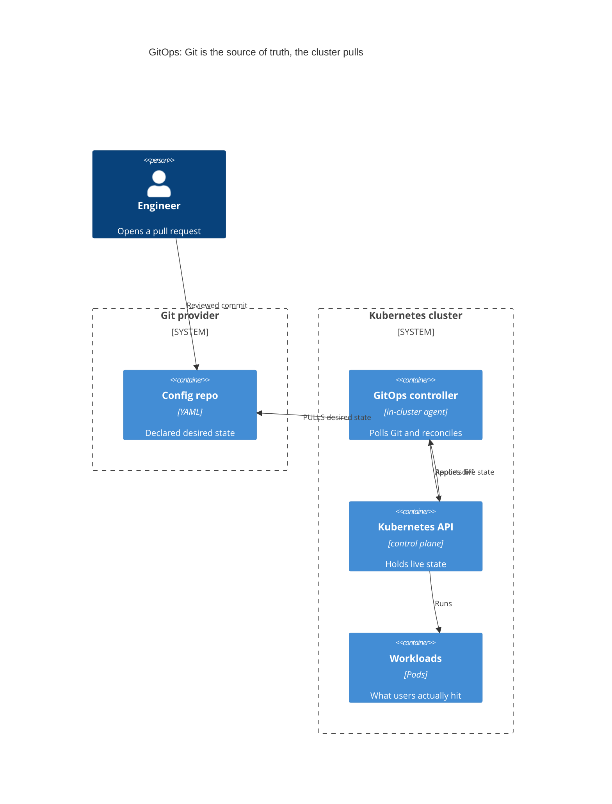
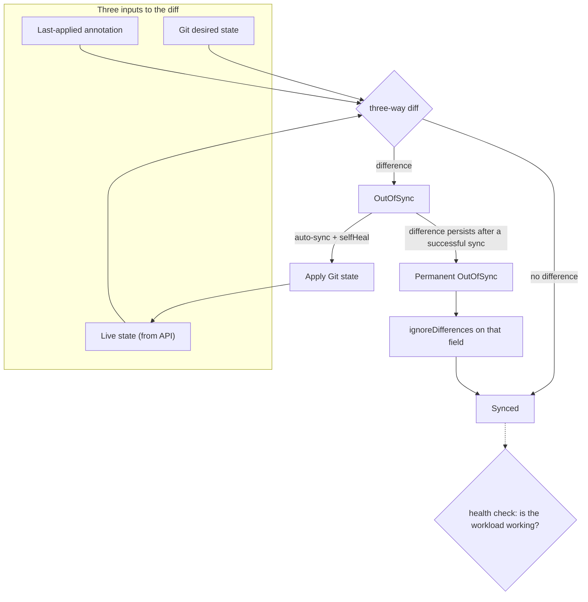

## Before you start

Read `cicd-pipelines` first — GitOps changes what the *last* stage of a pipeline does, so you need the pipeline shape in your head. `kubernetes-architecture` helps, because the thing being reconciled is the Kubernetes API's live state. `infrastructure-as-code` is a close cousin: same declarative idea, different layer.

## In one sentence

**GitOps** is a deployment model where a Git repository holds the declared desired state of your system, and an agent running *inside* the cluster continuously pulls that repository and changes the cluster until it matches.

## Why it matters

Look at what a traditional pipeline needs to deploy. It needs credentials for your production cluster, stored in the CI system, usable by anyone who can edit a workflow file. It runs `kubectl apply` and then forgets — nothing watches whether the result stayed correct. And when someone asks "what is actually running in production right now?", the honest answer is "whatever the last successful job applied, plus any manual changes since, and nobody has the full list."

GitOps fixes all three at once, and it does so by inverting one arrow.

Instead of CI **pushing** into the cluster, an in-cluster agent **pulls** from Git. That single change means: no cluster credentials live in CI, because CI's job now ends at "commit a new image tag to the config repo". Every deployment is a reviewable commit with an author, a timestamp, and a diff. Rollback is `git revert`. And disaster recovery stops being a runbook — you point a fresh cluster at the repo and it rebuilds itself.

## The intuition

Think of the difference between mailing someone instructions and giving them a blueprint they check against.

A push pipeline mails instructions: "add a wall here." The letter arrives, the work happens, and then the letter is thrown away. If a wall later falls down, nothing notices — the instructions were consumed, not retained.

GitOps hands over a blueprint and hires an inspector who walks the building continuously. The inspector's only job is to compare the building against the blueprint and fix any difference. Change the blueprint and the building follows. Knock a hole in a wall without changing the blueprint and the inspector patches it, because from the inspector's point of view the blueprint is *the* truth and the building is merely the current attempt at it.

That last part is the bit that surprises people, and we come back to it below.



Note the direction of the arrow from the controller to the repo. Nothing outside the cluster reaches in. That is the whole security argument in one line.

## How it actually works

**ArgoCD** is the most common implementation. You give it an `Application` — a small object saying "watch this repo at this path, and keep this namespace matching it." From then on a loop runs.

The loop fetches the repo and renders it. Rendering matters: the repo rarely contains final YAML. It contains a Helm chart, a Kustomize overlay, or plain manifests, and the controller runs the appropriate tool to produce the manifests it will actually compare. Those rendered manifests are the **desired state**.

Then it reads the **live state** from the Kubernetes API and diffs the two. If they match, the app is `Synced`. If not, it is `OutOfSync`, and depending on configuration it either waits for a human to click sync or applies the difference itself.

### Drift detection and self-healing

Here is where the model bites first-timers. Someone runs `kubectl edit deployment` at 2am to bump replicas during an incident. With `selfHeal` enabled, the controller notices the live state no longer matches Git and reverts the edit — possibly within seconds.

People experience this as the tool fighting them. It is not a bug; it is the entire product. If a manual change could persist, Git would no longer describe production and every guarantee above would evaporate. The correct response to "my change got reverted" is "commit it", and the correct response during a genuine emergency is to disable auto-sync deliberately, fix it, then reconcile the repo afterwards — not to be surprised.

### Sync and health are two different questions

Interviewers probe this because conflating them is so common.

**Synced** answers: does live state match Git? It is a comparison of manifests. **Healthy** answers: is the workload actually working? For a Deployment that means the expected replicas are available and ready.

All four combinations occur, and each means something different:

| Sync | Health | What it means |
|---|---|---|
| Synced | Healthy | The good state. Git applied, workload running. |
| Synced | Unhealthy | Git was applied faithfully and the result is broken — a bad image tag, a failing probe, insufficient quota. **The manifest is not the problem; the workload is.** |
| OutOfSync | Healthy | The old version is running fine; your new change hasn't been applied yet. Common when auto-sync is off. |
| OutOfSync | Unhealthy | Either a sync in progress, or a failed sync leaving a broken workload. |

"Synced and Unhealthy" is the one worth being able to explain. It tells you to stop reading YAML diffs and start reading pod events, because the delivery mechanism did its job correctly.

### The permanent-OutOfSync failure class

This one deserves real attention because it routinely wastes days.

Some resources are legitimately modified *after* you apply them. A mutating admission controller injects a sidecar. A CRD applies a default to a field you left unset. Another controller writes a computed value into the spec. In every case the live object now contains something your Git manifest does not.

The result: the controller diffs, finds a difference, syncs, the sync succeeds, the mutation happens again immediately, and the next diff finds the same difference. The app reports `OutOfSync` forever while every sync operation reports success. That combination — "sync succeeded" plus "still OutOfSync" — is the signature.

Syncing again will never fix it. Neither will `--force` or `--replace`, which just make the churn more violent. The fix is to tell the controller that this specific field is not yours to own, via `ignoreDifferences`:

```yaml
spec:
  ignoreDifferences:
    # A defaulting webhook writes a protocol we never specify.
    - group: ""
      kind: Service
      jsonPointers:
        - /spec/ports/0/protocol
    # A CRD defaults a field; ignore it wherever it appears.
    - group: external-secrets.io
      kind: ExternalSecret
      jqPathExpressions:
        - '.spec.data[].remoteRef.conversionStrategy'
```

**The diagnostic method matters more than the syntax.** The instinct is to theorise about which field it might be, then guess. Don't. The controller can show you both sides of the comparison it is making: fetch the *normalized live* object and the *predicted live* object for the resource and diff them directly. Whatever field differs is the answer, exactly, with no guessing. Argo exposes this per-resource in the UI's diff view and through its managed-resources API; the equivalent instinct in any reconciling system is "make the tool print the two things it is comparing" rather than reasoning about what it *should* be comparing.

One more trap: `ignoreDifferences` is a scalpel, not a mute button. Ignoring `/spec` wholesale means you stop detecting real drift on that resource. Ignore the narrowest path that fixes it.



The **three-way** part explains a subtlety. Comparing only Git against live cannot tell "a field I removed from Git" apart from "a field I never managed." The last-applied record — what this tool applied previously — supplies that distinction, which is how a field deleted from your manifest gets removed from the cluster instead of lingering forever.

### Ordering: waves and hooks

Applying everything at once fails when order matters — a migration must finish before new pods start, a CRD must exist before its custom resources.

**Sync waves** solve ordering with an annotation. Lower numbers go first, and the controller waits for each wave to become healthy before starting the next.

```yaml
metadata:
  annotations:
    argocd.argoproj.io/sync-wave: "-1"   # CRDs and namespaces first
```

**Hooks** run Jobs at defined points: `PreSync` before the manifests are applied, `PostSync` after everything is healthy, `SyncFail` on failure.

`PreSync` carries a consequence worth internalising: **a failing PreSync job blocks the entire sync.** Nothing gets applied. Consider a schema-migration job that refuses to run because the migration is destructive and no override was given. The job exits non-zero, the sync halts, and the app shows a sync error — while the actual message is buried in the logs of a Job pod that may already have been cleaned up.

This looks like a broken deployment. It is a guard doing its job. Which leads to a general principle worth stating plainly: **automation that refuses a dangerous change by default is a feature.** The right response is to add a deliberate approval path for the dangerous case, not to pass a flag that disables the check permanently — because that flag will still be there, forgotten, the next time the change is genuinely dangerous.

### App-of-apps

Managing forty `Application` objects by hand recreates the problem GitOps solved. The **app-of-apps** pattern makes one Application whose repo contains other Application definitions. Bootstrap that root app and everything else appears. A new service becomes a commit, and a fresh cluster needs exactly one manual step.

## Worked example

An `Application` with the pieces that matter:

```yaml
apiVersion: argoproj.io/v1alpha1
kind: Application
metadata:
  name: checkout-prod
  namespace: argocd
spec:
  project: default
  source:
    repoURL: https://github.com/acme/platform-config.git
    targetRevision: main                    # a branch, or pin a commit SHA
    path: envs/prod/checkout                # per-env DIRECTORY, not per-env branch
    helm:
      valueFiles:
        - values.yaml
        - values-prod.yaml                  # env-specific values, same chart
  destination:
    server: https://kubernetes.default.svc   # this cluster
    namespace: checkout
  syncPolicy:
    automated:
      prune: true      # resource deleted from Git gets deleted from the cluster
      selfHeal: true   # manual kubectl edits get reverted
    syncOptions:
      - CreateNamespace=true
  revisionHistoryLimit: 10
```

Line by line, the decisions being made:

`targetRevision: main` plus `path: envs/prod/checkout` is the **per-environment directory** layout. `repoURL` and the branch stay constant; only the path changes between environments.

`prune: true` is the one to think hardest about. Without it, deleting a manifest from Git leaves the resource running forever — Git stops being the source of truth for *deletions*, and clusters accumulate orphans nobody remembers creating. With it, a mistaken deletion in Git deletes real infrastructure. Teams usually enable it and rely on review to catch bad deletions, because silent orphans are the worse failure.

`selfHeal: true` is the drift reversion described above. Enabled, your cluster cannot diverge. Disabled, drift is detected and reported but not corrected.

`revisionHistoryLimit` bounds how many past revisions are retained for rollback.

Applying this produces:

```text
$ argocd app get checkout-prod
Name:         argocd/checkout-prod
Project:      default
Server:       https://kubernetes.default.svc
Namespace:    checkout
Repo:         https://github.com/acme/platform-config.git
Target:       main
Path:         envs/prod/checkout
Sync Policy:  Automated (Prune, SelfHeal)
Sync Status:  Synced to main (a3f9c21)
Health Status: Healthy

GROUP  KIND        NAMESPACE  NAME      STATUS  HEALTH
       Service     checkout   checkout  Synced  Healthy
apps   Deployment  checkout   checkout  Synced  Healthy
```

Two independent status lines, per resource. That is the sync-versus-health distinction made concrete: you can read them separately because they answer separate questions.

## A second example — when it gets harder

Now the failure that eats a week. An app reports:

```text
Sync Status:   OutOfSync
Health Status: Healthy
Last Sync:     Succeeded (2 minutes ago)
```

Succeeded, healthy, still OutOfSync. Clicking sync produces another success and no change in status.

The wrong loop is: sync again, then force, then delete and recreate the app, then suspect the repo, then blame caching. Each attempt "succeeds" and nothing improves, which is exactly why people keep trying — the tool never says no.

The right move is to stop and make the tool show its comparison:

```js
// Reduce the diff to the ONE field that never converges.
// Input: the two objects the controller actually compares.
const normalizedLive = { spec: { ports: [{ port: 80, protocol: 'TCP' }] } };
const predictedLive  = { spec: { ports: [{ port: 80 }] } };

function diffPaths(a, b, path = '') {
  const out = [];
  const keys = new Set([...Object.keys(a ?? {}), ...Object.keys(b ?? {})]);
  for (const k of keys) {
    const [x, y] = [a?.[k], b?.[k]];
    const p = `${path}/${k}`;
    if (x && y && typeof x === 'object' && typeof y === 'object') {
      out.push(...diffPaths(x, y, p));
    } else if (JSON.stringify(x) !== JSON.stringify(y)) {
      out.push({ path: p, live: x, git: y });
    }
  }
  return out;
}

for (const d of diffPaths(normalizedLive, predictedLive)) {
  console.log(`${d.path}  live=${JSON.stringify(d.live)}  git=${JSON.stringify(d.git)}`);
}
```

Output:

```text
/spec/ports/0/protocol  live="TCP"  git=undefined
```

One line, and the whole mystery collapses. The cluster defaults `protocol` to `TCP`; your manifest omits it; the diff can never close. `ignoreDifferences` on `/spec/ports/0/protocol` fixes it permanently.

Generalise the lesson beyond this tool: **when a reconciling system won't converge, find the field before forming a theory.** Any system that loops "compare, act, compare" can show you the two things it compared. Reading them takes minutes. Guessing takes days, and every guess looks plausible.

A related note on repo layout, since it interacts with this. Two options exist: a directory per environment on one branch, or a branch per environment.

| | Per-env directories | Per-env branches |
|---|---|---|
| Promoting a change | Copy or template a value between paths | Merge between long-lived branches |
| Seeing all envs at once | One checkout, `diff` the directories | Impossible without switching branches |
| Drift between envs | Visible in a single diff | Accumulates silently in merge conflicts |
| Accidental promotion | Requires editing the prod path | One careless merge to `prod` |

Per-env directories win in practice. Long-lived environment branches diverge, conflict on every promotion, and hide how far staging has drifted from prod — the exact problem you adopted GitOps to eliminate.

## Quick reference

| Concept | What it does | Failure symptom |
|---|---|---|
| Pull-based reconciliation | Agent in cluster fetches Git and applies | Nothing deploys — agent can't reach repo |
| Synced | Live manifests match Git | OutOfSync after a commit is expected briefly |
| Healthy | Workload is actually running | Synced + Unhealthy = read pod events, not YAML |
| `selfHeal` | Reverts manual cluster edits | "My kubectl edit vanished" — working as designed |
| `prune` | Deletes resources removed from Git | Off: orphaned resources accumulate silently |
| `ignoreDifferences` | Excludes externally-mutated fields | Absent: permanent OutOfSync despite success |
| Sync waves | Orders application of resources | Absent: CRs applied before their CRD exists |
| PreSync hook | Runs a Job before applying | Job fails: entire sync blocked, nothing applied |
| App-of-apps | One app manages many apps | Absent: manual bootstrap per service |

## Tools & frameworks

| Tool | What it's for | Reach for it when |
|---|---|---|
| [Argo CD](https://argo-cd.readthedocs.io/en/stable/) | Pull-based reconciliation of manifests | It is the most-asked-about GitOps tool, and you want one application-centric UI over many clusters |
| [Flux](https://fluxcd.io/flux/) | Toolkit-style GitOps controllers | You would rather compose small controllers than operate one application UI |
| [Kustomize](https://kubectl.docs.kubernetes.io/references/kustomize/) | Environment overlays without templating | Per-environment differences are genuinely patches, not variables |
| [Helm](https://helm.sh/docs/) | Packaged, parameterised releases | You are consuming third-party charts you do not want to fork |
| [SOPS](https://github.com/getsops/sops) | Encrypted secrets committed to git | GitOps needs secrets in git and you have no external secret store to pull from |

The real operational traps are worth naming: a permanently OutOfSync resource caused by a server-defaulted field, and sync waves or hooks quietly blocking a deploy.

## Common mistakes

- Treating a reverted manual edit as a tool bug. Reverting drift is the point; commit the change or deliberately pause auto-sync.
- Reading `Synced` as "the deploy worked". Synced only means the YAML matches. Check health separately.
- Re-syncing a permanently-OutOfSync app repeatedly. If a *successful* sync leaves it OutOfSync, an external mutation owns that field — diff normalized-live against predicted-live and add a narrow `ignoreDifferences`.
- Ignoring an entire `/spec` to silence one field, which disables real drift detection on that resource.
- Long-lived per-environment branches, which drift and conflict; use per-environment directories.
- Disabling a guard that refuses a destructive change instead of adding an approval step for it.
- Leaving `prune: false` and accumulating orphaned resources nobody can account for.

## What interviewers ask

- **What does GitOps actually change compared with a push pipeline?** — The direction of control: an in-cluster agent pulls from Git rather than CI pushing in. Consequences are no cluster credentials in CI, every change being a reviewable commit, and continuous correction rather than fire-and-forget.
- **Difference between Synced and Healthy?** — Synced compares live manifests to Git; Healthy asks whether the workload runs. Independent, and Synced-plus-Unhealthy specifically means delivery worked and the workload is broken.
- **An app says sync succeeded but stays OutOfSync forever. Diagnose it.** — Something outside Git mutates the live object after apply: a defaulting webhook, a CRD default, another controller. Each sync succeeds and the mutation returns. Find the field by diffing normalized-live against predicted-live, then add a narrow `ignoreDifferences` for exactly that path. They are testing whether you diagnose or thrash.
- **Someone `kubectl edit`s production. What happens?** — With `selfHeal`, the controller reverts it, because Git is authoritative. The legitimate path is a commit, or a deliberate auto-sync pause during an incident.
- **How do you order dependent resources?** — Sync waves for ordering within a sync, and hooks for lifecycle steps. Note that a failing `PreSync` job blocks the whole sync, which is a guard rather than a defect.
- **Why is recovery easier?** — Full desired state lives in Git, so rebuilding is pointing a fresh cluster at the repo; rollback is reverting a commit.

## Practice

1. Deploy an app with `selfHeal: true`, scale the Deployment manually with `kubectl`, and watch it revert. Then achieve the same scale correctly. Explain which record of intent won and why.
2. Create a Service manifest that omits `protocol` on a port. Get the app to `Synced`, then inspect the live object to find the defaulted field. Reproduce a permanent OutOfSync, diagnose it by comparing the two sides of the diff, and fix it with the narrowest `ignoreDifferences` you can write.
3. Build an app-of-apps for three services across dev and prod using per-environment directories. Then write down what a `git revert` of the top-level commit would do to each cluster, and verify your prediction.

## Where to go next

`helm-and-templating` — the repo a GitOps controller renders almost always contains charts, so how templating resolves values determines what actually gets diffed. Then `progressive-delivery`, which layers canary and blue-green rollouts on top of reconciliation, and `kubernetes-debugging` for the Synced-but-Unhealthy half of the status pair.
