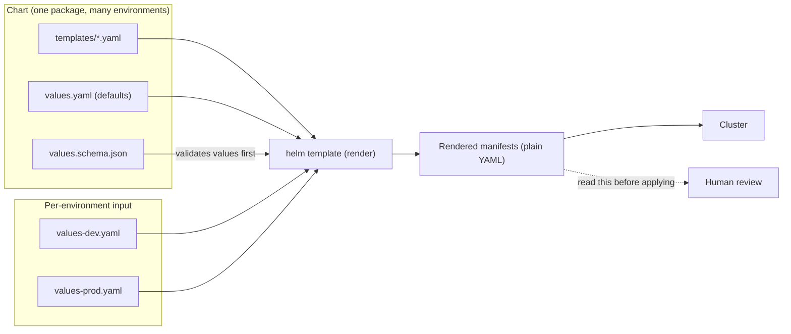
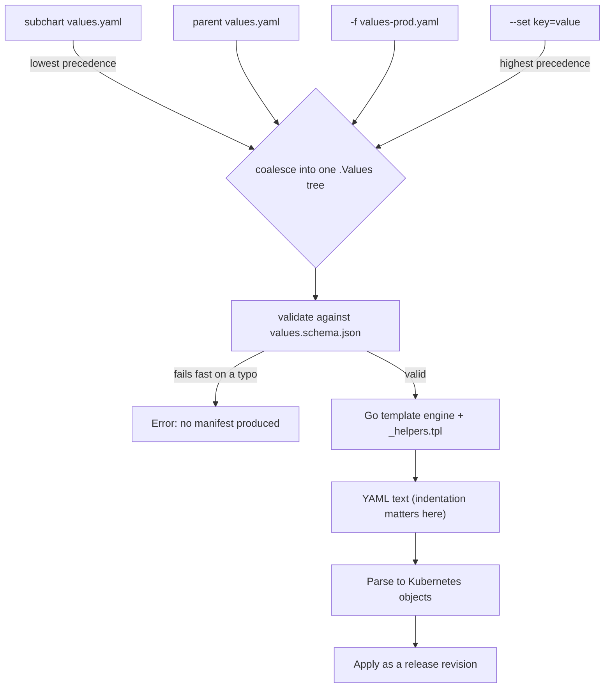

## Before you start

You need `kubernetes-basics` — Pods, Deployments and Services, because Helm's only output is those manifests. If you have read `gitops-and-argocd`, note that the manifests a GitOps controller diffs are usually Helm's output, so what you learn here decides what gets compared there.

## In one sentence

**Helm** is a package manager for Kubernetes: it takes a **chart** (a directory of manifest templates), fills the templates in from a **values** file, and installs the resulting YAML into a cluster as a named, versioned **release**.

## Why it matters

Start with the problem, because Helm's downsides only make sense against it.

You have a Deployment, Service, ConfigMap and Ingress for one service. You need them in dev, staging and prod. The differences are small — replica count, resource limits, hostname, log level. So you copy the directory three times.

Now the drift begins. A security fix adds a `securityContext`, applied to two of the three. Someone bumps a memory limit in prod only. Six months on, nobody can say what differs between staging and prod, and "it works in staging" has become meaningless. The three directories are 95% identical and diverging.

Templating collapses that into one definition plus three small sets of differences. The manifest structure exists exactly once, so a change to it reaches every environment. What varies is explicit, small, and reviewable — you can read the entire delta between prod and staging in one screen.

## The intuition

A chart is a form letter.

The letter is written once with blanks: "Dear ____, your order of ____ ships on ____." The mail-merge data supplies the blanks for each recipient. One letter, many outputs, and correcting a typo in the letter fixes every copy.

`values.yaml` is the default data — what fills the blanks when nobody says otherwise. `values-prod.yaml` overrides only the fields prod needs. The template stays single-sourced.

Where the analogy breaks is worth flagging now: Helm does not understand Kubernetes objects while it renders. It performs **text substitution**, producing a string, and only afterwards is that string parsed as YAML. A form letter with a misaligned blank is still readable. A manifest with a misaligned blank is a different manifest, or not YAML at all. Almost every confusing Helm error traces back to that one fact.



## How it actually works

A chart is a directory with a fixed shape:

```text
checkout/
  Chart.yaml           # name, chart version, appVersion, dependencies
  values.yaml          # default values — the documented input surface
  values.schema.json   # optional: validates values before rendering
  templates/
    deployment.yaml
    service.yaml
    _helpers.tpl       # named templates; the leading _ means "not a manifest"
```

Files in `templates/` are Go templates. `{{ .Values.replicaCount }}` reads from the merged values tree; `{{ .Release.Name }}` and `{{ .Chart.Version }}` read release and chart metadata.

`_helpers.tpl` holds named templates for repeated fragments — most usefully the name and label logic that must be identical across every manifest in the chart. Defining `checkout.fullname` once and calling it everywhere is what stops a Service selector from drifting out of alignment with its Deployment's pod labels.

**Template functions** do the real work. `default` supplies a fallback, `quote` prevents YAML from reinterpreting a value, `toYaml` serialises a whole subtree, `required` fails the render with your own message, and `nindent` indents a block to a given column. That last one exists purely because indentation is semantic in YAML and you are generating text.

### Releases and revisions

`helm install checkout ./checkout` creates a **release** named `checkout`. Helm records the rendered manifests and the values used, as revision 1. `helm upgrade` produces revision 2, and so on.

That history enables `helm rollback checkout 1`, which re-applies revision 1's stored manifests. Worth knowing precisely: rollback replays the *manifests Helm recorded*, not "the state the cluster was in." Anything changed outside Helm is not in that record and will not come back.

### The single most useful habit: render before you apply

`helm template` runs the whole pipeline and prints the manifests to stdout without touching the cluster. `helm install` does the same rendering and then applies.

So make rendering a separate, deliberate step and **read the output**:

```bash
helm template checkout ./checkout -f values-prod.yaml | less
```

This costs seconds and catches the entire class of bugs where you reasoned about what the template *should* produce rather than what it does. A conditional that silently evaluated false, an empty block leaving invalid YAML, an environment variable whose value became the string `"nil"` — all obvious in the output, all invisible in the template.

The habit generalises: `helm diff upgrade` (a widely used plugin) shows the change against what is currently released, which is the version of this question you actually want before a production upgrade.

### Failing fast with `values.schema.json`

Values are just YAML, so a typo is not an error — it creates a new key that no template reads. Set `replicaCont: 5` and you get the default replica count with no warning at all.

`values.schema.json` closes that hole by validating the merged values before rendering:

```json
{
  "$schema": "https://json-schema.org/draft-07/schema#",
  "type": "object",
  "additionalProperties": false,
  "required": ["image", "replicaCount"],
  "properties": {
    "replicaCount": { "type": "integer", "minimum": 1 },
    "image": {
      "type": "object",
      "required": ["repository", "tag"],
      "properties": {
        "repository": { "type": "string" },
        "tag": { "type": "string", "minLength": 1 }
      }
    }
  }
}
```

`additionalProperties: false` is the line that earns its keep — it turns a misspelled key into an immediate error naming the key, instead of a silently ignored one. Without it the schema checks only what you spelled correctly.

The trade-off is real: every legitimate new value now requires a schema edit. On a chart used by more than a couple of people, that friction is cheaper than the debugging it prevents.



Read the precedence order carefully, because "my value had no effect" is nearly always a precedence question. Later sources win. Multiple `-f` flags apply left to right, so the last file overrides earlier ones. `--set` beats every file.

Note also **where in the pipeline failures occur**. A schema violation stops before rendering. A template error stops during rendering. An indentation bug produces text that fails at the YAML parse step, and the error message describes a line number in generated output you never wrote — which is precisely why you should have rendered it yourself first.

### Dependencies and subcharts

`Chart.yaml` can declare dependencies:

```yaml
dependencies:
  - name: redis
    version: "18.6.1"
    repository: "https://charts.bitnami.com/bitnami"
    condition: redis.enabled
```

Values flow down by key. In the parent's values file, anything under `redis:` becomes the subchart's `.Values`:

```yaml
redis:
  enabled: true
  auth:
    enabled: true
  master:
    persistence:
      size: 8Gi
```

Two rules catch people. Overriding a subchart value requires nesting it under the subchart's name — top-level `auth.enabled` does nothing. And `global:` is the only key subcharts share, so it is the one place to put a value several subcharts must agree on.

The subtler issue is ownership. A subchart is someone else's chart on their release cadence. Bumping its version changes manifests you did not write and may not have read. `helm template` after a dependency bump is not optional.

## Worked example

A Deployment template exercising the pieces that matter:

```yaml
# templates/deployment.yaml
apiVersion: apps/v1
kind: Deployment
metadata:
  name: {{ include "checkout.fullname" . }}        # named template: one naming rule, chart-wide
  labels:
    {{- include "checkout.labels" . | nindent 4 }} # nindent aligns the injected block
spec:
  replicas: {{ .Values.replicaCount }}
  selector:
    matchLabels:
      {{- include "checkout.selectorLabels" . | nindent 6 }}
  template:
    metadata:
      labels:
        {{- include "checkout.selectorLabels" . | nindent 8 }}
    spec:
      containers:
        - name: {{ .Chart.Name }}
          # required fails the render with OUR message rather than shipping a broken image ref
          image: "{{ .Values.image.repository }}:{{ required "image.tag is required" .Values.image.tag }}"
          ports:
            - containerPort: {{ .Values.service.port }}
          env:
            # quote stops YAML reading `true` or `01` as bool/number
            - name: LOG_LEVEL
              value: {{ .Values.logLevel | default "info" | quote }}
          {{- with .Values.resources }}
          resources:
            {{- toYaml . | nindent 12 }}          # serialise a whole subtree
          {{- end }}
```

With these values:

```yaml
# values-prod.yaml
replicaCount: 6
image:
  repository: registry.example.com/checkout
  tag: "1.24.0"
logLevel: warn
resources:
  requests: { cpu: 500m, memory: 512Mi }
  limits:   { cpu: "2",  memory: 1Gi }
service:
  port: 8080
```

Rendering:

```bash
helm template checkout ./checkout -f values-prod.yaml
```

Output (abridged):

```yaml
apiVersion: apps/v1
kind: Deployment
metadata:
  name: checkout
  labels:
    app.kubernetes.io/name: checkout
    app.kubernetes.io/version: "1.24.0"
spec:
  replicas: 6
  template:
    spec:
      containers:
        - name: checkout
          image: "registry.example.com/checkout:1.24.0"
          env:
            - name: LOG_LEVEL
              value: "warn"
          resources:
            limits:
              cpu: "2"
              memory: 1Gi
            requests:
              cpu: 500m
              memory: 512Mi
```

Three details in that output repay attention. `{{- with .Values.resources }}` means the `resources:` key is absent entirely when no resources are set — not present-but-empty, which would be invalid. `nindent 12` produced correct alignment because 12 is the column `resources:` children need; get it wrong and you generate a sibling key instead of a child. And `quote` turned `warn` into `"warn"`, which matters enormously for a value like `logLevel: "no"` — unquoted, YAML reads that as boolean false.

## A second example — when it gets harder

Now a packaging failure that is genuinely hard to see, and whose lesson applies far beyond Helm.

Mature setups do not deploy charts from a working directory. They run `helm package` to produce a versioned tarball (`checkout-1.24.0.tgz`), publish it to a chart repository, and deploy the tarball. The tarball is the artefact; it is what prod runs.

The failure: someone packages version `1.24.0`, then edits a template, then commits. The tarball on disk and in the repository still contains the *pre-edit* template. The source says one thing, the deployed artefact does another, and the chart version is identical in both — so nothing looks wrong. The symptom arrives much later as "my change isn't taking effect in prod", and the change is genuinely present in Git.

Now the part worth internalising. Teams add an integrity check for exactly this, and the natural implementation compares the tarball in the repository against the tarball in the build output. **That check cannot catch this failure**, because both tarballs are the same stale artefact. It confirms the artefact was copied faithfully while saying nothing about whether it matches the source it claims to be built from.

The principle: **verify an artefact against its source, not against another copy of itself.** Any check comparing two derived copies validates the copy step only. To detect staleness you must re-derive from source and compare:

```js
const { execSync } = require('node:child_process');
const crypto = require('node:crypto');
const fs = require('node:fs');

// Deterministically fingerprint the chart SOURCE tree.
function sourceFingerprint(dir) {
  const files = execSync(`find ${dir} -type f -not -path '*/charts/*' | sort`)
    .toString().trim().split('\n');
  const h = crypto.createHash('sha256');
  for (const f of files) {
    h.update(f.replace(dir, ''));   // path, so a rename is a change
    h.update(fs.readFileSync(f));   // content
  }
  return h.digest('hex').slice(0, 12);
}

// Fingerprint the SOURCE, then compare against the fingerprint recorded
// when the tarball was built. Never tarball-vs-tarball.
const current = sourceFingerprint('./checkout');
const recorded = JSON.parse(fs.readFileSync('./dist/checkout-1.24.0.provenance.json')).sourceFingerprint;

console.log(`source now:      ${current}`);
console.log(`packaged from:   ${recorded}`);
if (current !== recorded) {
  console.error('STALE ARTEFACT: chart source changed after packaging. Repackage.');
  process.exit(1);
}
console.log('artefact matches its source.');
```

Output when someone edited a template after packaging:

```text
source now:      9f2c41ab77de
packaged from:   3ac0be15d902
STALE ARTEFACT: chart source changed after packaging. Repackage.
```

A closely related trap sits next to this one: **per-environment chart version pinning**. When each environment pins its own chart version, dev runs `1.24.0` while prod still pins `1.21.3`. Everything is consistent and reproducible, and the change you validated in dev is simply not in prod. The tell is that "works in dev, wrong behaviour in prod" comes with *no error at all* — prod is faithfully running an older chart. Whatever mechanism promotes versions between environments needs to be as visible as the code review, or the pin becomes a place changes go to be forgotten.

### Helm versus Kustomize

Helm's honest downsides:

Templating text to produce YAML is fragile. Indentation bugs, `nil` rendering where you expected `""`, values that change type when quoted — none of these are Kubernetes problems, they are string-generation problems. Diffs between chart versions are hard to read because you compare templates rather than outcomes. And a chart with deep conditionals becomes genuinely unmaintainable; nobody can predict its output without rendering it.

**Kustomize** takes a different route. You write real, valid Kubernetes YAML as a base, then declare **patches** that modify specific fields in overlays. There is no template language — the base is a manifest you can apply directly, and overlays are structured edits to it.

| | Helm | Kustomize |
|---|---|---|
| Mechanism | Text templating, then parse | Structured patches on valid YAML |
| Base validity | Templates are not valid YAML alone | Base is directly appliable |
| Failure mode | Indentation and type bugs in generated text | Patch targets nothing; silently no-ops |
| Distribution | Versioned tarballs, chart repos, third-party charts | Copy or remote base reference |
| Release history | Built in, with rollback | None; whatever applied the YAML owns it |
| Conditional logic | Full: loops, conditionals, functions | Deliberately none |
| Reading the result | Must render to know | Overlay diff is close to the outcome |

Neither wins outright, and the choice follows the use case. **Helm fits distribution** — publishing a chart for people whose requirements you don't know needs conditionals, and installing third-party software effectively requires it. **Kustomize fits your own services** across environments you control, where differences are a handful of fields and you would rather read a patch than a template. Many teams use both: Kustomize for their applications, Helm for vendor software. Using Kustomize to patch Helm's rendered output is also common, and gives you structured edits over a chart you don't own.

## Quick reference

| Concept | What it does | Failure symptom |
|---|---|---|
| Chart | Package of templates + default values | — |
| `values.yaml` | Documented default input surface | Undocumented values nobody knows exist |
| `values.schema.json` | Validates values before rendering | Absent: typo silently uses the default |
| `_helpers.tpl` | Named templates for shared fragments | Absent: selector/label drift between manifests |
| `helm template` | Renders locally, applies nothing | Skipping it: debugging YAML you never read |
| `nindent n` | Indents an injected block to column n | Wrong n: sibling key instead of child |
| `quote` | Forces a string | Absent: `no`/`on`/`01` become bool/number |
| `required` | Fails render with your message | Absent: broken value ships silently |
| Release revision | Recorded manifests per upgrade | Rollback restores only Helm-recorded state |
| Subchart values | Nested under the subchart's name | Top-level override does nothing |
| Chart version pin | Fixes the chart version per env | Per-env pins drift; dev-only fixes |

## Common mistakes

- Applying without rendering. `helm template | less` costs seconds and catches most template bugs.
- Assuming a values typo is an error. Without `additionalProperties: false` it silently creates an unread key.
- Wrong `nindent` column, producing a sibling key instead of a nested one — visible only in rendered output.
- Leaving values unquoted where YAML reinterprets them: `no`, `on`, `01`, `1.10`.
- Overriding a subchart value at the top level instead of nesting it under the subchart name.
- Verifying a packaged artefact against another artefact. Compare against the source, or staleness is undetectable.
- Per-environment chart pins with no visible promotion path, so prod quietly runs an old chart.
- Reaching for templating when the differences are three fields; a patch is clearer.

## What interviewers ask

- **What problem does Helm solve?** — Copy-pasted manifests per environment drift apart. One templated definition plus small per-environment values makes the structure single-sourced and the differences explicit.
- **`helm template` vs `helm install`?** — Both render; only install applies. Rendering first and reading the output is the highest-value habit, because Helm generates text and most bugs are visible only in the result.
- **Why does indentation cause so many Helm bugs?** — Helm does text substitution and the result is parsed as YAML afterwards. Indentation is semantic, so a block injected at the wrong column becomes a different structure. Hence `nindent`.
- **Helm or Kustomize?** — Helm for distributing charts to unknown consumers and installing third-party software, since that needs conditionals and versioned packages. Kustomize for your own services where differences are a few fields and patches read more clearly. Refusing to declare a universal winner is the right answer.
- **How do you stop a values typo shipping?** — `values.schema.json` with `additionalProperties: false`, so an unknown key fails the render by name rather than falling back to a default.
- **Chart source changed after the tarball was built. How do you catch it?** — Fingerprint the source and compare the artefact against that recorded fingerprint. Comparing two tarballs validates only the copy, since both hold the same stale content.

## Practice

1. Write a chart for a service with a Deployment and Service, using `_helpers.tpl` for names and labels. Deliberately use `indent` where `nindent` is required, render it, and identify the exact structural difference in the output.
2. Add a `values.schema.json` with `additionalProperties: false`. Misspell a key and compare the failure to the same misspelling without a schema. Then add a value that legitimately needs schema changes and note the friction.
3. Take the same service and express dev/prod differences as a Kustomize base plus overlays. Compare the two implementations on: predicting the output without running the tool, reviewing a one-field prod change, and adding a conditional feature. State which you would choose and why.

## Where to go next

`terraform-and-iac-patterns` — the same declarative pattern one layer down, where a state file replaces release history and the failure modes are far less forgiving. `configmaps-and-configuration` covers what belongs in values versus injected at runtime, and `gitops-and-argocd` shows what happens to rendered output once a controller starts diffing it continuously.
