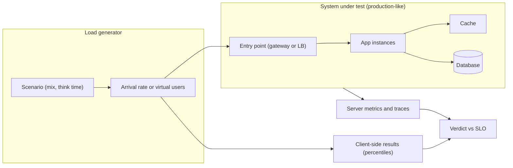
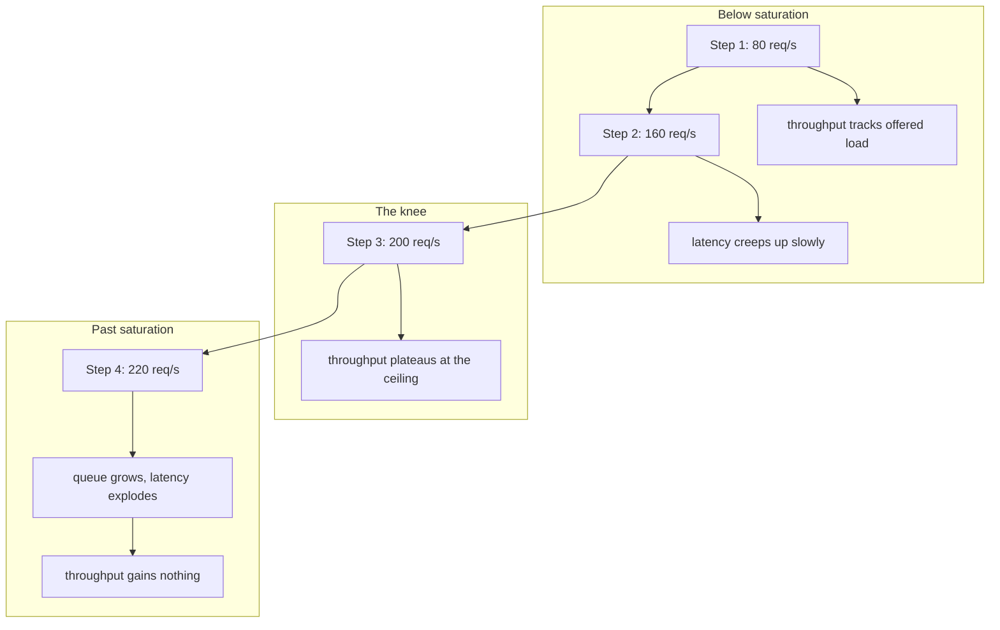

## Before you start

Read [capacity-planning](capacity-planning) — estimation gives you the number you expect, and a load test tells you whether it is true. [sre-slos-and-error-budgets](sre-slos-and-error-budgets) gives you the target a test result is judged against; without a stated objective, a load test produces numbers nobody can act on.

## In one sentence

**Load testing** means generating traffic against a system on purpose, at controlled rates, to answer a specific question about how it behaves under demand — most usefully, at what point it stops keeping up.

## Why it matters

The alternative is finding out during a launch. That is not only more expensive, it teaches you less: production is a single uncontrolled data point, and while it is failing you cannot vary one thing at a time.

But the common failure is not skipping the test. It is running one and drawing a false conclusion. A team runs 100 virtual users for five minutes, sees an average of 80ms, and reports the system as good for 100 users. Every part of that is unsafe. Nobody knows whether 100 was near the limit or a tenth of it. The average hid a tail that was already bad. Five minutes was too short for a leak to show. And the load generator may have been under-reporting the worst latency by design.

So the real skill is designing a test that can be wrong — one whose result would change your decision. Interviewers ask about this because it separates people who have run a tool from people who have interpreted a result.

## The intuition

A load test is not a stamp of approval; it is a measuring instrument, and you have to choose what to measure.

Think of a motorway. There are four different questions you could ask, and they need four different experiments. Does it carry Monday morning's traffic? Push traffic past rush hour until something jams — where does it break, and does it jam gracefully or gridlock? Leave normal traffic running for twelve hours — does anything degrade that a short test would never see? And what happens when a stadium empties all at once, and how long until flow recovers?

Those are **load**, **stress**, **soak** and **spike** testing. Same road, same cars, four different setups, and conflating them is the most common mistake in the topic. "We load tested it" usually means only the first, and the first cannot tell you where the ceiling is.



Both arrows into the verdict matter. Client-side results tell you what a user would experience; server-side metrics and traces tell you which component is responsible. A test with only the first gives you a number you cannot act on.

## How it actually works

Here is the idea that makes the rest worth doing. **Do not measure one point — find saturation.** Run a series of steps at increasing load and watch throughput and latency *together*.

Below the ceiling, throughput rises to match whatever you offer, and latency stays near the service's actual work time. As you approach the ceiling, requests begin waiting for a busy worker, and latency creeps up while throughput still tracks. Then throughput flattens — the system is doing all it can — and latency climbs steeply, because extra load has nowhere to go but a queue.

**That bend is the knee, and it is the capacity number you actually want.** Past it, more load buys no throughput and costs unbounded latency.



**Little's Law** explains why, informally: concurrency is roughly throughput times latency. If throughput is pinned at the ceiling and you keep raising offered load, concurrency has to rise, so latency must rise with it. The queue is not a bug; it is arithmetic.

Next, **why averages lie**. An average blends the fast majority with the slow minority and reports something nobody experienced. Report **percentiles** instead — p50, p95, p99 — always with the concurrency they were measured at, because a percentile without a load level is meaningless. Even then, watch the window: a p99 computed over a ten-minute average hides a thirty-second stall, since the stalled requests are a small fraction of ten minutes' traffic. Shorter windows, or a maximum alongside the percentiles, keep stalls visible.

Then the trap that catches good engineers, **coordinated omission**. Most load generators use a **closed** model: a fixed number of virtual users, each sending its next request only after the previous one returns. When the system stalls, those users are *blocked*. They stop issuing requests during exactly the period you most want measured, so the stall contributes a handful of slow samples instead of thousands. The generator's cooperation with the slowdown removes the evidence of it.

The fix is an **open** model, driven by arrival rate: requests are scheduled at a rate regardless of how slow responses are, and a request that could not be sent on time counts its waiting from the moment it *should* have been sent. Which model you choose changes your numbers, so name it in the result. Closed models mimic a fixed pool of clients; open models mimic the internet, where users arrive whether or not you are ready.

## Worked example

A simulated service with a real ceiling — 8 workers, about 40ms of work each, so 200 requests per second — driven by an open model with realistic variability.

```js
const SERVERS = 8, MEAN_SERVICE_MS = 40;
const CAPACITY = SERVERS / (MEAN_SERVICE_MS / 1000);   // 200 req/s
let seed = 42;
const rand = () => (seed = (seed * 1103515245 + 12345) % 2147483648) / 2147483648;
const expo = (mean) => -Math.log(1 - rand()) * mean;   // bursty, like real arrivals
const pct = (s, p) => s[Math.min(s.length - 1, Math.ceil((p / 100) * s.length) - 1)];

// OPEN model: arrivals keep coming at the offered rate however slow we get.
function step(rate, seconds = 120) {
  const free = new Array(SERVERS).fill(0);   // when each worker next goes idle
  const lat = [], starts = [];
  let clock = 0, queuedPeak = 0;
  const total = Math.round(rate * seconds);
  for (let i = 0; i < total; i++) {
    clock += expo(1000 / rate);               // next arrival, independent of service
    let w = 0;
    for (let k = 1; k < SERVERS; k++) if (free[k] < free[w]) w = k;
    const start = Math.max(clock, free[w]);   // time spent here IS queue wait
    free[w] = start + expo(MEAN_SERVICE_MS);
    lat.push(free[w] - clock);                // latency includes the wait
    starts.push({ arr: clock, start });
    let q = 0;
    for (let j = starts.length - 2; j >= 0 && starts[j].start > clock; j--) q++;
    if (q > queuedPeak) queuedPeak = q;
  }
  lat.sort((a, b) => a - b);
  const wall = Math.max(...free) / 1000;
  return { rate, tput: +(total / wall).toFixed(1), p50: Math.round(pct(lat, 50)),
           p95: Math.round(pct(lat, 95)), p99: Math.round(pct(lat, 99)), q: queuedPeak };
}

console.log(`ceiling: ${CAPACITY} req/s  (${SERVERS} workers, ${MEAN_SERVICE_MS}ms mean service)\n`);
console.log('offered   throughput     p50      p95      p99   peakQueue');
for (const r of [40, 80, 120, 160, 180, 200, 220, 280]) {
  const s = step(r);
  console.log(String(s.rate).padStart(7) + String(s.tput).padStart(13) +
    (s.p50 + 'ms').padStart(8) + (s.p95 + 'ms').padStart(9) + (s.p99 + 'ms').padStart(9) +
    String(s.q).padStart(12));
}
```

Real output:

```
ceiling: 200 req/s  (8 workers, 40ms mean service)

offered   throughput     p50      p95      p99   peakQueue
     40         40.2    27ms    119ms    180ms           1
     80         80.4    27ms    123ms    185ms           4
    120        120.7    29ms    126ms    188ms          16
    160        160.7    39ms    142ms    203ms          27
    180        180.7    59ms    185ms    247ms          42
    200        200.8   175ms    389ms    456ms          78
    220        202.5  5420ms  10652ms  10996ms        2264
    280        202.3 23272ms  44274ms  46243ms        9439
```

Read the throughput column first. It tracks the offered rate exactly up to 200, then stops: 202.5 at an offered 220, and 202.3 at an offered 280. You cannot buy more. Now read latency across the same rows — 27ms at p50 while there is headroom, 59ms at 180, 175ms at 200, then 5.4 *seconds* at 220. Between the last two rows offered load rose 10% and p50 rose thirty-fold.

The knee sits between 200 and 220. That, not any single measurement, is the capacity of this system, and note that the honest operating point is *below* it: at 180 you are at 90% of capacity with p50 at 59ms, and one bad minute of traffic tips you over. The peak-queue column shows why the cliff is so sharp — 42 requests waiting at 180, 2,264 at 220.

## A second example — when it gets harder

Now the same system with a two-second stall, measured two ways. This is coordinated omission made visible.

```js
const FAST_MS = 20, STALL_START = 10000, STALL_MS = 2000;
const responseTime = (t) => (t >= STALL_START && t < STALL_START + STALL_MS)
  ? (STALL_START + STALL_MS - t) + FAST_MS   // stuck until the stall clears
  : FAST_MS;
const p = (a, q) => { const s = [...a].sort((x, y) => x - y);
  return Math.round(s[Math.min(s.length - 1, Math.ceil(q / 100 * s.length) - 1)]); };

// CLOSED loop: one virtual user sends the next request only after this one returns.
// During the stall it has ONE request outstanding, so the stall is sampled once.
function closedLoop(durationMs = 20000) {
  const lat = []; let t = 0;
  while (t < durationMs) { const r = responseTime(t); lat.push(r); t += r; }
  return lat;
}
// OPEN model: requests are SCHEDULED every 20ms and counted from their intended time.
function openModel(durationMs = 20000, gap = FAST_MS) {
  const lat = [];
  for (let intended = 0; intended < durationMs; intended += gap) {
    const sent = (intended >= STALL_START && intended < STALL_START + STALL_MS)
      ? STALL_START + STALL_MS : intended;
    lat.push((sent - intended) + FAST_MS);   // waiting to be sent counts
  }
  return lat;
}
const closed = closedLoop(), open = openModel();
console.log(`closed loop : n=${closed.length}  p50=${p(closed,50)}ms  p99=${p(closed,99)}ms  max=${Math.round(Math.max(...closed))}ms`);
console.log(`open model  : n=${open.length}  p50=${p(open,50)}ms  p99=${p(open,99)}ms  max=${Math.round(Math.max(...open))}ms`);
console.log(`requests the closed loop never issued during the stall: ${open.length - closed.length}`);
```

```
closed loop : n=900  p50=20ms  p99=20ms  max=2020ms
open model  : n=1000  p50=20ms  p99=1820ms  max=2020ms
requests the closed loop never issued during the stall: 100
```

The closed loop reports a p99 of 20ms for a system that stalled for two full seconds. It is not lying about the requests it made — it simply did not make the requests that would have been slow, because it was blocked waiting on one of them. The open model, counting each request from its intended send time, reports a p99 of 1820ms. Same system, same outage, and only one of those numbers would have warned you.

The last line names the mechanism exactly: 100 requests that should have been sent during the stall were never issued at all. Those hundred are the missing evidence, and they are the ones a real user would have been waiting on. Notice also that both runs report the same 2020ms maximum — which is why a maximum alongside your percentiles is a cheap safeguard even when the model is wrong.

Beyond the model, **realism decides whether the result means anything**. Hammer one URL with one parameter and every cache in the stack serves from memory, so you measure your cache rather than your system — the effect is large enough to make a broken design look fast, and [caching-strategies](caching-strategies) explains why. Use a request mix in production proportions, spread keys across a realistic range, and include **think time** between a user's actions, or you model a bot and size for traffic nobody will send. Data volume matters for the same reason: a query against 10,000 rows may use a plan it will abandon at 10 million, so a small dataset can hide the regression you are hunting ([query-optimization](query-optimization)).

Where you run it matters too. Test in a production-like environment — same instance sizes, same replica counts, same network path — or you are carefully measuring a different system. Testing production itself gives the truest answer and needs the same care as a deliberate failure experiment ([chaos-and-resilience-testing](chaos-and-resilience-testing)): a blast radius, a stop condition, and headroom in the error budget.

Finally, be clear on what the test does not tell you. It tells you *what* is slow, never *why*. Attribute the bottleneck with profiling ([performance-profiling](performance-profiling)) and traces ([distributed-tracing-and-observability](distributed-tracing-and-observability)) before you change anything; tuning before attributing is guesswork that occasionally gets lucky and always costs time. For LLM endpoints the metrics differ — time to first token and per-token time under streaming — and [serving-latency-and-benchmarking](serving-latency-and-benchmarking) owns that case.

On tools, at an awareness level: **k6** scripts tests in JavaScript, supports arrival-rate (open) executors, and fits CI naturally. **JMeter** is older, GUI-driven, with wide protocol support and a heavier thread-per-user model. **Locust** describes user behaviour in Python and is pleasant when scenarios are complex. **autocannon** is a small Node CLI for quickly benchmarking one HTTP endpoint — right for a local before-and-after, not for a scenario.

## Quick reference

| Shape | Question it answers | Setup |
|---|---|---|
| Load | Does it meet expected peak demand? | Hold expected peak, minutes |
| Stress | Where does it break, and how? | Ramp past peak until failure |
| Soak | Does it degrade over hours? | Moderate load, hours |
| Spike | Does it survive a jump and recover? | Sudden step up, then down |
| Breakpoint ramp | Where is the saturation knee? | Steps up, watch throughput vs latency |

| Signal | Healthy | Saturated |
|---|---|---|
| Throughput | Tracks offered load | Flat regardless of load |
| Latency | Near service time | Rising steeply |
| Queue depth | Near zero | Growing without bound |
| Errors | Near zero | Timeouts and rejections |

## Tools & frameworks

| Tool | What it's for | Reach for it when |
|---|---|---|
| [k6](https://grafana.com/docs/k6/latest/) | Scripted load tests in JavaScript with thresholds | Node/TS teams — scenarios are JavaScript, and thresholds can gate CI |
| [autocannon](https://github.com/mcollina/autocannon) | Fast single-endpoint HTTP benchmarking | You want a throughput number now and do not want to write a script |
| [Vegeta](https://github.com/tsenart/vegeta) | Constant-rate attack with latency histograms | You need a fixed request *rate* rather than fixed concurrency |
| [Gatling](https://docs.gatling.io/) | Scenario-based load testing with reports | You need rich HTML reports and multi-step user journeys |
| [Locust](https://docs.locust.io/en/stable/) | Python-scripted distributed load | You are a Python shop, or you need distributed workers with minimal setup |
| [JMeter](https://jmeter.apache.org/usermanual/index.html) | The long-standing enterprise standard | Your organisation has already standardised on it and the reports are expected |

The crucial distinction is open versus closed workload models: fixed concurrency (closed) hides the queueing that a fixed arrival rate (open) exposes.

## Common mistakes

- Reporting an average. It describes nobody; report percentiles at a stated concurrency.
- Measuring one load level and calling it capacity, instead of ramping to find the knee.
- Using a closed-model generator for a latency claim, so coordinated omission hides the stalls.
- Hammering one URL or key, which measures the cache rather than the system.
- Testing on a smaller environment or dataset than production, then trusting the number.
- Running only short tests, so leaks and connection exhaustion never appear.
- Tuning based on the load test alone, without profiling or tracing to attribute the bottleneck.

## What interviewers ask

- **Difference between load, stress, soak and spike testing?** — Expected demand, breaking point, degradation over hours, and sudden-jump survival plus recovery. They want to hear that these are different questions needing different setups.
- **How do you find a system's capacity?** — Ramp load in steps and watch throughput and latency together. Capacity is the knee: where throughput plateaus and latency starts climbing, not the highest number you managed to push.
- **Your load test reports p99 of 200ms but users see multi-second stalls — what went wrong?** — Most likely coordinated omission from a closed-model generator that stopped issuing requests while blocked, plus a percentile window long enough to dilute a short stall. Re-measure with an arrival-rate model and report maximums.
- **Why are averages inadequate?** — They blend fast and slow into a value nobody experienced and hide the tail entirely, and the tail is where users notice.
- **Open versus closed workload model?** — Closed fixes the number of virtual users, so throughput falls as the system slows; open fixes the arrival rate regardless of responses. Open reflects internet traffic and does not hide stalls.

## Practice

1. Take the ramp simulation, change `SERVERS` to 16 without touching anything else, and predict the new knee before running it. Confirm your prediction and explain the p50 at 90% of the new ceiling.
2. Add a 1% chance of a request taking 50 times the mean service time, then re-run the ramp. Note how much earlier p99 degrades than p50, and how that changes the operating point you would recommend.
3. Convert the closed-loop generator into a hybrid that keeps virtual users but records intended send times, and show that it recovers the open model's p99 during the stall.

## Where to go next

[chaos-and-resilience-testing](chaos-and-resilience-testing) — a load test tells you the ceiling under healthy conditions; the next question is what happens when a dependency fails while you are near that ceiling. [performance-profiling](performance-profiling) is the other direction: you have a bottleneck at a known load, and now you need to know which code is responsible.
