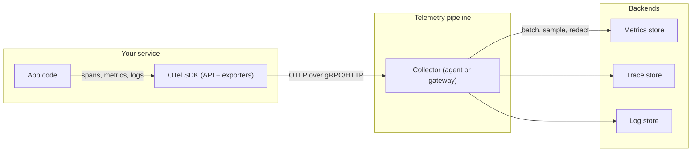
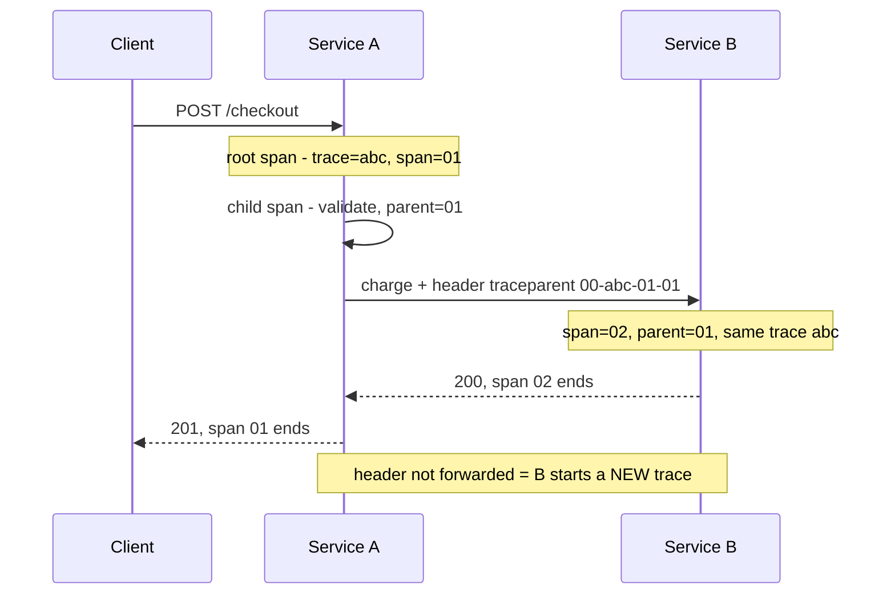

## Before you start

Read [logging-and-monitoring](logging-and-monitoring) for structured logs, levels and the four golden signals, and [distributed-tracing-and-observability](distributed-tracing-and-observability) for what traces and spans *are* and why sampling exists. This topic assumes both and goes straight to the practice: how you actually instrument a service, and what it costs.

## In one sentence

**OpenTelemetry** (OTel) is a vendor-neutral standard — an API, a set of SDKs, and a wire protocol called **OTLP** — for emitting traces, metrics and logs, so that the instrumentation you write in your code is not tied to whichever backend you happen to pay for this year.

## Why it matters

Monitoring answers questions you thought of in advance. You predicted that error rate matters, so you built a dashboard for it. Observability is the ability to ask a question you *did not* predict — "is this slowness only affecting logged-in users in one region on the mobile client?" — and get an answer from data already emitted, without shipping new code and waiting for the problem to recur.

The practical reason OTel exists is uglier. Instrumentation is the most expensive code to write and the most annoying to change: it is scattered across every handler and every client call. When it is written against a vendor's proprietary agent, switching backends means rewriting all of it, so teams stay locked in to a tool they have outgrown. OTel splits the two decisions apart. You instrument once against a standard API; where the data goes becomes a config change.

## The intuition

Think of OTel as standard plumbing fittings. Before standardisation, every tap had its own thread, so choosing a tap committed you to that manufacturer's pipes forever. Once the thread is standard, tap and pipe are independent purchases. Your **application code** is the tap, the **OTLP protocol** is the standard thread, and the **backend** is the pipe — swappable without touching the tap.

The **Collector** is the manifold in between: services push telemetry to it, and it does the work you do not want in every application — batching, sampling, stripping personal data, fanning data out to several destinations.



The important property of that picture: the app knows only about the SDK. It has no idea which vendor is on the right-hand side.

## How it actually works

**The three signals, and what each is genuinely best at.** They are not interchangeable, and choosing wrongly is where observability bills explode.

*Metrics* are pre-aggregated counters and histograms, and they are astonishingly cheap because cost scales with distinct time series rather than traffic: a counter serving a billion requests is still one series. That makes them the right home for alerting. *Logs* are per-event detail whose cost scales linearly with traffic — right for depth on one event, wrong for anything you need continuously. *Traces* are the only signal capturing **causality** across service boundaries: which call caused which, and where the latency went.

**High-cardinality labels are what make metrics explode**, and this is the most common self-inflicted observability outage. Every unique combination of label values creates a separate time series. Add `region` (5 values) and `status` (6 values) to a counter and you have 30 series — fine. Add `user_id` and you have one series per user, forever, because the series is never forgotten once created. A million users becomes a million series, then the metrics backend runs out of memory and you lose the dashboards you needed to diagnose it. The rule: metric labels must be **bounded and low-cardinality**. Unbounded identifiers — user IDs, request IDs, URLs with parameters, error messages — belong on span attributes and log lines, which are designed for high cardinality.

**Auto-instrumentation vs manual spans.** OTel ships instrumentation libraries that monkey-patch popular modules — the HTTP server, the database driver, the HTTP client — so you get spans for every inbound request and outbound query without writing any code. That is the right starting point and covers most of the value. Manual spans are for *your* logic: the business operation, the cache decision, the loop that turned out to be quadratic. Auto-instrumentation tells you the database call took 400ms; a manual span tells you that you made it eleven times.

**Context propagation** is the mechanism that makes a trace a trace. The **W3C `traceparent`** header carries four fields in one string: version, trace ID, the parent span ID, and flags including the sampling decision. Each service reads it, makes its span a child of that parent, and — the critical part — writes it onto every outgoing call.



**A trace breaks at the first hop that does not forward the header**, and the break is silent. You do not get an error; you get two unrelated traces and a diagnosis that says service B was never called. Two places cause nearly all of it. **Queue boundaries**: a message published to a broker carries no HTTP headers, so the context must be written into the message metadata explicitly and read back by the consumer. **Custom HTTP clients**: auto-instrumentation patches the standard client, so a hand-rolled wrapper around a raw socket — or any client constructed to bypass the defaults — quietly drops the header. This is the same lesson as [connection-reuse-and-handshake-cost](connection-reuse-and-handshake-cost), where a custom client silently loses connection pooling: whenever you replace a default client, you inherit responsibility for everything the default was doing for you.

**The Collector**, and the two ways to deploy it. As an **agent** it runs next to every application — one per host or as a sidecar — so the app's export is a localhost call that cannot fail on the network, and the agent can add host-level metadata. As a **gateway** it is a shared, independently scaled service that all applications send to, which is the only place you can make decisions needing a *whole* trace. Most real setups run both: agents collect, a gateway decides.

What the Collector does is worth listing because each item is work you would otherwise duplicate in every service: **batch** (turn thousands of small exports into few large ones), **sample**, **enrich** (attach cluster and version metadata), **redact** (strip an email address that should never have been an attribute), and **fan out** to several backends at once — which is how you evaluate a new vendor without reinstrumenting.

**Tail sampling** is the gateway's real prize. Head sampling decides at the start of a request and therefore keeps errors only by luck. Tail sampling buffers a trace's spans until it completes, then applies rules: keep every trace that errored, keep every trace slower than a threshold, keep 1% of the boring successes. You store a fraction of the volume and still hold every failure. The cost is that the gateway must buffer spans in memory and know when a trace is finished, so it needs sizing like any other stateful service — and every service in the trace must send to the *same* gateway instance for the trace to be complete.

**Semantic conventions** are the least glamorous and most valuable part of the standard. OTel specifies attribute names: `http.request.method`, `server.address`, `db.system.name`. If everyone uses them, a dashboard for "p99 latency by route" works against any service in the company, and a vendor's out-of-the-box views light up with no configuration. If each team invents its own — `method`, `httpMethod`, `http_verb` — every dashboard becomes bespoke and nothing is comparable. Consistent naming is what makes observability *portable*.

## Worked example

Real OTel SDK usage, exporting to the console so it runs with no backend at all.

```js
// npm i @opentelemetry/api @opentelemetry/sdk-trace-node @opentelemetry/resources
const { NodeTracerProvider, SimpleSpanProcessor, ConsoleSpanExporter } =
  require('@opentelemetry/sdk-trace-node');
const { resourceFromAttributes } = require('@opentelemetry/resources');
const { trace, SpanStatusCode } = require('@opentelemetry/api');

const provider = new NodeTracerProvider({
  resource: resourceFromAttributes({ 'service.name': 'checkout' }), // identifies the emitter
  spanProcessors: [new SimpleSpanProcessor(new ConsoleSpanExporter())],
});
provider.register();

const tracer = trace.getTracer('checkout-service', '1.0.0');

async function chargeCard(amount) {
  // startActiveSpan makes this span the parent of anything created inside it
  return tracer.startActiveSpan('payment.charge', async (span) => {
    span.setAttribute('payment.amount', amount);
    await new Promise((r) => setTimeout(r, 30));
    if (amount > 500) span.setStatus({ code: SpanStatusCode.ERROR, message: 'limit exceeded' });
    span.end();                                    // a span you never end is never exported
    return amount <= 500;
  });
}

tracer.startActiveSpan('POST /checkout', async (root) => {
  root.setAttribute('http.request.method', 'POST'); // semantic convention, not a made-up name
  const ok = await chargeCard(42);                  // becomes a CHILD span automatically
  root.setAttribute('checkout.ok', ok);
  root.end();
  await provider.shutdown();                        // flush before the process exits
});
```

Real output, trimmed to the fields that matter:

```
{
  resource: { attributes: { 'service.name': 'checkout' } },
  instrumentationScope: { name: 'checkout-service', version: '1.0.0' },
  traceId: 'b06b17d65ff6ffb3f7ea543015da2b7b',
  parentSpanContext: { traceId: 'b06b17d65ff6ffb3f7ea543015da2b7b',
                       spanId: '6d79aa6a363752a9', traceFlags: 1 },
  name: 'payment.charge',
  id: '1f4a41fa9253cf31',
  duration: 31478.459,
  attributes: { 'payment.amount': 42 },
  status: { code: 0 }
}
{
  resource: { attributes: { 'service.name': 'checkout' } },
  traceId: 'b06b17d65ff6ffb3f7ea543015da2b7b',
  parentSpanContext: undefined,
  name: 'POST /checkout',
  id: '6d79aa6a363752a9',
  duration: 32600.667,
  attributes: { 'http.request.method': 'POST', 'checkout.ok': true },
  status: { code: 0 }
}
```

Four things to read off it. Both spans share one `traceId`, which is what makes them one trace. The child's `parentSpanContext.spanId` is `6d79aa...`, exactly the root's `id` — that is the tree, stored as a pointer upward rather than a list downward, which is why spans can be exported independently and reassembled later. `duration` is in **microseconds**, so 31478 is the 30ms sleep plus overhead. And the child printed *first*: spans are exported when they end, so a collector always receives children before parents and must wait before it can know a trace is complete — precisely the constraint that makes tail sampling stateful.

## A second example — when it gets harder

Now the arithmetic that decides your bill, because "add a label" is a one-line change with a five-figure consequence.

A service handles 5,000 requests per second. You add a request-duration histogram with 10 buckets, labelled by `route` (40 routes) and `status_class` (5 values). Series count is 40 × 5 × 10 = **2,000** — trivial, and it does not grow with traffic no matter how popular you get.

A well-meaning engineer adds `customer_id` to help a support team, and there are 50,000 customers. The count becomes 40 × 5 × 10 × 50,000 = **100 million series**. Nothing warns you. Metrics ingestion is fire-and-forget, so the application stays healthy while the metrics backend's memory climbs for an hour and then dies — taking every dashboard and every alert with it, at the exact moment you need them.

The fix is not "never label anything". It is a **cardinality budget**, treated as a real limit: agree a maximum series count per service, compute the product of every label's distinct values before merging the change, and enforce it in the Collector, which can drop or aggregate away offending labels centrally rather than trusting every service to behave. And note where the customer question actually belongs: `customer_id` on a *span attribute* costs nothing extra, because a span is one event rather than a permanent series, and traces already answer "show me this customer's slow requests" far better than a metric could.

The same reasoning drives the whole cost model, which is three independent dials:

| Dial | What it controls | Typical setting |
|---|---|---|
| Sampling | Fraction of traces stored | Tail: 100% of errors, 1–10% of successes |
| Cardinality | Metric series count | Budget per service, enforced in the Collector |
| Retention | How long each signal lives | Traces 7d, logs 30d, metrics 13 months |

Retention is the cheapest win, because signals have genuinely different useful lifetimes: you debug with traces from the last few days, satisfy an audit with logs from last month, and plan capacity with metrics from last year. Storing all three for thirteen months costs several times what tiering costs and buys almost nothing.

## Quick reference

| Signal | Answers | Cost scales with | Put here | Never put here |
|---|---|---|---|---|
| Metrics | Is something wrong now? | Distinct label combinations | Route, status class, region | User ID, request ID, raw URL |
| Logs | What exactly happened? | Traffic volume | Full detail, error messages | Anything needed continuously |
| Traces | Where did the time go? | Traffic × spans × sample rate | High-cardinality attributes | — |

| Collector role | Deployment | Can do |
|---|---|---|
| Agent | Per host or sidecar | Batch, enrich with host metadata, localhost export |
| Gateway | Shared, scaled service | Tail sampling, redaction, fan-out to backends |

## Tools & frameworks

| Tool | What it's for | Reach for it when |
|---|---|---|
| [OpenTelemetry JS](https://opentelemetry.io/docs/languages/js/) | `@opentelemetry/sdk-node` auto-instrumentation | Node services — start with auto-instrumentation and add manual spans only where it is blind |
| [OTel Collector](https://opentelemetry.io/docs/collector/) | Pipelines for sampling, redaction and routing | Sampling and PII handling belong outside the app, so you can change them without a redeploy |
| [Semantic conventions](https://opentelemetry.io/docs/concepts/semantic-conventions/) | Standard attribute names | Your dashboards must survive changing backends |
| [Grafana Tempo](https://grafana.com/docs/tempo/latest/) | Cheap trace storage on object stores | Trace volume is high and search-by-trace-ID is enough — you do not need rich trace search |
| [Prometheus](https://prometheus.io/docs/introduction/overview/) | The metrics half, via OTLP or scrape | Metrics still carry the alerting load; traces explain, metrics page |

Tail sampling in the Collector is the answer to "we cannot afford 100% of traces" — head sampling throws away exactly the errors you needed. Instrument with OTel SDKs rather than Jaeger clients or OpenTracing: Jaeger v1 reached end-of-life on 31 December 2025 and v2 is an OTel Collector distribution, OpenTracing is superseded, and the OTel Zipkin exporter is deprecated in favour of OTLP.

## Common mistakes

- Putting an unbounded identifier in a metric label, which multiplies series until the metrics backend falls over — the most common self-inflicted observability outage.
- Instrumenting against a vendor SDK, then discovering that changing backend means rewriting instrumentation in every service.
- Assuming a trace is complete because it renders. A hop that drops `traceparent` produces two valid-looking traces, and the missing service looks like it was never called.
- Publishing to a queue without copying trace context into the message metadata, which breaks every asynchronous trace.
- Inventing attribute names instead of using semantic conventions, so no dashboard is reusable across services.
- Head-sampling at 1% and then wondering why no failed request ever has a trace.
- Forgetting `span.end()`, so the span is never exported and its parent's duration is unexplained.

## What interviewers ask

- **Monitoring vs observability?** — Monitoring watches failure modes you predicted and instrumented; observability means emitting enough context to answer questions you did not anticipate, without deploying new code first.
- **What problem does OpenTelemetry actually solve?** — It decouples instrumentation from the backend via a standard API and the OTLP protocol, so the expensive, widely-scattered instrumentation code survives a change of vendor.
- **Why can adding one metric label take down your metrics system?** — Each unique label combination is a separate stored time series and series are never forgotten; an unbounded label like user ID multiplies series into the millions until the backend exhausts memory.
- **How does trace context survive across services?** — The W3C `traceparent` header carries the trace ID, parent span ID and sampling flag; each service continues that trace and must re-attach the header to every outgoing call, including into message queues.
- **Where would a trace silently break?** — At any hop not forwarding context: a queue boundary with no header mechanism, or a custom HTTP client that bypasses the instrumented default.
- **Why run a Collector rather than exporting straight to a backend?** — It centralises batching, redaction, retry and fan-out, and it is the only place with a whole trace in hand, which is what tail sampling requires.
- **Agent or gateway?** — Agent for reliability and host metadata via a localhost hop; gateway for decisions needing the complete trace. Most setups run both.

## Practice

1. Run the worked example, then add a third nested span inside `chargeCard` and confirm from the printed `parentSpanContext.spanId` values that the tree is three levels deep, not flat.
2. Write two tiny HTTP services. Propagate `traceparent` from one to the other manually and print the trace ID at both ends. Then delete the header on the outgoing call and describe precisely what an engineer debugging the resulting trace would wrongly conclude.
3. Take a histogram with 12 buckets and labels `route` (25), `method` (4), `status_code` (18). Compute the series count. Now decide which of those labels you would replace with `status_class` and justify the reduction with the new number.

## Where to go next

[sre-slos-and-error-budgets](sre-slos-and-error-budgets) is the natural next step: instrumentation gives you the numbers, and SLOs are how you decide which numbers mean you should stop shipping features. [chaos-and-resilience-testing](chaos-and-resilience-testing) depends on this topic directly — you cannot run a safe experiment without observability good enough to detect the impact.
