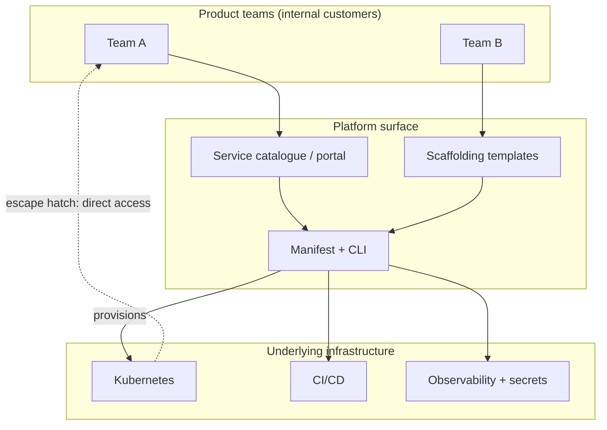
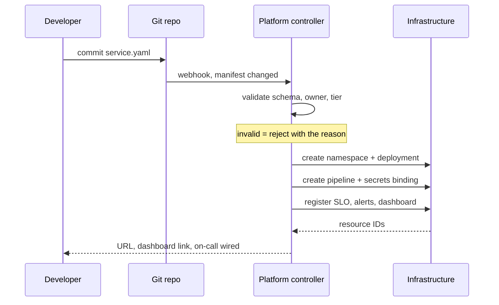

## Before you start

You need [kubernetes-basics](kubernetes-basics) and [cicd-pipelines](cicd-pipelines) — this topic is about packaging those and everything around them so that product teams do not each have to master them. [sre-slos-and-error-budgets](sre-slos-and-error-budgets) helps, because a good platform provisions reliability defaults rather than leaving each team to invent them.

## In one sentence

**Platform engineering** is building an internal product — a set of self-service tools, templates and defaults — that lets product teams ship and operate their services without each one having to become an expert in Kubernetes, Terraform, CI, observability and on-call.

## Why it matters

"You build it, you run it" improved on throwing code at an operations team. But taken literally it hands every product team the full weight of modern infrastructure: orchestration, infrastructure as code, pipeline design, secret management, network policy, dashboards, alert routing and a pager rotation. That is a specialism most product teams have neither time nor inclination to acquire.

Two things then happen, both expensive. Teams either **move slowly**, because a new service takes three weeks of Kubernetes archaeology, or they **each build their own version** — five pipeline shapes, five logging conventions, five ways of holding secrets, four of them subtly wrong. The second is worse than it looks: it multiplies operational surface by the number of teams and turns any org-wide fix, a base-image CVE or a compliance rule, into five migrations.

A platform absorbs that complexity once, paid for by a team whose actual job it is.

## The intuition

Think of the difference between a hardware shop and a kit.

A hardware shop has everything needed to build a shed, which is ideal if you know exactly what you are doing. Most people do not, so they buy the wrong timber, cut it badly, and get a shed that leaks in a way they discover in November. A **kit** has pre-cut parts, the right fixings and instructions — most people get a better shed, faster, because the manufacturer already made the mistakes for them.

The platform is the kit, and the analogy predicts the failure mode: a kit for a shed you did not want is useless, and instructions stopping at "attach roof" strand you at the hardest step. Hence **escape hatches** — pre-cut parts are the default, and you can still buy raw timber when your case genuinely differs.



## How it actually works

**The platform is a product, and product teams are its customers.** That framing changes behaviour, because products have users you must persuade rather than tickets you must close. It implies user research, documented interfaces, versioning, deprecation notices and a roadmap driven by what teams actually struggle with.

**The decisive test is whether teams choose it because it is genuinely easier, not because it is mandated.** A platform that must be enforced is failing, and the enforcement hides the evidence. High voluntary adoption tells you it delivers value; compulsory adoption tells you nothing, and creates an incentive to route around you that teams will act on, usually in ways you discover during an incident.

**Golden paths, guardrails and gates** are three different mechanisms and the distinction is worth being precise about, because interviewers use it to check whether you understand incentives:

- A **golden path** is a well-supported default route: the templated, documented, opinionated way to build a service, which is easy *and* correct. It is a recommendation with the friction removed.
- A **guardrail** is a boundary that prevents disaster without blocking work: a network policy that stops a service reaching the internet, a quota that caps spend, an admission rule that rejects a container running as root. You are free to move; you cannot drive off the cliff.
- A **gate** is a checkpoint that blocks until something or someone approves: a manual sign-off, a mandatory review, a change board.

**Prefer paths and guardrails over gates.** Gates tempt because they feel like control, but they impose a queue on every change, and that queue is a bottleneck growing with adoption — so the more successful the platform, the slower everyone gets. A guardrail scales for free: enforced by machinery, applied uniformly, needing nobody awake. Reserve gates for genuinely irreversible actions where being wrong costs more than waiting.

**Abstractions and the leaky-abstraction risk.** A platform necessarily hides things — that is its value. The danger is specific and worth stating carefully: **an abstraction that hides Kubernetes until it breaks, then requires deep Kubernetes knowledge to debug, has made things worse than no abstraction at all.** The team never learned the underlying system because they never needed to, so when the abstraction leaks they are debugging two unfamiliar systems at once, under pressure, without the vocabulary to search for help.

Three things keep this honest. **Escape hatches**: dropping to the layer below for a legitimate case without leaving the platform. **Errors in the user's vocabulary**: say "replicas must be at least 2 for tier critical", not a raw admission-webhook rejection. And **transparency about what was created**, so a developer sees the resources their manifest produced and learns the mapping over time.

**The surface teams actually touch.** A **service catalogue** or **developer portal** — Backstage being the common open-source example — answers the questions that otherwise cost a week each: what services exist, who owns this one, where its dashboards and runbooks are, what depends on it. **Scaffolding templates** create a new service with pipeline, health checks, dashboards and ownership metadata already wired, turning "three weeks" into "an afternoon". **Environment provisioning** gives a team a realistic place to test without filing a request.



**Measuring a platform honestly** means measuring outcomes for its customers, not output from its team. The wrong metric is how many features the platform has; the right ones are:

- **Adoption** — what fraction of services use the golden path, voluntarily.
- **Time to first deploy** for a brand-new service, measured end to end from "I have an idea" to "it is serving traffic". This is the single most revealing number a platform team can track.
- **Lead time for change** — commit to production for an existing service.
- **Toil removed** — how much manual operational work disappeared, which is the clearest evidence you absorbed complexity rather than relocating it.

The **DORA** metrics are the common frame for the delivery half: deployment frequency, lead time for change, change failure rate, and time to restore service. Their value in an interview is that they measure throughput *and* stability together, which stops the obvious gaming — you cannot claim success by deploying constantly if your change failure rate climbs with it.

**The organisational reality.** Team Topologies describes a platform team as an **enabling** structure, existing to reduce the cognitive load on product teams so they can own their services end to end. The failure mode it warns of is the one most platform teams hit — **the platform team becomes a ticket queue**. Every new service, permission or config change needs a request, so the platform sits on everyone's critical path and the bottleneck it was created to remove has simply moved. The tell: if the primary interface is a request form rather than an API or a repository, it is an operations team with a new name.

## Worked example

A service manifest, which is the platform's actual contract with a team:

```yaml
# service.yaml — the only file a team writes to get a production service
name: orders-api            # DNS-safe; becomes namespace, hostname, metric prefix
owner: team-payments        # must resolve to a real on-call rotation
tier: critical              # drives SLO, replica count, paging, review depth
runtime: node22             # only supported runtimes get patched base images
resources:
  cpu: 500m
  memory: 512Mi
```

Six lines, and everything else is inferred. `tier: critical` is doing the most work: it selects an SLO, a replica count and whether alerts page a human, so a team declares *intent* and the platform decides *implementation*. `owner` must resolve to a real rotation, because a service whose alerts route nowhere is worse than one with no alerts. `runtime` is a closed set, which is what makes fleet-wide base-image patching possible at all.

The validator is the gate that makes this contract real:

```js
const SCHEMA = {
  name:      { required: true,  test: (v) => /^[a-z][a-z0-9-]{2,29}$/.test(v),
               why: 'lowercase DNS-safe name, 3-30 chars' },
  owner:     { required: true,  test: (v) => /^team-[a-z-]+$/.test(v),
               why: 'must map to a real on-call rotation' },
  tier:      { required: true,  test: (v) => ['critical', 'standard', 'internal'].includes(v),
               why: 'drives SLO defaults, alert routing and review depth' },
  runtime:   { required: true,  test: (v) => ['node20', 'node22', 'python312', 'go123'].includes(v),
               why: 'only supported runtimes get patched base images' },
  slo:       { required: false, test: (v) => typeof v === 'number' && v > 90 && v <= 99.99,
               why: 'availability target between 90 and 99.99' },
  resources: { required: false, test: (v) => v && v.cpu && v.memory,
               why: 'cpu and memory both needed, or the scheduler guesses' },
};

// Tier drives the defaults — the golden path is what you get for free.
const TIER_DEFAULTS = {
  critical: { slo: 99.95, replicas: 3, pagerDuty: true,  reviewers: 2 },
  standard: { slo: 99.9,  replicas: 2, pagerDuty: true,  reviewers: 1 },
  internal: { slo: 99.0,  replicas: 1, pagerDuty: false, reviewers: 1 },
};

function validate(manifest) {
  const errors = [];
  for (const [field, rule] of Object.entries(SCHEMA)) {
    const value = manifest[field];
    if (value === undefined) {
      if (rule.required) errors.push(`${field}: missing (${rule.why})`);
      continue;                                   // optional + absent = defaulted
    }
    if (!rule.test(value)) errors.push(`${field}: invalid value ${JSON.stringify(value)} (${rule.why})`);
  }
  // Unknown fields are rejected, not ignored: silence would hide a typo forever.
  for (const k of Object.keys(manifest).filter((k) => !(k in SCHEMA))) {
    errors.push(`${k}: unknown field — typo, or a feature the platform does not provide`);
  }
  if (errors.length) return { ok: false, errors };
  return { ok: true, resolved: { ...TIER_DEFAULTS[manifest.tier], ...manifest } };
}

const good = { name: 'orders-api', owner: 'team-payments', tier: 'critical',
               runtime: 'node22', resources: { cpu: '500m', memory: '512Mi' } };
const bad  = { name: 'Orders_API', owner: 'sai', tier: 'super-critical',
               runtime: 'node18', slo: 99.999, replicaz: 3 };

for (const m of [good, bad]) {
  const r = validate(m);
  console.log(`\n${m.name} -> ${r.ok ? 'ACCEPTED' : 'REJECTED'}`);
  if (r.ok) console.log('  provisions with:', JSON.stringify(r.resolved.slo), 'SLO,',
                        r.resolved.replicas, 'replicas, paging:', r.resolved.pagerDuty);
  else r.errors.forEach((e) => console.log('  -', e));
}
```

Real output:

```
orders-api -> ACCEPTED
  provisions with: 99.95 SLO, 3 replicas, paging: true

Orders_API -> REJECTED
  - name: invalid value "Orders_API" (lowercase DNS-safe name, 3-30 chars)
  - owner: invalid value "sai" (must map to a real on-call rotation)
  - tier: invalid value "super-critical" (drives SLO defaults, alert routing and review depth)
  - runtime: invalid value "node18" (only supported runtimes get patched base images)
  - slo: invalid value 99.999 (availability target between 90 and 99.99)
  - replicaz: unknown field — typo, or a feature the platform does not provide
```

Three design decisions are visible there, each a platform judgement rather than a coding one.

**Every error explains why**, in the developer's terms. That is the difference between an abstraction people tolerate and one they resent: `slo: 99.999` is rejected with the permitted range, so the developer fixes it without opening a ticket — guardrails doing the work a gate would otherwise do.

**Unknown fields are rejected, not ignored.** `replicaz` is a typo, and a platform that silently discards it provisions one replica while the developer believes they asked for three, a discrepancy found during an incident. Refusing unknown keys turns silent misconfiguration into an obvious error.

**All errors report at once.** Returning only the first means six edit-and-retry cycles, and the perception of a slow platform is built from exactly that friction.

## A second example — when it gets harder

Now the case that decides whether your platform survives: the team whose requirements do not fit.

A team needs a GPU node pool, an unsupported runtime, and a sidecar the golden path knows nothing about. Three responses are possible.

**Refuse.** The team routes around the platform, builds its own deployment path, and you have an unmanaged service *plus* a team telling everyone the platform is a straitjacket. Lost adoption, gained a shadow platform.

**Say yes, bespoke.** You have taken unfunded maintenance for one customer and will do it again for the next. Enough of these and the platform team does custom infrastructure full-time with no capacity for the platform.

**Offer an escape hatch with the non-negotiables intact.** The team writes their own deployment resources but still gets identity, secrets, network policy, logging and the catalogue entry. They keep the guardrails and lose the golden path. Crucially, log the request — the same escape hatch requested three times is a product signal that the golden path is missing something real, and the fourth requester should find it supported.

That last option is what an interviewer listens for, because it treats the platform as a product with a roadmap informed by usage rather than a fixed set of rules.

| Mechanism | What it does | Scales with adoption? | Use for |
|---|---|---|---|
| Golden path | Easy, correct default | Yes | The 80% case |
| Guardrail | Prevents disaster automatically | Yes | Security, cost, safety limits |
| Gate | Blocks pending approval | No — becomes a queue | Genuinely irreversible actions |
| Escape hatch | Legitimate exit from the default | Yes, if logged | Cases the path does not cover |

The related trap is measuring the platform by its own output. "We shipped twelve platform features this quarter" says nothing about whether anyone benefited. The honest questions are whether time-to-first-deploy fell, whether adoption rose without a mandate, and whether tickets *per service* went down — because a platform whose ticket volume grows in proportion to the services it hosts has not automated anything, only centralised the manual work.

## Quick reference

| Term | Meaning |
|---|---|
| Internal developer platform | The self-service product product teams build on |
| Golden path | Supported, opinionated, easy default route |
| Guardrail | Automated boundary preventing disaster |
| Gate | Blocking approval checkpoint |
| Escape hatch | Sanctioned way out of the default |
| Service catalogue | Inventory of services, owners, docs, dashboards |
| Scaffolding | Template generating a ready-to-run new service |
| Cognitive load | The amount a team must understand to ship |
| DORA metrics | Deploy frequency, lead time, change failure rate, restore time |

## Common mistakes

- Building the platform as a project rather than a product, so it ships once and then rots as nobody owns its roadmap.
- Mandating adoption, which hides the evidence of whether it is actually good and pushes teams to route around you.
- Preferring gates to guardrails, creating a queue that gets worse the more successful the platform becomes.
- Abstracting away the infrastructure with no escape hatch, so a leak leaves teams debugging two systems they do not understand.
- Surfacing raw errors from the layer below instead of messages in the developer's vocabulary.
- Silently ignoring unknown manifest fields, turning a typo into a misconfiguration discovered during an incident.
- Becoming a ticket queue, which relocates the bottleneck rather than removing it.
- Measuring platform features shipped instead of customer outcomes like time-to-first-deploy and voluntary adoption.
- Building for the hardest team's requirements first, producing something too complex for the majority who needed the simple path.

## What interviewers ask

- **What problem does platform engineering solve?** — "You build it, you run it" hands every product team the full weight of Kubernetes, IaC, CI, observability and on-call. Most cannot carry it, so they either move slowly or each build a different inconsistent version, which multiplies operational surface and makes org-wide fixes into many migrations.
- **How do you know your platform is good?** — Voluntary adoption is the decisive test. If teams use it because it is genuinely easier, it works; if it has to be mandated, the mandate is concealing the fact that it is not yet better than the alternative.
- **Golden path vs guardrail vs gate?** — A golden path is an easy, correct default; a guardrail is an automated boundary preventing disaster while leaving you free to work; a gate blocks until approval. Prefer paths and guardrails, because gates become queues that worsen as adoption grows, and reserve them for irreversible actions.
- **What is the risk of a platform abstraction?** — Leaking. An abstraction that hides Kubernetes until it breaks, then demands deep Kubernetes knowledge to debug, is worse than none, because the team never had reason to learn the system they are now debugging. Escape hatches, errors in the user's vocabulary, and visibility into created resources are the mitigations.
- **How do you measure a platform?** — Customer outcomes: voluntary adoption, time to first deploy for a new service, lead time for change, and toil removed. DORA metrics frame the delivery half and pair throughput with stability so the numbers cannot be gamed by shipping recklessly.
- **What is the classic platform team failure mode?** — Becoming a ticket queue, so the platform sits on everyone's critical path and the bottleneck moves rather than disappearing. The tell is a request form as the primary interface instead of an API or repository.
- **A team's requirements do not fit the golden path. What do you do?** — Give them an escape hatch that retains the non-negotiable guardrails, and log the request; a request appearing repeatedly is evidence the golden path should grow to cover it.

## Practice

1. Extend the validator so `tier: critical` requires an explicit `resources` block and rejects any `slo` below the tier default, and confirm both new rules report alongside existing errors rather than short-circuiting.
2. Write the manifest for a service that needs a scheduled job and a database. Decide which fields the team must state and which the platform should infer from `tier`, and justify each inference.
3. List five things your platform would do for a new service automatically. For each, classify it as a golden path, a guardrail or a gate, and if you chose a gate, argue why a guardrail could not do the job.

## Where to go next

[gitops-and-argocd](gitops-and-argocd) is how most platforms actually apply what a manifest declares, making the desired state a reviewable repository change. [terraform-and-iac-patterns](terraform-and-iac-patterns) covers the module design that lets a platform expose a small interface over a large amount of infrastructure. [progressive-delivery](progressive-delivery) is a capability worth building into the golden path, so every team gets safe releases without designing them.
