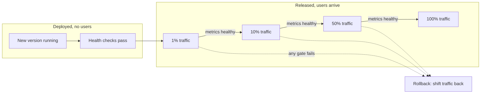
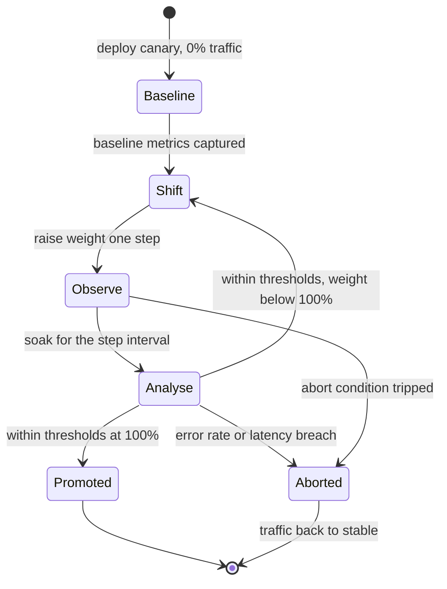

## Before you start

You need [cicd-pipelines](cicd-pipelines) for how code gets built and shipped automatically, and [designing-for-failure](designing-for-failure) for timeouts, circuit breakers and graceful degradation — this topic is the deployment-time counterpart to those runtime patterns. [sre-slos-and-error-budgets](sre-slos-and-error-budgets) helps, because the metrics a canary judges itself against are usually SLIs.

## In one sentence

**Progressive delivery** is releasing a change to a small slice of users first, watching real metrics, and expanding only if those metrics stay healthy — so that a bad change harms a fraction of traffic for a few minutes rather than everyone at once.

## Why it matters

**Deploy is not release.** Getting the code running on a server and putting users in front of it are two separate events, and treating them as one is what makes shipping frightening.

When they are the same event, every deployment is a bet with no hedge: either it was fine, or every user is affected at once. Teams respond rationally by deploying less often, which makes each release larger and riskier — the spiral that produces quarterly release weekends.

Separating the two breaks it. If code can run in production while receiving no traffic, *starting* the release becomes a small, reversible action taken independently of the build — expandable gradually, undoable in seconds. That distinction is what makes everything else here possible.

## The intuition

Think of a restaurant adding a dish to the menu.

The kitchen can cook, plate and taste the dish without a single customer ordering it — that is a **deploy**. Offering it to one table is a **canary release**. Putting it on every menu is a **full release**. A **feature flag** is the waiter deciding per table whether to mention it, needing no change in the kitchen at all.

What matters is what each stage teaches you. Tasting it yourself catches obvious mistakes but says nothing about whether customers like it. One table gives real feedback at survivable cost. The whole restaurant gives certainty and no way back tonight.



## How it actually works

**The four strategies, and what each genuinely costs.** The honest comparison is about cost and rollback speed, not which is "best".

A **rolling update** replaces instances a few at a time. It is the orchestrator default, needs no extra capacity and nothing clever. Its weakness is rollback: undoing it is another rolling update in reverse, so recovery takes as long as the deploy did, and throughout you run two versions with no control over the split.

**Blue-green** runs two complete environments and switches traffic in one action. Rollback is that action reversed, so it is near-instant — the great virtue. You pay **double capacity** during the switch, and because the cutover is all-at-once you learn nothing gradually: the first real signal arrives when 100% of users are already on the new version.

A **canary** sends a small percentage of real traffic to the new version and raises it in steps, giving real production signal at a survivable blast radius — the strongest property on offer here. The costs are genuine: **traffic shaping** (a load balancer, ingress or mesh that splits by weight), per-version metrics to compare, and both versions running at once, so the new one must be compatible with the old one's data and peers.

**Feature flags** move the decision into the application: both behaviours are deployed and a runtime switch picks the path per request. This is the only mechanism giving **per-user targeting** — internal staff, then 5% of users, then one region — and the only one where release is fully decoupled from deployment, since flipping a flag needs no deploy. The cost is inside your codebase: every flag is a branch, flags interact, and flags never removed become **flag debt**, code paths nobody has run in a year that still occasionally execute. Give every flag a removal date.

**Automated canary analysis** is what separates progressive delivery from a slow deploy. The controller captures baseline metrics from the stable version, shifts a weight to the canary, waits a defined interval, compares error rate and latency against the baseline and explicit thresholds, then advances or aborts and shifts traffic back.



Thresholds must be defined **before** the rollout, because a threshold chosen while watching a graph permits whatever the graph is doing. And the automation is the point: **a canary nobody watches is just a slow deploy with extra steps.** If promotion happens because twenty minutes elapsed and nobody objected, you added delay and gained nothing — the failure still reaches everyone, just later.

**A canary needs enough traffic and enough time to mean anything**, and this is where canaries are most often fooled. Suppose a bug affects 1 in 500 requests. At 1% of traffic on a service doing 100 requests per second the canary sees 1 request per second, expecting one failure every 500 seconds — over a 5-minute soak, roughly zero or one. That is indistinguishable from noise, so the canary passes and the bug is promoted to everyone. You need enough canary requests that expected failures sit comfortably above the noise floor, which means a longer soak, a larger percentage, or accepting that rare failures are not what canaries catch. Low-traffic services often cannot canary meaningfully at all; the honest answer is to say so and rely on blue-green plus fast rollback.

Time matters independently of volume, because some failures are not immediate. A memory leak, a pool exhausting, a cache filling, an hourly cron — none appear in the first ninety seconds. A two-minute soak tests only failures that happen instantly.

**Rollback as a first-class capability, and why data is the hard part.** Everything above assumes rollback works. Code rollback is easy — the previous artefact exists and traffic moves back. **Schema and data changes are what make rollback hard, because code can revert and data cannot.** If your deploy renamed a column and backfilled it, the old code meets data in a shape it has never seen, and the failure mode is not a clean crash but silent corruption.

The discipline that keeps rollback possible is **expand-migrate-contract**: every step must be compatible with the code on either side of it.

1. **Expand** — add the new column, nullable, with no code reading it. Deploy this migration *before* the code that needs it.
2. **Migrate** — deploy code writing both old and new, and backfill existing rows. Both app versions now work against this schema, which is exactly what a canary requires.
3. **Contract** — only once the old code is definitively gone, stop writing the old column and drop it.

The ordering is what people get wrong: a backward-compatible migration ships *ahead* of the code that needs it, and the destructive step ships long *after*. Throughout the middle phase rollback stays code-only, which is the property you were buying. See [database-migrations](database-migrations) for the mechanics.

**Things that leak across a cutover.** Some state ignores your traffic split. **Session affinity** pins a user to a canary instance, so "10% of traffic" may be 10% of users seeing 100% of the new behaviour — often what you want, but not what a naive per-request split gives. **Caches** are shared: if the canary writes a new value shape, the stable version reads it and breaks, so a cache-format change needs a new key namespace rather than a new value. **Long-lived connections** — WebSockets, gRPC streams, database connections — do not move when you shift a weight, so one opened against the old version can persist for hours; the percentage applies to *new* connections, and draining is separate and slower.

**Tooling, at an awareness level.** In Kubernetes, **Argo Rollouts** and **Flagger** implement this loop as controllers: you declare steps, weights, pause durations and metric thresholds, and the controller drives the rollout and aborts on breach. Both integrate with an ingress or mesh for traffic shaping and a metrics backend for analysis. Because the rollout is a manifest, it fits the declarative model of [gitops-and-argocd](gitops-and-argocd).

## Worked example

Automated canary analysis: given per-step observations, decide promote, hold or abort.

```js
const POLICY = {
  steps: [1, 10, 50, 100],          // traffic weights, in percent
  soakSeconds: 300,                 // how long each step runs before judging
  maxErrorRatePct: 1.0,             // absolute ceiling
  maxLatencyRatio: 1.2,             // canary p95 may be 20% worse than baseline, no more
  minCanaryRequests: 500,           // below this, the sample proves nothing
};

function judge(step, obs, baseline, policy = POLICY) {
  const reasons = [];
  if (obs.requests < policy.minCanaryRequests) {
    // Not a pass and not a failure: the experiment is underpowered.
    return { verdict: 'INCONCLUSIVE', reasons: [`only ${obs.requests} requests, need ${policy.minCanaryRequests}`] };
  }
  const errorPct = (obs.errors / obs.requests) * 100;
  const latencyRatio = obs.p95Ms / baseline.p95Ms;
  if (errorPct > policy.maxErrorRatePct) reasons.push(`error rate ${errorPct.toFixed(2)}% > ${policy.maxErrorRatePct}%`);
  if (latencyRatio > policy.maxLatencyRatio) reasons.push(`p95 ${latencyRatio.toFixed(2)}x baseline > ${policy.maxLatencyRatio}x`);
  if (reasons.length) return { verdict: 'ABORT', reasons };
  const next = policy.steps[policy.steps.indexOf(step) + 1];
  return next ? { verdict: 'PROMOTE', next } : { verdict: 'COMPLETE' };
}

// Expected failures visible at a given weight — the power calculation people skip.
function expectedFailures(rps, weightPct, soakSeconds, bugRate) {
  return rps * (weightPct / 100) * soakSeconds * bugRate;
}

const baseline = { p95Ms: 120 };
const observations = [
  { step: 1,  requests: 1500,  errors: 2,   p95Ms: 125 },
  { step: 10, requests: 15000, errors: 40,  p95Ms: 131 },
  { step: 50, requests: 75000, errors: 210, p95Ms: 460 },
];

for (const obs of observations) {
  const r = judge(obs.step, obs, baseline);
  console.log(`step ${String(obs.step).padStart(3)}% -> ${r.verdict}${r.next ? ` (next ${r.next}%)` : ''}`);
  (r.reasons ?? []).forEach((x) => console.log(`           ${x}`));
}

console.log('\nis a 1-in-500 bug detectable? expected failures per step:');
for (const w of POLICY.steps) {
  const n = expectedFailures(100, w, POLICY.soakSeconds, 1 / 500);
  console.log(`  ${String(w).padStart(3)}% traffic: ${n.toFixed(1)} failures in ${POLICY.soakSeconds}s` +
              `${n < 5 ? '  <- too few to distinguish from noise' : ''}`);
}
```

Real output:

```
step   1% -> PROMOTE (next 10%)
step  10% -> PROMOTE (next 50%)
step  50% -> ABORT
           p95 3.83x baseline > 1.2x

is a 1-in-500 bug detectable? expected failures per step:
    1% traffic: 0.6 failures in 300s  <- too few to distinguish from noise
   10% traffic: 6.0 failures in 300s
   50% traffic: 30.0 failures in 300s
  100% traffic: 60.0 failures in 300s
```

Two things to read carefully. The 50% step aborted on **latency, not errors**: error rate was 0.28%, well inside the 1% ceiling, while p95 had quadrupled. A canary gated only on error rate would have promoted a version that was correct and unusably slow, which is why latency comparison against a live baseline belongs in every policy.

The second block is the power calculation. At 1% traffic, a bug hitting 1 request in 500 yields **0.6 expected failures** in a five-minute soak — you will usually see zero, the canary passes, and you have gained false confidence. That step is not evidence, it is theatre. Only at 10% and above can a threshold act on the count.

## A second example — when it gets harder

Now the failure no traffic-splitting can save you from: a canary that passes and *then* takes down the stable version too.

You deploy a change that adds a column and, to save a step, has the new code write to it immediately. The canary runs at 5%, health checks pass, error rate is flat, latency is fine, and it promotes. Two days later you roll back for an unrelated reason — and the old code reads rows containing values it has never seen, misinterprets them, and writes corrupt data. Your safety net has become the incident.

That is expand-migrate-contract stated as a consequence rather than a rule. The canary did its job: it verified the *new* code worked. What it cannot verify is that the *old* code still works against the data the new code produced, because the old code is receiving no traffic and nobody is testing it. Rollback safety is not something a canary measures.

The sharper version of the trap: during any canary two versions run against one datastore, so the new version's writes must be readable by the old *for the whole duration*. That is a stronger requirement than blue-green, which needs forward compatibility only at the instant of cutover. Teams adopting canaries without expand-migrate-contract discover this by corrupting data.

| Strategy | Extra capacity | Rollback speed | Real-traffic signal before full release | Needs |
|---|---|---|---|---|
| Rolling update | None | Slow (reverse rollout) | Partial, uncontrolled | Nothing extra |
| Blue-green | 2x during switch | Near-instant | None | Duplicate environment |
| Canary | Small (extra pods) | Fast (shift weight) | Yes, graduated | Traffic shaping + per-version metrics |
| Feature flags | None | Instant (flip flag) | Yes, per-user | Flag system, disciplined cleanup |

These combine rather than compete, and the mature pattern uses both layers: canary or blue-green to control *which code runs*, flags to control *which behaviour it exposes*. A flag is better when the risk is business logic, since it targets internal users first and flips off in a second with no deploy. A canary is better when the risk is operational — a library upgrade, a runtime change, a query rewrite — where the danger is resource usage and latency rather than one code path.

## Quick reference

| Concept | What it means |
|---|---|
| Deploy | The new version is running; no users are on it |
| Release | Users are being served by the new version |
| Canary step | A traffic weight, a soak duration, and pass/fail thresholds |
| Baseline | Metrics from the stable version, compared against live |
| Abort condition | The rule that shifts traffic back without a human |
| Soak / bake time | How long a step runs before judgement |
| Flag debt | Flags left in the code after the decision was made |
| Expand-migrate-contract | Schema discipline that keeps rollback code-only |

## Tools & frameworks

| Tool | What it's for | Reach for it when |
|---|---|---|
| [Argo Rollouts](https://argo-rollouts.readthedocs.io/en/stable/) | Canary and blue-green with analysis steps | You want promotion or rollback decided by metrics, not by someone watching a dashboard |
| [Flagger](https://docs.flagger.app/) | Progressive delivery driven by mesh or ingress | You are on Flux, or you want the traffic shifting done by the mesh you already run |
| [OpenFeature](https://openfeature.dev/docs/reference/intro/) | Vendor-neutral feature-flag SDK | You want to decouple release from deploy without locking into a flag vendor |
| [Unleash](https://docs.getunleash.io/) | Self-hostable feature flag service | You need a flag backend you control and can run on-prem |
| [Prometheus](https://prometheus.io/docs/introduction/overview/) | The metrics the analysis gates on | Always — a canary with no defined failure metric is just a slow deploy |

Canary and feature flags solve different halves: traffic shifting moves *requests*, flags move *behaviour*. Both need a failure metric agreed before you start.

## Common mistakes

- Treating deploy and release as one event, pushing the team toward rare, large, risky releases.
- A canary with no automated analysis — promotion by timer is a slow deploy with no added safety.
- Choosing thresholds while watching the rollout, which guarantees they permit whatever is happening.
- Canary percentages too small or soaks too short to detect the failure rate you care about, producing confident false passes.
- Gating on error rate only, so a version that is correct but four times slower gets promoted.
- Shipping a destructive migration alongside the code that needs it, making rollback unsafe from the moment it lands.
- Assuming rollback works. If you have never rolled back, your recovery path is untested.
- Changing a shared cache's value format, so the stable version breaks on the canary's writes.
- Expecting a traffic weight to move existing long-lived connections; it applies to new ones only.
- Never deleting flags, until the codebase has more branches than anyone can reason about.

## What interviewers ask

- **Difference between deploy and release?** — Deploy puts the new version in production; release puts users in front of it. Separating them makes starting a release a small reversible action rather than an all-or-nothing bet.
- **Compare blue-green and canary.** — Blue-green switches all traffic at once: near-instant rollback, but double capacity and no graduated signal. A canary shifts traffic in steps so you learn from real traffic at small blast radius, but needs traffic shaping, per-version metrics, and both versions simultaneously compatible with your data.
- **How does a canary decide to promote?** — It compares canary metrics against the stable baseline and against thresholds set before the rollout, after a soak at each weight, then advances or aborts automatically. If a human decides from a dashboard, you have a slow deploy.
- **Why can a canary at 1% miss a real bug?** — Detection depends on absolute request count, not percentage. A 1-in-500 bug at 1% of 100 rps yields under one expected failure in five minutes, indistinguishable from noise, so the canary passes.
- **What makes rollback hard?** — Data. Code reverts to a previous artefact, but data written in a new shape persists and the old code meets values it was never designed to read. Expand-migrate-contract keeps rollback code-only by making every schema state work with the versions on both sides.
- **Feature flag or canary?** — Flag when the risk is business logic and you want per-user targeting or instant off-switching with no deploy; canary when the risk is operational, like resource usage and latency.
- **What is flag debt?** — Flags left in the codebase after the decision is permanent, multiplying untested code paths that interact unpredictably. Give every flag a removal date.

## Practice

1. Extend `judge` so a step must pass two consecutive soak intervals before promoting, and show how that changes the verdict for an intermittent failure appearing in only one interval.
2. Compute the minimum canary weight and soak needed to expect at least 10 failures from a bug affecting 1 in 2,000 requests at 40 requests per second. State what you would do if the answer exceeds your acceptable rollout time.
3. Write the three migration steps for renaming `email` to `email_address` on a live table, naming for each step the app versions that must run against it. Identify the step after which rollback stops being code-only.

## Where to go next

[gitops-and-argocd](gitops-and-argocd) is where rollout definitions live as declarative manifests, so a release becomes a reviewable repository change. [chaos-and-resilience-testing](chaos-and-resilience-testing) is the complement: progressive delivery limits the damage of a change you chose, while chaos testing verifies you survive failures you did not.
