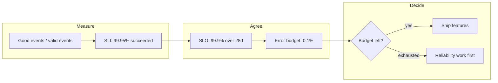
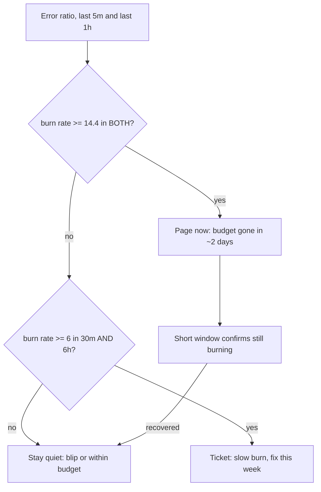

## Before you start

Read [logging-and-monitoring](logging-and-monitoring) first — you need the four golden signals and the rule that alerts fire on symptoms, not causes. This topic is about **measurement and decisions**: defining reliability as a number and what that number entitles you to do. The human side of an outage — who is in charge, comms, the postmortem — lives in [production-incident-response](production-incident-response).

## In one sentence

An **SLO** is a target for how reliable your service will be, stated as a percentage of successful events over a defined window, and the **error budget** is the failure that target explicitly permits — which turns "should we ship this risky change?" from an argument into a calculation.

## Why it matters

Two failures happen without this. The first is **chasing 100%**: it is unreachable, each additional nine costs roughly an order of magnitude more, and past a point users cannot perceive the improvement because their own network fails more often than your service. A team treating every incident as unacceptable slows to a halt for reliability nobody notices.

The second is more common — reliability has no number, so it loses every argument. "This feels risky" versus "the customer needs it this quarter" pits a vague worry against a concrete deadline, and the deadline wins until enough incidents accumulate that the team overcorrects and freezes. An error budget replaces both with a quantity both sides agreed to in advance.

## The intuition

Think of a monthly spending budget rather than a speed limit.

A speed limit invites the wrong conversation — was this incident *allowed*? A budget is different: you agreed to spend at most a certain amount, you spend it while it lasts, and when it runs out you stop until next period. Nobody argues whether a purchase was morally acceptable; they check the balance.

Your error budget is that balance, denominated in failed requests. A 99.9% SLO permits 0.1% of events to fail, and that 0.1% is not a shameful allowance — it is **the resource that pays for shipping**. Spend it wisely and you ship a lot; spend it all in week one and you have earned a quiet fortnight of reliability work.



## How it actually works

**The chain, defined precisely.** Interviewers ask for these three terms constantly and the distinctions are exact.

An **SLI** — Service Level Indicator — is a *measured ratio*: good events divided by valid events. Not a gauge, not an average, a ratio. "The proportion of requests returning non-5xx within 300ms" is an SLI.

An **SLO** — Service Level Objective — is the *target* for that SLI over a stated window: "99.9% of requests over 28 rolling days." An SLO without a window is meaningless, because 99.9% over an hour and over a quarter are wildly different promises.

The **error budget** is `100% − SLO`: the failure you have permitted. At 99.9% over 28 days you may fail 0.1% of events — about 40 minutes of total unavailability, or far longer of partial degradation.

An **SLA** — Service Level Agreement — is the *contract*: a commercial promise with financial penalties. Your SLA should be deliberately looser than your SLO. Promise customers 99.5% while targeting 99.9% internally and you get warned long before you owe a refund; set them equal and your first internal alert is also your first breach of contract.

**Availability must be measured as a ratio of events, not as uptime.** "The server was up 99.95% of the month" says nothing about whether requests succeeded: a process can be running, passing health checks, and returning 500 to every real request. Uptime also cannot express partial failure, which is what modern outages look like — one endpoint broken, one region degraded, 4% of users unable to check out. A ratio handles all of it, but only if you define both halves explicitly:

- **Good events** — what counts as success? A 200 is good. A 404 usually is: the user asked for something absent and you correctly said so. A 429 arguably is, since rate limiting is the system working as designed. A slow 200 is not, if you have a latency SLO.
- **Valid events** — what belongs in the denominator? Health checks and your own load tests do not. Every exclusion is a judgement you must be able to defend, because the denominator is where people accidentally cheat.

**The error budget as a decision tool — this is the real idea.** The SLO is not a score; it is the input to a policy agreed with product owners *before* anything breaks:

> While budget remains, the team ships at normal pace and may take deliberate risks. When the budget is exhausted, feature work stops and reliability work takes priority until the window recovers.

That paragraph is what makes SLOs worth the effort. It settles the velocity-versus-stability conflict without anyone relitigating it mid-incident, and it aligns incentives: the product owner now has a stake in reliability, because unreliability is what stops their features shipping. It also legitimises risk — with 80% of budget left, a bold deploy is spending a resource for its intended purpose.

**Burn-rate alerting, and why it beats a threshold.** A static threshold — "page if error rate exceeds 1%" — is wrong in both directions at once. A 30-second spike to 2% pages someone for something that consumed a rounding error of budget. Meanwhile a sustained 0.9% sits quietly under the threshold and eats a 99.9% service's entire monthly budget in about three days.

**Burn rate** fixes both by measuring consumption relative to the budget: the observed error rate divided by the rate the SLO permits. A burn rate of 1 spends the budget exactly over the window; 14.4 spends it 14.4 times faster, which for a 28-day window is the whole budget in under two days.

The refinement that makes this production-grade is **multiple windows**, because each catches what the other misses. A **fast-burn** alert uses a high threshold on a short window and pages immediately for a catastrophe. A **slow-burn** alert uses a lower threshold on a long window and tickets the quiet 0.9% leak. Each pairs its long window with a much shorter one that must *also* be burning — which stops it firing for an hour after a two-minute blip recovered.



**Latency SLOs need a percentile and a threshold, never an average.** "Average response time under 300ms" is satisfied by a service where 90% of requests take 50ms and 10% take 2.5 seconds — the average is 295ms and one user in ten is suffering. Averages hide exactly the tail you care about. State it as "95% of requests within 300ms", itself a ratio of good to valid events. Many teams run two — 95% under 300ms *and* 99% under 1s — so both the typical and the worst experience have a target.

## Worked example

An error-budget and burn-rate calculator.

```js
const WINDOW_DAYS = 28;
const WINDOW_MIN = WINDOW_DAYS * 24 * 60;

function budget(sloPct) {
  const allowedFailFraction = 1 - sloPct / 100;        // the error budget itself
  return { allowedFailFraction, allowedBadMinutes: WINDOW_MIN * allowedFailFraction };
}

// Burn rate = observed error rate / allowed error rate.
// 1.0 spends the budget exactly over the window; 14.4 spends it in 1/14.4 of the window.
function burnRate(observedErrorPct, sloPct) {
  return observedErrorPct / (100 - sloPct);
}

function assess(sloPct, observedErrorPct, budgetSpentPct) {
  const b = budget(sloPct);
  const rate = burnRate(observedErrorPct, sloPct);
  const remaining = 1 - budgetSpentPct / 100;
  const hoursToExhaust = rate <= 0 ? Infinity : (WINDOW_DAYS * 24 * remaining) / rate;
  return { ...b, rate, remaining, hoursToExhaust };
}

// The recommended pair: page fast on a catastrophe, ticket slowly on a leak.
const ALERTS = [
  { name: 'fast-burn', threshold: 14.4 },
  { name: 'slow-burn', threshold: 6 },
];
const fires = (rate) => ALERTS.filter((a) => rate >= a.threshold).map((a) => a.name);

const SLO = 99.9;
console.log(`SLO ${SLO}% over ${WINDOW_DAYS}d`);
console.log(`error budget = ${(budget(SLO).allowedFailFraction * 100).toFixed(3)}% of requests`);
console.log(`             = ${budget(SLO).allowedBadMinutes.toFixed(1)} bad minutes if 100% down\n`);

for (const [errPct, spentPct] of [[0.05, 10], [0.6, 25], [1.5, 25], [14.4, 60]]) {
  const r = assess(SLO, errPct, spentPct);
  const firing = fires(r.rate);
  console.log(
    `observed ${String(errPct).padStart(5)}% errors | burn rate ${r.rate.toFixed(1).padStart(5)}x | ` +
    `budget left ${(r.remaining * 100).toFixed(0).padStart(3)}% | ` +
    `exhausted in ${r.hoursToExhaust.toFixed(1).padStart(6)}h | ` +
    `alert: ${firing.length ? firing.join(' + ') : 'none'}`
  );
}
```

Real output:

```
SLO 99.9% over 28d
error budget = 0.100% of requests
             = 40.3 bad minutes if 100% down

observed  0.05% errors | burn rate   0.5x | budget left  90% | exhausted in 1209.6h | alert: none
observed   0.6% errors | burn rate   6.0x | budget left  75% | exhausted in   84.0h | alert: slow-burn
observed   1.5% errors | burn rate  15.0x | budget left  75% | exhausted in   33.6h | alert: fast-burn + slow-burn
observed  14.4% errors | burn rate 144.0x | budget left  40% | exhausted in    1.9h | alert: fast-burn + slow-burn
```

Read the rows against a naive 1% threshold and the value is obvious. Row one burns at half the permitted rate and finishes the window with budget spare, so it must not page — and does not. Row two matters most: **0.6% errors sits under a 1% threshold and would never page**, yet it burns six times too fast and exhausts the budget in 84 hours, which burn-rate alerting catches as a slow burn. Row three at 1.5% empties the budget in a day and a half, so both alerts fire. Row four is a real outage — at 144x the remaining 40% is gone in under two hours, exactly when someone should already be awake.

## A second example — when it gets harder

Now choosing the number honestly, which is where most SLOs are quietly fictional.

**Your SLO cannot exceed your dependencies'.** Availability composes multiplicatively across anything required to serve a request. If a request needs the database, auth and a payment provider, each at 99.9%, your ceiling is:

```
0.999 × 0.999 × 0.999 = 0.997  →  99.7%
```

That is your best case with flawless code, and it is *below* the 99.9% you were about to promise: three hard dependencies at three nines cannot produce a three-nines service. This arithmetic is the honest answer to "why can't we just say 99.99%?", and it points at the only real fixes — reduce hard dependencies, add redundancy within one, or make one *soft* with a designed fallback. A recommendation service whose failure means showing bestsellers never enters this multiplication at all, which is exactly the argument for [designing-for-failure](designing-for-failure).

And the cost of nines is exponential while the perceived benefit flattens:

| SLO | Bad minutes / 28d | What it takes | User perception |
|---|---|---|---|
| 99% | ~403 | One region, business-hours ops | Noticeably flaky |
| 99.9% | ~40 | Redundancy, real on-call, tested rollback | Good |
| 99.95% | ~20 | Multi-zone, automated failover | Very good |
| 99.99% | ~4 | Multi-region active-active, no manual steps | Mostly invisible |
| 99.999% | ~0.4 | Enormous cost; humans too slow to respond | Indistinguishable from above |

At five nines you have roughly twenty seconds of budget per month, so any response involving a person is already a breach — the system must heal itself unassisted. Meanwhile a mobile user's own connection drops far more often than that, so they cannot tell four nines from five. Past a point you buy reliability only your dashboard can perceive.

**Toil and alert fatigue are reliability problems in themselves.** Toil is manual, repetitive operational work that scales with traffic and creates no lasting value — restarting the stuck job each morning, hand-editing config per tenant. It matters because it consumes exactly the engineering time reliability work needs: a team spending its week on toil cannot absorb what an exhausted budget demands.

Alert fatigue is the sharper danger, and burn-rate alerting is partly a cure. Every page that turns out to be nothing teaches responders that pages are usually nothing, and that lesson sticks. A team paged three times a night for blips will eventually miss the real one, so a noisy alerting system is *worse than a quiet one* because it also supplies false confidence. Every page should be actionable, urgent and tied to user-visible harm; failing any of those, it is a ticket or a dashboard.

## Quick reference

| Term | What it is | Example |
|---|---|---|
| SLI | Measured ratio of good to valid events | 99.95% of requests non-5xx under 300ms |
| SLO | Target for the SLI over a window | 99.9% over 28 rolling days |
| Error budget | 100% − SLO; permitted failure | 0.1%, about 40 minutes per 28 days |
| SLA | Contract with financial penalties | 99.5% or customers get credits |
| Burn rate | Observed error rate / permitted rate | 0.6% observed at 99.9% SLO = 6x |

| Alert | Long window | Burn rate | Response |
|---|---|---|---|
| Fast burn | 1 hour | 14.4x | Page immediately |
| Slow burn | 6 hours | 6x | Ticket, fix this week |
| Static threshold | — | — | Pages on blips, misses slow leaks |

## Tools & frameworks

| Tool | What it's for | Reach for it when |
|---|---|---|
| [Google SRE Book](https://sre.google/sre-book/table-of-contents/) | SLI, SLO and error-budget definitions | You want the source — this is what interviewers are quoting at you |
| [SRE Workbook](https://sre.google/workbook/table-of-contents/) | Practical SLO implementation | You have the theory and now have to pick an actual SLI and window |
| [Sloth](https://sloth.dev/) | Generate Prometheus SLO rules and alerts | Multi-window multi-burn-rate alerts are easy to hand-write wrong |
| [OpenSLO](https://openslo.com/) | Vendor-neutral SLO specification | SLOs should be reviewable code, not config buried in a dashboard |
| [Prometheus Alertmanager](https://prometheus.io/docs/alerting/latest/alertmanager/) | Route and inhibit burn-rate alerts | You need to turn burn rate into a page that is genuinely worth waking someone for |

Burn-rate alerting on a *ratio* is the key technique — alerting on raw error count gives you noise at low traffic and silence at high traffic.

## Common mistakes

- Measuring uptime instead of a ratio of successful events, which calls a service healthy while it returns 500s.
- Stating an SLO with no window, making the promise unfalsifiable.
- Setting the SLA equal to the SLO, so your first internal warning is also a contractual breach.
- Using an average for latency, hiding the slow tail that was the reason you measured.
- Static error-rate thresholds, which page for harmless spikes and miss the leak that drains the budget.
- Promising more nines than your dependencies support, making the SLO fiction from day one.
- An SLO with no error-budget policy — a number nobody acts on is a dashboard, not a decision tool.
- Treating a consumed budget as a failure to punish rather than a resource spent as intended.
- Excluding inconvenient events from the denominator until the SLI flatters you.

## What interviewers ask

- **SLO vs SLA vs error budget?** — An SLI is a measured ratio of good to valid events; an SLO is the target for that SLI over a window; the error budget is 100% minus the SLO, the failure explicitly permitted; the SLA is the commercial contract with penalties, deliberately looser than the SLO so you get warned before you owe refunds.
- **Why is burn-rate alerting better than a threshold?** — A threshold ignores how much budget is being consumed: it pages for a 30-second spike costing almost nothing and stays silent for a sustained 0.9% that drains a month's budget in three days. Burn rate normalises observed against permitted rate, and pairing a long window with a short one pages only for what will genuinely breach.
- **Why measure availability as a ratio rather than uptime?** — A running process is not a working service; it can pass health checks and fail every real request. Uptime also cannot express the partial failures that make up most modern outages.
- **What is an error budget policy for?** — It decides in advance what happens when the budget runs out, halting feature work in favour of reliability work, converting a recurring argument into a rule tied to an agreed number.
- **You depend on three services at 99.9%. Can you promise 99.99%?** — No. Hard dependencies multiply, so 0.999³ is about 99.7%, already below three nines. Reduce hard dependencies, add redundancy, or make them soft with designed fallbacks.
- **How would you write a latency SLO?** — A percentile and a threshold, such as 95% under 300ms, because an average is satisfied by a service where one request in ten takes seconds.
- **Should you aim for 100%?** — No. Each nine costs roughly an order of magnitude more and past a point users cannot perceive the difference. Target the least reliability at which users are happy, and spend the rest on shipping.

## Practice

1. Run the calculator with an SLO of 99.95% and a 30-day window. Find, to one decimal place, the error rate that exactly triggers the fast-burn alert, and explain why it is not 1%.
2. Write the SLI for a file-upload endpoint. Define good and valid events explicitly, and justify how you treat a 413 for an oversized file, a 429, and a request the client abandoned halfway.
3. Compose availability for a checkout path needing auth (99.95%), a database (99.99%), a payment provider (99.9%) and recommendations (99%). Compute the ceiling with all four hard, recompute treating recommendations as soft, and state the SLO you would commit to.

## Where to go next

[progressive-delivery](progressive-delivery) is how you spend an error budget deliberately rather than by accident — canaries limit how much a bad release can consume. [chaos-and-resilience-testing](chaos-and-resilience-testing) requires budget headroom before an experiment may run. For the human process once an alert fires, read [production-incident-response](production-incident-response).
