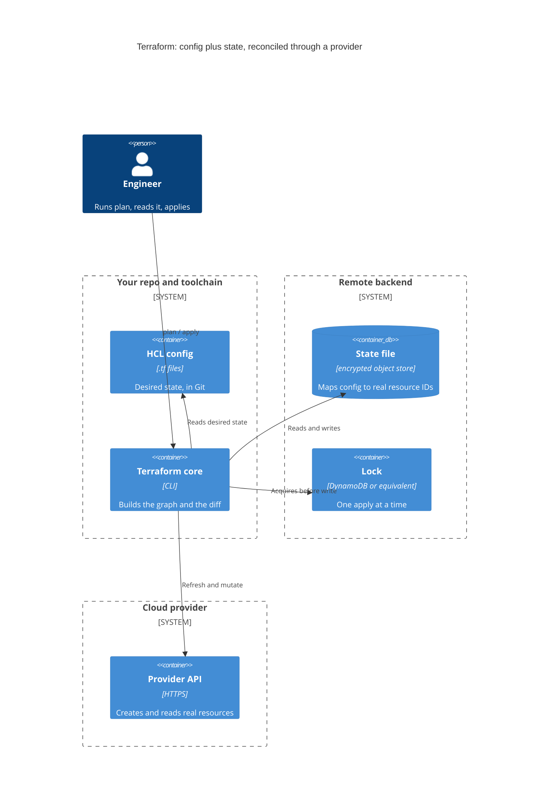
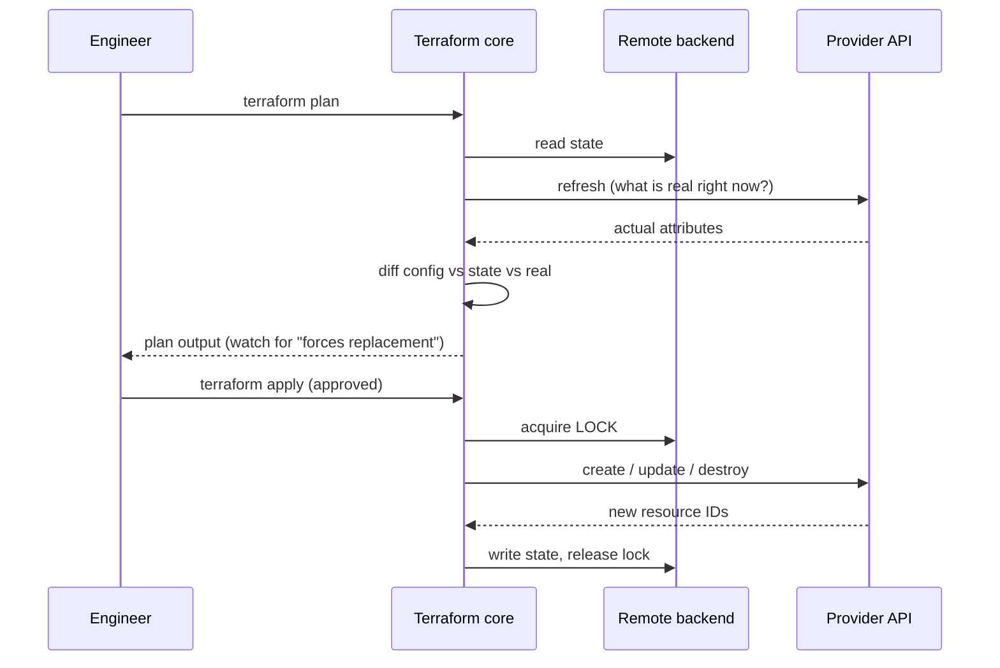

## Before you start

Read `infrastructure-as-code` first — declarative versus imperative, idempotence, and why a plan exists at all are assumed here. This topic goes past those ideas into the mechanics that actually cause incidents: what the state file is, why locking is mandatory, and how to read a plan that is about to destroy a database.

## In one sentence

**Terraform** turns a text description of cloud resources into real infrastructure, and keeps a **state file** — a record mapping each block in your config to the real resource ID it created — so it can tell what already exists from what it still needs to build.

## Why it matters

Everything distinctive about Terraform follows from one problem: a cloud API cannot tell you which resources are *yours*.

You write `resource "aws_instance" "web"`. Terraform creates it and the cloud returns `i-0a1b2c3d`. Next run, Terraform sees the same block. Is that a request to create another instance, or a reference to the one that exists? The config contains no ID, and the cloud just has a list of instances with no idea which config block each belongs to.

The state file is the answer. Lose it and Terraform believes it has built nothing, so the next apply duplicates your entire infrastructure while the original keeps running and billing. Share it carelessly and concurrent writes corrupt the only record linking config to reality.

So the state file is not an implementation detail to gloss over in an interview. It is what makes declarative infrastructure possible, and what causes the worst outcomes when mishandled.

## The intuition

Think of a builder working from a plan, holding a numbered inventory.

The **plan** on paper is your config: what should exist. The **building site** is the cloud: what does exist. The **inventory** is the state file — "wall 3 is the one I built on Tuesday, serial number 40471."

Ask the builder to update the site and three sources get consulted: the plan says what you want, the inventory says what they previously built and which physical thing each item is, and a walk around the site says what is there now.

Take the inventory away and the builder is lost even standing in the finished building. They can see a wall; they cannot tell whether it is *their* wall 3, so the safe assumption becomes "build a new one."

That is Terraform without state, and it explains why state is treated with more care than the config. The config is reproducible from Git. The state file is the only record of a mapping that exists nowhere else.



## How it actually works

### Plan and apply

`terraform plan` reads the state, refreshes it against the real world, diffs that against your config, and prints what it would do, changing nothing. `terraform apply` does the same work, then executes it and writes the new state.

The plan is your only preview, and its symbols carry very different weight:

| Symbol | Meaning | Risk |
|---|---|---|
| `+` | create | Low — new resource |
| `~` | update in place | Usually low; check for restarts |
| `-` | destroy | High — read the resource name carefully |
| `-/+` | **destroy then create replacement** | **Highest — data loss on stateful resources** |
| `<=` | read (data source) | None |

### Why remote state with locking is non-negotiable

Local state is a file on one laptop, and it fails in three ways of increasing severity. Nobody else can apply, since they have no state. Then someone copies the file, and two divergent records exist. Then two people apply at once.

That last one is why locking exists. Terraform reads state, decides on changes, then writes state. Two applies interleaving those steps means the second overwrites the first's record. The resources the first apply created are now real, billing, and absent from state — **orphaned**. Terraform will never touch them again, and will happily create duplicates next run.

A remote backend fixes both problems. State lives in shared encrypted storage, and Terraform acquires a **lock** before any write, so a second apply waits rather than corrupting:

```hcl
terraform {
  backend "s3" {
    bucket         = "acme-tfstate"
    key            = "prod/network/terraform.tfstate"
    region         = "eu-west-1"
    encrypt        = true            # state holds secrets in PLAINTEXT otherwise
    dynamodb_table = "acme-tf-locks" # the lock — without this, concurrent applies corrupt
  }
}
```

The `key` including an environment and a component is deliberate; we return to it under state splitting.

One point interviewers like: **state contains secrets in plaintext.** A generated database password, a private key — whatever the provider returned is recorded verbatim. So state is never in Git, always encrypted at rest, and access-controlled like a credential store, because it is one.

### Drift

**Drift** is reality diverging from config, and it happens because consoles exist. Someone resizes an instance at 3am to survive a traffic spike.

Nothing breaks immediately. It breaks on the next unrelated apply, when Terraform notices the difference and dutifully "corrects" it — reverting the emergency fix, possibly at peak load, as a side effect of a change to something else entirely.

`terraform plan -refresh-only` reports drift without proposing to fix it. Seeing drift, ask *why* before reverting: a manual change usually means someone had a real problem. Either bring the change into config, or revert deliberately having understood it.



Two things to notice in that sequence. The **refresh** happens before the diff, which is how drift becomes visible — the diff is against reality, not against the last recorded state. And the **lock is acquired at apply, not at plan**, which is why a plan reviewed an hour ago may no longer describe what apply will do. Hence `terraform plan -out=tfplan` followed by `terraform apply tfplan`: it applies the exact reviewed plan and refuses if the world has moved underneath it.

## Worked example

A resource with the guardrails that matter:

```hcl
resource "aws_db_instance" "main" {
  identifier     = "acme-prod"
  engine         = "postgres"
  engine_version = "15.4"
  instance_class = "db.r6g.large"

  allocated_storage = 200
  storage_encrypted = true

  db_name  = "acme"
  username = "acme_app"
  password = var.db_password   # ends up in state IN PLAINTEXT

  backup_retention_period = 14
  deletion_protection     = true   # cloud-side guard: refuses deletion via API

  lifecycle {
    prevent_destroy = true         # Terraform-side guard: refuses to PLAN a destroy
  }
}
```

Two guards, and they are not redundant — that is the interesting part.

`deletion_protection` is enforced by the cloud provider. The API rejects a delete regardless of what asked for it: Terraform, the console, a script, anything.

`prevent_destroy` is enforced by Terraform, earlier in the process. It fails the *plan*, so you never reach the point of typing `yes`. This catches the case the cloud guard cannot help with, because a destroy-and-recreate is not seen by the cloud as a deletion of something protected — it is a delete followed by a create, and if the guard blocks the delete, apply fails halfway through, leaving state and reality inconsistent.

Now a routine-looking change. Bump `engine_version` to `"16.1"` and the plan reads:

```text
Terraform used the selected providers to generate the following execution plan.
Resource actions are indicated with the following symbols:
-/+ destroy and then create replacement

Terraform will perform the following actions:

  # aws_db_instance.main must be replaced
-/+ resource "aws_db_instance" "main" {
      ~ engine_version = "15.4" -> "16.1" # forces replacement
      ~ endpoint       = "acme-prod.xxxx.eu-west-1.rds.amazonaws.com" -> (known after apply)
      ~ id             = "acme-prod" -> (known after apply)
        # (23 unchanged attributes hidden)
    }

Plan: 1 to add, 0 to change, 1 to destroy.

╷
│ Error: Instance cannot be destroyed
│
│   on rds.tf line 1:
│    1: resource "aws_db_instance" "main" {
│
│ Resource aws_db_instance.main has lifecycle.prevent_destroy set, but the
│ plan calls for this resource to be destroyed.
╵
```

Read that plan the way a reviewer should.

**`-/+` and `must be replaced`** are the danger markers. Not `~`. This is not an upgrade in place.

**`# forces replacement`** on the `engine_version` line names the culprit. Some attributes are immutable in the provider's API, so the only way to change them is destroy and create. The plan says so precisely.

**`Plan: 1 to add, 0 to change, 1 to destroy`** is the line people read *instead of* the detail above — and the one that hides what is being destroyed. "1 to destroy" reads as small. It is your production database.

**The error is the happy outcome here.** `prevent_destroy` refused to plan. Without it, this is a plan a tired reviewer approves at the end of a long day, and the recreated database comes up empty. Twenty-three unchanged attributes were hidden and the two lines that mattered were the ones about identity.

So the reading discipline is mechanical rather than intuitive: **grep the plan for `forces replacement` and `must be replaced` before reading anything else.** Judgement fails under time pressure; a mechanical check does not.

## A second example — when it gets harder

### Blast radius: splitting state

One state file for all your infrastructure means every apply risks everything, every plan refreshes hundreds of resources slowly, and every lock blocks the whole organisation.

Split state by **environment** and by **rate of change**. Networking changes yearly; application resources change daily. Separate states mean an application deploy cannot damage the VPC, because that resource is not in the state being written. Cross-state references go through data sources or published outputs, forcing the dependency to be explicit and one-directional.

### Directory-per-environment versus workspaces

**Workspaces** give one config multiple states, selected by `terraform workspace select prod`.

The problem is that the environment becomes invisible ambient state. Your files look identical for dev and prod; which one you are about to modify depends on a CLI setting you last changed some time ago. Divergence between environments must then be expressed as conditionals — `count = terraform.workspace == "prod" ? 3 : 1` — scattered through the config, so nobody can read prod's actual shape without mentally evaluating them.

**Directory per environment** makes it explicit:

```text
environments/
  dev/    main.tf  terraform.tfvars  backend.tf
  prod/   main.tf  terraform.tfvars  backend.tf
modules/
  network/  database/  service/
```

Now the path names the environment, `cd prod` is a visible act, prod's backend config is in prod's directory, and each environment's real configuration is readable without evaluating conditionals. Shared logic lives in modules, so duplication stays low.

| | Workspaces | Directory per environment |
|---|---|---|
| Which env am I in? | A hidden CLI setting | The path you are standing in |
| Env differences | Conditionals through the config | Different `tfvars`, plain to read |
| Per-env backend | Awkward | Natural |
| Accidental prod apply | Easy — stale selection | Requires being in the prod directory |
| Best fit | Short-lived, identical copies | Long-lived environments that differ |

Workspaces are genuinely good for ephemeral, identical environments — a per-pull-request stack. For dev/staging/prod, directories are clearer.

### Modules

A **module** is a directory of resources with inputs and outputs — a function for infrastructure:

```hcl
module "checkout_db" {
  source = "../../modules/database"

  name              = "checkout"
  environment       = "prod"
  instance_class    = "db.r6g.large"
  allocated_storage = 200
  multi_az          = true
}
```

The module encodes decisions once — encryption on, backups retained, logging enabled — so every database gets them without each caller remembering. That is the real value: not less typing, but making the safe configuration the default.

Version module sources when shared across teams; an unpinned module changing underneath you means today's plan differs from yesterday's for reasons absent from your diff.

### Adopting existing resources with `import`

Resources created by hand predate your config. `import` brings them under management by writing the state mapping without creating anything:

```hcl
import {
  to = aws_s3_bucket.legacy_assets
  id = "acme-legacy-assets"
}
```

Then plan. The critical part: **the plan after an import should show no changes.** If it shows changes, your config does not match the real resource, and applying would modify live infrastructure to match your guess. Adjust the config until the plan is empty; only then is the resource genuinely adopted.

### Guards are features, not obstacles

A pattern worth stating generally, because it recurs across this whole area.

Automation that refuses a destructive operation by default — `prevent_destroy`, a migration tool declining a destructive schema change, a deploy blocking on an unreviewed diff — creates an obstacle at an inconvenient moment. The obstacle is the product working.

The instinct under pressure is to find the flag that turns it off. Then that flag stays in the config, and the next genuinely dangerous change sails through unremarked.

The right response is an **explicit, auditable approval path**: a one-off operation performed knowingly, recording who approved it and why, while the default stays protective. The distinction is between "a human decided this specific destruction was acceptable" and "we stopped asking" — identical in the moment, completely different six months later.

## Quick reference

| Concept | What it does | Failure symptom |
|---|---|---|
| State file | Maps config blocks to real resource IDs | Lost: apply duplicates everything |
| Remote backend | Shared, encrypted state | Local only: nobody else can apply |
| State locking | One write at a time | Absent: concurrent applies orphan resources |
| `plan` | Preview diff, changes nothing | Skipped: you discover changes by causing them |
| `-/+` / `forces replacement` | Destroy and recreate | Skimmed: data loss on stateful resources |
| `prevent_destroy` | Fails the plan on destroy | Absent: replacement plan looks approvable |
| `deletion_protection` | Cloud-side refusal to delete | Only guard: apply fails mid-way |
| `plan -out` then `apply` | Applies the exact reviewed plan | Absent: world moved since review |
| Drift | Reality diverged from config | Silent until an unrelated apply reverts it |
| Module | Reusable resource group with inputs | Unpinned: plans change without a diff |
| `import` | Adopts an existing resource | Plan not empty after: config mismatches reality |
| State splitting | Limits blast radius per apply | One state: every apply risks everything |

## Common mistakes

- Committing state to Git. It holds plaintext secrets and breaks the instant two people apply.
- Local state on a team. The first copy creates divergence; the first concurrent apply orphans resources.
- Reading `Plan: 1 to add, 1 to destroy` instead of the detail. Grep for `forces replacement` first.
- No `prevent_destroy` on anything holding data, so a replacement plan looks routine.
- Editing state by hand to clear an error, orphaning resources that keep billing.
- One state file for everything, so an application change plans against the whole estate.
- Workspaces for long-lived environments, hiding which environment you are targeting.
- Importing and applying without confirming the plan is empty, modifying live infrastructure to match a guess.
- Disabling a destructive-change guard permanently instead of adding an approval step.

## What interviewers ask

- **What is the state file and why can't Terraform work without it?** — It maps config blocks to real resource IDs. A cloud API cannot say which resources belong to which block, so without state Terraform assumes nothing exists and creates duplicates. It also holds secrets in plaintext, so it needs encryption and access control.
- **Why is remote state with locking non-negotiable?** — Terraform reads state, decides, then writes. Two interleaved applies mean the second's write loses the first's records, orphaning real resources that keep billing and will be duplicated later. Locking serialises writes; shared storage makes team use possible at all.
- **A plan says `forces replacement` on your production database. What do you do?** — Stop. `-/+` means destroy and recreate, so the data goes. Find the attribute the plan flags, since it is immutable in the provider API, and look for a non-replacing route: an in-place upgrade path, a managed version upgrade, or a replica promotion. If replacement is genuinely required, it is a planned migration with backups, verification and a maintenance window — not an apply. And `prevent_destroy` should have failed the plan before you got here.
- **What is drift and how do you handle it?** — Reality diverging from config, usually a console change during an incident. Detect with `plan -refresh-only`. Investigate why before reverting: either adopt the change into config or revert deliberately, because a blind apply undoes an emergency fix as a side effect of unrelated work.
- **Workspaces or a directory per environment?** — Directories for long-lived environments: the path names the target, per-environment backends are natural, and differences read as data instead of conditionals. Workspaces suit ephemeral identical stacks like per-PR environments.
- **How do you bring hand-built resources under Terraform?** — `import` writes the state mapping without creating anything, then you iterate on the config until the plan is empty. A non-empty plan means the config disagrees with reality and applying would modify live infrastructure.
- **How do you limit the damage one apply can do?** — Split state by environment and rate of change, use `prevent_destroy` on stateful resources, review a saved plan rather than a live one, and require approval for destructive operations rather than disabling the guard.

## Practice

1. Configure a remote backend with locking. Start an apply, and from a second terminal start another against the same state. Observe the lock, then explain precisely what would have been lost had both proceeded.
2. Create a resource whose type has an immutable attribute. Change that attribute and read the plan, identifying the `forces replacement` line and the resource name. Add `prevent_destroy` and confirm the plan now fails. Write the approval process you would require to perform this replacement deliberately.
3. Create a resource by hand in a console, then adopt it with `import`. Iterate until `plan` reports no changes, listing each attribute you had to add. Then explain what applying the first, non-empty plan would have done.

## Where to go next

`cicd-pipeline-design` — a plan posted on a pull request is the highest-value review a team does, and getting that into a pipeline safely raises the credential question directly. `secrets-management` matters because state is a secret store you did not intend to create, and `platform-engineering` covers wrapping these sharp tools so application teams get the guardrails without the footguns.
